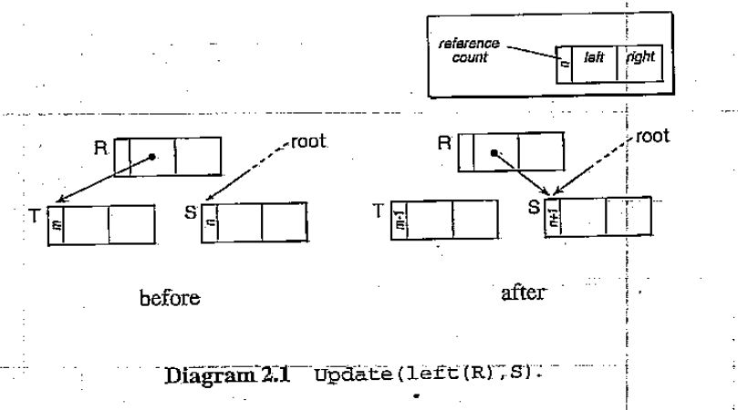

# 2 经典算法介绍

[TOC]

在这一章，我们介绍三个经典的内存回收算法：引用技术、标记-清扫和拷贝算法。由于这些算法后面的技巧和思想构成了本书后面大部分内容的基础，理解它们是如何工作的就显得非常重要。因此，这一章呈现的这些算法以简单的递归来表述。在后面的章节，将会展示更高效的实现方法

## 2.1 引用计数算法

第一个算法是`直接回收`的算法，基于其他`单元(cell)`或root对每个`单元`的`引用`的计数[Collins,1960]。其特点在于记录`单元`是否被使用方式很简单。同时也是一种`增量回收`算法，将管理内存的系统开销分布在整个程序当中。基于`引用计数`的算法被许多语言和应用采用，例如，早期版本的面向对象语言Smalltalk[Goldberg and Robson, 1983], InterLisp， Modula-2+[DeTreville, 1990a]，Adoble Photoshop。许多操作系统也采用这一方法(例如,Unix)来确定文件是否应该从磁盘上删除。

引用计数相对于`跟踪式垃圾回收器`，使用了不同的策略。每个对象有一个额外的field，即`引用计数`。内存管理器必须维护一个不变的定理：每个对象的引用计数等于其他堆对象或根指向它的指针的数量。在算法开始时，所有的对象被放置在一个空闲的对象池里面，空闲对象池一般以链表实现。每个空闲对象以next指针链接在一起，free_list指向链表的开头。next指针占用的空间也可用作其他用途,比如用来保存引用计数，因为空闲对象不需要引用计数(注：非空闲对象又不需要用到next指针）。另一种方式就是使用存放用户数据的空间的一部分来保存引用计数。

### 算法

**空闲对象的引用计数为0，当一个新对象从对象池里分配时，其引用计数初始化为1。每次有指针指向这个对象时，对象的引用计数加1；当对这个对象的引用被删除时，引用计数减1。如果引用计数降为0，根据引用计数的不变定理，意味着没有其他指针指向当前对象。更进一步来讲，因为当前对象的位置已经"丢失"，没有(正当)的方法来重新建立到此对象的联系。所以程序不再需要这个对象，它也可以被归还给空闲对象池了。**

让我们来看看算法的细节。在考虑的每个垃圾回收算法中，`allocate`是一个在`堆(heap)`上预留空间的通用函数。在引用计数算法中，它从free-list中取第一个元素。在其他算法中它的实现将会有所不同。`New`函数返回一个刚刚从free-list获取的空闲对象，其引用计数已经被初始化为1（见算法2.1）。如果free-list是空，程序将会崩溃，另一种方案是增大heap的空间。否则allocate将第一个元素从free-list移除被那个返回给`New`。安全起见，新对象的所有指针域即Children(newcell)应该被清理，如果新对象被获取后立即初始化，这样做就显得不必要了。在这种情况下，`New`可能还需要将程序栈空间上的参数放到新对象上，简单起见，我们假设现在所有的新对象都有同样的固定大小。

算法2.1 内存分配

~~~
allocae() = 
	newcell = free_list
	free_list = next(free_list)
	return newcell
	
New() =  
	if free_list ==  nil
		abort "memory exhausted"
	newcell = allocate()
	RC(newcell) = 1 //增加引用计数
	return newcell
~~~

`Update`函数用参数S重写R，如算法2.2和图2.1所示。S的引用计数加 1，对R的更新移除了R和其指向的对象*R之间的引用关系,所以R的引用计数需要减1。**之所以在减少旧对象的引用计数之前，先增加指向的新对象的引用计数，这样就可以处理新旧对象是同一个对象的情况**。假设R最初指向对象T，若这是最后一个引用T的指针，`delete`函数就可以释放对象T到空闲对象池。但是在释放之前，需要递归地减少T的所有指针域引用的对象的引用计数。(一种更高效的delete函数的实现是，保持空闲对象引用计数为1，因此可以精简函数New和delete的指令)

算法2.2 更新指针域

~~~
free(N) = 
	next(N) = free_list
	free_list = N
	
delete(T) = 
	RC(T) = RC(T)-1
	if RC(T) == 0
		for U in Children(T)
			delete(*U)
		free(T)
		
//R 引用S
Update(R,S) =
	RC(S) = RC(S) + 1
	delete(*R)
	*R=S
~~~

### Update示例

为了更好的解释`Update`函数，这里给出一个具体的示例。在图2.2展示的结构中，指针right(R)被重写为nil。由于这是唯一一个指向S的指针，在释放S之前，需要递归地调用delete函数来处理对象S的所有指针域。在释放U之前，delete(right(S))反过来又调用delete(right(U))

### 引用计数法的优势和劣势

引用计数法的优势在于内存管理的开销遍布整个程序。管理存活和垃圾对象的工作和用户程序的执行穿插在一起。这和`跟踪式回收`算法恰恰相反，如mark-sweep算法在执行期间会将用户计算部分挂起。因此引用计数法比较适用于需要更流畅的响应时间的场合，如高交互或实时系统中。However, the simple reference counting algorithm given above distributes processing overheads 'lumpily': the cost of deleting the last pointer to a sub-graph depends on its size. We consider how to ameliorate this in Chapter 3 when we discuss reference counint in more detail.(不太会翻译:(   )

引用计数算法相对于其他垃圾回收算法的第二个优势就是引用的空间局部性不会比客户程序更糟。引用计数为0的对象可以在不访问堆(heap)上其他页面(page)上的对象的情况下被释放。而`跟踪式算法`在释放垃圾对象之前一般需要访问所有其他存活的对象。However, note that `Update` alters the reference counts of both the old and the new targets of the pointer field being updated. If either of these fields are paged-out(on a machine with virutal memory) or not held in the data cache, a page fault or cache miss will occur。

第三，虽然一些研究依赖于语言和实现，但对大量语言的研究表明只有少部分对象被共享，而且许多对象的生命周期很短(short-lived)(例如, Lisp[], Cedar[], Standard ML[], C 和C++)。标准的引用计数法使得对象被释放后可以尽快被重新利用，在基于栈的环境中(原文:in a stack-like manner),使用`跟踪式`算法时垃圾对象等到堆空间(heap)被耗尽时才能重新得到利用，此时(在堆空间耗尽时)才会运行垃圾回收器。<u>垃圾对象的立即使用可以减少在虚拟内存系统中产生的缺页错误，对缓存也更友好，相较于`跟踪式垃圾回收`的从堆获取新对象，除非内存或缓存可以容纳整个堆空间</u>(后半部分翻译欠佳）。当在第7章和11章我们再考虑`分代式垃圾回收`和垃圾回收算法的缓存行为时再重新探讨这个问题。

立即知道对象何时被释放也带来了其他优势。如果需要一个引用计数为0的对象的一份更改后的拷贝，可以通过借用指向该对象的指针并且更新对象的内容，而不是重新分配一个新对象，然后把旧对象的内容拷贝到新对象上再释放旧对象来实现。这个适用于纯函数式语言的优化技巧被用在Glasgow Haskell compiler[Peyton Jones, 1992]。引用计数法同样可以简化"clean-up"或“finalisation"的操作，如关闭文件，在对象被释放时调用finaliser(在第10章我们会讨论针对object-oriented语言的垃圾回收)

不利的方面，引用计数算法因为其自身的一些劣势导致许多实现拒绝使用它作为管理内存。最严重的劣势就是为了维护引用计数的恒定而更新引用计数的开销（see, for instance,[Hartel, 1988])。每次重写指针，都会更新旧、新对象的引用计数。与此相反，在`跟踪式垃圾回收`中更新指针不会有内存管理方面的开销。

使用引用计数法的内存管理和客户程序或其编译器紧紧耦合在一起。每次更新或拷贝指针都需要更新对象的引用计数。例如，在最简单的一种情况下，当传递指针给函数时需要增加对象的引用计数，返回时需要减少引用计数。若忽略了某次引用计数调整就会导致灾难。和其他和mutator松耦合的内存管理系统相比，这种脆弱性使得引用计数法难以维护。

引用计数法需要使用额外的空间存储引用计数。在最坏情况下，引用计数需要足够大才能容纳所有在堆空间(heap)上的指针和根的总数：必须至少和指针大小相同。实际上引用计数不会真有这么大，所以使用一个较小的空间（或许1个bit)结合处理溢出的策略就可以了。

### 循环引用的数据结构

然俄，引用计数法的主要的缺陷是不能处理循环引用的数据结构。能够处理这样的结构对许多系统来说都很重要。循环数据结构经常被使用，常见的例子如双向链表、叶子节点带有指向根节点的指针的树结构。Also, many implementations of lazy functional languages based on graph reduction use cycles to handle recursion（不知道怎么翻译)。下面考虑一个例子，在图2.6展示的结构中，假设删除right(R)。在调用delete(right(R))时，对象S的引用计数在减1后，仍不为0。这样，对象S、T、U都被隔离开来

## 2.2  Mark-Sweep （标记-清扫）算法

第一个自动释放内存的算法是`跟踪式回收`算法: 标记-清扫或标记-扫描[McCarthy,1960]。 在标记-清扫算法中，对象成为垃圾对象时不会被立即释放，而是一直保持不可达状态直到空间耗尽。若这时请求内存分配，用户程序会被挂起，垃圾回收器会清扫堆空间上所有的垃圾对象，将其归还空闲对象池。标记-清扫算法依赖对堆空间的全局遍历来确定哪些对象是垃圾。回收时，从根开始，标记所有可达的对象。所有其他的对象就是垃圾并归还空闲对象池，这样用户的请求得到满足并且恢复执行。

算法2.3  标记-清扫算法中的内存分配

~~~
New() = 
	if free_pool is empty
		mark_sweep()
	newcell = allocate()
	return newcell
~~~

### 算法

让我们更详细地看一下该算法。New函数从内存池分配一块内存并返回其地址(见算法2.3)。这里，我们没有指定allocate函数是如何实现的， 但是用free_pool来代表空闲的内存池。一种可能的实现是将空闲对象链接成一个空闲列表(free-list)，就如引用计数法那样(算法2.1)。但是有一些其他更高效的选择，我们会在第4章讨论更高效的方法。

更新指针不需要额外的开销。和引用计数法需要更新引用计数相比，这是个明显的差异。引用计数法的开销会更大，若出现缓存未命中，或者更糟的是目标对象所在的页面不在内存中。

标记-回收算法分成两个阶段（见算法2.4）。第一个阶段，称为标记(marking), 标记所有活动对象。第二个阶段，清扫，归还垃圾对象到空闲对象池。若清扫阶段没有恢复足够的空闲内存，堆需要增大或终止程序执行

算法2.4 标记-回收算法 

~~~
mark_sweep() = 
	for R in Roots
		mark(R)e
~~~

每个对象需要预留一个bit位供垃圾回收算法使用，这个标记位用来记录该对象是否可由根到达。由于mark函数遍历所有从根可以到达的对象，每个活动对象的标记位都会被设置(见算法2.5)。简单起见，这里使用简单的递归算法来实现，但在4.2节会给出一个更高效的实现。

算法2.5 标记部分

~~~
mark(N) = 
	if mark_bit(N) == unmarked
		mark_bit(N) = marked
		for M in children(N)
			mark(*M)
~~~

因为标记阶段不会跟踪已经被标记的对象，所以标记阶段可以正确的结束。当标记阶段完成的时候，所有从根可达的对象的标记位都被设置了。这意味这，mark函数将对象存活性(live)转化为是否可达。图2.7展示了一个例子,已经被标记的对象，左上角被涂黑。其他未被标记的对象都是不可达的，也就是垃圾对象。

算法2.6 清扫

~~~
sweep() =
	N = Heap_bottom
	while N < Heap_top
		if mark_bit(N) == unmarked
			free(N)
		else mark_bit(N) = unmarked
		N = N + size(N)
~~~

### 标记回收算法的优势和劣势

## 2.3 Copying Algorithm(拷贝回收算法)

**在这一章，我们考查的最后一类`跟踪式回收算法`就是拷贝回收算法。拷贝回收算法将堆空间等分成两个semi-space(半空间)，一半存放当前的数据（活动对象），称其为Tospace；另一半存放丢弃的数据（看算法2.7),称其为Fromspace。初始时，拷贝回收算法交换两个空间的角色。然后回收器遍历当前存放活动对象的半空间Fromspace，拷贝所有活动的对象到新的半空间，Tospace，当第一次访问活动对象时进行拷贝。在所有活动对象都拷贝完成后，所有活动对象的副本就都已经在Topace了，然后恢复用户程序的执行。由于在旧半空间Fromspace的所有垃圾对象都被丢弃了，所以拷贝回收算法经常被描述为 "拾荒者"- 它从垃圾对象中挑拣出有价值的对象带走。**

拷贝回收算法的一个优势就是活动对象被紧凑的安排在Tospace的底部。与面临内存碎片问题的回收算法相比，紧凑安排活动对象的算法在分配内存时更高效。New函数所需要做的就是检查剩余的空间是否足够，然后增加指向下一个空闲内存的指针, free。由于对象被紧凑的安排在Tospace, 检查空间是否足够的操作仅通过比较指针比较就可以完成（见算法2.7)。拷贝回收算法可以方便的处理大小不一的对象，所以给New函数指定一个待分配对象大小的参数, n。跟标记-回收算法一样，拷贝回收算法对mutator的操作没有额外开销。

算法2.7  拷贝回收算法中的内存分配

~~~
//初始化垃圾回收器，新对象始终从Tospace获得空间
init() = 
	Tospace = Heap_bottom
	space_size = Heap_size / 2
	top_of_space = Tospace + space_size
	Fromspace = top_of_space + 1
	free = Tospace
	
New() = 
	if free + n > top_of_space
		flip()
	if free + n > top_of_space
		abort "Memory exhausted"
	newcell = free
	free = free + n
	return newcell
~~~

### 算法

首先，调用flip函数交换Tospace和Fromspace的角色（见算法2.8）。每个从根(root)可以到达的Fromspace空间对象都被拷贝到Tospace。简单起见，这里使用递归算法[Fenichel and Yochelson,1969]；更高效的算法在第6章讨论。Copy(P)拷贝P指向的对象的域引用的所有对象(见算法2.9)。 拷贝时需确保对象之间的引用关系被保留。若没有正确保留引用关系可能导致同一个对象被多次拷贝，最好的情况是部分堆空间被浪费，但也可能破坏用户程序的语义（例如，更新了一个对象的拷贝，但又从另一个拷贝读取了值）。拷贝循环引用的对象时若不保留引用关系可能浪费大量空间。

算法2.8 flip 函数

~~~
flip() = 
	Fromspace, Tospace = Tospace, Fromspace
	top_of_space = Tospace + space_size
	free = Tospace
	for R in Roots
		R = copy(R)
~~~

拷贝回收算法通过在原有对象上设置一个forwarding address(对象的新地址)来保留引用关系。对象的forwarding address也就是副本在Tospace空间的地址。每次访问到Fromspace的一个对象时，copy函数检查对象是已经被拷贝。若被拷贝过直接返回forwarding address， 否则在Tospace为对象副本预留空间。在这个递归拷贝算法中，在拷贝对象的域引用的对象之前，先将forwarding address 设置为预留的空间地址。这样可以确保递归的结束和引用关系的正确。

可以在对象上预留特定的空间存放forwarding address。更常见的是先保存对象的第一个域存放的值，然后使用这个域来存放forwarding address（这里的域指用来存放用户程序设置的值)。在算法2.9中假设forwarding address 存放在对象P的P[0]位置，forwarding_address(P)和P[0]是等价的。

算法2.9 深度优先拷贝 Fenichel-Yochelson 拷贝回收算法

~~~
copy(P) = 
	if atomic(P) or P = nil //P 不是指针或为空
		return P
	if not forwarded(P)		//P尚未拷贝
		n = size(P)
		P' = free
		free = free + n
		temp = P[0]			//假设P[0]存放对象拷贝后的新地址
		forwarding_address(P) = P'
		P'[0] = copy(temp)
		for i = 1 to n-1	//拷贝引用的其他对象
			P'[i] = copy(P[i])
	return forwarding_address(P) //返回拷贝后的地址
~~~

### 示例

作为拷贝回收算法的一个例子，让我们来看一个无限列表[0，1，0，1，...]如何被回收。这个列表可以通过循环引用的数据结构使用有限的空间来表示(见图2.8)。为了清晰起见，我们分别命名对象和其Tospace的副本为A，B，C，D和A'，B’，C‘，D’。开始时根指向对象A

图 2.8 拷贝列表[0，1，0，1,。。。]

拷贝回收算法以交换两个半空间的角色开始。拷贝根指向的对象，为A在Tospace预留空间并将其forwarding address设置为A‘（见图2.9）

图2.9 拷贝根节点

接下来对copy函数的两次调用为B预留空间，更新A'的左边的域（left field of A')，然后拷贝B的内容，由于B不含指针，直接返回。（见图2.10）

图2.10

解析来，拷贝A'的右边的域。对象C和D以A和B同样的方式被拷贝。最后，copy函数跟踪C'右边域的指针回到了A。因为A已经拷贝完成， 所以C'右边的域的指针更新为对象A'的地址。至此回收完成（见图2.11）

图2.11

### 拷贝回收算法的优势和劣势

拷贝回收算法相对于引用计数和标记-清扫算法的优势而被广泛采用。分配内存的开销很小：仅通过指针比较检查剩余空间是否足；通过增加指向空闲空间的free指针就可完成内存的分配；将活动对象紧凑的安排在Tospace的底部。在非紧凑(non-compacting)的回收算法中内存分配的开销更高，尤其是分配可变大小的对象时。

拷贝回收算法最迫切的开销就是使用两个半空间：和其他非拷贝式算法相比，需要的空间增加了一倍。经常有人认为对采用了虚拟内存的系统来说这不是 个问题，由于非活动半空间可以被淘汰到第二存储上，但是这种观点忽略了页机制带来的开销（but this argument ignores paging costs)。试比较标记-清扫算法和拷贝回收算法回收固定大小的堆空间时的行为。In this period, the copying allocator will touch every page of the heap regardless of the residency of the user program。Unless both semi-spaces can be held simultaneously in physical memory, copying collection will suffer more page faults than mark-sweep, as it uses twice as many pages.

另一方面, 这需要和压缩(compaction)带来的优势进行折中。使用标记回收算法的堆可能面临这更严重的碎片化， 导致程序的的工作集(working set of pages)增大。若内存无法容纳工作集也会导致缺页率的增加。poor locality of reference will also affect cache performance but this will have very much less impact on overall execution than poor paging。

## 2.4 比较标记-清扫 和 拷贝算法

## 2.5 需要考虑的问题

## 2.6 note

