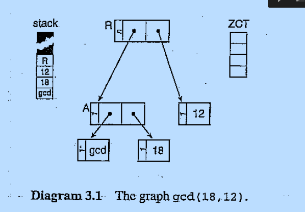
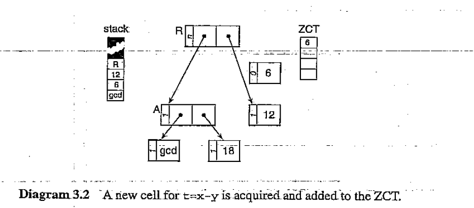
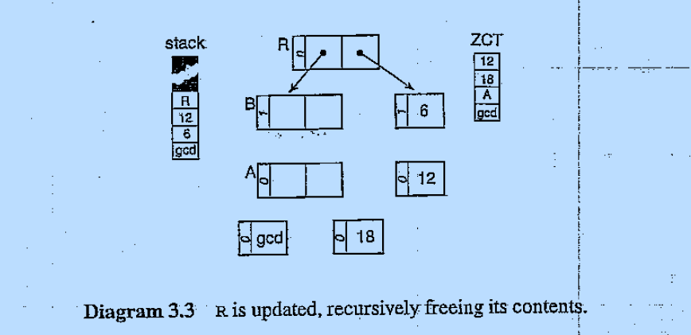
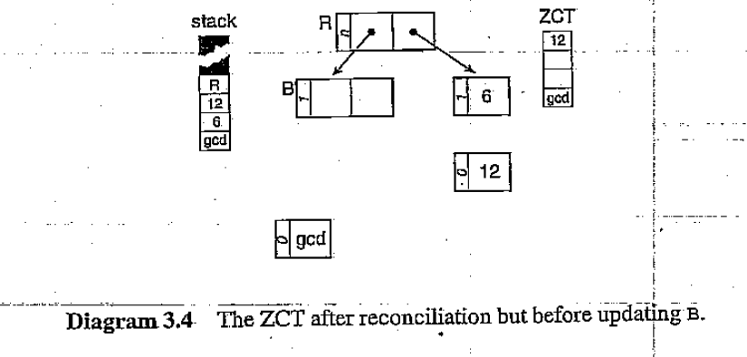
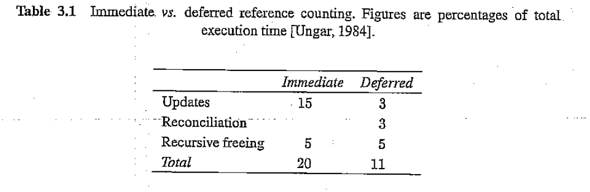
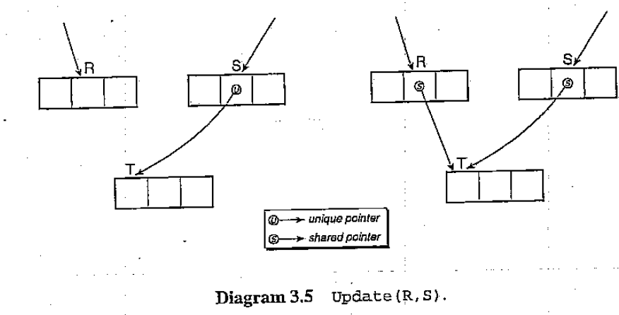

# 3 Reference Counting(引用计数)

[TOC]

第2章介绍了引用计数法的一种简单实现。引用计数法有很多优势。实现简单；当对象消亡时就能立即判定是不是垃圾对象，允许立即回收；内存回收有着较好的空间局部性，只需要访问更新指针的对象；不需要在堆上额外分配空间避免垃圾回收器的抖动；开销分布到所有计算中，使得引用计数适用于交互程序和其他不能容忍垃圾回收延迟的应用。每个对象的引用计数也可能有其他用途，例如，profiling 和其他能利用运行时共享分析的系统(原文:systems that can take advantage of run-time sharing analysis)

这些优势使得引用计数被一些系统采用（如， 早期版本的Smalltalk[Goldberg and Robson, 1983]和InterLisp; Modula2+[DeTreville, 1990a]; SISAL[Cann et al, 1992]; unix 工具awk 和perl[Aho et al, 1988; Wall and Schwartz, 1991])。引用计数也被分布式系统用作内存管理，其引用良好的局部性意味着通信开销的减少(见第12章)

第2章也指出了简单实现的引用计数法的劣势。移除最后一个指向对象的指针的开销是unbounded(无限的)，由于任意从被删除对象可达的后代也需要被释放。虽然引用计数的开销可以平摊到整个计算过程，调整引用计数的总开销(total overhead)多于跟踪式回收算法。尽管在更加受限的堆上也可以成功操作，引用计数在空间上也有一定的开销，计数需要使用每个对象的一部分空间。对许多应用来说另一个主要劣势是不能回收循环引用的对象。这一章，我们看看解决或至少能够改善这些问题的方法。

## 3.1 Non-recursive freeing(非递归释放)

在2.1小节介绍的引用计数算法中， 当指向对象的指针被重写时，Update函数减小该对象的引用计数。如果重写导致引用计数为0，在释放该对象之前，对象含有的所有指针也需要递归的删除。因此，简单的递归释放使得处理开销不均衡：删除最后一个指向对象的指针的开销并不是常数，跟对象的大小也没关系，而是取决于对象含有的指针的多少(but depends on the size of the sub-graph rooted at the object)

#### The algorithm (非递归算法)

Weizenbaum 提出了一种使用free-list作为栈来平滑释放的方法【Weizenbaum，1963】。当最后一个指向对象N的指针被删除时，N被放到free-stack上(free-list)。此时没有递归释放的操作。相反, 当N从free-stack中取出被重新分配时，N含有的所有指针被New删除，其中引用计数为0的对象又被放到free-stack上(见算法3.1)。注意当对象被放到栈上时其包含的指针内容没有被销毁。**唯一能够保证不再使用的是对象的`计数`使用的空间(若对象是空闲的，计数一定是0)，因此可以用来作为指向free-stack其他元素的指针(RC(N)= free-list)**。~~为了在推迟垃圾测试的情况下懒惰释放~~为了实现懒惰删除(原文: To make freeing 'lazy' in the sence of delaying tests for garbage)，在第2章算法2.2中给出free 和Update函数的定义并没有改变，除了使用RC(N)而不是一个未指定的next field来链接free-list。然而，New和delete必须修改。3.3节会给出这么做的原因， 我们使用incrementRC和decrementRC来抽象底层调整引用计数的细节。

算法3.1 Weizenbaum's lazy freeing algorithm for reference counting

~~~
New() = 
	if free_list ==  nil
		abort "memory exhausted"
	newcell = allocate()
	for N in Children(newcell)
		delete(*N)
	RC(newcell) = 1
	return newcell
	
delete(N) = 
	if RC(N) == 1
		RC(N) = free_list //引用计数的空间也用作指针
		free_list = N
	else decrementRC(N)
~~~

#### Costs and benifits of lazy deletion(懒惰删除的开销和劣势)

这种懒惰删除方法和之前的积极方法一样高效——使用的指令相同，但是从delete移到了allocate——but the algorithm is not so vulnerable to delays caused by cascades of cell releases（但是算法并非如此脆弱 级联释放对象引起的延迟  版本2：但该算法不易受到由对象级联释放引起的延迟的影响)。不幸的是这并没有完全解决处理的不均衡性。例如，如果一个数组被释放 ，当到达free-list的顶部(栈顶）时，它包含的所有指针仍然必须被释放; 删除指针和操纵free-stack带来的延迟可能是明显的，也可能是不明显的(原文: the delay to delete the pointers and manipulate the free-stack may or may not be noticeable)，取决于数组的大小。Weizenbaum's算法的惰性也会丧失一些标准引用计数算法的优势。被垃圾对象引用的数据结构占用的内存将不可用直到被引用的数据结构从free-stack中移除。假设某种类型的对象由一个小的头部指向一个大的结构体，当这种类型的对象被删除时——对象的头部会被放入free-stack中，被大的结构体占用的内存不能立即被回收使用

#### 总结

懒惰释放确实可能带来的延迟比较低，因为一次性释放的对象比较少（相较于递归释放)。也不需要编译器辅助

## 3.2 Deferred reference counting(推迟引用计数)

在传统硬件上维护引用计数的开销是比较高的。这个原因也导致在内存管理上引用计数没有跟踪式回收算法那么有吸引力（[Hartel, 1988])。重写(overwriting)指针一般需要几十个指令来调整新、旧对象的引用计数。当指针入栈和出栈是也必须调整引用计数(参数传递)。即使像遍历列表(list)这样的非销毁操作(non-destructive)也需要先增加列表元素的计数，当访问完成后减小引用计数。在现代带有数据缓存(data cache)的架构中，访问计数的指令可能导致lines被存入缓存(原文: In a mordern architecture with a data cache，instructions to fetch counts may cause lines to be brought into the cache that otherwise would not be touched。)。这些`lines`将会变脏(dirtied)并且需要回写到堆内存，即使它们的值和存入缓存的值一样[Baker, 1994]。操纵引用计数也可能导致包含远程对象(remote objects)的页面被换进[Stamos, 1984] (reference count manipulations may cause pages containing the remote objects to be paged in)(注:不太理解)

这种开销只能在认为是安全的时机通过不调整引用计数来减少。一种通常用在手写(hand-crafted)的引用计数系统中的技巧是，当传递参数给子例程(sub-routines)时避免增减引用计数。当然，只有知道子例程的执行不会导致参数的引用计数变为0才是安全的。手动优化引用计数更像是在减少CPU时间和增加调试时间之间做权衡。更可靠的方式是将优化放在编译器中，SISAL的并行实现中已经正面这种消除引用计数的方法非常高效[Cann and Oldehoeft, 1988; Oldehoeft, 1994]。Unorthodox type systems may also be used to identify singly-threaded objects, rendering reference counts unnecessary. Baker advocates use of a type system based on linear logic [Girard,1987] as an effective technique, although others have found it disappointing in practice[Baker, 1994; Wakeling,1990]。The functional programming language Clean uses a similar system of unique types[Brues et al., 1987]。 Although these systems require programmers to identify singly-threaded objects, the correctness of their type assertions can be checked by the compiler。(注： 不太理解）

#### The Deutsch-Bobrow algorithm

Deutsch and Bobrow 设计出一种系统性的运行时方法来推迟引用计数调整[Deutsch and Bobrow, 1976]，而不是通过编译时分析(compile-time analysis)来消除引用计数调整。大部分的指针都存储在局部变量中；现代为Lisp和ML优化的编译器中(原文: with modern optimising compilers for Lisp and ML,)， 存储在其他地方的指针的比例不足1%[Taylor et al, 1986; Appel, 1989b；Zorn, 1989]。**推迟引用计数利用了这种优势，通过特殊处理局部变量和编译器在栈上分配的临时变量：来自栈的引用不再被计数。这就意味着当对象的引用计数减为0时不能立即释放，因为可能还有局部变量或临时变量在引用此对象。相反当对象的引用计数为0时delete添加对象到一个zero count table(ZCT)中。ZCT通常以哈希表或bitmap的方式实现**。

**当对象被堆上的其他对象引用时，删除该对象在ZCT中的入口并且增加其引用计数。需要周期性的扫描ZCT来移除并回收垃圾对象。任意一个在ZCT中的对象且扫描栈时没有发现其他引用，一定是垃圾对象，可以归还到free-list。处理ZCT分三个阶段：首先标记所有从栈上可以访问到的对象，然后释放ZCT中没有被标记的对象，最后清除被标记对象上的标记**。

一种标记和反标记对象的方式是增加和减小引用计数(见算法3.3)。在从栈能直接访问到的所有对象的引用计数被增加后，若某个在ZCT中的对象确实是垃圾对象，其引用计数只能为0。这些垃圾对象在其含有的指针被删除(delete)后可以被释放。最后，在第一阶段——扫描栈——增加的引用计数必须被减小。

算法3.2 Deferred Reference counting: updating pointer values

~~~
delete(N) = 
	decrementRC(N)
	if RC(N) == 0
		add N to ZCT

Update(R,S) =
	incrementRC(S)
	delete(*R)
	remove S from ZCT
	*R = S
~~~

算法3.3 推迟引用计数: 处理ZCT

~~~
reconcile() = 
	for N in stack					//标记栈
		incrementRC(N) 
	for N in ZCT					//回收垃圾
		if RC(N) == 0
			for M in Children(N)
				delete(*M)
			free(N)
	for N in stack					//取消标记
		decrementRC(N)
~~~

#### An example(一个例子)

让我们通过一个例子来看看`推迟引用计数`是如何工作的。函数gcd(x，y)计算两个非负参数的最大公约数。我们假设第一个参数总是大于等于第二个参数，gcd函数如下：

算法3.4 最大公约数

~~~
gcd(x,y) = 
	if y == 0
		return x
	t = x -y 
	if x > t
		return gcd(y,t)
	else return gcd(t,y)
~~~

让我们假设有这样一个系统，所有的对象都在堆(heap)上分配，并且用图(graphs)来表示表达式(expressions)，图的节点是堆对象(heap objects)。进一步假设系统栈含有指向堆对象的指针。手动计算gcd(18, 12)的第一步是将其重写为gcd(12,6)。来看看系统如何做这一步

首先创建表示gcd(18,12)的图。R（注：表示什么玩意），两个参数和一个指向函数gcd的指针在栈上。方便起见，我们以原子对象的值来命名该对象。在这个阶段所有的节点(nodes)的引用计数都是1（除了可能被共享的R)并且ZCT为空(见图3.1)

因为y不为0，所以第一个测试失败，局部变量t的值设置为6。从free-list申请一块新内存，存放值6。由于没有其他堆对象引用它，所以将其放入ZCT。编译器也足够智能意识到x在gcd的本次调用中不会再被使用，所以重用这块栈内存来存放6。虽然6的引用计数为0，但从栈上还可以访问到所以回收时不会被释放(见图3.2)

图3.2

接下来的两步是使用Update(right(R)，6）将6和图链接起来，然后获取一个新对象B，并且Update(left(R)，B)。链接6和R会增加6的引用计数并且删除6在ZCT的入口项。让我们假设重写left(R)导致指向A、gcd和12（注:原文的12，应该是18才对）的指针被递归删除。此时ZCT包含12、18、A和gcd(见图3.3)（注：说实话没搞明白这一段）

图3.3

填充ZCT触发调和机制(原文: Filling ZCT triggers the reconciliation mechanism)。扫描栈时，reconcile函数发现R、6、12和gcd并标记它们（增加其引用计数)。扫描ZCT， reconcile函数释放A和18，由于它们未被标记(引用计数为0），并将其归还到free-list。由于栈中有指针指向12和gcd被保留在ZCT中(见图3.4）

抽象机器现在会链接gcd和12到B，并且从栈中删除三个元素。然后可以执行递归的下一步，计算gcd(12,6)(未展示)(原文: The abstract machine would now link gcd and 12 to B, and pop the top three items from the stack。 It would then be in a state where it can perform the next step of the recursion, evaluating gcd(12,6))

#### ZCT overflow(ZCT溢出)

在这个例子中，有个明显的缺点就是当ZCT溢出的时候（ZCT没有空间）时会进行协调(reconciled)，但是对象释放时，递归释放可能添加更多的对象到ZCT。解决这个问题有几种方案。如果释放对象会导致ZCT溢出，则应该终止回收，等到下次协调(reconciliation)ZCT时回收。另一种方案是，若使用Weizenbaum's 的延迟释放算法，已经被释放的对象含有的指针直到对象重新分配时才会被删除。当分配对象导致ZCT溢出时可以协调(reconciled ZCT)。若ZCT以bitmap的方式实现，溢出就不再是个问题[Baden, 1983]。在垃圾回收上下文中，位图是位数组，每个表示一个堆上的一个word。 通过设置和取消设置对应的位来标记对象进入和移除ZCT。以堆空间的一小部分为代价(例如, 1:32)， 可以消除溢出检查

#### The efficiency of deferred reference counting(推迟引用计数的效率)

推迟引用计数在减少写指针的开销方面非常高效。80年代中期，在Xerox dorado对Smalltalk 的实现的经验表明，以小部分空间为代价（在个人电脑上25KB） ，通常能够减少80%甚至更多的指针操纵开销[Ungar， 1984；Baden, 1983]。表3.1展示了 Ungar's reconciliation 和以递归方式实现的标准引用计数和推迟引用计数。

Ungar 也声明和标记—回收算法相比，协调（reconcile)ZCT带来的停顿(pauses)也很短(每500毫秒停顿30毫秒)

除了ZCT的空间开销外，推迟引用计数的主要劣势在于减小了引用计数能够立即回收垃圾对象的优势，只有等到协调ZCT的时候才能回收

#### 总结

这种方式需要编译器辅助

## 3.3 Limited-field reference counts

引用计数算法要求每个对象为计数预留存储空间。理论上最坏的情况下，预留的空间必须足够大以容纳堆(heep)和roots上的所有指针：至少必须和指针大小一样（这也是为什么Weizenbaum's 算法可以使用引用计数使用的空间来存放指针值，来将free-list中的对象串联在一起）。然俄，很难相信有哪个程序会导致引用计数增长到如此之大。因此可以使用更小的空间来存储引用计数 来节省空间，不过需要以处理计数溢出为代价。

### Sticky reference counts

**每个对象中引用计数的空间开销取决于对象的大小。如果使用指针大小的空间（避免溢出检查），Lisp cons 对象的开销是50%；如果使用1个字节开销就是12.5%。小的引用计数可能溢出，并因此违背引用计数对任意的堆上的对象N，RC(N)等于指向其指针的数目的恒定性(invariant)。会导致下面两个问题。**

**首先，引用计数不允许超出其允许的最大值。其次，一旦引用计数达到这个最大值，它就处于`停滞`(stuck)状态：由于引用对象的指针数量可能超出计数值，所以引用计数不能被减小(见算法3.5)。我们将这个最大值称为'sticky'**

算法3.5  增减'sticky' 引用计数

~~~
incrementRC(N) = 
	if RC(N) < sticky
		RC(N) = RC(N) + 1
		
decrementRC(N) =
	if RC(N) < sticky
		RC(N) = RC(N) - 1
~~~

#### Tracing collection restore reference counts(跟踪式回收算法恢复引用计数)

这就意味着一旦引用计数达到最大值，此对象就不能被释放。因为仅靠引用计数算法，计数无法再回到0。为了恢复引用计数必须使用一个后备的跟踪式回收算法(见算法3.6)。这个回收算法通过清扫堆上的对象，使得垃圾对象的计数为0。由于在活动图(active graph)的每个指针都会被遍历到，mark函数增加每个遍历到的对象的引用计数（直到其最大值）。在mark阶段结束的时候，堆上每个对象的引用计数将会恢复到其真正的值或`stick`值。后备的跟踪式回收算法的使用并不是一个负担，因为为了回收循环引用的对象也需要使用。简单起见，我们使用递归式的mark算法。实际当中会使用更高效算法（见第四章）

算法3.6  恢复处于'stuck'状态的引用计数的后备跟踪式回收算法

~~~
mark_sweep() = 
	for N in Heap
	for R in Roots
		mark(R)
	sweep()
	if free_pool is empty
		abort "Memory exhausted"

mark(N) = 
	incrementRC(N)
	if RC(N) == 1
		for M in Children(N)
			mark(*M)
~~~

### One-bit reference counts(1位引用计数)—待完善

Wise 和其他人提出了一种更激进的建议，使用1个bit位来存储引用计数[Wise and Friedman, 1977; Stoyeetal,1984; Chikaama and Kimura,1987; Wise,1993]。引用计数决定对象是被共享（sticky)还是独享（unique)。对Lisp和其他语言的研究表明大部分对象是没有被共享的，所以当指向它们的指针被删除时可以立即回收[Clark and Green,1977; Stoye et al,1984; Hartel,1988]。Wise认为引用计数应该关注这些没有被共享的对象。One-bit 引用计数的目标是尽可能的推迟垃圾回收，并且减小`标记-回收`空间上的开销(原文: and to reduce the space overhead to that of mark-sweep garbage collection.或许可以翻译为：减小mark-sweep要处理的空间大小)。引用计数也为优化提供了机会，比如 copy avoidance (拷贝避免)或者 in-place(在位更新)。如果需要一个对象修改后的拷贝，且没有其他引用指向这个对象，那么拷贝可以通过借用指向对象的指针和side-effecting完成，而不是先考吧再释放原始对象。拷贝避免对操纵大型的数组带来的优势比较明显。

最简单的实现是将存储引用计数的1个bit放到对象中[Wise and Friedman,1977]，但更好的方案是将bit存放到指针里[Stoye et al. 1984] 和用于类型检查的运行时的tag(run-time tags)一样[Steenkiste and Hennessy，1987]。第一个指向新创建对象的指针被标记为unique。当指针被Update拷贝时，拷贝指针被标记位sticky，还需要检查源指针的引用计数，如果源指针是unique需要被标记位sticky(见算法3.7)。注意引用计数不能将已经标记为sticky的指针标记为unique：被共享的对象只能被回收，非共享对象只能被恢复，通过跟踪式垃圾回收算法(restored)（原文: shared cells can only be reclaimed, and uniqueness can only be resotred, by a tracing garbage collection)。 然而，正如上面提到的，跟踪式回收算法在任意的回收周期都可能是必要的

The advantage of the Stoye et al. scheme is that a remote cell's status(uniquely referenced or shared) can be determined and modified without fetching the cell itself(for example, T in Diagram 3.5 on the facing page), and hence reduces the chance of cache misses or page faults. The cost of event a primay cache miss is likely to be of the order of five cycles; a page fault will cost many hundreds of thousands. Thus the cost of extra instruction is a price well worth paying. We discuss the interaction between garbage collection and the cache further in Chapter 11. A potential problem is that the site of the original pointer might be difficult to discover if the pointer's value has been passed through registers or the stack. 

算法3.7 One-bit reference counting with tagged pointers(引用计数存储在指针中的Update)

~~~
Update(R,S) =
	T = sticky(*S)
	if RC(*S) == unique
		*S = T
	delete(*R)
	*R = T
	
~~~

#### Restoring uniqueness information

一旦计数变成共享的，它就处于停滞状态(原文: it is stuck)—— 引用计数机制不能再将其变成独享的(unique)。如果指向sticky对象的最后一个指针被删除，对象无法被立即回收必须等待垃圾回收。若引用计数存储在对象中，那么这个引用计数位也可用作`标记-清扫`算法的标记位。在标记阶段完成之后，所有存活的对象被标记位sticky。不幸的是标记阶段不会区分共享(shared)和独享的对象。虽然独享信息丢失了，Friedman 和Wise 认为 that there will be plenty of opportunity for the one-bit reference counting scheme to get going again before another garbage collection is required provided that the collector is relatively successful in reclaiming space。

如果使用two-pass 压缩回收算法（见第4章的标记-压缩算法），独享引用可以被恢复(see also [Wise, 1979])。标记-压缩算法通常在标记阶段之后还需要进行两个阶段：存活对象被压缩到堆的底部（原文：live cells are compacted toward the bottom of the heap)，并且更新对这些对象的引用以反应它们的新位置。压缩算法在更新这些引用的过程中可以确定一个对象是否有多个引用(被共享)

Wise 也使用过半空间拷贝回收算法(semi-space copying)来恢复已经变成`sticky`的指针的唯一性标签，但是不应该再使用[Wize，1993]（见第6章堆拷贝回收算法的讨论）（原文：）。一个合理的拷贝回收算法必须维护一个恒定性(invariant)： 对任意在Tospace的对象，

### The 'Ought to be Two' cache

#### 总结

## 3.4 Hardware reference counting(暂时忽略)

## 3.5 cyclic reference counting(循环引用计数)

### Functional programming languages

### Bobrow's technique

### Weak-pointer algorithms

### Partial Mark-Seep Algorithms

## 3.6 issue to consider(需要考虑的问题)

## 总结

引用计数法的这些变种，哪种需要编译器辅助才能使用。哪种不需要就可以用到c/c++语言中

不需要编译器辅助就能使用的算法:

* 递归释放

* 非递归释放(懒惰删除)
