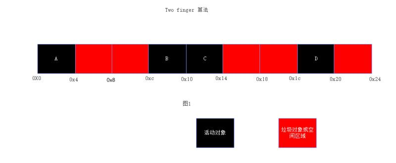
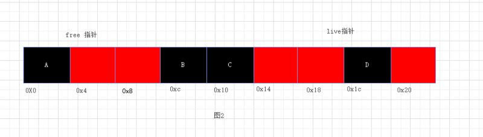
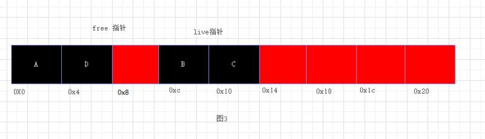
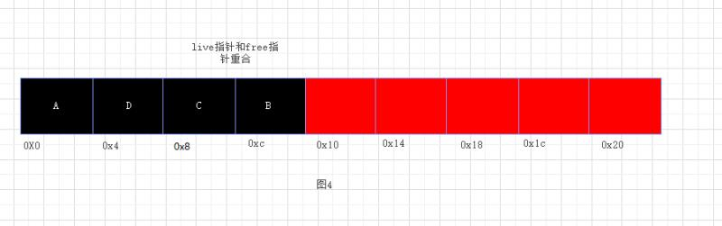
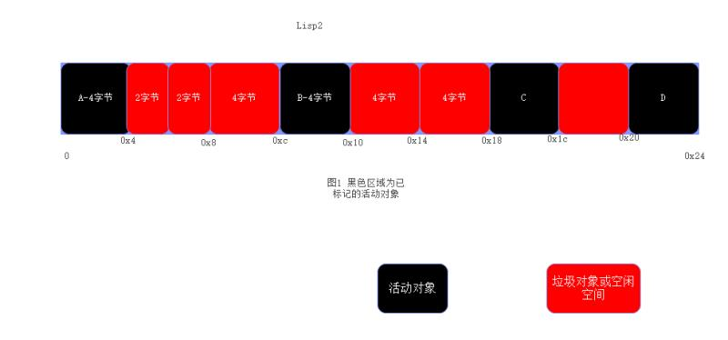
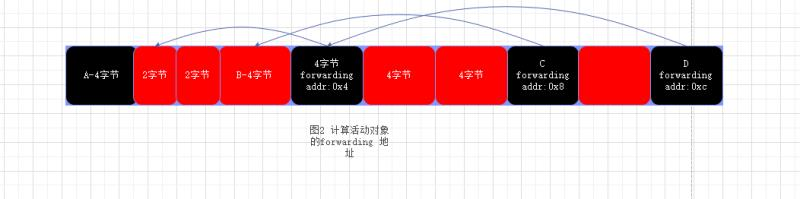
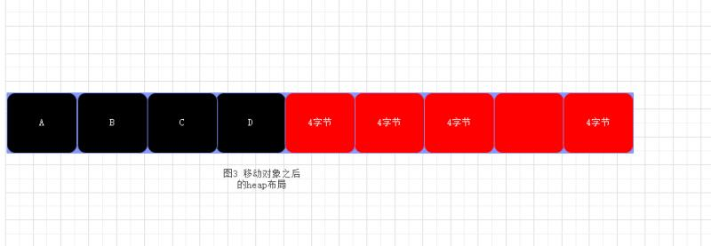

# 5 Mark-Compact Garbage Collection

[TOC]

在第4章，我们看到标记—清扫垃圾回收和在某些情况下可以和半空间—拷贝回收竞争。尤其是，标记—清扫 有着更好的虚拟内存行为(virtual memory behaviour)。其主要的的缺点在于处理不同大小的的对象时导致的堆空间碎片化。在每次垃圾回收过后，堆空间可能有许多小的"洞"(hole)

## 5.1 Fragmentation(碎片化)

碎片化可能意味着在不扩展堆空间的情况下不能放下一个大的对象，因为没有哪个"洞"(hole)足够大以容纳新对象，虽然总的空闲空间可能足够。反过来，当分配小的对象时面临这样一个困境。就是应该使用哪种分配策略？应该是First-Fit策略么，有导致上述碎片化问题的风险，或者为新对象找到Best-Fit位置而付出代价的分配器？又或者使用Buddy system？这个问题并不只存在于标记—清扫算法中；分配不同大小的对象但不移动它们的任意系统都存在这个问题。引用计数和采用显示分配、释放动态内存的系统也存在这个困境(quandary)。

与此相反，紧缩(compact)堆内存的回收系统，包括半空间—拷贝回收器，有着非常小的内存分配开销。在这些系统中堆空间的分配策略可以被认为遵从栈(stack)的规则：使用的内存区域一直增长直到垃圾回收被触发，此时，寄希望于大部分被回收。对象的分配就会比较简单（the area of memory believed to be in use always grows until a garbage collection takes place when, hopefully, it shrinks by a large amount。Object allocation is then simple)。假设堆上有足够的空间，可能轻推指向“next-free-space"的指针对象大小就能分配一个对象（ an object may be allocated by nudging a "next-free-space" pointer by the size of the object)

一种具有吸引力的堆空间组织方式适用于非移动(non-moving)回收器，就是为每个大小不同的对象维护一个单独的free-list。在这种情况下，内存分配的开销不会比拷贝式回收器的大多少(正如第4章看到的）。虽然这种技术减轻了分配和释放固定大小对象的问题，本质上没有解决内存碎片化的问题。仍然存在一个free-list维护的区域已经满了，而其他free-list维护的区域是空闲的(while that maintained by another is comparatively empty)

### Two-level allocation（2层分配）

Two-level 分配器，比如被Boehm-Demers-Weiser回收器使用的，可以极大地减轻这个问题[Boehm and Weiser，1988]。在低层，分配器维护一个内存块列表(a list of blocks of memory)。假如用于某个大小的对象的free-list为空，可以为这个free-list分配一个块(block)。在较高层，每个free-list 从低层(low-level)获取的块(blocks)中为单一大小对象分配空间。假设free-list不为空，总是能以较低的开销获得小对象。在垃圾回收的清扫阶段(sweep phase)若发现整个块(block)都是空闲的，这个块(block)可以归还给低层分配器（it can be returned to the low-level allocator to be recycled between the different free-lists)(4.5节讨论了清扫技术)。two-level分配系统的另一个优势是堆(heap)空间不必是连续的

Two-level分配也不能完全消除碎片。分配超过单个块(block)大小的对象可能仍然困难，因为需要找到足够的连续的(adjacent)空闲块来容纳对象。针对这一问题的一个方案就是将大型对象分成固定大小的头部(fixed size header)和body来单独管理大型的对象(for eample, Kyoto Common Lisp uses this technique [Yuasa and Hagiya, 1985])。头部可以被标记—清扫回收器使用适当大小的free-list来管理，而body在单独的堆区域中分配。这个大型对象区域(Large Object Area) 被单独的策略管理；可能是某种使用压缩的回收算法。

Two-level分配也仍然允许被单个free-list管理的块(block)内的碎片化。在不妨碍分配的情况下(While not impeding allocation)，这种碎片化可能影响客户程序(client program)的空间局部性。在垃圾回收之后，空闲区域将会散布着存活对象(live objects)。这些空闲区域将会被客户程序的不同部分分配新对象填充，使得虚拟内存页包含不同年龄的对象。结果就是程序的工作集(working set)将会分散到超过必须的更多的页面, 可能导致大量的paging traffic。因为这个原因，简单的标记—清扫算法有时被认为不适合虚拟内存环境。工作集参数(woking set argument)和其他的非移动(non-moving)系统也相关，比如引用计数，或者不遵循局部性的移动对象的回收系统。一个例子就是5.3节要讨论的Two-Finger 紧缩(compaction)算法。（翻译的不咋滴）

然而，局部性问题可能并不像简单的分析表明的那样糟糕。Objects that are active at the same time are often created at the same time and may share similar lifetimes. If such clusters of objects do indeed live and die in groups, the objects are likely to be allocated closely, spatially as well as temporarily, and likely to be reclaimed at about the same time[Hayes,1991; Wilson, 1994]

## 5.2 Styles of compaction 

在这一章我们讨论紧缩(compacting)堆上的存活的数据结构的方法。紧缩(compaction)意味着，在紧缩阶段结束后，堆空间会被划分成两个连续的区域。一个区域存放所有活动的数据，而另一个区域则为空闲区域。为了区分于压缩(compressing)数据结构的技术，一些人将这种技术称为compactifying。实际上，可能希望将两种技术结合在一起使用—结构可以在重定位时压缩，虽然随着价格便宜的内存的出现，像cdrcoding list这种技术已经失宠，因为访问压缩数据的代价[Bobrow and Clark，1979]。然而，一些人最近建议为了减少内存需求和磁盘寻道（由于处理器的速度继续超过磁盘速度的增加），压缩可能值得再次考虑[Backer, 1991; Wilson, 1992a; Douglis, 1993; Wilson，1994]。我们应该在需要做出区别的地方小心指出；否则我们应该使用术语compaction。

紧缩算法在活动数据结构或堆区域上运行多趟(several passes)。执行的趟数取决于算法和合并多趟的优化是否可能。通常，compacting 回收器运行3趟，虽然它们可能在对象重定位是在指针更新之前或之后完成上有所不同：

* 标记活动的数据结构
* 通过重定位对象来compact the graph(原文: compact the graph by relocating)
* 更新引用被移动的对象的指针的值

重定位对象时需要小心。理想情况下，对象在堆上的位置应该反应出它们被用户程序访问的方式。糟糕的对象顺序可能导致虚拟内存性能下降和缓存命中率下降。根据紧缩完成后对象的相对顺序，算法可以被分为三类：

* Arbitrary: 移动对象时不考虑其原来的顺序，或它们是否指向其他对象。这种方法可能实现简单并且执行时间短，特别时所有对象都是固定大小，但它们通常会导致糟糕的空间局部性。
* Linearising:  只要可能，原来指向其他对象的对象就被移动到相邻的位置。采用深度优先遍历的拷贝回收算法(如2.3节的Fenichel-Yochelson 回收算法)归为此类。如果期望的话，可以使用如crd-coding的技术来压缩数据结构.
* Sliding: 对象滑动到堆的另一端，挤出空闲空间，因此维持对象原来分配时的位置。

后两种compaction提供了一些优势。对象在堆上的空间顺序反应它们的分配顺序对某些系统来说特别重要。例如，Prolog的实现，在回溯用常量时间释放不定数量（unbounded amounts)的内存时可以利用这个特性： 堆被当作一样来对待。有些人认为sliding 策略倾向于给定最佳的引用局部性，并且不值得尝试再次猜测用户程序[Clark and Green，1997; Clark，1979]。Hayes的研究和Xerox PCR系统的经验表明许多对象以簇的形式存活和消亡[Hayes，1991]。如果是这样的话，并且如果这些簇被合理地相邻分配，sliding compaction 将会保持它们在一起（或者，无论如何，不会恶化它们的空间分部)

在比较compaction 算法时，其他需要考虑的问题包括算法是否能处理不同大小的对象；为了重定位对象和更新指针需要扫描堆几趟(passes)；如果有的话，算法需要多少额外空间；算法是否对指针施加了额外限制，是否允许内部指针(interior pointers)，can pointers point backwards；每一步有多少工作量

许多不同的算法和算法优化存在于资料中。我们应该限制我们只审视几个有代表性的方法。除了semi-space 拷贝回收算法，使用的技术包括：

* Two-Finger algorithms:  使用两个指针，一个指向下一个空闲位置，另一个指向下一个待移动的对象。移动对象时，一个前向地址(a forwarding address)被留在旧位置。这个算法通常只适用于固定大小的对象。
* Forwarding address algorithms: 在移动对象前，前向地址(forwarding addresses)被写入每个对象的一个额外的字段(field)中。此算法适用于回收具有不同大小的对象。
* Table-based methods: 一个重定位表，通常被称为 break table，在堆上构建在重定位对象之前或之后。后面计算指针的新值时会用到这个表。
* Threaded methods: 原来指向某个对象的每个对象被串在一起形成一个列表(list)。当对象被移动时，遍历列表来调整指向它的指针

我们详细地考虑4个特定的算法。  Edwards's Two-Finger compactor is fast, 时间复杂度是O(M) ，M是堆的大小。它的

**interior pointer: 指向某个对象的内部而不是对象头部的指针**

## 5.3 The Two-Finger Algorithm

我们的第一个例子是two-finger算法，来源于Edwards[Saunders, 1974]，首先标记活动对象，并统计存活对象的数目nlive。算法的第一趟就是重定位位于heap的上部(above heap[nlive])的存活对象到heap的底部的空闲槽位中。然后用forwarding address 重写被拷贝对象的第一个field。不需要额外空间。第二趟扫描heap的底部直到heap[nlive] (第一趟完成之后，nlive之上都是空闲空间)，更新指针以反映对象的新位置。在compaction阶段结束时，free指向heap的第一个空闲槽位。

~~~
统计存活对象数目的目的就是在算法完成后，用于设置free指针

Compact_2Finger() = 
	no_live_cells = mark()
	relocate()
	update_pointers(no_live_cells)
	free = no_live_cells + 1
~~~

​	算法5.1 Edward's Two-Finger compaction算法

### 图示

假设有36字节大小的堆，每个对象的大小为4字节，如图1所示。首先，从roots出发标记所有可达对象，图1所示的堆上有四个live对象分别是A、B、C、D。

标记完成后，接下来扫描整个堆。free指针指向从堆开始的一个空闲槽位，live指针指向堆结束位置开始的第一个存活对象的位置。如下图所示，free指向0x4， 而live指向0x1c处的对象D

拷贝 live指向的对象到free指向的位置，copy(free, live)，将forwarding address写入被拷贝对象。

更新指针

## LISP2 

