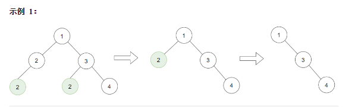
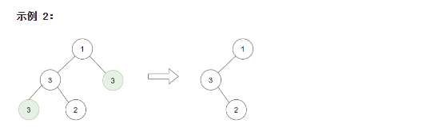
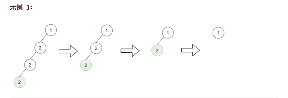

# 二叉查找树相关练习

[TOC]

### 总结


tag: binary search tree

### 问题1：将二叉查找树转换为 Greater Sum Tree 

2020-6-9s

\1038. Binary Search Tree to Greater Sum Tree

Medium

70794Share

Given the root of a binary **search** tree with distinct values, modify it so that every `node` has a new value equal to the sum of the values of the original tree that are greater than or equal to `node.val`.

As a reminder, a *binary search tree* is a tree that satisfies these constraints:

- The left subtree of a node contains only nodes with keys **less than** the node's key.
- The right subtree of a node contains only nodes with keys **greater than** the node's key.
- Both the left and right subtrees must also be binary search trees.

 

**Example 1:**

****

```
Input: [4,1,6,0,2,5,7,null,null,null,3,null,null,null,8]
Output: [30,36,21,36,35,26,15,null,null,null,33,null,null,null,8]
```

 

**Constraints:**

1. The number of nodes in the tree is between `1` and `100`.
2. Each node will have value between `0` and `100`.
3. The given tree is a binary search tree.

##### 算法

问题更新二叉查找树的每个节点的键值。更新后的键值为所有键值大于等于节点x的节点的的键值之和(包含当前的x节点)。最简单的方法是中序遍历二叉查找树，获得一个按键值升序排列的节点列表。然后倒序更新节点列表中每个节点的键值

~~~go
/**
 * Definition for a binary tree node.
 * type TreeNode struct {
 *     Val int
 *     Left *TreeNode
 *     Right *TreeNode
 * }
 */
func bstToGst(root *TreeNode) *TreeNode {
    queue := make([]*TreeNode, 0)
    queue = inOrderTraverse(root, queue)
    sum := 0
    for i := len(queue)-1; i >= 0;i--{
        sum += queue[i].Val
        queue[i].Val = sum
    }
    return root
}

func inOrderTraverse(node *TreeNode, queue []*TreeNode)[]*TreeNode{
    if node == nil{
        return queue
    }
    queue = inOrderTraverse(node.Left, queue)
    queue = append(queue, node)
    return inOrderTraverse(node.Right,queue)
}
~~~


##### 结果


##### 优化

以上的解法时间复杂度是O(n)，空间复杂度也是O(n)。能找到一个空间复杂度为常量的算法最好不过s


### 问题2 平衡一颗二叉查找树

\1382. Balance a Binary Search Tree

Medium

19317Share

Given a binary search tree, return a **balanced** binary search tree with the same node values.

A binary search tree is *balanced* if and only if the depth of the two subtrees of every node never differ by more than 1.

If there is more than one answer, return any of them.

 

**Example 1:**

****

```
Input: root = [1,null,2,null,3,null,4,null,null]
Output: [2,1,3,null,null,null,4]
Explanation: This is not the only correct answer, [3,1,4,null,2,null,null] is also correct.
```

 

**Constraints:**

- The number of nodes in the tree is between `1` and `10^4`.
- The tree nodes will have distinct values between `1` and `10^5`.


### 问题3 检查一棵二叉树是否是二叉查找树

中等

##### 解题思路

一开始的想法是，以先序方式遍历二叉查找树，遍历过程中比较当前节点及其左、右子节点的值的大小。若出现违反二叉查找树规则的情形，则设置一个标志位即可

上面的方法无法解决下面的输入构造的二叉树：

[10, 5, 15, null, null, 6 20]

~~~
 		10
 		/ \
 	   5   15
 	      / \
 	     6   20 
~~~


~~~go
/**
 * Definition for a binary tree node.
 * type TreeNode struct {
 *     Val int
 *     Left *TreeNode
 *     Right *TreeNode
 * }
 */
func isValidBST(root *TreeNode) bool {
    if root == nil{
        return true
    }
    
    values := make([]int, 0)
    values = preorderTraverse(root, values)
    for i :=1; i < len(values); i++{
        if values[i] <= values[i-1]{
            return false
        }
    }
    return true
}

func preorderTraverse(node *TreeNode, values []int)[]int{
    if node == nil{
        return values
    }
    values = preorderTraverse(node.Left, values)
    values = append(values, node.Val)
    values = preorderTraverse(node.Right, values)

    return values
}
~~~


##### 结果


### 优化后

~~~go
/**
 * Definition for a binary tree node.
 * type TreeNode struct {
 *     Val int
 *     Left *TreeNode
 *     Right *TreeNode
 * }
 */
func isValidBST(root *TreeNode) bool {
    if root == nil{
        return true
    }
    /*
    values := make([]int, 0)
    values = preorderTraverse(root, values)
    for i :=1; i < len(values); i++{
        if values[i] <= values[i-1]{
            return false
        }
    }*/
    balance := true
    pre := findMin(root)
    pre = pre -1
    inorderTraverse(root, &pre, &balance)
    return balance
}

func findMin(node *TreeNode)int{
    if node.Left == nil{
        return node.Val
    }
    return findMin(node.Left)
}

func inorderTraverse(node *TreeNode, pre *int, balance *bool){
    if node == nil{
        return 
    }
    inorderTraverse(node.Left, pre, balance)
    if node.Val <= *pre{
        *balance = false
    }
    *pre = node.Val
    inorderTraverse(node.Right, pre, balance)
}
~~~


### 问题4  找出二叉查找树中第k小元素


##### 问题描述

给定一个二叉搜索树，编写一个函数 kthSmallest 来查找其中第 k 个最小的元素。

说明：
你可以假设 k 总是有效的，1 ≤ k ≤ 二叉搜索树元素个数。

示例 1:

输入: root = [3,1,4,null,2], k = 1
   3
  / \
 1   4
  \
   2
输出: 1
示例 2:

输入: root = [5,3,6,2,4,null,null,1], k = 3
​       5
​      / \
​     3   6
​    / \
   2   4
  /
 1
输出: 3
进阶：
如果二叉搜索树经常被修改（插入/删除操作）并且你需要频繁地查找第 k 小的值，你将如何优化 kthSmallest 函数？


思路：

最初想法就是中序遍历二叉查找树，将节点值放到数组中。然后再获取k-1索引位置的值就是第k小元素。思路是没有问题。性能较差,时间复杂度是O(n), 空间复杂度也是O(n)。

下面是经过优化的，空间复杂度降至到了常量

~~~go
/**
 * Definition for a binary tree node.
 * type TreeNode struct {
 *     Val int
 *     Left *TreeNode
 *     Right *TreeNode
 * }
 */
func kthSmallest(root *TreeNode, k int) int {
    value := 0
    i := 0
    inorderTraversal(root, &value,  k, &i)
    return value
}

func inorderTraversal(node *TreeNode, value *int,  k int, i *int){
    if node == nil{
        return 
    }
    inorderTraversal(node.Left, value,  k, i)
    if *i == k-1{
        *value = node.Val
        *i += 1
    }else if *i < k{
        *i += 1
    }
  
    inorderTraversal(node.Right, value, k, i)
}
~~~


##### 结果


### 5 删除叶子节点

给你一棵以 root 为根的二叉树和一个整数 target ，请你删除所有值为 target 的 叶子节点 。

注意，一旦删除值为 target 的叶子节点，它的父节点就可能变成叶子节点；如果新叶子节点的值恰好也是 target ，那么这个节点也应该被删除。

也就是说，你需要重复此过程直到不能继续删除。

 

示例 1：



输入：root = [1,2,3,2,null,2,4], target = 2
输出：[1,null,3,null,4]
解释：
上面左边的图中，绿色节点为叶子节点，且它们的值与 target 相同（同为 2 ），它们会被删除，得到中间的图。
有一个新的节点变成了叶子节点且它的值与 target 相同，所以将再次进行删除，从而得到最右边的图。
示例 2：



输入：root = [1,3,3,3,2], target = 3
输出：[1,3,null,null,2]
示例 3：


输入：root = [1,2,null,2,null,2], target = 2
输出：[1]
解释：每一步都删除一个绿色的叶子节点（值为 2）。
示例 4：

输入：root = [1,1,1], target = 1
输出：[]
示例 5：

输入：root = [1,2,3], target = 1
输出：[1,2,3]


提示：

1 <= target <= 1000
每一棵树最多有 3000 个节点。
每一个节点值的范围是 [1, 1000] 。


~~~go
/**
 * Definition for a binary tree node.
 * type TreeNode struct {
 *     Val int
 *     Left *TreeNode
 *     Right *TreeNode
 * }
 */
func removeLeafNodes(root *TreeNode, target int) *TreeNode {
    if root == nil{
        return nil
    }
    root.Left = removeLeafNodes(root.Left, target)
    root.Right = removeLeafNodes(root.Right, target)
    if root.Val == target && root.Left == nil && root.Right == nil{
        return nil
    }
    return root
}

~~~


##### 结果


### 问题6 以非递归实现中序遍历

待实现