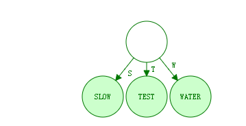
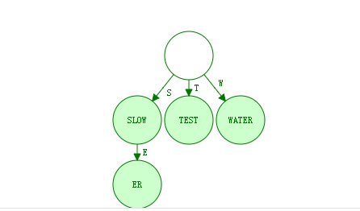
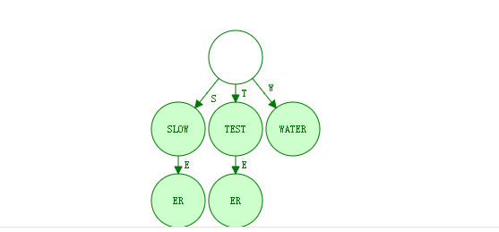
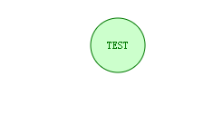
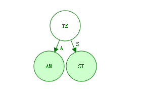
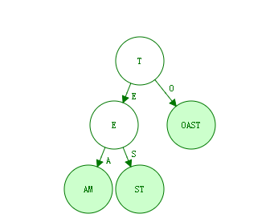

# radix tree

source address：http://en.wikipedia.org/wiki/Radix_tree

In [computer science](http://en.wikipedia.org/wiki/Computer_science), a **radix tree** (also **patricia trie** or **radix trie** or **compact prefix tree**) is a space-optimized [trie](http://en.wikipedia.org/wiki/Trie) [data structure](http://en.wikipedia.org/wiki/Data_structure) **where each node with only one child is merged with its child**. The result is that every internal node has up to the number of children of the radix r of the radix trie, where r is a positive integer and a power x of 2, having x ≥ 1. Unlike in regular tries, edges can be labeled with sequences of elements as well as single elements. This makes them much more efficient for small sets (especially if the strings are long) and for sets of strings that share long prefixes.

<font color="red">Unlike regular trees (where whole keys are compared *en masse* from their beginning up to the point of inequality), the key at each node is compared chunk-of-bits by chunk-of-bits, where the quantity of bits in that chunk at that node is the radix r of the radix trie. When the r is 2, the radix trie is binary (i.e., compare that node's 1-bit portion of the key), which minimizes sparseness at the expense of maximizing trie depth—i.e., maximizing up to conflation of nondiverging bit-strings in the key. When r is an integer power of 2 greater or equal to 4, then the radix trie is an r-ary trie, which lessens the depth of the radix trie at the expense of potential sparseness.没理解</font>

As an optimization, edge labels can be stored in constant size by using two pointers to a string (for the first and last elements).[[1\]](http://en.wikipedia.org/wiki/Radix_tree#cite_note-1)

Note that although the examples in this article show strings as sequences of characters, the type of the string elements can be chosen arbitrarily; for example, as a bit or byte of the string representation when using [multibyte character](http://en.wikipedia.org/wiki/Multibyte_character) encodings or [Unicode](http://en.wikipedia.org/wiki/Unicode).

 

## Contents

 [[hide](http://en.wikipedia.org/wiki/Radix_tree)] 

- [1 Applications](http://en.wikipedia.org/wiki/Radix_tree#Applications)
- 2 Operations
  - [2.1 Lookup](http://en.wikipedia.org/wiki/Radix_tree#Lookup)
  - [2.2 Insertion](http://en.wikipedia.org/wiki/Radix_tree#Insertion)
  - [2.3 Deletion](http://en.wikipedia.org/wiki/Radix_tree#Deletion)
  - [2.4 Additional operations](http://en.wikipedia.org/wiki/Radix_tree#Additional_operations)
- [3 History](http://en.wikipedia.org/wiki/Radix_tree#History)
- [4 Comparison to other data structures](http://en.wikipedia.org/wiki/Radix_tree#Comparison_to_other_data_structures)
- [5 Variants](http://en.wikipedia.org/wiki/Radix_tree#Variants)
- [6 See also](http://en.wikipedia.org/wiki/Radix_tree#See_also)
- [7 References](http://en.wikipedia.org/wiki/Radix_tree#References)
- 8 External links
  - [8.1 Implementations](http://en.wikipedia.org/wiki/Radix_tree#Implementations)

 

## Applications 

As mentioned, radix trees are useful for constructing [associative arrays](http://en.wikipedia.org/wiki/Associative_array) with keys that can be expressed as strings. They find particular application in the area of [IP](http://en.wikipedia.org/wiki/Internet_Protocol) [routing](http://en.wikipedia.org/wiki/Routing), where the ability to contain large ranges of values with a few exceptions is particularly suited to the hierarchical organization of [IP addresses](http://en.wikipedia.org/wiki/IP_address).[[2\]](http://en.wikipedia.org/wiki/Radix_tree#cite_note-2) They are also used for [inverted indexes](http://en.wikipedia.org/wiki/Inverted_index) of text documents in [information retrieval](http://en.wikipedia.org/wiki/Information_retrieval).

## Operations 

Radix trees support insertion, deletion, and searching operations. Insertion adds a new string to the trie while trying to minimize the amount of data stored. Deletion removes a string from the trie. Searching operations include (but are not necessarily limited to) exact lookup, find predecessor, find successor, and find all strings with a prefix. All of these operations are O(*k*) where k is the maximum length of all strings in the set, where length is measured in the quantity of bits equal to the radix of the radix trie.

### Lookup 


[](http://en.wikipedia.org/wiki/File:An_example_of_how_to_find_a_string_in_a_Patricia_trie.png)

Finding a string in a Patricia trie

The lookup operation determines if a string exists in a trie. Most operations modify this approach in some way to handle their specific tasks. For instance, the node where a string terminates may be of importance. This operation is similar to tries except that some edges consume multiple elements.

The following pseudo code assumes that these classes exist.

**Edge**

- *Node* targetNode
- *string* label

**Node**

- *Array of Edges* edges
- *function* isLeaf()

```
function lookup(string x)
{
  // Begin at the root with no elements found
  Node traverseNode := root;
  int elementsFound := 0;
  
  // Traverse until a leaf is found or it is not possible to continue
  while (traverseNode != null && !traverseNode.isLeaf() && elementsFound < x.length)
  {
    // Get the next edge to explore based on the elements not yet found in x
    Edge nextEdge := select edge from traverseNode.edges where edge.label is a prefix of x.suffix(elementsFound)
      // x.suffix(elementsFound) returns the last (x.length - elementsFound) elements of x
  
    // Was an edge found?
    if (nextEdge != null)
    {
      // Set the next node to explore
      traverseNode := nextEdge.targetNode;
    
      // Increment elements found based on the label stored at the edge
      elementsFound += nextEdge.label.length;
    }
    else
    {
      // Terminate loop
      traverseNode := null;
    }
  }
  
  // A match is found if we arrive at a leaf node and have used up exactly x.length elements
  return (traverseNode != null && traverseNode.isLeaf() && elementsFound == x.length);
}
```

### Insertion[ ](http://en.wikipedia.org/w/index.php?title=Radix_tree&action=edit&section=4)

To insert a string, we search the tree until we can make no further progress. At this point we either add a new outgoing edge labeled with all remaining elements in the input string, or if there is already an outgoing edge sharing a prefix with the remaining input string, we split it into two edges (the first labeled with the common prefix) and proceed. This splitting step ensures that no node has more children than there are possible string elements.

Several cases of insertion are shown below, though more may exist. Note that r simply represents the root. It is assumed that edges can be labelled with empty strings to terminate strings where necessary and that the root has no incoming edge.

- 

  Insert 'water' at the root

- 

  Insert 'slower' while keeping 'slow'

- 

  Insert 'test' which is a prefix of 'tester'

- 

  

  Insert 'team' while splitting 'test' and creating a new edge label 'st'

- 

  Insert 'toast' while splitting 'te' and moving previous strings a level lower

### Deletion 

To delete a string x from a tree, we first locate the leaf representing x. Then, assuming x exists, we remove the corresponding leaf node. If the parent of our leaf node has only one other child, then that child's incoming label is appended to the parent's incoming label and the child is removed.

### Additional operations 

- Find all strings with common prefix: Returns an array of strings which begin with the same prefix.
- Find predecessor: Locates the largest string less than a given string, by lexicographic order.
- Find successor: Locates the smallest string greater than a given string, by lexicographic order.

## History 

Donald R. Morrison first described what he called "Patricia trees" in 1968;[[3\]](http://en.wikipedia.org/wiki/Radix_tree#cite_note-3) the name comes from the [acronym](http://en.wikipedia.org/wiki/Acronym) **PATRICIA**, which stands for "*Practical Algorithm To Retrieve Information Coded In Alphanumeric*". Gernot Gwehenberger independently invented and described the data structure at about the same time.[[4\]](http://en.wikipedia.org/wiki/Radix_tree#cite_note-4) PATRICIA tries are radix tries with radix equals 2, which means that each bit of the key is compared individually and each node is a two-way (i.e., left versus right) branch.

## Comparison to other data structures 

(In the following comparisons, it is assumed that the keys are of length *k* and the data structure contains *n* members.)

Unlike [balanced trees](http://en.wikipedia.org/wiki/Balanced_trees), radix trees permit lookup, insertion, and deletion in O(*k*) time rather than O(log *n*). This doesn't seem like an advantage, since normally*k* ≥ log *n*, but in a balanced tree every comparison is a string comparison requiring O(*k*) worst-case time, many of which are slow in practice due to long common prefixes (in the case where comparisons begin at the start of the string). In a trie, all comparisons require constant time, but it takes *m* comparisons to look up a string of length *m*. Radix trees can perform these operations with fewer comparisons, and require many fewer nodes.

Radix trees also share the disadvantages of tries, however: as they can only be applied to strings of elements or elements with an efficiently reversible mapping to strings, they lack the full generality of balanced search trees, which apply to any data type with a [total ordering](http://en.wikipedia.org/wiki/Total_ordering). A reversible mapping to strings can be used to produce the required total ordering for balanced search trees, but not the other way around. This can also be problematic if a data type only[provides](http://en.wikipedia.org/wiki/Interface_(computer_science)) a comparison operation, but not a (de)[serialization](http://en.wikipedia.org/wiki/Serialization) operation.

[Hash tables](http://en.wikipedia.org/wiki/Hash_table) are commonly said to have expected O(1) insertion and deletion times, but this is only true when considering computation of the hash of the key to be a constant time operation. When hashing the key is taken into account, hash tables have expected O(*k*) insertion and deletion times, but may take longer in the worst-case depending on how collisions are handled. Radix trees have worst-case O(*k*) insertion and deletion. The successor/predecessor operations of radix trees are also not implemented by hash tables.

## Variants 

A common extension of radix trees uses two colors of nodes, 'black' and 'white'. To check if a given string is stored in the tree, the search starts from the top and follows the edges of the input string until no further progress can be made. If the search-string is consumed and the final node is a black node, the search has failed; if it is white, the search has succeeded. This enables us to add a large range of strings with a common prefix to the tree, using white nodes, then remove a small set of "exceptions" in a space-efficient manner by *inserting* them using black nodes.

The **HAT-trie** is a radix tree based cache-conscious data structure that offers efficient string storage and retrieval, and ordered iterations. Performance, with respect to both time and space, is comparable to the cache-conscious [hashtable](http://en.wikipedia.org/wiki/Hashtable).[[5\]](http://en.wikipedia.org/wiki/Radix_tree#cite_note-5)[[6\]](http://en.wikipedia.org/wiki/Radix_tree#cite_note-6) See HAT trie implementation notes at [[1\]](http://code.google.com/p/hat-trie)