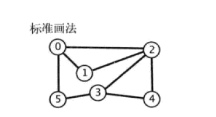
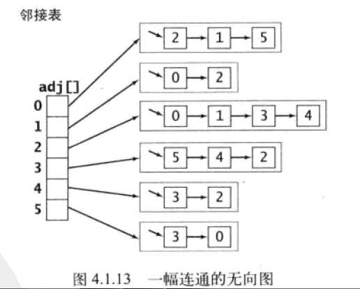
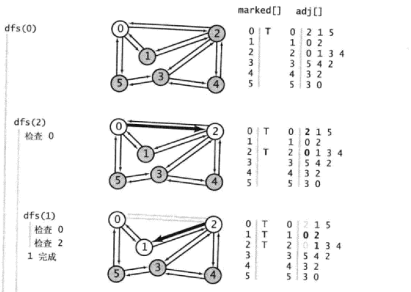
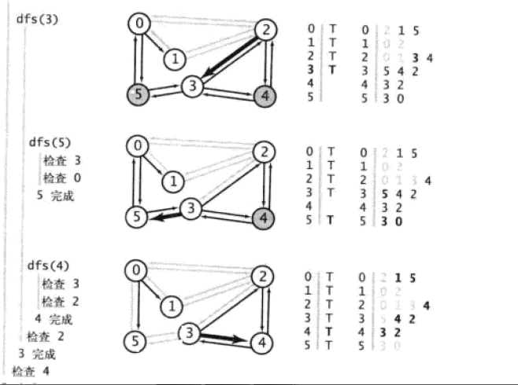
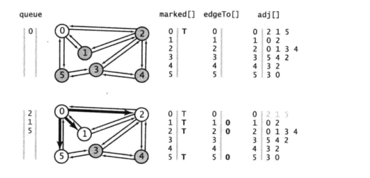
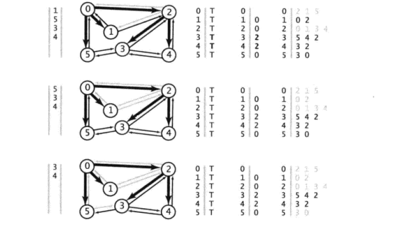
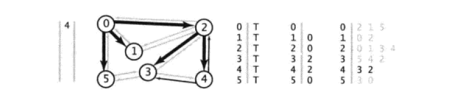

# 图

[TOC]

### 图

一个图(graph)G=(V,E)由顶点(vertex)集和边(edge)集E组成，每一条边就是一个点对(v, w),其中v, w 属于V

路径：图中的路径是一个顶点序列a1, a2, a3, ..., an, 使得(ai, ai+1)属于E，1 <= i <N。路径长度即路径上的边数目

自环(loop)：顶点含有一条到顶点自身的边那么路径(v, v)被称为环(loop)

简单路径：没有重复顶点的路径

完全联通图：图中的每对顶点之间都存在一条边

环(loop or cycle): 至少含有一条边且起点和终点相同的路径(有向图)

DAG: 有向无环图(directed acyclic graph)

顶点的度数：依附于该顶点的边的总数

图的密度： 已经连接的顶点对（边数）占所有可能被链接的顶点对的比例。在稀疏图中，被连接的顶点对很少。而稠密图中只有少部分顶点对之间没有连接

二分图：二分图又称作二部图，是图论中的一种[特殊模型](https://baike.baidu.com/item/%E7%89%B9%E6%AE%8A%E6%A8%A1%E5%9E%8B/19071206)。 设G=(V,E)是一个无向图，如果顶点V可分割为两个互不相交的子集(A,B)，**并且图中的每条边（i，j）所关联的两个顶点i和j分别属于这两个不同的顶点集(i in A,j in B)，则称图G为一个二分图**

### 无向图

表示边的点对无序

连通图: 在无向图中从每一个顶点到其他顶点都存在一条路径，则该无向图是连通的

~~~go

type Grapher interface{
    AddEdge(int, int)
    Adjs(v int)[]int
    Size()int
    Vertexes()[]int
}

func NewGraph(size int)*Graph{
    return &Graph{
        vertexes : make([]int, size),
        edges: make([][]int, size),
    }
}
type Graph struct{
    vertexes []int
    edges [][]int
}

func (g *Graph)Size()int{
    return len(g.vertexes)
}

func (g *Graph)AddEdge(start, end int){
    g.vertexes[start]=start
    g.vertexes[end]=end
    
    g.edges[start] = append(g.edges[start], end)
    g.edges[end] = append(g.edges[end], start)
}
//顶点的临接顶点表
func (g *Graph)Adjs(v int)[]int{
    return g.edges[v]
}

func (g *Graph)Vertexes()[]int{
    return g.vertexes
}
~~~

### 有向图

表示边的点对(v,w)是有序的，那么图就是有向图

强连通：在有向图中从每一个顶点到其他顶点都存在一条路径，则该有向图是强连通的

弱连通：非强联通， 但去掉边的方向形成的无向图是连通的，则该有向图是弱连通的

强连通分量：强连通的顶点的最大子集组成的子图

出度：以顶点为起点的边数

入度：以顶点为终点的边数

~~~go
type DiGraph struct{
    vertexes []int
    edges [][]int
}

func NewDiGraph(size int)*DiGraph{
    return &DiGraph{
        vertexes : make([]int, size),
        edges: make([][]int, size),
    }
}

func (g *DiGraph)Size()int{
    return len(g.vertexes)
}

func (g *DiGraph)AddEdge(start, end int){
    g.vertexes[start]=start
    g.vertexes[end]=end
    
    g.edges[start] = append(g.edges[start], end)
    g.edges[end] = append(g.edges[end], start)
}
//顶点的临接顶点表
func (g *DiGraph)Adjs(v int)[]int{
    return g.edges[v]
}

func (g *DiGraph)Vertexes()[]int{
    return g.vertexes
}
~~~

### 图的表示

##### 邻接矩阵

对含有V个顶点的图，需要V*V大小的矩阵（二维数组表示）。当顶点v和顶点w之间有相连接的边时，v行w列的元素值为1，否则为0。缺点是不适用于稀疏图（浪费空间）

##### 邻接表

以顶点为索引的列表数组，每个元素都是和该顶点相邻的顶点列表.

​				无向图及其邻接表表示

### 常见算法

#### 深度优先遍历

访问一个顶点时

* 将它标记为已访问
* 递归地访问它的所有没有被访问的临接点

下图是从顶点0开始，深度优先遍历图时的轨迹

##### 深度优先遍历代码

~~~go
/*
func Dfs(g Grapher, start int){
    marked := make([]bool, g.Size())
    for _, v := range g.Vertexes(){
        dfs(g, v, marked)
    }
}
*/

//从某个顶点开始遍历
func dfs(g Grapher, start int, marked []bool){
    marked[start] = true
    for _, v := range g.Adjs(start){
        if !marked[v]{
            dfs(g, v, marked)
        }
    }
}
~~~

#### 深度优先遍历的应用

* 从某个顶点v到顶点w是否有路径以及路径上的各个顶点
* 是否有环

#### 广度优先遍历

使用队列保存所有已经被标记过但其邻接表还未被检查的顶点。先将起点加入队列，然后重复以下步骤直到队列为空

* 从队列中取出顶点v并标记
* 将与顶点v相邻的所有未被标记过的顶点加入队列

下图是广度优先遍历的轨迹：

##### 算法实现

广度优先遍历

~~~go
func bfs(g Grapher, start int){
    queue := []int{start}
    marked := make([]bool, g.Size())
    marked[start] = true
    for len(queue)> 0{
        v := queue[0]
        for _, k := range g.Adjs[v]{
            if !marked[k]{
                marked[k] = true
                queue = append(queue, k)
            }
        }
        queue = queue[1:]
    }
}
~~~

最短路径

~~~go
func bfs(g Grapher, start int){
    queue := []int{start}
    marked := make([]bool, g.Size())
    marked[start] = true
    for len(queue)> 0{
        v := queue[0]
        for _, k := range g.Adjs[v]{
            if !marked[k]{
                marked[k] = true
                queue = append(queue, k)
            }
        }
        queue = queue[1:]
    }
}
~~~

##### 广度优先遍历的应用

* 单源最短路径，即某个顶点v到其他顶点的最短路径

#### 拓扑排序

##### 基于深度优先遍历

##### 基于入度

### 应用

* 两个顶点是否连通（是否有路径）及路径上的点（深度优先遍历）
* 两个顶点间的最短路径（深度优先遍历）
* 图是否是无环图（深度优先遍历）
* 是否是二分图或双色图（双色问题：能狗用两种颜色将图中所有顶点上色， 使得任意一条边的两个顶点的颜色都不相同）
* 多点可达性给定一副有向图和顶点的集合，是否存在一条从集合中的任意顶点到达给定顶点v的有向路径（深度优先遍历)
* 调度问题(拓扑排序)
* 有向图中是否存在环（深度优先遍历）
* 有向图的的强连通性及强连通分量
* 无向图的连通性及其连通分量