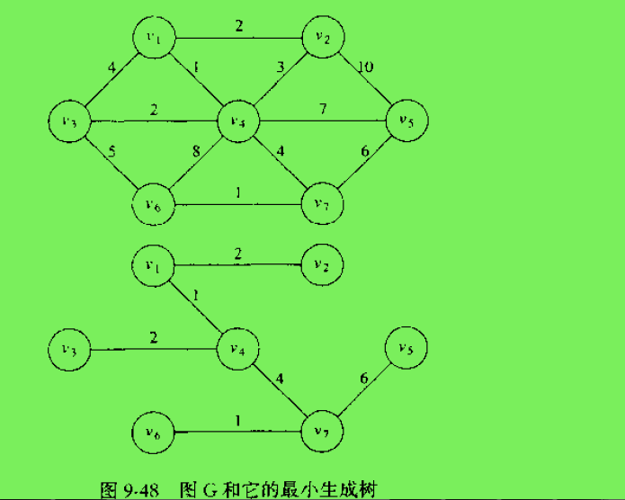
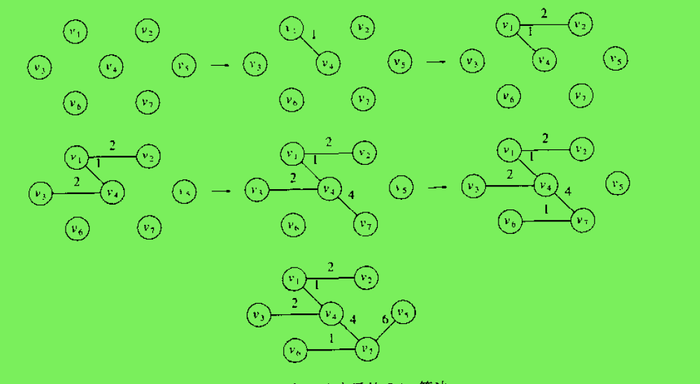
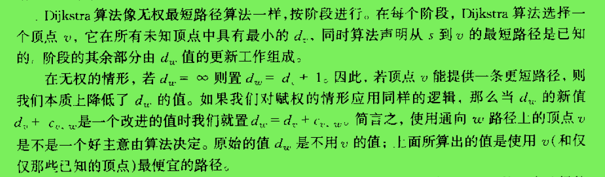

# 图

[TOC]

### 图

一个图(graph)G=(V,E)由顶点(vertex)集和边(edge)集E组成，每一条边就是一个点对(v, w),其中v, w 属于V

路径：图中的路径是一个顶点序列a1, a2, a3, ..., an, 使得(ai, ai+1)属于E，1 <= i <N。路径长度即路径上的边数目

自环(loop)：顶点含有一条到顶点自身的边那么路径(v, v)被称为环(loop)

简单路径：没有重复顶点的路径

完全联通图：图中的每对顶点之间都存在一条边

环(loop or cycle): 至少含有一条边且起点和终点相同的路径(有向图)

DAG: 有向无环图(directed acyclic graph)

顶点的度数：依附于该顶点的边的总数

图的密度： 已经连接的顶点对（边数）占所有可能被链接的顶点对的比例。在稀疏图中，被连接的顶点对很少。而稠密图中只有少部分顶点对之间没有连接

二分图：二分图又称作二部图，是图论中的一种[特殊模型](https://baike.baidu.com/item/%E7%89%B9%E6%AE%8A%E6%A8%A1%E5%9E%8B/19071206)。 设G=(V,E)是一个无向图，如果顶点V可分割为两个互不相交的子集(A,B)，**并且图中的每条边（i，j）所关联的两个顶点i和j分别属于这两个不同的顶点集(i in A,j in B)，则称图G为一个二分图**

双连通性：

如果一个连通的无向图中删除任一顶点之后，剩下的图仍然连通。那么这样的无向连通图就称为是双连通的

分割点：

若一个图不是双连通的，那么将其删除后图将不再连通的那些顶点叫做分割点

### 无向图

表示边的点对无序

连通图: 在无向图中从每一个顶点到其他顶点都存在一条路径，则该无向图是连通的

~~~go

type Grapher interface{
    AddEdge(int, int)
    Adjs(v int)[]int
    Size()int
    Vertexes()[]int
}

func NewGraph(size int)*Graph{
    return &Graph{
        vertexes : make([]int, size),
        edges: make([][]int, size),
        edgeTo: make([]int, size),
    }
}
type Graph struct{
    vertexes []int
    edges [][]int
    edgeTo []int
}

func (g *Graph)Size()int{
    return len(g.vertexes)
}

func (g *Graph)AddEdge(start, end int){
    g.vertexes[start]=start
    g.vertexes[end]=end
    
    g.edges[start] = append(g.edges[start], end)
    g.edges[end] = append(g.edges[end], start)
}
//顶点的临接顶点表
func (g *Graph)Adjs(v int)[]int{
    return g.edges[v]
}

func (g *Graph)Vertexes()[]int{
    return g.vertexes
}

func (g *Graph)SingleShortestPath(start, end int)[]int{
    next := end
    stack := make([]int, 0)
	for {
			k := paths[next]
			stack = append(stack, k)
			if k == start {
				return stack
			}
			next = k
	}
    path := make([]int, len(stack))
    i := 0
    for j := len(stack) - 1; j >= 0; j-- {
			path[i] = stack[j]
        	i++
	}
    return path
    //所有顶点的最短路径
    /*
	start := 0
	for i := range paths {
		fmt.Printf("path: 0 -> %d   ", i)
		stack := make([]int, 0)
		next := i
		for {
			k := paths[next]
			stack = append(stack, k)
			if k == start {
				break
			}
			next = k
		}
		for j := len(stack) - 1; j >= 0; j-- {
			fmt.Printf(" %d", stack[j])
		}
		fmt.Printf("\n")
	}
	*/
}
~~~

带权重的图

~~~go
type vertexT struct {
	vertex int
	weight float64
}
type WeightGraph struct {
	vertexes []int
	edges    [][]vertexT
}

func (v *vertexT)Weight() float64 {
	return v.weight
}
func (v *vertexT)Vertex() int {
	return v.vertex
}
func NewWeightGraph(size int) *WeightGraph {
	return &WeightGraph{
		vertexes: make([]int, size),
		edges:    make([][]vertexT, size),
	}
}

func (g *WeightGraph) Size() int {
	return len(g.vertexes)
}

func (g *WeightGraph) AddEdge(start, end int, weight float64) {
	g.vertexes[start] = start
	g.vertexes[end] = end

	g.edges[start] = append(g.edges[start], vertexT{vertex: end, weight: weight})
	g.edges[end] = append(g.edges[end], vertexT{vertex: start, weight: weight})
}

//顶点的临接顶点表
func (g *WeightGraph) Adjs(v int) []vertexT {
	return g.edges[v]
}

func (g *WeightGraph) Vertexes() []int {
	return g.vertexes
}

~~~

### 有向图

表示边的点对(v,w)是有序的，那么图就是有向图

强连通：在有向图中从每一个顶点到其他顶点都存在一条路径，则该有向图是强连通的

弱连通：非强联通， 但去掉边的方向形成的无向图是连通的，则该有向图是弱连通的

强连通分量：强连通的顶点的最大子集组成的子图

出度：以顶点为起点的边数

入度：以顶点为终点的边数

~~~go
type DiGraph struct{
    vertexes []int
    edges [][]int //邻接表
    indegree []int //顶点入度
}

func NewDiGraph(size int)*DiGraph{
    return &DiGraph{
        vertexes : make([]int, size),
        edges: make([][]int, size),
        indegree: make([]int),
    }
}

func (g *DiGraph)Size()int{
    return len(g.vertexes)
}

func (g *DiGraph)AddEdge(start, end int){
    g.vertexes[start]=start
    g.vertexes[end]=end
    g.edges[start] = append(g.edges[start], end)
    g.indegree[end] += 1
}
//顶点的临接顶点表
func (g *DiGraph)Adjs(v int)[]int{
    return g.edges[v]
}

func (g *DiGraph)Vertexes()[]int{
    return g.vertexes
}

func (g *DiGraph)
~~~

### 图的表示

##### 邻接矩阵

对含有V个顶点的图，需要V*V大小的矩阵（二维数组表示）。当顶点v和顶点w之间有相连接的边时，v行w列的元素值为1，否则为0。缺点是不适用于稀疏图（浪费空间）

##### 邻接表

以顶点为索引的列表数组，每个元素都是和该顶点相邻的顶点列表.

​				无向图及其邻接表表示

### 常见算法

#### 深度优先遍历

访问一个顶点时

* 将它标记为已访问
* 递归地访问它的所有没有被访问的临接点

下图是从顶点0开始，深度优先遍历图时的轨迹

##### 深度优先遍历代码

~~~go
/*
func Dfs(g Grapher, start int){
    marked := make([]bool, g.Size())
    for _, v := range g.Vertexes(){
        dfs(g, v, marked)
    }
}
*/

//从某个顶点开始遍历
func dfs(g Grapher, start int, marked []bool){
    marked[start] = true
    for _, v := range g.Adjs(start){
        if !marked[v]{
            dfs(g, v, marked)
        }
    }
}
~~~

#### 深度优先遍历的应用

###### 从某个顶点v到顶点w是否有路径以及路径上的各个顶点

算法类似于连通分量及其个数的算法

~~~

~~~

###### 连通分量及其个数

* 方案1， 使用edgeTo[]int 数组。在深度优先遍历时，从起始顶点v可以到达的顶点w，将到达的顶点索引下标处的值设置为起始顶点的索引下标即edgeTo[w]=v
* 方案2， 仍然使用edgeTo[]int数组，深度优先遍历时, 从顶点v到达邻接点w时

~~~go
func ConnectdPaths(g Grapher) []int {
	edgeTo := make([]int, g.Size())
	marked := make([]bool, g.Size())
	for _, v := range g.Vertexes() {
		if !marked[v] {
			edgeTo[v] = v
		}
		dfsConnected(g, v, edgeTo, marked)
	}
	return edgeTo
}

func dfsConnected(g Grapher, start int, edgeTo []int, marked []bool) {
	marked[start] = true
	for _, v := range g.Adjs(start) {
		if !marked[v] {
			dfsConnected(g, v, edgeTo, marked)
			edgeTo[v] = start
		}
	}
}
~~~

* 是否有环

#### 广度优先遍历

使用队列保存所有已经被标记过但其邻接表还未被检查的顶点。先将起点加入队列，然后重复以下步骤直到队列为空

* 从队列中取出顶点v并标记
* 将与顶点v相邻的所有未被标记过的顶点加入队列

下图是广度优先遍历的轨迹：

##### 算法实现

广度优先遍历

~~~go
func bfs(g Grapher, start int){
    queue := []int{start}
    marked := make([]bool, g.Size())
    marked[start] = true
    for len(queue)> 0{
        v := queue[0]
        for _, k := range g.Adjs[v]{
            if !marked[k]{
                marked[k] = true
                queue = append(queue, k)
            }
        }
        queue = queue[1:]
    }
}
~~~

##### 广度优先遍历的应用

###### 单源最短路径(最小边数)或无权最短路径，即某个顶点v到其他顶点的最短路径O

时间复杂度：(E+V)

~~~go
func SingleShortestPath(g Grapher, start int) []int {
	queue := []int{start}
	marked := make([]bool, g.Size())
	edgeTo := make([]int, g.Size())
	marked[start] = true
	for len(queue) > 0 {
		v := queue[0]
		for _, k := range g.Adjs(v) {
			if !marked[k] {
				edgeTo[k] = v
				marked[k] = true
				queue = append(queue, k)
			}
		}
		queue = queue[1:]
	}
	return edgeTo
}
~~~

###### 

#### 拓扑排序

##### 基于深度优先遍历

##### 基于入度

#### 最小生成树

图的生成树是它的一棵含有所有顶点的无环连通子图

加权无向图的最小生成树（MST)是它的一棵权值最小(所有边的权值之和)的生成树

有两种算法求解,即Prim算法和Kruskal算法

需要注意的点：

* 权重可能是0或负数
* 存在相等的权重时，最小生成树不唯一

##### Prim算法

算法的任意时刻，图的顶点都分成两个集合。在树上的顶点和不在树上的顶点。待添加的树边的要求：边连接树中顶点v和非树中的顶点w 且具有最小权重

~~~go
func PrimMST(g Grapher, start int) ([]int, int) {
	queue := []int{start}
	size := g.Size()
	distances := make([]int, size)
	marked := make([]bool, size)
	for i := range distances {
		distances[i] = int(math.MaxInt32)
	}

	distances[start] = 0
	for len(queue) > 0 {
		s := queue[0]
		marked[s] = true
		for _, vertex := range g.Adjs(s) {
			v := vertex.Vertex()
			if !marked[v] && vertex.Weight() < distances[v] {
				distances[v] = vertex.Weight()
			}
		}
		min := int(math.MaxInt32)
		minIndex := 0
		for j, d := range distances {
			if !marked[j] && d < min {
				min = d
				minIndex = j
			}
		}
		fmt.Printf("min vertex:%d\n", minIndex)
		if !marked[minIndex] {
			queue = append(queue, minIndex)
		}
		queue = queue[1:]
	}
	sum := 0
	for i, d := range distances[1:] {
		fmt.Printf("%d distance:%d\n", i+1, d)
		sum += d
	}
	return nil, sum
}

~~~

##### Kruskal算法

~~~

~~~

#### 单源最短路径

* 无权最短路径(使用广度优先遍历)
* 权重都是正整数，且无重复权重(Dijkstra 迪杰斯特拉算法)
* 权重有负数
* 权重都是正整数，且有相同权重

##### Dijkstra算法

顶点之间的距离保存在数组d中，起始顶点v到自身的距离是d[v]=0. 广度优先遍历顶点时，若当前顶点s到邻接点w的距离d[s]+ d(s,w) < d[w]则更新d[w]

~~~go
func dijkstra(g Grapher, start int) []int {
	marked := make([]bool, g.Size())
	queue := make([]int, 0)
	distances := make([]int, g.Size())
	for i := range distances {
		distances[i] = int(math.MaxInt32)
	}
	distances[start] = 0
	queue = append(queue, start)
	for len(queue) > 0 {
		s := queue[0]
		marked[s] = true
		for _, vertex := range g.Adjs(s) {
			v := vertex.Vertex()
			d := distances[s] + vertex.Weight()
			if d < distances[v] {
				distances[v] = d
			}
			if !marked[v] {
				queue = append(queue, v)
			}
		}
		queue = queue[1:]
	}
	return distances
}
~~~

###### 正宗的Dijkstra算法描述

~~~go
func dijkstra(g Grapher, start int) []int {
	marked := make([]bool, g.Size())
	distances := make([]int, g.Size())
	for i := range distances {
		distances[i] = int(math.MaxInt32)
	}
	distances[start] = 0
	for {
        minDistance := int(math.MaxInt32)
        s := -1
        for i, d := range distances{
            if d < minDistance && !marked[i]{
                minDistance = d
                s = i
            }
        }
        if s == -1{
            break
        }
		marked[s] = true
		for _, vertex := range g.Adjs(s) {
			v := vertex.Vertex()
			d := distances[s] + vertex.Weight()
			if d < distances[v] {
				distances[v] = d
			}
		}
	}
	return distances
}
~~~

#### 关键路径

#### 网络流

### 应用

* 两个顶点是否连通（是否有路径）及路径上的点（深度优先遍历）
* 两个顶点间的最短路径（广度优先遍历）
* 图是否是无环图（深度优先遍历）
* 是否是二分图或双色图（双色问题：能狗用两种颜色将图中所有顶点上色， 使得任意一条边的两个顶点的颜色都不相同）
* 多点可达性给定一副有向图和顶点的集合，是否存在一条从集合中的任意顶点到达给定顶点v的有向路径（深度优先遍历)
* 调度问题(拓扑排序)
* 有向图中是否存在环（深度优先遍历）
* 有向图的的强连通性及强连通分量
* 无向图的连通性及其连通分量