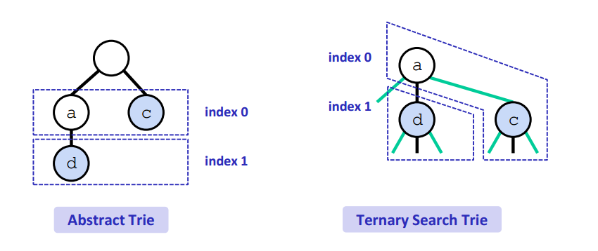

# 字符串算法

[TOC]

### 字符串排序

##### 键索引计数法

##### 低位优先的字符串排序

### 单词查找树

#### trie(try发音)

trie是一棵树，每个节点有n条边（边的数目以存储的字符的字符表大小而定，若只存储包含a-z的字符串，则n就是26。若存储ascii字符，则大小为128）。每个节v点对应一个字符，对应的字符由其父节点p指向当前子节点边隐式确定

查找指定的字符串的时间复杂度是O(L),L是字符串长度

##### 应用

* 前缀匹配 keysWithPrefix("sa")， 找出前缀为指定字串的所有字符串
* 最长前缀longestPrefixOf("sample"),  找出含有给定字串的最长前缀的字符串

##### Trie的定义

使用数组表示边，会产生很多浪费。可以使用以下几种结构代替数组

* 哈希表
* 二叉查找树
* TST

~~~go
type Node struct{
    end bool //单次结束符
    next []*Node //考虑哈希表或二叉查找树
}

type Trie struct{
    root *Node
    size int
}

func NewTrie()*Trie{
    return &Trie{
        size:0,
        root:newNode(),
    }
}

func newNode()*Node{
    return &Node{
        end: false,
        next: make([]*Node, 128),
    }
}

~~~

##### 插入

~~~go
func (t *Trie) Insert(key string) {
	node := t.Find(key)
	if node != nil {
		return
	}
	insert(t.root, 0, key)
}
func insert(node *Node, index int, key string) {
	i := int(key[index])
	if node.next[i] == nil {
		node.next[i] = newNode()
	}
	if index == len(key)-1 {
		node.end = true
		return
	}
	insert(node.next[i], index+1, key)
}
~~~

##### 查找

从根开始，首先确定键中第一个字符所在节点。然后根据第二个字符在第一个字符维护的边数组中的节点。递归的搜索

* 找到
* 未找到有两种情况， 第一种是键的最后一个字符对应的节点的结束标志为false。第二种是某个字符对应的节点为空

~~~go
func (t *Trie) Find(key string) *Node {
	return find(t.root, 0, key)
}

func find(node *Node, index int, key string) *Node {
	i := int(key[index])
	if node.next[i] == nil {
		return nil
	} else if index == len(key)-1 && !node.end {
		return nil
	} else if index == len(key)-1 && node.end {
		return node
	}
	return find(node.next[i], index+1, key)
}

~~~

##### 删除

~~~

~~~

##### 最长前缀

~~~go
func (t *Trie) KeysWithPrefix(key string) []string {
	queue := make([]int, 0)
	return collect(t.root, 0, queue, key)
}

func collect(node *Node, index int, queue []int, key string) []string {
	k := key[index]
	if node.next[k] == nil {
		return nil
	}
	queue = append(queue, index)
	if index == len(key)-1 {
		keys := make([]string, 0)
		if node.end {
			keys = append(keys, key)
		}
		queue := make([]int, 0)
		for i, pnext := range node.next {
			if pnext != nil {
				subKeys := make([]string, 0)
				subKeys = collectHelper(pnext, i, queue, subKeys)
				keys = append(keys, subKeys...)
			}
		}
		return keys
	}
	return collect(node.next[k], index+1, queue, key)
}

func collectHelper(node *Node, index int, queue []int, keys []string) []string {
	queue = append(queue, index)
	if node.end {
		data := make([]byte, len(queue))
		buf := bytes.NewBuffer(data)
		for _, e := range queue {
			buf.WriteRune(rune(e))
		}
		keys = append(keys, buf.String())
	}
	for i, pnext := range node.next {
		if pnext == nil {
			continue
		}
		keys = collectHelper(pnext, i, queue, keys)
	}
	queue = queue[:len(queue)]
	return keys
}
~~~

##### 前缀匹配 找出包含指定前缀的所有字符串

~~~go
func (t *Trie) KeysWithPrefix(key string) []string {
	queue := make([]int, 0)
	return collect(t.root, 0, queue, key)
}

func collect(node *Node, index int, queue []int, key string) []string {
	k := key[index]
	if node.next[k] == nil {
		return nil
	}
	queue = append(queue, index)
	if index == len(key)-1 {
		keys := make([]string, 0)
		if node.end {
			keys = append(keys, key)
		}
		queue := make([]int, 0)
		for i, pnext := range node.next {
			if pnext != nil {
				subKeys := make([]string, 0)
				subKeys = collectHelper(pnext, i, queue, subKeys)
				keys = append(keys, subKeys...)
			}
		}
		return keys
	}
	return collect(node.next[k], index+1, queue, key)
}

func collectHelper(node *Node, index int, queue []int, keys []string) []string {
	queue = append(queue, index)
	if node.end {
		data := make([]byte, len(queue))
		buf := bytes.NewBuffer(data)
		for _, e := range queue {
			buf.WriteRune(rune(e))
		}
		keys = append(keys, buf.String())
	}
	for i, pnext := range node.next {
		if pnext == nil {
			continue
		}
		keys = collectHelper(pnext, i, queue, keys)
	}
	queue = queue[:len(queue)]
	return keys
}
~~~

#### 三向查找树(TST)

下图左边是普通Trie的表示，右图是TST的表示

在TST中，左链接表示位于同一层但小于当前节点键值(字符)的节点，右链接表示位于同一层但大于当前节点键值的的节点。中间的链接表示等于当前节点键值的下一个节点

##### 定义

~~~go
type tstNode struct{
    end bool
    left *tstNode
    middle *tstNode
    right *tstNode
    ch rune
}

type Tst struct{
    root *tstNode
    size int
}

func NewTst()*Tst{
    return &Tst{}
}

func newTstNode(ch rune, end bool)*tstNode{
    return &tstNode{
        ch : ch,
        end:end,
    }
}
~~~

##### 查找

~~~go
func (t *Tst)Find(key string){
    return find(t.root, 0, key)
}

func find(node *tstNode, index int, key string)*tstNode{
    if node == nil{
        return nil
    }
    k := key[index]
    if index == len(key){
        if node.ch == k && node.end{
            return node
        }else if node.ch == k && !node.end{
            return nil
        }     
    }
    if node.ch == k{
        return find(node.middle, index+1, key)
    }else if k < node.ch{
        return find(node.left, index, key)
    }
    return find(node.right, index, key)
}
~~~

##### 插入

~~~go
func (t *Tst)Insert(key){
    t.root = insert(t.root, index, key)
}

func insert(node *tstNode, index, key string)*tstNode{
    if node == nil{
        end := false
        if index == len(key)-1{
            end = true
        }
        node = &newTstNode(key[index], end)
        if index == len(key)-1{
            return node
        }
    }
    k := key[index]
    if node.ch == k{
        node.middle = insert(node.middle, index+1, key)
    }else if k < node.ch{
        node.left= insert(node.left, index, key)
    }else{
        node.right insert(node.right, index, key)
    }
    return node
}
~~~

##### 删除

~~~

~~~

### 参考

* trie 及TST的介绍 https://courses.cs.washington.edu/courses/cse373/20wi/lectures/19-tries/19-tries.pdf
* 后缀树(suffixtree)https://www.cs.cmu.edu/~ckingsf/bioinfo-lectures/suffixtrees.pdf