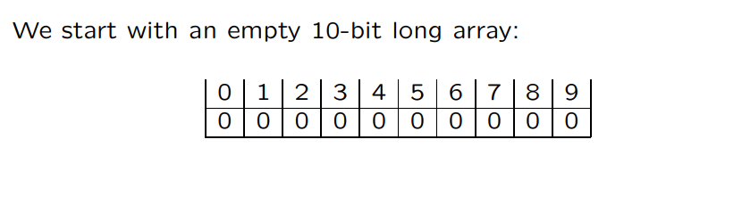
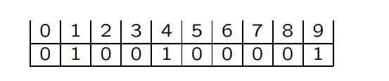
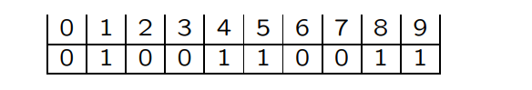

# Bloom filter(布隆过滤器)

[TOC]

## Bloom filter

bloom filter 可以用来确定某一元素是否属于特定集合。bloom filter 用一个位数组和一组`hash函数`来实现。

现在假设有一个10位大小的数组，3个hash函数(h1, h2, h3)。H(x) = {h1(x), h2(x), h3(x)}

插入x0后: H(x0)={1, 4, 9}

插入x1后:  H(x1)={4, 5, 8}

从上面两个图可以看出，单纯的使用0和1的布隆过滤器存在两个问题：

* 在删除时会遇到问题，如删除x0就会使得x1的存储被破坏。解决这问题的方法是采用`计数法`
* false positive(假阳性）问题。查找时，若某个`x`的哈希值H(x)={1, 5, 8}，则会误认为`x`存在于过滤器中。

### 实现

* 大小为q的位数组
* k个不同的hash函数

~~~go
type BitMap struct{
    bits []byte
    size int
}
const unit = 8
func NewBitMap(size int)*BitMap{
    n := (size / 8)+1
    return &BitMap{
        bits: make([]byte, n),
        size: n,
    }
}
func (bm *BitMap)Set(pos int){
    i := pos / unit
    j := pos % unit
    bm.bits[i] |= byte((1 << j))
}
func (bm *BitMap)IsSet(pos int)bool{
    i := pos / unit
    j := pos % unit
    return (bm.bits[i] >> j) & 1 == 1
}
func (bm *BitMap)Clear(pos int){
    i := pos /unit
    j := pos % unit
    bm.bits[i] &= byte(^(1 << j))
}

const k = 10
type BloomFilter struct{
    size int
    bitmap *BitMap
    hashFuncs [k]hashFunc
}
~~~

#### 添加元素

使用k个hash函数计算`key`的哈希值, 将位数组中对应哈希值的`位`置1

~~~go
func (bf *BloomFilter)Add(key string){
    for i := 0; i < k; i++{
        h := bf.hashFuncs[i](key)
        bf.bitmap.Set(h)
    }
}
~~~

#### 检查元素是否存在

~~~go
func (bf *BloomFilter)Contains(key string)bool{
    for i := 0; i < k; i++{
        h := bf.hashFuncs[i](key)
        if !bf.bitmap.IsSet(h){
            return false
        }
    }
    return true
}
~~~

#### 删除元素

### 优缺点

* 空间效率相对于hash表更高
* 有一定的错误率

### 应用

* IP追踪
* 缓存

## 参考

* <https://www.cs.princeton.edu/courses/archive/spr05/cos598E/bib/bloom_filters.pdf>
* <https://cs.nju.edu.cn/daihp/ns_course/15HaipengDai_BloomFiltersandItsVariants.pdf>
* <https://www.cs.unc.edu/~fabian/courses/CS600.624/slides/bloomslides.pdf>