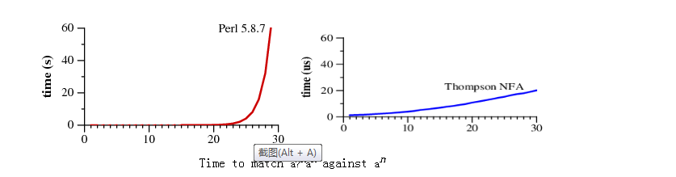
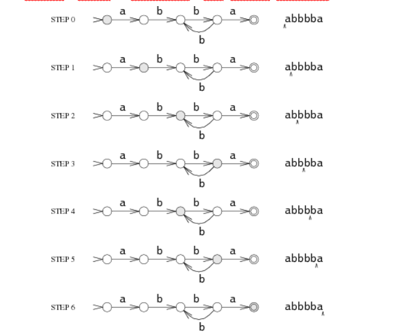
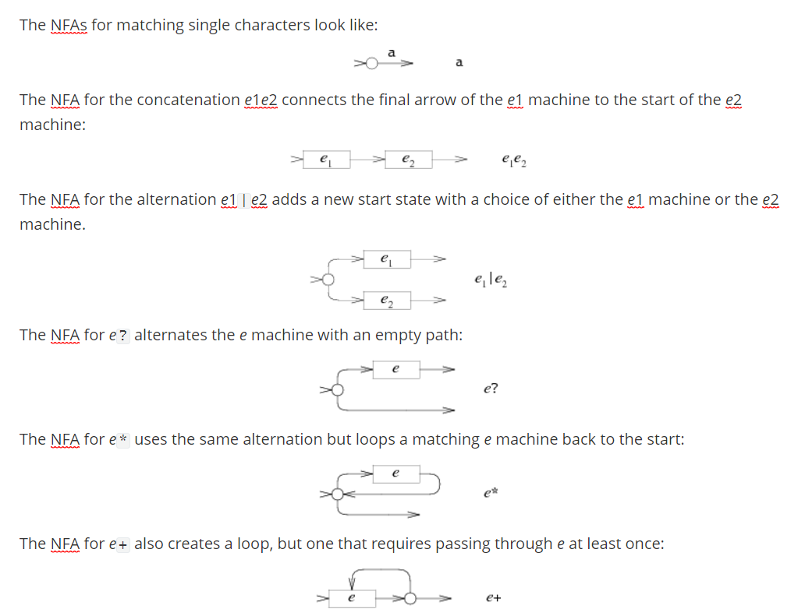
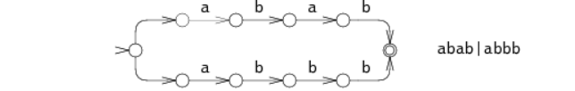
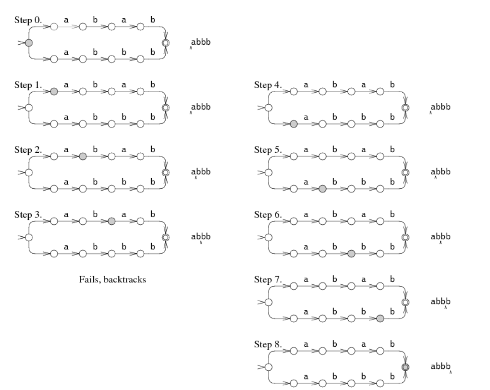
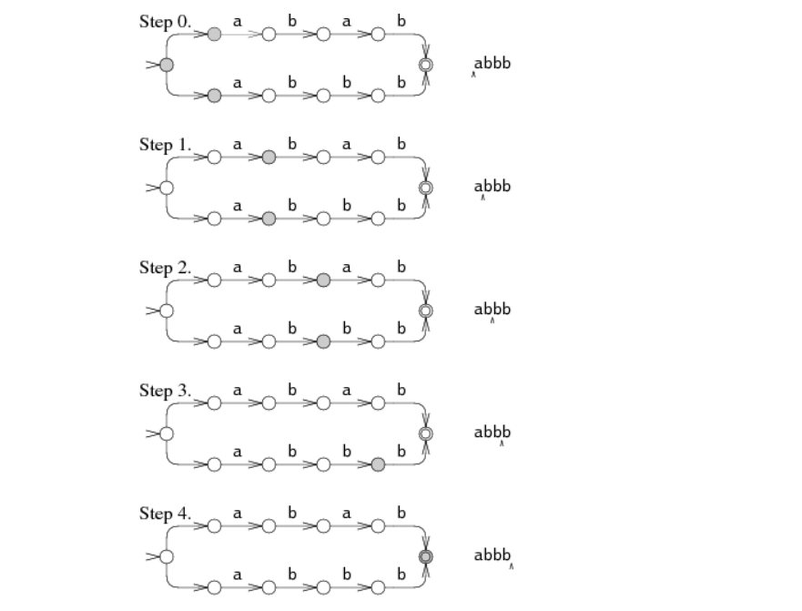
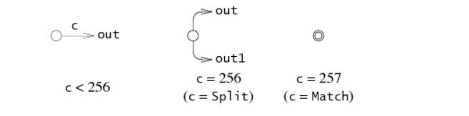

# Regular Expression Matching Can Be Simple And Fast  (but is slow in Java, Perl, PHP, Python, Ruby, ...)

[TOC]


## [Russ Cox](http://swtch.com/~rsc/)  *rsc@swtch.com*  January 2007

## Introduction

This is a tale of two approaches to regular expression matching. One of them is in widespread use in the standard interpreters for many languages, including Perl. The other is used only in a few places, notably most implementations of awk and grep. The two approaches have wildly different performance characteristics:




Time to match `a?`*n*`a`*n* against `a`*n*

Let's use superscripts to denote string repetition, so that `a?3a3` is shorthand for `a?a?a?aaa`. The two graphs plot the time required by each approach to match the regular expression `a?`*n*`a`*n* against the string `a`*n*.

Notice that Perl requires over sixty seconds to match a 29-character string. The other approach, labeled Thompson NFA for reasons that will be explained later, requires twenty *microseconds* to match the string. That's not a typo. The Perl graph plots time in seconds, while the Thompson NFA graph plots time in microseconds: the Thompson NFA implementation is a million times faster than Perl when running on a miniscule 29-character string. The trends shown in the graph continue: the Thompson NFA handles a 100-character string in under 200 microseconds, while Perl would require over 1015 years. (Perl is only the most conspicuous example of a large number of popular programs that use the same algorithm; the above graph could have been Python, or PHP, or Ruby, or many other languages. A more detailed graph later in this article presents data for other implementations.)

It may be hard to believe the graphs: perhaps you've used Perl, and it never seemed like regular expression matching was particularly slow. Most of the time, in fact, regular expression matching in Perl is fast enough. As the graph shows, though, it is possible to write so-called “pathological” regular expressions that Perl matches very *very* slowly. In contrast, there are no regular expressions that are pathological for the Thompson NFA implementation. Seeing the two graphs side by side prompts the question, “why doesn't Perl use the Thompson NFA approach?” It can, it should, and that's what the rest of this article is about.

Historically, regular expressions are one of computer science's shining examples of how using good theory leads to good programs. They were originally developed by theorists as a simple computational model, but Ken Thompson introduced them to programmers in his implementation of the text editor QED for CTSS. Dennis Ritchie followed suit in his own implementation of QED, for GE-TSS. Thompson and Ritchie would go on to create Unix, and they brought regular expressions with them. By the late 1970s, regular expressions were a key feature of the Unix landscape, in tools such as ed, sed, grep, egrep, awk, and lex.

Today, regular expressions have also become a shining example of how ignoring good theory leads to bad programs. The regular expression implementations used by today's popular tools are significantly slower than the ones used in many of those thirty-year-old Unix tools.

This article reviews the good theory: regular expressions, finite automata, and a regular expression search algorithm invented by Ken Thompson in the mid-1960s. It also puts the theory into practice, describing a simple implementation of Thompson's algorithm. That implementation, less than 400 lines of C, is the one that went head to head with Perl above. It outperforms the more complex real-world implementations used by Perl, Python, PCRE, and others. The article concludes with a discussion of how theory might yet be converted into practice in the real-world implementations.

## Regular Expressions

Regular expressions are a notation for describing sets of character strings. When a particular string is in the set described by a regular expression, we often say that the regular expression *matches* the string.

The simplest regular expression is a single literal character. Except for the special metacharacters `*+?()|`, characters match themselves. To match a metacharacter, escape it with a backslash: `\+` matches a literal plus character.

Two regular expressions can be alternated or concatenated to form a new regular expression: if *e*1 matches *s* and *e*2 matches *t*, then *e*1`|`*e*2 matches *s* or *t*, and *e*1*e*2 matches *st*.

The metacharacters `*`, `+`, and `?` are repetition operators: *e*1`*` matches a sequence of zero or more (possibly different) strings, each of which match *e*1; *e*1`+`matches one or more; *e*1`?` matches zero or one.

The operator precedence, from weakest to strongest binding, is first alternation, then concatenation, and finally the repetition operators. Explicit parentheses can be used to force different meanings, just as in arithmetic expressions. Some examples: `ab|cd` is equivalent to `(ab)|(cd)`; `ab*` is equivalent to`a(b*)`.

The syntax described so far is a subset of the traditional Unix egrep regular expression syntax. This subset suffices to describe all regular languages: loosely speaking, a regular language is a set of strings that can be matched in a single pass through the text using only a fixed amount of memory. Newer regular expression facilities (notably Perl and those that have copied it) have added [many new operators and escape sequences](http://www.perl.com/doc/manual/html/pod/perlre.html). These additions make the regular expressions more concise, and sometimes more cryptic, but usually not more powerful: these fancy new regular expressions almost always have longer equivalents using the traditional syntax.

One common regular expression extension that does provide additional power is called *backreferences*. A backreference like `\1` or `\2` matches the string matched by a previous parenthesized expression, and only that string: `(cat|dog)\1` matches `catcat` and `dogdog` but not `catdog` nor `dogcat`. As far as the theoretical term is concerned, regular expressions with backreferences are not regular expressions. The power that backreferences add comes at great cost: in the worst case, the best known implementations require exponential search algorithms, like the one Perl uses. Perl (and the other languages) could not now remove backreference support, of course, but they could employ much faster algorithms when presented with regular expressions that don't have backreferences, like the ones considered above. This article is about those faster algorithms.

## Finite Automata

Another way to describe sets of character strings is with finite automata. Finite automata are also known as state machines, and we will use “automaton” and “machine” interchangeably.

As a simple example, here is a machine recognizing the set of strings matched by the regular expression `a(bb)+a`:


A finite automaton is always in one of its states, represented in the diagram by circles. (The numbers inside the circles are labels to make this discussion easier; they are not part of the machine's operation.) As it reads the string, it switches from state to state. This machine has two special states: the start state *s*0 and the matching state *s*4. Start states are depicted with lone arrowheads pointing at them, and matching states are drawn as a double circle.

The machine reads an input string one character at a time, following arrows corresponding to the input to move from state to state. Suppose the input string is `abbbba`. When the machine reads the first letter of the string, the `a`, it is in the start state *s*0. It follows the `a` arrow to state *s*1. This process repeats as the machine reads the rest of the string: `b` to `*s*2`, `b` to `*s*3`, `b` to `*s*2`, `b` to `*s*3`, and finally `a` to `*s*4`.



The machine ends in *s*4, a matching state, so it matches the string. If the machine ends in a non-matching state, it does not match the string. If, at any point during the machine's execution, there is no arrow for it to follow corresponding to the current input character, the machine stops executing early.

The machine we have been considering is called a *deterministic* finite automaton (DFA), because in any state, each possible input letter leads to at most one new state. We can also create machines that must choose between multiple possible next states. For example, this machine is equivalent to the previous one but is not deterministic:


The machine is not deterministic because if it reads a `b` in state *s*2, it has multiple choices for the next state: it can go back to *s*1 in hopes of seeing another `bb`, or it can go on to *s*3 in hopes of seeing the final `a`. Since the machine cannot peek ahead to see the rest of the string, it has no way to know which is the correct decision. In this situation, it turns out to be interesting to let the machine *always guess correctly*. Such machines are called non-deterministic finite automata (NFAs or NDFAs). An NFA matches an input string if there is some way it can read the string and follow arrows to a matching state.

Sometimes it is convenient to let NFAs have arrows with no corresponding input character. We will leave these arrows unlabeled. An NFA can, at any time, choose to follow an unlabeled arrow without reading any input. This NFA is equivalent to the previous two, but the unlabeled arrow makes the correspondence with `a(bb)+a` clearest:


## Converting Regular Expressions to NFAs

Regular expressions and NFAs turn out to be exactly equivalent in power: every regular expression has an equivalent NFA (they match the same strings) and vice versa. (It turns out that DFAs are also equivalent in power to NFAs and regular expressions; we will see this later.) There are multiple ways to translate regular expressions into NFAs. The method described here was first described by Thompson in his 1968 CACM paper.

The NFA for a regular expression is built up from partial NFAs for each subexpression, with a different construction for each operator. The partial NFAs have no matching states: instead they have one or more dangling arrows, pointing to nothing. The construction process will finish by connecting these arrows to a matching state.




<font color="green">Counting the new states in the diagrams above, we can see that this technique creates exactly one state per character or metacharacter in the regular expression, excluding parentheses. Therefore the number of states in the final NFA is at most equal to the length of the original regular expression.</font>

Just as with the example NFA discussed earlier, it is always possible to remove the unlabeled arrows, and it is also always possible to generate the NFA without the unlabeled arrows in the first place. Having the unlabeled arrows makes the NFA easier for us to read and understand, and they also make the C representation simpler, so we will keep them.

## Regular Expression Search Algorithms

Now we have a way to test whether a regular expression matches a string: convert the regular expression to an NFA and then run the NFA using the string as input. Remember that NFAs are endowed with the ability to guess perfectly when faced with a choice of next state: to run the NFA using an ordinary computer, we must find a way to simulate this guessing.

One way to simulate perfect guessing is to guess one option, and if that doesn't work, try the other. For example, consider the NFA for `abab|abbb` run on the string `abbb`:






At step 0, the NFA must make a choice: try to match `abab` or try to match `abbb`? In the diagram, the NFA tries `abab`, but that fails after step 3. The NFA then tries the other choice, leading to step 4 and eventually a match. This backtracking approach has a simple recursive implementation but can read the input string many times before succeeding. If the string does not match, the machine must try *all* possible execution paths before giving up. The NFA tried only two different paths in the example, but in the worst case, there can be exponentially many possible execution paths, leading to very slow run times.

A more efficient but more complicated way to simulate perfect guessing is to guess both options simultaneously. In this approach, the simulation allows the machine to be in multiple states at once. To process each letter, it advances all the states along all the arrows that match the letter.



The machine starts in the start state and all the states reachable from the start state by unlabeled arrows. In steps 1 and 2, the NFA is in two states simultaneously. Only at step 3 does the state set narrow down to a single state. This multi-state approach tries both paths at the same time, reading the input only once. In the worst case, the NFA might be in *every* state at each step, but this results in at worst a constant amount of work independent of the length of the string, so arbitrarily large input strings can be processed in linear time. This is a dramatic improvement over the exponential time required by the backtracking approach. The efficiency comes from tracking the set of reachable states but *not* which paths were used to reach them. In an NFA with *n*nodes, there can only be *n* reachable states at any step, but there might be 2*n* paths through the NFA.


前半部分理解没啥问题

## Implementation

Thompson introduced the multiple-state simulation approach in his 1968 paper. In his formulation, the states of the NFA were represented by small machine-code sequences, and the list of possible states was just a sequence of function call instructions. In essence, Thompson compiled the regular expression into clever machine code. Forty years later, computers are much faster and the machine code approach is not as necessary. The following sections present an implementation written in portable ANSI C. The full source code (under 400 lines) and the benchmarking scripts are [available online](http://swtch.com/~rsc/regexp/). (Readers who are unfamiliar or uncomfortable with C or pointers should feel free to read the descriptions and skip over the actual code.)

#### Implementation: Compiling to NFA

The first step is to compile the regular expression into an equivalent NFA. In our C program, we will represent an NFA as a linked collection of `State`structures:

```c
struct State
{
	int c;
	State *out;
	State *out1;
	int lastlist;
};
```

<font color="red">Each `State` represents one of the following three NFA fragments, depending on the value of `c`.</font>



(`Lastlist` is used during execution and is explained in the next section.)

<font color="green">Following Thompson's paper, the compiler builds an NFA from a regular expression in *postfix* notation with dot (`.`) added as an explicit concatenation operator. A separate function `re2post` rewrites infix regular expressions like “`a(bb)+a`” into equivalent postfix expressions like “`abb.+.a.`”. (A “real” implementation would certainly need to use dot as the “any character” metacharacter rather than as a concatenation operator. A real implementation would also probably build the NFA during parsing rather than build an explicit postfix expression. However, the postfix version is convenient and follows Thompson's paper more closely.)</font>

As the compiler scans the postfix expression, it maintains a stack of computed NFA fragments. Literals push new NFA fragments onto the stack, while operators pop fragments off the stack and then push a new fragment. For example, after compiling the `abb` in `abb.+.a.`, the stack contains NFA fragments for `a`,`b`, and `b`. The compilation of the `.` that follows pops the two `b` NFA fragment from the stack and pushes an NFA fragment for the concatenation `bb.`. Each NFA fragment is defined by its start state and its outgoing arrows:

```c
struct Frag
{
	State *start;
	Ptrlist *out;
};
```

`Start` points at the start state for the fragment, and `out` is a list of pointers to `State*` pointers that are not yet connected to anything. These are the dangling arrows in the NFA fragment.

Some helper functions manipulate pointer lists:

```c
Ptrlist *list1(State **outp);
Ptrlist *append(Ptrlist *l1, Ptrlist *l2);

void patch(Ptrlist *l, State *s);
```

`List1` creates a new pointer list containing the single pointer `outp`. `Append` concatenates two pointer lists, returning the result. `Patch` connects the dangling arrows in the pointer list `l` to the state `s`: it sets `*outp` `=` `s` for each pointer `outp` in `l`.

Given these primitives and a fragment stack, the compiler is a simple loop over the postfix expression. At the end, there is a single fragment left: patching in a matching state completes the NFA.

```c
State*
post2nfa(char *postfix)
{
	char *p;
	Frag stack[1000], *stackp, e1, e2, e;
	State *s;

	#define push(s) *stackp++ = s
	#define pop()   *--stackp

	stackp = stack;
	for(p=postfix; *p; p++){
		switch(*p){
		/* compilation cases, described below */
             
		}
	}
	
	e = pop();
	patch(e.out, matchstate);
	return e.start;
}
```

The specific compilation cases mimic the translation steps described earlier.

| Literal characters:`default: 	s = state(*p, NULL, NULL); 	push(frag(s, list1(&s->out)); 	break; ` |  |
| ------------------------------------------------------------ | ----------------------------------------------- |
| Catenation:`case '.': 	e2 = pop(); 	e1 = pop(); 	patch(e1.out, e2.start); 	push(frag(e1.start, e2.out)); 	break; ` |  |
| Alternation:`case '|': 	e2 = pop(); 	e1 = pop(); 	s = state(Split, e1.start, e2.start); 	push(frag(s, append(e1.out, e2.out))); 	break; ` |  |
| Zero or one:`case '?': 	e = pop(); 	s = state(Split, e.start, NULL); 	push(frag(s, append(e.out, list1(&s->out1)))); 	break; ` |  |
| Zero or more:`case '*': 	e = pop(); 	s = state(Split, e.start, NULL); 	patch(e.out, s); 	push(frag(s, list1(&s->out1))); 	break; ` |  |
| One or more:`case '+': 	e = pop(); 	s = state(Split, e.start, NULL); 	patch(e.out, s); 	push(frag(e.start, list1(&s->out1))); 	break; ` |  |

#### Implementation: Simulating the NFA

Now that the NFA has been built, we need to simulate it. The simulation requires tracking `State` sets, which are stored as a simple array list:

```c
struct List
{
	State **s;
	int n;
};
```

The simulation uses two lists: `clist` is the current set of states that the NFA is in, and `nlist` is the next set of states that the NFA will be in, after processing the current character. The execution loop initializes `clist` to contain just the start state and then runs the machine one step at a time.

```c
int
match(State *start, char *s)
{
	List *clist, *nlist, *t;

	/* l1 and l2 are preallocated globals */
	clist = startlist(start, &l1);
	nlist = &l2;
	for(; *s; s++){
		step(clist, *s, nlist);
		t = clist; clist = nlist; nlist = t;	/* swap clist, nlist */
	}
	return ismatch(clist);
}
```

To avoid allocating on every iteration of the loop, `match` uses two preallocated lists `l1` and `l2` as `clist` and `nlist`, swapping the two after each step.

If the final state list contains the matching state, then the string matches.

```c
int
ismatch(List *l)
{
	int i;

	for(i=0; i<l->n; i++)
		if(l->s[i] == matchstate)
			return 1;
	return 0;
}
```


`Addstate` adds a state to the list, but not if it is already on the list. Scanning the entire list for each add would be inefficient; instead the variable`listid` acts as a list generation number. When `addstate` adds `s` to a list, it records `listid` in `s->lastlist`. If the two are already equal, then `s` is already on the list being built. `Addstate` also follows unlabeled arrows: if `s` is a `Split` state with two unlabeled arrows to new states, `addstate` adds those states to the list instead of `s`.

```c
void
addstate(List *l, State *s)
{
	if(s == NULL || s->lastlist == listid)
		return;
	s->lastlist = listid;
	if(s->c == Split){
		/* follow unlabeled arrows */
		addstate(l, s->out);
		addstate(l, s->out1);
		return;
	}
	l->s[l->n++] = s;
}
```


`Startlist` creates an initial state list by adding just the start state:

```c
List*
startlist(State *s, List *l)
{
	listid++;
	l->n = 0;
	addstate(l, s);
	return l;
}
```


Finally, `step` advances the NFA past a single character, using the current list `clist` to compute the next list `nlist`.

```c
void
step(List *clist, int c, List *nlist)
{
	int i;
	State *s;

	listid++;
	nlist->n = 0;
	for(i=0; i<clist->n; i++){
		s = clist->s[i];
		if(s->c == c)
			addstate(nlist, s->out);
	}
}
```

## Performance

The C implementation just described was not written with performance in mind. Even so, a slow implementation of a linear-time algorithm can easily outperform a fast implementation of an exponential-time algorithm once the exponent is large enough. Testing a variety of popular regular expression engines on a so-called pathological regular expression demonstrates this nicely.

Consider the regular expression `a?*n*a*n*`. It matches the string `a*n*` when the `a?` are chosen not to match any letters, leaving the entire string to be matched by the `a*n*`. Backtracking regular expression implementations implement the zero-or-one `?` by first trying one and then zero. There are *n* such choices to make, a total of 2*n* possibilities. Only the very last possibility—choosing zero for all the `?`—will lead to a match. The backtracking approach thus requires *O*(2*n*) time, so it will not scale much beyond *n*=25.

In contrast, Thompson's algorithm maintains state lists of length approximately *n* and processes the string, also of length *n*, for a total of *O*(*n*2) time. (The run time is superlinear, because we are not keeping the regular expression constant as the input grows. For a regular expression of length *m* run on text of length *n*, the Thompson NFA requires *O*(*mn*) time.)

The following graph plots time required to check whether `a?*n*a*n*` matches `a*n*`:

  regular expression and text size *n*  `a?`*n*`a`*n* matching `a`*n*

Notice that the graph's *y*-axis has a logarithmic scale, in order to be able to see a wide variety of times on a single graph.

From the graph it is clear that Perl, PCRE, Python, and Ruby are all using recursive backtracking. PCRE stops getting the right answer at *n*=23, because it aborts the recursive backtracking after a maximum number of steps. As of Perl 5.6, Perl's regular expression engine is [said to memoize](http://perlmonks.org/index.pl?node_id=502408) the recursive backtracking search, which should, at some memory cost, keep the search from taking exponential amounts of time unless backreferences are being used. As the performance graph shows, the memoization is not complete: Perl's run time grows exponentially even though there are no backreferences in the expression. Although not benchmarked here, Java uses a backtracking implementation too. In fact, the `java.util.regex` interface requires a backtracking implementation, because arbitrary Java code can be substituted into the matching path. PHP uses the PCRE library.

The thick blue line is the C implementation of Thompson's algorithm given above. Awk, Tcl, GNU grep, and GNU awk build DFAs, either precomputing them or using the on-the-fly construction described in the next section.

Some might argue that this test is unfair to the backtracking implementations, since it focuses on an uncommon corner case. This argument misses the point: given a choice between an implementation with a predictable, consistent, fast running time on all inputs or one that usually runs quickly but can take years of CPU time (or more) on some inputs, the decision should be easy. Also, while examples as dramatic as this one rarely occur in practice, less dramatic ones do occur. Examples include using `(.*)` `(.*)` `(.*)` `(.*)` `(.*)` to split five space-separated fields, or using alternations where the common cases are not listed first. As a result, programmers often learn which constructs are expensive and avoid them, or they turn to so-called [optimizers](http://search.cpan.org/~dankogai/Regexp-Optimizer-0.15/lib/Regexp/Optimizer.pm). Using Thompson's NFA simulation does not require such adaptation: there are no expensive regular expressions.

## Caching the NFA to build a DFA

Recall that DFAs are more efficient to execute than NFAs, because DFAs are only ever in one state at a time: they never have a choice of multiple next states. Any NFA can be converted into an equivalent DFA in which each DFA state corresponds to a list of NFA states.

For example, here is the NFA we used earlier for `abab|abbb`, with state numbers added:


The equivalent DFA would be:


Each state in the DFA corresponds to a list of states from the NFA.

In a sense, Thompson's NFA simulation is executing the equivalent DFA: each `List` corresponds to some DFA state, and the `step` function is computing, given a list and a next character, the next DFA state to enter. Thompson's algorithm simulates the DFA by reconstructing each DFA state as it is needed. Rather than throw away this work after each step, we could cache the `Lists` in spare memory, avoiding the cost of repeating the computation in the future and essentially computing the equivalent DFA as it is needed. This section presents the implementation of such an approach. Starting with the NFA implementation from the previous section, we need to add less than 100 lines to build a DFA implementation.

To implement the cache, we first introduce a new data type that represents a DFA state:

```
struct DState
{
	List l;
	DState *next[256];
	DState *left;
	DState *right;
};
```

A `DState` is the cached copy of the list `l`. The array `next` contains pointers to the next state for each possible input character: if the current state is `d` and the next input character is `c`, then `d->next[c]` is the next state. If `d->next[c]` is null, then the next state has not been computed yet. `Nextstate` computes, records, and returns the next state for a given state and character.

The regular expression match follows `d->next[c]` repeatedly, calling `nextstate` to compute new states as needed.

```
int
match(DState *start, char *s)
{
	int c;
	DState *d, *next;
	
	d = start;
	for(; *s; s++){
		c = *s & 0xFF;
		if((next = d->next[c]) == NULL)
			next = nextstate(d, c);
		d = next;
	}
	return ismatch(&d->l);
}
```


All the `DStates` that have been computed need to be saved in a structure that lets us look up a `DState` by its `List`. To do this, we arrange them in a binary tree using the sorted `List` as the key. The `dstate` function returns the `DState` for a given `List`, allocating one if necessary:

```
DState*
dstate(List *l)
{
	int i;
	DState **dp, *d;
	static DState *alldstates;

	qsort(l->s, l->n, sizeof l->s[0], ptrcmp);

	/* look in tree for existing DState */
	dp = &alldstates;
	while((d = *dp) != NULL){
		i = listcmp(l, &d->l);
		if(i < 0)
			dp = &d->left;
		else if(i > 0)
			dp = &d->right;
		else
			return d;
	}
	
	/* allocate, initialize new DState */
	d = malloc(sizeof *d + l->n*sizeof l->s[0]);
	memset(d, 0, sizeof *d);
	d->l.s = (State**)(d+1);
	memmove(d->l.s, l->s, l->n*sizeof l->s[0]);
	d->l.n = l->n;

	/* insert in tree */
	*dp = d;
	return d;
}
```

Nextstate runs the NFA `step` and returns the corresponding `DState`:

```
DState*
nextstate(DState *d, int c)
{
	step(&d->l, c, &l1);
	return d->next[c] = dstate(&l1);
}
```

Finally, the DFA's start state is the `DState` corresponding to the NFA's start list:

```
DState*
startdstate(State *start)
{
	return dstate(startlist(start, &l1));
}
```

(As in the NFA simulation, `l1` is a preallocated `List`.)

The `DStates` correspond to DFA states, but the DFA is only built as needed: if a DFA state has not been encountered during the search, it does not yet exist in the cache. An alternative would be to compute the entire DFA at once. Doing so would make `match` a little faster by removing the conditional branch, but at the cost of increased startup time and memory use.

One might also worry about bounding the amount of memory used by the on-the-fly DFA construction. Since the `DStates` are only a cache of the `step` function, the implementation of `dstate` could choose to throw away the entire DFA so far if the cache grew too large. This cache replacement policy only requires a few extra lines of code in `dstate` and in `nextstate`, plus around 50 lines of code for memory management. An implementation is [available online](http://swtch.com/~rsc/regexp/). ([Awk](http://cm.bell-labs.com/cm/cs/awkbook/) uses a similar limited-size cache strategy, with a fixed limit of 32 cached states; this explains the discontinuity in its performance at *n*=28 in the graph above.)

NFAs derived from regular expressions tend to exhibit good locality: they visit the same states and follow the same transition arrows over and over when run on most texts. This makes the caching worthwhile: the first time an arrow is followed, the next state must be computed as in the NFA simulation, but future traversals of the arrow are just a single memory access. Real DFA-based implementations can make use of additional optimizations to run even faster. A companion article (not yet written) will explore DFA-based regular expression implementations in more detail.

## Real world regular expressions

Regular expression usage in real programs is somewhat more complicated than what the regular expression implementations described above can handle. This section briefly describes the common complications; full treatment of any of these is beyond the scope of this introductory article.

*Character classes*. A character class, whether `[0-9]` or `\w` or `.` (dot), is just a concise representation of an alternation. Character classes can be expanded into alternations during compilation, though it is more efficient to add a new kind of NFA node to represent them explicitly. [POSIX](http://www.opengroup.org/onlinepubs/009695399/basedefs/xbd_chap09.html) defines special character classes like `[[:upper:]]` that change meaning depending on the current locale, but the hard part of accommodating these is determining their meaning, not encoding that meaning into an NFA.

*Escape sequences*. Real regular expression syntaxes need to handle escape sequences, both as a way to match metacharacters (`\(`, `\)`, `\\`, etc.) and to specify otherwise difficult-to-type characters such as `\n`.

*Counted repetition*. Many regular expression implementations provide a counted repetition operator `{*n*}` to match exactly *n* strings matching a pattern;`{`*n*`,`*m*`}` to match at least *n* but no more than *m*; and `{`*n*`,}` to match *n* or more. A recursive backtracking implementation can implement counted repetition using a loop; an NFA or DFA-based implementation must expand the repetition: *e*`{3}` expands to *eee*; *e*`{3,5}` expands to *eeee*`?`*e*`?`, and *e*`{3,}` expands to *eee*`+`.

*Submatch extraction*. When regular expressions are used for splitting or parsing strings, it is useful to be able to find out which sections of the input string were matched by each subexpression. After a regular expression like `([0-9]+-[0-9]+-[0-9]+)` `([0-9]+:[0-9]+)` matches a string (say a date and time), many regular expression engines make the text matched by each parenthesized expression available. For example, one might write in Perl:

```
if(/([0-9]+-[0-9]+-[0-9]+) ([0-9]+:[0-9]+)/){
	print "date: $1, time: $2\n";
}
```

The extraction of submatch boundaries has been mostly ignored by computer science theorists, and it is perhaps the most compelling argument for using recursive backtracking. However, Thompson-style algorithms can be adapted to track submatch boundaries without giving up efficient performance. The Eighth Edition Unix *regexp*(3) library implemented such an algorithm as early as 1985, though as explained below, it was not very widely used or even noticed.

*Unanchored matches*. This article has assumed that regular expressions are matched against an entire input string. In practice, one often wishes to find a substring of the input that matches the regular expression. Unix tools traditionally return the longest matching substring that starts at the leftmost possible point in the input. An unanchored search for *e* is a special case of submatch extraction: it is like searching for `.*(*e*).*` where the first `.*` is constrained to match as short a string as possible.

*Non-greedy operators*. In traditional Unix regular expressions, the repetition operators `?`, `*`, and `+` are defined to match as much of the string as possible while still allowing the entire regular expression to match: when matching `(.+)(.+)` against `abcd`, the first `(.+)` will match `abc`, and the second will match `d`. These operators are now called *greedy*. Perl introduced `??`, `*?`, and `+?` as non-greedy versions, which match as little of the string as possible while preserving the overall match: when matching `(.+?)(.+?)` against `abcd`, the first `(.+?)` will match only `a`, and the second will match `bcd.` By definition, whether an operator is greedy cannot affect whether a regular expression matches a particular string as a whole; it only affects the choice of submatch boundaries. The backtracking algorithm admits a simple implementation of non-greedy operators: try the shorter match before the longer one. For example, in a standard backtracking implementation, `*e*?` first tries using *e* and then tries not using it; `*e*??` uses the other order. The submatch-tracking variants of Thompson's algorithm can be adapted to accommodate non-greedy operators.

*Assertions*. The traditional regular expression metacharacters `^` and `$` can be viewed as *assertions* about the text around them: `^` asserts that the previous character is a newline (or the beginning of the string), while `$` asserts that the next character is a newline (or the end of the string). Perl added more assertions, like the word boundary `\b`, which asserts that the previous character is alphanumeric but the next is not, or vice versa. Perl also generalized the idea to arbitrary conditions called lookahead assertions: `(?=`*re*`)` asserts that the text after the current input position matches *re*, but does not actually advance the input position; `(?!`*re*`)` is similar but asserts that the text does not match *re*. The lookbehind assertions `(?<=`*re*`)` and `(?<!`*re*`)` are similar but make assertions about the text before the current input position. Simple assertions like `^`, `$`, and `\b` are easy to accommodate in an NFA, delaying the match one byte for forward assertions. The generalized assertions are harder to accommodate but in principle could be encoded in the NFA.

*Backreferences*. As mentioned earlier, no one knows how to implement regular expressions with backreferences efficiently, though no one can prove that it's impossible either. (Specifically, the [problem is NP-complete](http://perl.plover.com/NPC/NPC-3SAT.html), meaning that if someone did find an efficient implementation, that would be *major* news to computer scientists and would win a [million dollar prize](http://www.claymath.org/Popular_Lectures/Minesweeper/).) The simplest, most effective strategy for backreferences, taken by the original awk and egrep, is not to implement them. This strategy is no longer practical: users have come to rely on backreferences for at least occasional use, and backreferences are part of the [POSIX standard for regular expressions](http://www.opengroup.org/onlinepubs/009695399/basedefs/xbd_chap09.html). Even so, it would be reasonable to use Thompson's NFA simulation for most regular expressions, and only bring out backtracking when it is needed. A particularly clever implementation could combine the two, resorting to backtracking only to accommodate the backreferences.

*Backtracking with memoization*. Perl's approach of using memoization to avoid exponential blowup during backtracking when possible is a good one. At least in theory, it should make Perl's regular expressions behave more like an NFA and less like backtracking. Memoization does not completely solve the problem, though: the memoization itself requires a memory footprint roughly equal to the size of the text times the size of the regular expression. Memoization also does not address the issue of the stack space used by backtracking, which is linear in the size of the text: matching long strings typically causes a backtracking implementation to run out of stack space:

```
$ perl -e '("a" x 100000) =~ /^(ab?)*$/;'
Segmentation fault (core dumped)
$
```

*Character sets*. Modern regular expression implementations must deal with large non-ASCII character sets such as Unicode. The [Plan 9 regular expression library](http://swtch.com/plan9port/unix/) incorporates Unicode by running an NFA with a single Unicode character as the input character for each step. That library separates the running of the NFA from decoding the input, so that the same regular expression matching code is used for both [UTF-8](http://plan9.bell-labs.com/sys/doc/utf.html) and wide-character inputs.

## History and References

Michael Rabin and Dana Scott introduced non-deterministic finite automata and the concept of non-determinism in 1959 [[7](https://swtch.com/~rsc/regexp/regexp1.html#rabin-scott)], showing that NFAs can be simulated by (potentially much larger) DFAs in which each DFA state corresponds to a set of NFA states. (They won the Turing Award in 1976 for the introduction of the concept of non-determinism in that paper.)

R. McNaughton and H. Yamada [[4](https://swtch.com/~rsc/regexp/regexp1.html#mcnaughton-yamada)] and Ken Thompson [[9](https://swtch.com/~rsc/regexp/regexp1.html#thompson)] are commonly credited with giving the first constructions to convert regular expressions into NFAs, even though neither paper mentions the then-nascent concept of an NFA. McNaughton and Yamada's construction creates a DFA, and Thompson's construction creates IBM 7094 machine code, but reading between the lines one can see latent NFA constructions underlying both. Regular expression to NFA constructions differ only in how they encode the choices that the NFA must make. The approach used above, mimicking Thompson, encodes the choices with explicit choice nodes (the `Split` nodes above) and unlabeled arrows. An alternative approach, the one most commonly credited to McNaughton and Yamada, is to avoid unlabeled arrows, instead allowing NFA states to have multiple outgoing arrows with the same label. McIlroy [[3](https://swtch.com/~rsc/regexp/regexp1.html#mcilroy)] gives a particularly elegant implementation of this approach in Haskell.

Thompson's regular expression implementation was for his QED editor running on the CTSS [[10](https://swtch.com/~rsc/regexp/regexp1.html#vanvleck)] operating system on the IBM 7094. A copy of the editor can be found in archived CTSS sources [[5](https://swtch.com/~rsc/regexp/regexp1.html#pierce)]. L. Peter Deutsch and Butler Lampson [[1](https://swtch.com/~rsc/regexp/regexp1.html#deutsch-lampson)] developed the first QED, but Thompson's reimplementation was the first to use regular expressions. Dennis Ritchie, author of yet another QED implementation, has documented the early history of the QED editor [[8](https://swtch.com/~rsc/regexp/regexp1.html#ritchie)] (Thompson, Ritchie, and Lampson later won Turing awards for work unrelated to QED or finite automata.)

Thompson's paper marked the beginning of a long line of regular expression implementations. Thompson chose not to use his algorithm when implementing the text editor ed, which appeared in First Edition Unix (1971), or in its descendant grep, which first appeared in the Fourth Edition (1973). Instead, these venerable Unix tools used recursive backtracking! Backtracking was justifiable because the regular expression syntax was quite limited: it omitted grouping parentheses and the `|`, `?`, and `+` operators. Al Aho's egrep, which first appeared in the Seventh Edition (1979), was the first Unix tool to provide the full regular expression syntax, using a precomputed DFA. By the Eighth Edition (1985), egrep computed the DFA on the fly, like the implementation given above.

While writing the text editor sam [[6](https://swtch.com/~rsc/regexp/regexp1.html#pike)] in the early 1980s, Rob Pike wrote a new regular expression implementation, which Dave Presotto extracted into a library that appeared in the Eighth Edition. Pike's implementation incorporated submatch tracking into an efficient NFA simulation but, like the rest of the Eighth Edition source, was not widely distributed. Pike himself did not realize that his technique was anything new. Henry Spencer reimplemented the Eighth Edition library interface from scratch, but using backtracking, and [released his implementation](http://arglist.com/regex/) into the public domain. It became very widely used, eventually serving as the basis for the slow regular expression implementations mentioned earlier: Perl, PCRE, Python, and so on. (In his defense, Spencer knew the routines could be slow, and he didn't know that a more efficient algorithm existed. He even warned in the documentation, “Many users have found the speed perfectly adequate, although replacing the insides of egrep with this code would be a mistake.”) Pike's regular expression implementation, extended to support Unicode, was made freely available with sam in [late 1992](http://groups.google.com/group/comp.os.research/msg/f1783504a2d18051), but the particularly efficient regular expression search algorithm went unnoticed. The code is now available in many forms: as [part of sam](http://plan9.bell-labs.com/sources/plan9/sys/src/cmd/sam/), as [Plan 9's regular expression library](http://plan9.bell-labs.com/sources/plan9/sys/src/libregexp/), or [packaged separately for Unix](http://swtch.com/plan9port/unix/). Ville Laurikari independently discovered Pike's algorithm in 1999, developing a theoretical foundation as well [[2](https://swtch.com/~rsc/regexp/regexp1.html#laurikari)].

Finally, any discussion of regular expressions would be incomplete without mentioning Jeffrey Friedl's book *Mastering Regular Expressions*, perhaps the most popular reference among today's programmers. Friedl's book teaches programmers how best to use today's regular expression implementations, but not how best to implement them. What little text it devotes to implementation issues perpetuates the widespread belief that recursive backtracking is the only way to simulate an NFA. Friedl makes it clear that he [neither understands nor respects](http://regex.info/blog/2006-09-15/248) the underlying theory.

## Summary

Regular expression matching can be simple and fast, using finite automata-based techniques that have been known for decades. In contrast, Perl, PCRE, Python, Ruby, Java, and many other languages have regular expression implementations based on recursive backtracking that are simple but can be excruciatingly slow. With the exception of backreferences, the features provided by the slow backtracking implementations can be provided by the automata-based implementations at dramatically faster, more consistent speeds.

The next article in this series, “[Regular Expression Matching: the Virtual Machine Approach](https://swtch.com/~rsc/regexp/regexp2.html),” discusses NFA-based submatch extraction. The third article, “[Regular Expression Matching in the Wild](https://swtch.com/~rsc/regexp/regexp3.html),” examines a production implementation. The fourth article, “[Regular Expression Matching with a Trigram Index](https://swtch.com/~rsc/regexp/regexp4.html),” explains how Google Code Search was implemented.

## Acknowledgements

Lee Feigenbaum, James Grimmelmann, Alex Healy, William Josephson, and Arnold Robbins read drafts of this article and made many helpful suggestions. Rob Pike clarified some of the history surrounding his regular expression implementation. Thanks to all.

## References

[[1](https://swtch.com/~rsc/regexp/regexp1.html#deutsch-lampson-b)] L. Peter Deutsch and Butler Lampson, “An online editor,” Communications of the ACM 10(12) (December 1967), pp. 793–799.[*http://doi.acm.org/10.1145/363848.363863*](http://doi.acm.org/10.1145/363848.363863)

[[2](https://swtch.com/~rsc/regexp/regexp1.html#laurikari-b)] Ville Laurikari, “NFAs with Tagged Transitions, their Conversion to Deterministic Automata and Application to Regular Expressions,” in Proceedings of the Symposium on String Processing and Information Retrieval, September 2000. [*http://laurikari.net/ville/spire2000-tnfa.ps*](http://laurikari.net/ville/spire2000-tnfa.ps)

[[3](https://swtch.com/~rsc/regexp/regexp1.html#mcilroy-b)] M. Douglas McIlroy, “Enumerating the strings of regular languages,” Journal of Functional Programming 14 (2004), pp. 503–518.[*http://www.cs.dartmouth.edu/~doug/nfa.ps.gz*](http://www.cs.dartmouth.edu/~doug/nfa.ps.gz) (preprint)

[[4](https://swtch.com/~rsc/regexp/regexp1.html#mcnaughton-yamada-b)] R. McNaughton and H. Yamada, “Regular expressions and state graphs for automata,” IRE Transactions on Electronic Computers EC-9(1) (March 1960), pp. 39–47.

[[5](https://swtch.com/~rsc/regexp/regexp1.html#pierce-b)] Paul Pierce, “CTSS source listings.” [*http://www.piercefuller.com/library/ctss.html*](http://www.piercefuller.com/library/ctss.html) (Thompson's QED is in the file `com5` in the source listings archive and is marked as `0QED`)

[[6](https://swtch.com/~rsc/regexp/regexp1.html#pike-b)] Rob Pike, “The text editor sam,” Software—Practice & Experience 17(11) (November 1987), pp. 813–845. [*http://plan9.bell-labs.com/sys/doc/sam/sam.html*](http://plan9.bell-labs.com/sys/doc/sam/sam.html)

[[7](https://swtch.com/~rsc/regexp/regexp1.html#rabin-scott-b)] Michael Rabin and Dana Scott, “Finite automata and their decision problems,” IBM Journal of Research and Development 3 (1959), pp. 114–125.[*http://www.research.ibm.com/journal/rd/032/ibmrd0302C.pdf*](http://www.research.ibm.com/journal/rd/032/ibmrd0302C.pdf)

[[8](https://swtch.com/~rsc/regexp/regexp1.html#ritchie-b)] Dennis Ritchie, “An incomplete history of the QED text editor.” [*http://plan9.bell-labs.com/~dmr/qed.html*](http://plan9.bell-labs.com/~dmr/qed.html)

[[9](https://swtch.com/~rsc/regexp/regexp1.html#thompson-b)] Ken Thompson, “Regular expression search algorithm,” Communications of the ACM 11(6) (June 1968), pp. 419–422.[*http://doi.acm.org/10.1145/363347.363387*](http://doi.acm.org/10.1145/363347.363387) ([PDF](http://www.cs.chalmers.se/~coquand/AUTOMATA/thompson.pdf))

[[10](https://swtch.com/~rsc/regexp/regexp1.html#vanvleck-b)] Tom Van Vleck, “The IBM 7094 and CTSS.” [*http://www.multicians.org/thvv/7094.html*](http://www.multicians.org/thvv/7094.html)

Discussion on [reddit](http://programming.reddit.com/info/10c60/comments) and [perlmonks](http://perlmonks.org/?node_id=597262) and [LtU](http://lambda-the-ultimate.org/node/2064)


### NFA

```C
/*
 * Regular expression implementation.
 * Supports only ( | ) * + ?.  No escapes.
 * Compiles to NFA and then simulates NFA
 * using Thompson's algorithm.
 *
 * See also http://swtch.com/~rsc/regexp/ and
 * Thompson, Ken.  Regular Expression Search Algorithm,
 * Communications of the ACM 11(6) (June 1968), pp. 419-422.
 * 
 * Copyright (c) 2007 Russ Cox.
 * Can be distributed under the MIT license, see bottom of file.
 */
#include <stdio.h>
#include <stdlib.h>
#include <string.h>
#include <unistd.h>

/*
 * Convert infix regexp re to postfix notation.
 * Insert . as explicit concatenation operator.
 * Cheesy parser, return static buffer.
 */
char*
re2post(char *re)
{
	int nalt, natom;
	static char buf[8000];
	char *dst;
	struct {
		int nalt;
		int natom;
	} paren[100], *p;
	
	p = paren;
	dst = buf;
	nalt = 0;
	natom = 0;
	if(strlen(re) >= sizeof buf/2)
		return NULL;
	for(; *re; re++){
		switch(*re){
		case '(':
			if(natom > 1){
				--natom;
				*dst++ = '.';
			}
			if(p >= paren+100)
				return NULL;
			p->nalt = nalt;
			p->natom = natom;
			p++;
			nalt = 0;
			natom = 0;
			break;
		case '|':
			if(natom == 0)
				return NULL;
			while(--natom > 0)
				*dst++ = '.';
			nalt++;
			break;
		case ')':
			if(p == paren)
				return NULL;
			if(natom == 0)
				return NULL;
			while(--natom > 0)
				*dst++ = '.';
			for(; nalt > 0; nalt--)
				*dst++ = '|';
			--p;
			nalt = p->nalt;
			natom = p->natom;
			natom++;
			break;
		case '*':
		case '+':
		case '?':
			if(natom == 0)
				return NULL;
			*dst++ = *re;
			break;
		default:
			if(natom > 1){
				--natom;
				*dst++ = '.';
			}
			*dst++ = *re;
			natom++;
			break;
		}
	}
	if(p != paren)
		return NULL;
	while(--natom > 0)
		*dst++ = '.';
	for(; nalt > 0; nalt--)
		*dst++ = '|';
	*dst = 0;
	return buf;
}

/*
 * Represents an NFA state plus zero or one or two arrows exiting.
 * if c == Match, no arrows out; matching state.
 * If c == Split, unlabeled arrows to out and out1 (if != NULL).
 * If c < 256, labeled arrow with character c to out.
 */
enum
{
	Match = 256,
	Split = 257
};
typedef struct State State;
struct State
{
	int c;
	State *out;
	State *out1;
	int lastlist;
};
State matchstate = { Match };	/* matching state */
int nstate;

/* Allocate and initialize State */
State*
state(int c, State *out, State *out1)
{
	State *s;
	
	nstate++;
	s = malloc(sizeof *s);
	s->lastlist = 0;
	s->c = c;
	s->out = out;
	s->out1 = out1;
	return s;
}

/*
 * A partially built NFA without the matching state filled in.
 * Frag.start points at the start state.
 * Frag.out is a list of places that need to be set to the
 * next state for this fragment.
 */
typedef struct Frag Frag;
typedef union Ptrlist Ptrlist;
struct Frag
{
	State *start;
	Ptrlist *out;
};

/* Initialize Frag struct. */
Frag
frag(State *start, Ptrlist *out)
{
	Frag n = { start, out };
	return n;
}

/*
 * Since the out pointers in the list are always 
 * uninitialized, we use the pointers themselves
 * as storage for the Ptrlists.
 */
union Ptrlist
{
	Ptrlist *next;
	State *s;
};

/* Create singleton list containing just outp. */
Ptrlist*
list1(State **outp)
{
	Ptrlist *l;
	
	l = (Ptrlist*)outp;
	l->next = NULL;
	return l;
}

/* Patch the list of states at out to point to start. */
void
patch(Ptrlist *l, State *s)
{
	Ptrlist *next;
	
	for(; l; l=next){
		next = l->next;
		l->s = s;
	}
}

/* Join the two lists l1 and l2, returning the combination. */
Ptrlist*
append(Ptrlist *l1, Ptrlist *l2)
{
	Ptrlist *oldl1;
	
	oldl1 = l1;
	while(l1->next)
		l1 = l1->next;
	l1->next = l2;
	return oldl1;
}

/*
 * Convert postfix regular expression to NFA.
 * Return start state.
 */
State*
post2nfa(char *postfix)
{
	char *p;
	Frag stack[1000], *stackp, e1, e2, e;
	State *s;
	
	// fprintf(stderr, "postfix: %s\n", postfix);

	if(postfix == NULL)
		return NULL;

	#define push(s) *stackp++ = s
	#define pop() *--stackp

	stackp = stack;
	for(p=postfix; *p; p++){
		switch(*p){
		default:
			s = state(*p, NULL, NULL);
			push(frag(s, list1(&s->out)));
			break;
		case '.':	/* catenate */
			e2 = pop();
			e1 = pop();
			patch(e1.out, e2.start);
			push(frag(e1.start, e2.out));
			break;
		case '|':	/* alternate */
			e2 = pop();
			e1 = pop();
			s = state(Split, e1.start, e2.start);
			push(frag(s, append(e1.out, e2.out)));
			break;
		case '?':	/* zero or one */
			e = pop();
			s = state(Split, e.start, NULL);
			push(frag(s, append(e.out, list1(&s->out1))));
			break;
		case '*':	/* zero or more */
			e = pop();
			s = state(Split, e.start, NULL);
			patch(e.out, s);
			push(frag(s, list1(&s->out1)));
			break;
		case '+':	/* one or more */
			e = pop();
			s = state(Split, e.start, NULL);
			patch(e.out, s);
			push(frag(e.start, list1(&s->out1)));
			break;
		}
	}

	e = pop();
	if(stackp != stack)
		return NULL;

	patch(e.out, &matchstate);
	return e.start;
#undef pop
#undef push
}

typedef struct List List;
struct List
{
	State **s;
	int n;
};
List l1, l2;
static int listid;

void addstate(List*, State*);
void step(List*, int, List*);

/* Compute initial state list */
List*
startlist(State *start, List *l)
{
	l->n = 0;
	listid++;
	addstate(l, start);
	return l;
}

/* Check whether state list contains a match. */
int
ismatch(List *l)
{
	int i;

	for(i=0; i<l->n; i++)
		if(l->s[i] == &matchstate)
			return 1;
	return 0;
}

/* Add s to l, following unlabeled arrows. */
void
addstate(List *l, State *s)
{
	if(s == NULL || s->lastlist == listid)
		return;
	s->lastlist = listid;
	if(s->c == Split){
		/* follow unlabeled arrows */
		addstate(l, s->out);
		addstate(l, s->out1);
		return;
	}
	l->s[l->n++] = s;
}

/*
 * Step the NFA from the states in clist
 * past the character c,
 * to create next NFA state set nlist.
 */
void
step(List *clist, int c, List *nlist)
{
	int i;
	State *s;

	listid++;
	nlist->n = 0;
	for(i=0; i<clist->n; i++){
		s = clist->s[i];
		if(s->c == c)
			addstate(nlist, s->out);
	}
}

/* Run NFA to determine whether it matches s. */
int
match(State *start, char *s)
{
	int i, c;
	List *clist, *nlist, *t;

	clist = startlist(start, &l1);
	nlist = &l2;
	for(; *s; s++){
		c = *s & 0xFF;
		step(clist, c, nlist);
		t = clist; clist = nlist; nlist = t;	/* swap clist, nlist */
	}
	return ismatch(clist);
}

int
main(int argc, char **argv)
{
	int i;
	char *post;
	State *start;

	if(argc < 3){
		fprintf(stderr, "usage: nfa regexp string...\n");
		return 1;
	}
	
	post = re2post(argv[1]);
	if(post == NULL){
		fprintf(stderr, "bad regexp %s\n", argv[1]);
		return 1;
	}

	start = post2nfa(post);
	if(start == NULL){
		fprintf(stderr, "error in post2nfa %s\n", post);
		return 1;
	}
	
	l1.s = malloc(nstate*sizeof l1.s[0]);
	l2.s = malloc(nstate*sizeof l2.s[0]);
	for(i=2; i<argc; i++)
		if(match(start, argv[i]))
			printf("%s\n", argv[i]);
	return 0;
}

/*
 * Permission is hereby granted, free of charge, to any person
 * obtaining a copy of this software and associated
 * documentation files (the "Software"), to deal in the
 * Software without restriction, including without limitation
 * the rights to use, copy, modify, merge, publish, distribute,
 * sublicense, and/or sell copies of the Software, and to
 * permit persons to whom the Software is furnished to do so,
 * subject to the following conditions:
 * 
 * The above copyright notice and this permission notice shall
 * be included in all copies or substantial portions of the
 * Software.
 * 
 * THE SOFTWARE IS PROVIDED "AS IS", WITHOUT WARRANTY OF ANY
 * KIND, EXPRESS OR IMPLIED, INCLUDING BUT NOT LIMITED TO THE
 * WARRANTIES OF MERCHANTABILITY, FITNESS FOR A PARTICULAR
 * PURPOSE AND NONINFRINGEMENT.  IN NO EVENT SHALL THE AUTHORS
 * OR COPYRIGHT HOLDERS BE LIABLE FOR ANY CLAIM, DAMAGES OR
 * OTHER LIABILITY, WHETHER IN AN ACTION OF CONTRACT, TORT OR
 * OTHERWISE, ARISING FROM, OUT OF OR IN CONNECTION WITH THE
 * SOFTWARE OR THE USE OR OTHER DEALINGS IN THE SOFTWARE.
 */
```


### DFA

~~~
/*
 * Regular expression implementation.
 * Supports only ( | ) * + ?.  No escapes.
 * Compiles to NFA and then simulates NFA
 * using Thompson's algorithm.
 * Caches steps of Thompson's algorithm to 
 * build DFA on the fly, as in Aho's egrep.
 *
 * See also http://swtch.com/~rsc/regexp/ and
 * Thompson, Ken.  Regular Expression Search Algorithm,
 * Communications of the ACM 11(6) (June 1968), pp. 419-422.
 * 
 * Copyright (c) 2007 Russ Cox.
 * Can be distributed under the MIT license, see bottom of file.
 */
#include <stdio.h>
#include <stdlib.h>
#include <string.h>
#include <unistd.h>

/*
 * Convert infix regexp re to postfix notation.
 * Insert . as explicit concatenation operator.
 * Cheesy parser, return static buffer.
 */
char*
re2post(char *re)
{
	int nalt, natom;
	static char buf[8000];
	char *dst;
	struct {
		int nalt;
		int natom;
	} paren[100], *p;
	
	p = paren;
	dst = buf;
	nalt = 0;
	natom = 0;
	if(strlen(re) >= sizeof buf/2)
		return NULL;
	for(; *re; re++){
		switch(*re){
		case '(':
			if(natom > 1){
				--natom;
				*dst++ = '.';
			}
			if(p >= paren+100)
				return NULL;
			p->nalt = nalt;
			p->natom = natom;
			p++;
			nalt = 0;
			natom = 0;
			break;
		case '|':
			if(natom == 0)
				return NULL;
			while(--natom > 0)
				*dst++ = '.';
			nalt++;
			break;
		case ')':
			if(p == paren)
				return NULL;
			if(natom == 0)
				return NULL;
			while(--natom > 0)
				*dst++ = '.';
			for(; nalt > 0; nalt--)
				*dst++ = '|';
			--p;
			nalt = p->nalt;
			natom = p->natom;
			natom++;
			break;
		case '*':
		case '+':
		case '?':
			if(natom == 0)
				return NULL;
			*dst++ = *re;
			break;
		default:
			if(natom > 1){
				--natom;
				*dst++ = '.';
			}
			*dst++ = *re;
			natom++;
			break;
		}
	}
	if(p != paren)
		return NULL;
	while(--natom > 0)
		*dst++ = '.';
	for(; nalt > 0; nalt--)
		*dst++ = '|';
	*dst = 0;
	return buf;
}

/*
 * Represents an NFA state plus zero or one or two arrows exiting.
 * if c == Match, no arrows out; matching state.
 * If c == Split, unlabeled arrows to out and out1 (if != NULL).
 * If c < 256, labeled arrow with character c to out.
 */
enum
{
	Match = 256,
	Split = 257
};
typedef struct State State;
struct State
{
	int c;
	State *out;
	State *out1;
	int lastlist;
};
State matchstate = { Match };	/* matching state */
int nstate;

/* Allocate and initialize State */
State*
state(int c, State *out, State *out1)
{
	State *s;
	
	nstate++;
	s = malloc(sizeof *s);
	s->lastlist = 0;
	s->c = c;
	s->out = out;
	s->out1 = out1;
	return s;
}

/*
 * A partially built NFA without the matching state filled in.
 * Frag.start points at the start state.
 * Frag.out is a list of places that need to be set to the
 * next state for this fragment.
 */
typedef struct Frag Frag;
typedef union Ptrlist Ptrlist;
struct Frag
{
	State *start;
	Ptrlist *out;
};

/* Initialize Frag struct. */
Frag
frag(State *start, Ptrlist *out)
{
	Frag n = { start, out };
	return n;
}

/*
 * Since the out pointers in the list are always 
 * uninitialized, we use the pointers themselves
 * as storage for the Ptrlists.
 */
union Ptrlist
{
	Ptrlist *next;
	State *s;
};

/* Create singleton list containing just outp. */
Ptrlist*
list1(State **outp)
{
	Ptrlist *l;
	
	l = (Ptrlist*)outp;
	l->next = NULL;
	return l;
}

/* Patch the list of states at out to point to start. */
void
patch(Ptrlist *l, State *s)
{
	Ptrlist *next;
	
	for(; l; l=next){
		next = l->next;
		l->s = s;
	}
}

/* Join the two lists l1 and l2, returning the combination. */
Ptrlist*
append(Ptrlist *l1, Ptrlist *l2)
{
	Ptrlist *oldl1;
	
	oldl1 = l1;
	while(l1->next)
		l1 = l1->next;
	l1->next = l2;
	return oldl1;
}

/*
 * Convert postfix regular expression to NFA.
 * Return start state.
 */
State*
post2nfa(char *postfix)
{
	char *p;
	Frag stack[1000], *stackp, e1, e2, e;
	State *s;
	
	// fprintf(stderr, "postfix: %s\n", postfix);

	if(postfix == NULL)
		return NULL;

	#define push(s) *stackp++ = s
	#define pop() *--stackp

	stackp = stack;
	for(p=postfix; *p; p++){
		switch(*p){
		default:
			s = state(*p, NULL, NULL);
			push(frag(s, list1(&s->out)));
			break;
		case '.':	/* catenate */
			e2 = pop();
			e1 = pop();
			patch(e1.out, e2.start);
			push(frag(e1.start, e2.out));
			break;
		case '|':	/* alternate */
			e2 = pop();
			e1 = pop();
			s = state(Split, e1.start, e2.start);
			push(frag(s, append(e1.out, e2.out)));
			break;
		case '?':	/* zero or one */
			e = pop();
			s = state(Split, e.start, NULL);
			push(frag(s, append(e.out, list1(&s->out1))));
			break;
		case '*':	/* zero or more */
			e = pop();
			s = state(Split, e.start, NULL);
			patch(e.out, s);
			push(frag(s, list1(&s->out1)));
			break;
		case '+':	/* one or more */
			e = pop();
			s = state(Split, e.start, NULL);
			patch(e.out, s);
			push(frag(e.start, list1(&s->out1)));
			break;
		}
	}

	e = pop();
	if(stackp != stack)
		return NULL;

	patch(e.out, &matchstate);
	return e.start;
#undef pop
#undef push
}

typedef struct List List;
struct List
{
	State **s;
	int n;
};
List l1, l2;
static int listid;

void addstate(List*, State*);
void step(List*, int, List*);

/* Compute initial state list */
List*
startlist(State *start, List *l)
{
	l->n = 0;
	listid++;
	addstate(l, start);
	return l;
}

/* Check whether state list contains a match. */
int
ismatch(List *l)
{
	int i;

	for(i=0; i<l->n; i++)
		if(l->s[i] == &matchstate)
			return 1;
	return 0;
}

/* Add s to l, following unlabeled arrows. */
void
addstate(List *l, State *s)
{
	if(s == NULL || s->lastlist == listid)
		return;
	s->lastlist = listid;
	if(s->c == Split){
		/* follow unlabeled arrows */
		addstate(l, s->out);
		addstate(l, s->out1);
		return;
	}
	l->s[l->n++] = s;
}

/*
 * Step the NFA from the states in clist
 * past the character c,
 * to create next NFA state set nlist.
 */
void
step(List *clist, int c, List *nlist)
{
	int i;
	State *s;

	listid++;
	nlist->n = 0;
	for(i=0; i<clist->n; i++){
		s = clist->s[i];
		if(s->c == c)
			addstate(nlist, s->out);
	}
}

/*
 * Represents a DFA state: a cached NFA state list.
 */
typedef struct DState DState;
struct DState
{
	List l;
	DState *next[256];
	DState *left;
	DState *right;
};

/* Compare lists: first by length, then by members. */
static int
listcmp(List *l1, List *l2)
{
	int i;

	if(l1->n < l2->n)
		return -1;
	if(l1->n > l2->n)
		return 1;
	for(i=0; i<l1->n; i++)
		if(l1->s[i] < l2->s[i])
			return -1;
		else if(l1->s[i] > l2->s[i])
			return 1;
	return 0;
}

/* Compare pointers by address. */
static int
ptrcmp(const void *a, const void *b)
{
	if(a < b)
		return -1;
	if(a > b)
		return 1;
	return 0;
}

/*
 * Return the cached DState for list l,
 * creating a new one if needed.
 */
DState *alldstates;
DState*
dstate(List *l)
{
	int i;
	DState **dp, *d;

	qsort(l->s, l->n, sizeof l->s[0], ptrcmp);
	dp = &alldstates;
	while((d = *dp) != NULL){
		i = listcmp(l, &d->l);
		if(i < 0)
			dp = &d->left;
		else if(i > 0)
			dp = &d->right;
		else
			return d;
	}
	
	d = malloc(sizeof *d + l->n*sizeof l->s[0]);
	memset(d, 0, sizeof *d);
	d->l.s = (State**)(d+1);
	memmove(d->l.s, l->s, l->n*sizeof l->s[0]);
	d->l.n = l->n;
	*dp = d;
	return d;
}

void
startnfa(State *start, List *l)
{
	l->n = 0;
	listid++;
	addstate(l, start);
}

DState*
startdstate(State *start)
{
	return dstate(startlist(start, &l1));
}

DState*
nextstate(DState *d, int c)
{
	step(&d->l, c, &l1);
	return d->next[c] = dstate(&l1);
}

/* Run DFA to determine whether it matches s. */
int
match(DState *start, char *s)
{
	DState *d, *next;
	int c, i;
	
	d = start;
	for(; *s; s++){
		c = *s & 0xFF;
		if((next = d->next[c]) == NULL)
			next = nextstate(d, c);
		d = next;
	}
	return ismatch(&d->l);
}

int
main(int argc, char **argv)
{
	int i;
	char *post;
	State *start;

	if(argc < 3){
		fprintf(stderr, "usage: nfa regexp string...\n");
		return 1;
	}
	
	post = re2post(argv[1]);
	if(post == NULL){
		fprintf(stderr, "bad regexp %s\n", argv[1]);
		return 1;
	}

	start = post2nfa(post);
	if(start == NULL){
		fprintf(stderr, "error in post2nfa %s\n", post);
		return 1;
	}
	
	l1.s = malloc(nstate*sizeof l1.s[0]);
	l2.s = malloc(nstate*sizeof l2.s[0]);
	for(i=2; i<argc; i++)
		if(match(startdstate(start), argv[i]))
			printf("%s\n", argv[i]);
	return 0;
}

/*
 * Permission is hereby granted, free of charge, to any person
 * obtaining a copy of this software and associated
 * documentation files (the "Software"), to deal in the
 * Software without restriction, including without limitation
 * the rights to use, copy, modify, merge, publish, distribute,
 * sublicense, and/or sell copies of the Software, and to
 * permit persons to whom the Software is furnished to do so,
 * subject to the following conditions:
 * 
 * The above copyright notice and this permission notice shall
 * be included in all copies or substantial portions of the
 * Software.
 * 
 * THE SOFTWARE IS PROVIDED "AS IS", WITHOUT WARRANTY OF ANY
 * KIND, EXPRESS OR IMPLIED, INCLUDING BUT NOT LIMITED TO THE
 * WARRANTIES OF MERCHANTABILITY, FITNESS FOR A PARTICULAR
 * PURPOSE AND NONINFRINGEMENT.  IN NO EVENT SHALL THE AUTHORS
 * OR COPYRIGHT HOLDERS BE LIABLE FOR ANY CLAIM, DAMAGES OR
 * OTHER LIABILITY, WHETHER IN AN ACTION OF CONTRACT, TORT OR
 * OTHERWISE, ARISING FROM, OUT OF OR IN CONNECTION WITH THE
 * SOFTWARE OR THE USE OR OTHER DEALINGS IN THE SOFTWARE.
 */
~~~


### PERL

~~~
/*
 * Regular expression implementation.
 * Supports traditional egrep syntax, plus non-greedy operators.
 * Tracks submatches a la traditional backtracking.
 * 
 * Normally finds leftmost-biased (traditional backtracking) match;
 * run with -l to get leftmost-longest match (but not POSIX submatches).
 *
 * Normally executes repetitions as much as possible, but no more than 
 * necessary -- i.e. no unnecessary repeats that match the empty string --
 * but this differs from Perl.  Run with -p to get exact Perl behavior.
 *
 * yacc -v nfa-perl.y && gcc y.tab.c
 * 	a.out -d    '(a*)+' aaa    # (0,3)(0,3)
 *	a.out -d -p '(a*)+' aaa	   # (0,3)(3,3)
 *	a.out '(a|aa)(a|aa)' aaa   # (0,2)(0,1)(1,2)
 * 
 * Copyright (c) 2007 Russ Cox.
 * Can be distributed under the MIT license, see bottom of file.
 */

%{
#include <stdio.h>
#include <stdlib.h>
#include <string.h>
#include <unistd.h>

enum
{
	LeftmostBiased = 0,
	LeftmostLongest = 1,
};

enum
{
	RepeatMinimal = 0,
	RepeatLikePerl = 1,
};

int debug;
int matchtype = LeftmostBiased;
int reptype = RepeatMinimal;

enum
{
	NSUB = 10
};

typedef struct Sub Sub;
struct Sub
{
	char *sp;
	char *ep;
};

enum
{
	Char = 1,
	Any = 2,
	Split = 3,
	LParen = 4,
	RParen = 5,
	Match = 6,
};
typedef struct State State;
typedef struct Thread Thread;
struct State
{
	int op;
	int data;
	State *out;
	State *out1;
	int id;
	int lastlist;
	int visits;
	Thread *lastthread;
};

struct Thread
{
	State *state;
	Sub match[NSUB];
};

typedef struct List List;
struct List
{
	Thread *t;
	int n;
};

State matchstate = { Match };
int nstate;
int listid;
List l1, l2;

/* Allocate and initialize State */
State*
state(int op, int data, State *out, State *out1)
{
	State *s;
	
	nstate++;
	s = malloc(sizeof *s);
	s->lastlist = 0;
	s->op = op;
	s->data = data;
	s->out = out;
	s->out1 = out1;
	s->id = nstate;
	return s;
}

typedef struct Frag Frag;
typedef union Ptrlist Ptrlist;
struct Frag
{
	State *start;
	Ptrlist *out;
};

/* Initialize Frag struct. */
Frag
frag(State *start, Ptrlist *out)
{
	Frag n = { start, out };
	return n;
}

/*
 * Since the out pointers in the list are always 
 * uninitialized, we use the pointers themselves
 * as storage for the Ptrlists.
 */
union Ptrlist
{
	Ptrlist *next;
	State *s;
};

/* Create singleton list containing just outp. */
Ptrlist*
list1(State **outp)
{
	Ptrlist *l;
	
	l = (Ptrlist*)outp;
	l->next = NULL;
	return l;
}

/* Patch the list of states at out to point to start. */
void
patch(Ptrlist *l, State *s)
{
	Ptrlist *next;
	
	for(; l; l=next){
		next = l->next;
		l->s = s;
	}
}

/* Join the two lists l1 and l2, returning the combination. */
Ptrlist*
append(Ptrlist *l1, Ptrlist *l2)
{
	Ptrlist *oldl1;
	
	oldl1 = l1;
	while(l1->next)
		l1 = l1->next;
	l1->next = l2;
	return oldl1;
}

int nparen;
void yyerror(char*);
int yylex(void);
State *start;

Frag
paren(Frag f, int n)
{
	State *s1, *s2;

	if(n >= NSUB)
		return f;
	s1 = state(LParen, n, f.start, NULL);
	s2 = state(RParen, n, NULL, NULL);
	patch(f.out, s2);
	return frag(s1, list1(&s2->out));
}

%}

%union {
	Frag	frag;
	int	c;
	int nparen;
}

%token	<c>	CHAR
%token	EOL

%type	<frag>	alt concat repeat single line
%type	<nparen>	count

%%

line: alt EOL
	{
		State *s;

		$1 = paren($1, 0);
		s = state(Match, 0, NULL, NULL);
		patch($1.out, s);
		start = $1.start;
		return 0;
	}

alt:
	concat
|	alt '|' concat
	{
		State *s = state(Split, 0, $1.start, $3.start);
		$$ = frag(s, append($1.out, $3.out));
	}
;

concat:
	repeat
|	concat repeat
	{
		patch($1.out, $2.start);
		$$ = frag($1.start, $2.out);
	}
;

repeat:
	single
|	single '*'
	{
		State *s = state(Split, 0, $1.start, NULL);
		patch($1.out, s);
		$$ = frag(s, list1(&s->out1));
	}
|	single '*' '?'
	{
		State *s = state(Split, 0, NULL, $1.start);
		patch($1.out, s);
		$$ = frag(s, list1(&s->out));
	}
|	single '+'
	{
		State *s = state(Split, 0, $1.start, NULL);
		patch($1.out, s);
		$$ = frag($1.start, list1(&s->out1));
	}
|	single '+' '?'
	{
		State *s = state(Split, 0, NULL, $1.start);
		patch($1.out, s);
		$$ = frag($1.start, list1(&s->out));
	}
|	single '?'
	{
		State *s = state(Split, 0, $1.start, NULL);
		$$ = frag(s, append($1.out, list1(&s->out1)));
	}
|	single '?' '?'
	{
		State *s = state(Split, 0, NULL, $1.start);
		$$ = frag(s, append($1.out, list1(&s->out)));
	}
;

count:	{ $$ = ++nparen; }

single:
	'(' count alt ')'
	{
		$$ = paren($3, $2);
	}
|	'(' '?' ':' alt ')'
	{
		$$ = $4;
	}
|	CHAR
	{
		State *s = state(Char, $1, NULL, NULL);
		$$ = frag(s, list1(&s->out));
	}
|	'.'
	{
		State *s = state(Any, 0, NULL, NULL);
		$$ = frag(s, list1(&s->out));
	}
;

%%

char *input;
char *text;
void dumplist(List*);

int
yylex(void)
{
	int c;

	if(input == NULL || *input == 0)
		return EOL;
	c = *input++;
	if(strchr("|*+?():.", c))
		return c;
	yylval.c = c;
	return CHAR;
}

void
yyerror(char *s)
{
	fprintf(stderr, "parse error: %s\n", s);
	exit(1);
}

void
printmatch(Sub *m, int n)
{
	int i;
	
	for(i=0; i<n; i++){
		if(m[i].sp && m[i].ep)
			printf("(%d,%d)", m[i].sp - text, m[i].ep - text);
		else if(m[i].sp)
			printf("(%d,?)", m[i].sp - text);
		else
			printf("(?,?)");
	}
}

void
dumplist(List *l)
{
	int i;
	Thread *t;

	for(i=0; i<l->n; i++){
		t = &l->t[i];
		if(t->state->op != Char && t->state->op != Any && t->state->op != Match)
			continue;
		printf("  ");
		printf("%d ", t->state->id);
		printmatch(t->match, nparen+1);
		printf("\n");
	}
}

/*
 * Is match a longer than match b?
 * If so, return 1; if not, 0.
 */
int
longer(Sub *a, Sub *b)
{
	if(a[0].sp == NULL)
		return 0;
	if(b[0].sp == NULL || a[0].sp < b[0].sp)
		return 1;
	if(a[0].sp == b[0].sp && a[0].ep > b[0].ep)
		return 1;
	return 0;
}

/*
 * Add s to l, following unlabeled arrows.
 * Next character to read is p.
 */
void
addstate(List *l, State *s, Sub *m, char *p)
{
	Sub save;

	if(s == NULL)
		return;

	if(s->lastlist == listid){
		switch(matchtype){
		case LeftmostBiased:
			if(reptype == RepeatMinimal || ++s->visits > 2)
				return;
			break;
		case LeftmostLongest:
			if(!longer(m, s->lastthread->match))
				return;
			break;
		}
	}else{
		s->lastlist = listid;
		s->lastthread = &l->t[l->n++];
		s->visits = 1;
	}
	if(s->visits == 1){
		s->lastthread->state = s;
		memmove(s->lastthread->match, m, NSUB*sizeof m[0]);
	}

	switch(s->op){
	case Split:
		/* follow unlabeled arrows */
		addstate(l, s->out, m, p);
		addstate(l, s->out1, m, p);
		break;
	
	case LParen:
		/* record left paren location and keep going */
		save = m[s->data];
		m[s->data].sp = p;
		m[s->data].ep = NULL;
		addstate(l, s->out, m, p);
		/* restore old information before returning. */
		m[s->data] = save;
		break;
	
	case RParen:
		/* record right paren location and keep going */
		save = m[s->data];
		m[s->data].ep = p;
		addstate(l, s->out, m, p);
		/* restore old information before returning. */
		m[s->data] = save;
		break;
	}
}

/*
 * Step the NFA from the states in clist
 * past the character c,
 * to create next NFA state set nlist.
 * Record best match so far in match.
 */
void
step(List *clist, int c, char *p, List *nlist, Sub *match)
{
	int i;
	Thread *t;
	static Sub m[NSUB];

	if(debug){
		dumplist(clist);
		printf("%c (%d)\n", c, c);
	}

	listid++;
	nlist->n = 0;

	for(i=0; i<clist->n; i++){
		t = &clist->t[i];
		if(matchtype == LeftmostLongest){
			/*
			 * stop any threads that are worse than the 
			 * leftmost longest found so far.  the threads
			 * will end up ordered on the list by start point,
			 * so if this one is too far right, all the rest are too.
			 */
			if(match[0].sp && match[0].sp < t->match[0].sp)
				break;
		}
		switch(t->state->op){
		case Char:
			if(c == t->state->data)
				addstate(nlist, t->state->out, t->match, p);
			break;

		case Any:
			addstate(nlist, t->state->out, t->match, p);
			break;

		case Match:
			switch(matchtype){
			case LeftmostBiased:
				/* best so far ... */
				memmove(match, t->match, NSUB*sizeof match[0]);
				/* ... because we cut off the worse ones right now! */
				return;
			case LeftmostLongest:
				if(longer(t->match, match))
					memmove(match, t->match, NSUB*sizeof match[0]);
				break;
			}
			break;
		}
	}
	
	/* start a new thread if no match yet */
	if(match == NULL || match[0].sp == NULL)
		addstate(nlist, start, m, p);
}

/* Compute initial thread list */
List*
startlist(State *start, char *p, List *l)
{
	List empty = {NULL, 0};
	step(&empty, 0, p, l, NULL);
	return l;
}	

int
match(State *start, char *p, Sub *m)
{
	int c;
	List *clist, *nlist, *t;
	
	clist = startlist(start, p, &l1);
	nlist = &l2;
	memset(m, 0, NSUB*sizeof m[0]);
	for(; *p && clist->n > 0; p++){
		c = *p & 0xFF;
		step(clist, c, p+1, nlist, m);
		t = clist; clist = nlist; nlist = t;
	}
	step(clist, 0, p, nlist, m);
	return m[0].sp != NULL;
}

void
dump(State *s)
{
	if(s == NULL || s->lastlist == listid)
		return;
	s->lastlist = listid;
	printf("%d| ", s->id);
	switch(s->op){
	case Char:
		printf("'%c' -> %d\n", s->data, s->out->id);
		break;

	case Any:
		printf(". -> %d\n", s->out->id);
		break;

	case Split:
		printf("| -> %d, %d\n", s->out->id, s->out1->id);
		break;
	
	case LParen:
		printf("( %d -> %d\n", s->data, s->out->id);
		break;
	
	case RParen:
		printf(") %d -> %d\n", s->data, s->out->id);
		break;

	case Match:
		printf("match\n");
		break;

	default:
		printf("??? %d\n", s->op);
		break;
	}

	dump(s->out);
	dump(s->out1);
}

int
main(int argc, char **argv)
{
	int i;
	Sub m[NSUB];

	for(;;){
		if(argc > 1 && strcmp(argv[1], "-d") == 0){
			debug++;
			argv[1] = argv[0]; argc--; argv++;
		}
		if(argc > 1 && strcmp(argv[1], "-l") == 0){
			matchtype = LeftmostLongest;
			argv[1] = argv[0]; argc--; argv++;
		}
		else if(argc > 1 && strcmp(argv[1], "-p") == 0){
			reptype = RepeatLikePerl;
			argv[1] = argv[0]; argc--; argv++;
		}
		else
			break;
	}

	if(argc < 3){
		fprintf(stderr, "usage: %s regexp string...\n", argv[0]);
		return 1;
	}
	
	input = argv[1];
	yyparse();
	
	++listid;
	if(debug)
		dump(start);
	
	l1.t = malloc(nstate*sizeof l1.t[0]);
	l2.t = malloc(nstate*sizeof l2.t[0]);
	for(i=2; i<argc; i++){
		text = argv[i];	/* used by printmatch */
		if(match(start, argv[i], m)){
			printf("%s: ", argv[i]);
			printmatch(m, nparen+1);
			printf("\n");
		}
	}
	return 0;
}

/*
 * Permission is hereby granted, free of charge, to any person
 * obtaining a copy of this software and associated
 * documentation files (the "Software"), to deal in the
 * Software without restriction, including without limitation
 * the rights to use, copy, modify, merge, publish, distribute,
 * sublicense, and/or sell copies of the Software, and to
 * permit persons to whom the Software is furnished to do so,
 * subject to the following conditions:
 * 
 * The above copyright notice and this permission notice shall
 * be included in all copies or substantial portions of the
 * Software.
 * 
 * THE SOFTWARE IS PROVIDED "AS IS", WITHOUT WARRANTY OF ANY
 * KIND, EXPRESS OR IMPLIED, INCLUDING BUT NOT LIMITED TO THE
 * WARRANTIES OF MERCHANTABILITY, FITNESS FOR A PARTICULAR
 * PURPOSE AND NONINFRINGEMENT.  IN NO EVENT SHALL THE AUTHORS
 * OR COPYRIGHT HOLDERS BE LIABLE FOR ANY CLAIM, DAMAGES OR
 * OTHER LIABILITY, WHETHER IN AN ACTION OF CONTRACT, TORT OR
 * OTHERWISE, ARISING FROM, OUT OF OR IN CONNECTION WITH THE
 * SOFTWARE OR THE USE OR OTHER DEALINGS IN THE SOFTWARE.
 */
~~~


###  POSIX

~~~
/*
 * Regular expression implementation.
 * Supports traditional egrep syntax, plus non-greedy operators.
 * Tracks submatches a la POSIX.
 *
 * Seems to work (by running backward!) but very subtle.
 * Assumes repetitions are all individually parenthesized:
 * must say '(a?)b(c*)' not 'a?bc*'.
 *
 * Let m = length of regexp (number of states), and 
 * let p = number of capturing parentheses, and
 * let t = length of the text.  POSIX via running backward,
 * implemented here, requires O(m*p) storage during execution.
 * Can implement via running forward instead, but would
 * require O(m*p+m*m) storage and is not nearly so simple.
 *
 * yacc -v nfa-posix.y && gcc y.tab.c

These should be equivalent:

re='ab|cd|ef|a|bc|def|bcde|f'
a.out "(?:$re)(?:$re)($re)" abcdef
a.out "($re)*" abcdef

 (0,6)(3,6) => longest last guy (wrong)
 (0,6)(5,6) => shortest last guy (wrong)
 (0,6)(4,6) => posix last guy (right)

 * Copyright (c) 2007 Russ Cox.
 * Can be distributed under the MIT license, see bottom of file.
 */

%{
#include <stdio.h>
#include <stdlib.h>
#include <string.h>
#include <unistd.h>

enum
{
	NSUB = 20,
	MPAREN = 9,
};

typedef struct Sub Sub;
struct Sub
{
	char *sp;
	char *ep;
};

enum
{
	Char = 1,
	Any = 2,
	Split = 3,
	LParen = 4,
	RParen = 5,
	Match = 6,
};
typedef struct State State;
typedef struct Thread Thread;
struct State
{
	int op;
	int data;
	State *out;
	State *out1;
	int id;
	int lastlist;
	Thread *lastthread;
};

struct Thread
{
	State *state;
	Sub match[NSUB];
};

typedef struct List List;
struct List
{
	Thread *t;
	int n;
};

int debug;

State matchstate = { Match };
int nstate;
int listid;
List l1, l2;

/* Allocate and initialize State */
State*
state(int op, int data, State *out, State *out1)
{
	State *s;
	
	nstate++;
	s = malloc(sizeof *s);
	s->lastlist = 0;
	s->op = op;
	s->data = data;
	s->out = out;
	s->out1 = out1;
	s->id = nstate;
	return s;
}

typedef struct Frag Frag;
typedef union Ptrlist Ptrlist;
struct Frag
{
	State *start;
	Ptrlist *out;
};

/* Initialize Frag struct. */
Frag
frag(State *start, Ptrlist *out)
{
	Frag n = { start, out };
	return n;
}

/*
 * Since the out pointers in the list are always 
 * uninitialized, we use the pointers themselves
 * as storage for the Ptrlists.
 */
union Ptrlist
{
	Ptrlist *next;
	State *s;
};

/* Create singleton list containing just outp. */
Ptrlist*
list1(State **outp)
{
	Ptrlist *l;
	
	l = (Ptrlist*)outp;
	l->next = NULL;
	return l;
}

/* Patch the list of states at out to point to start. */
void
patch(Ptrlist *l, State *s)
{
	Ptrlist *next;
	
	for(; l; l=next){
		next = l->next;
		l->s = s;
	}
}

/* Join the two lists l1 and l2, returning the combination. */
Ptrlist*
append(Ptrlist *l1, Ptrlist *l2)
{
	Ptrlist *oldl1;
	
	oldl1 = l1;
	while(l1->next)
		l1 = l1->next;
	l1->next = l2;
	return oldl1;
}

int nparen;
void yyerror(char*);
int yylex(void);
State *start;

Frag
paren(Frag f, int n)
{
	State *s1, *s2;

	if(n > MPAREN)
		return f;
	s1 = state(RParen, n, f.start, NULL);
	s2 = state(LParen, n, NULL, NULL);
	patch(f.out, s2);
	return frag(s1, list1(&s2->out));
}

%}

%union {
	Frag	frag;
	int	c;
	int nparen;
}

%token	<c>	CHAR
%token	EOL

%type	<frag>	alt concat repeat single line
%type	<nparen>	count

%%

line: alt EOL
	{
		State *s;

		$1 = paren($1, 0);
		s = state(Match, 0, NULL, NULL);
		patch($1.out, s);
		start = $1.start;
		return 0;
	}

alt:
	concat
|	alt '|' concat
	{
		State *s = state(Split, 0, $1.start, $3.start);
		$$ = frag(s, append($1.out, $3.out));
	}
;

concat:
	repeat
|	concat repeat
	{
		patch($2.out, $1.start);
		$$ = frag($2.start, $1.out);
	}
;

repeat:
	single
|	single '*'
	{
		State *s = state(Split, 0, $1.start, NULL);
		patch($1.out, s);
		$$ = frag(s, list1(&s->out1));
	}
|	single '+'
	{
		State *s = state(Split, 0, $1.start, NULL);
		patch($1.out, s);
		$$ = frag($1.start, list1(&s->out1));
	}
|	single '?'
	{
		State *s = state(Split, 0, $1.start, NULL);
		$$ = frag(s, append($1.out, list1(&s->out1)));
	}
;

count:	{ $$ = ++nparen; }

single:
	'(' count alt ')'
	{
		$$ = paren($3, $2);
	}
|	'(' '?' ':' alt ')'
	{
		$$ = $4;
	}
|	CHAR
	{
		State *s = state(Char, $1, NULL, NULL);
		$$ = frag(s, list1(&s->out));
	}
|	'.'
	{
		State *s = state(Any, 0, NULL, NULL);
		$$ = frag(s, list1(&s->out));
	}
;

%%

char *input;
char *text;
void dumplist(List*);

int
yylex(void)
{
	int c;

	if(input == NULL || *input == 0)
		return EOL;
	c = *input++;
	if(strchr("|*?():.", c))
		return c;
	yylval.c = c;
	return CHAR;
}

void
yyerror(char *s)
{
	fprintf(stderr, "parse error: %s\n", s);
	exit(1);
}

void
printmatch(Sub *m, int jump)
{
	int i;
	
	for(i=jump-1; i<2*nparen+2; i+=jump){
		if(m[i].sp && m[i].ep)
			printf("(%d,%d)", m[i].sp - text, m[i].ep - text);
		else if(m[i].sp)
			printf("(%d,?)", m[i].sp - text);
		else
			printf("(?,?)");
	}
}

void
dumplist(List *l)
{
	int i;
	Thread *t;

	for(i=0; i<l->n; i++){
		t = &l->t[i];
		if(t->state->op != Char && t->state->op != Any && t->state->op != Match)
			continue;
		printf("  ");
		printf("%d ", t->state->id);
		printmatch(t->match, 1);
		printf("\n");
	}
}

/*
 * Is match a better than match b?
 * If so, return 1; if not, 0.
 */
int
_better(Sub *a, Sub *b)
{
	int i;

	/* Leftmost longest */
	for(i=0; i<2*nparen+2; i++){
		if(a[i].sp != b[i].sp)
			return b[i].sp == NULL || a[i].sp < b[i].sp;
		if(a[i].ep != b[i].ep)
			return a[i].ep > b[i].ep;
	}
	return 0;
}

int
better(Sub *a, Sub *b)
{
	int r;
	
	r = _better(a, b);
	if(debug > 1){
		printf("better? ");
		printmatch(a, 1);
		printf(" vs ");
		printmatch(b, 1);
		printf(": %s\n", r ? "yes" : "no");
	}
	return r;
}

/*
 * Add s to l, following unlabeled arrows.
 * Next character to read is p.
 */
void
addstate(List *l, State *s, Sub *m, char *p)
{
	Sub save0, save1;

	if(s == NULL)
		return;

	if(s->lastlist == listid){
		if(!better(m, s->lastthread->match))
			return;
	}else{
		s->lastlist = listid;
		s->lastthread = &l->t[l->n++];
	}
	s->lastthread->state = s;
	memmove(s->lastthread->match, m, NSUB*sizeof m[0]);

	switch(s->op){
	case Split:
		/* follow unlabeled arrows */
		addstate(l, s->out, m, p);
		addstate(l, s->out1, m, p);
		break;
	
	case LParen:
		save0 = m[2*s->data];
		save1 = m[2*s->data+1];
		/* record left paren location and keep going */
		m[2*s->data].sp = p;
		if(save1.sp == NULL)
			m[2*s->data+1].sp = p;
		addstate(l, s->out, m, p);
		/* restore old information before returning. */
		m[2*s->data] = save0;
		m[2*s->data+1] = save1;
		break;
	
	case RParen:
		save0 = m[2*s->data];
		save1 = m[2*s->data+1];
		/* record right paren location and keep going */
		m[2*s->data].ep = p;
		m[2*s->data].sp = NULL;
		if(save1.ep == NULL)
			m[2*s->data+1].ep = p;
		addstate(l, s->out, m, p);
		/* restore old information before returning. */
		m[2*s->data] = save0;
		m[2*s->data+1] = save1;
		break;
	}
}

/*
 * Step the NFA from the states in clist
 * past the character c,
 * to create next NFA state set nlist.
 * Record best match so far in match.
 */
void
step(List *clist, int c, char *p, List *nlist, Sub *match)
{
	int i;
	Thread *t;
	static Sub m[NSUB];

	if(debug){
		dumplist(clist);
		printf("%c (%d)\n", c, c);
	}

	listid++;
	nlist->n = 0;

	for(i=0; i<clist->n; i++){
		t = &clist->t[i];
		switch(t->state->op){
		case Char:
			if(c == t->state->data)
				addstate(nlist, t->state->out, t->match, p);
			break;

		case Any:
			addstate(nlist, t->state->out, t->match, p);
			break;

		case Match:
			if(better(t->match, match))
				memmove(match, t->match, NSUB*sizeof match[0]);
			break;
		}
	}
	
	/* start a new thread */
	if(match == NULL) // || match[0].sp == NULL)
		addstate(nlist, start, m, p);
}

/* Compute initial thread list */
List*
startlist(State *start, char *p, List *l)
{
	List empty = {NULL, 0};
	step(&empty, 0, p, l, NULL);
	return l;
}	

int
match(State *start, char *p, Sub *m)
{
	int c;
	List *clist, *nlist, *t;
	char *q;
	
	q = p+strlen(p);
	clist = startlist(start, q, &l1);
	nlist = &l2;
	memset(m, 0, NSUB*sizeof m[0]);
	while(--q>=p){
		c = *q & 0xFF;
		step(clist, c, q, nlist, m);
		t = clist; clist = nlist; nlist = t;
	}
	step(clist, 0, p, nlist, m);
	return m[0].sp != NULL;
}

void
dump(State *s)
{
	if(s == NULL || s->lastlist == listid)
		return;
	s->lastlist = listid;
	printf("%d| ", s->id);
	switch(s->op){
	case Char:
		printf("'%c' -> %d\n", s->data, s->out->id);
		break;

	case Any:
		printf(". -> %d\n", s->out->id);
		break;

	case Split:
		printf("| -> %d, %d\n", s->out->id, s->out1->id);
		break;
	
	case LParen:
		printf("( %d -> %d\n", s->data, s->out->id);
		break;
	
	case RParen:
		printf(") %d -> %d\n", s->data, s->out->id);
		break;

	case Match:
		printf("match\n");
		break;

	default:
		printf("??? %d\n", s->op);
		break;
	}

	dump(s->out);
	dump(s->out1);
}

int
main(int argc, char **argv)
{
	int i;
	Sub m[NSUB];

	for(;;){
		if(argc > 1 && strcmp(argv[1], "-d") == 0){
			debug++;
			argv[1] = argv[0]; argc--; argv++;
		}
		else
			break;
	}

	if(argc < 3){
		fprintf(stderr, "usage: %s regexp string...\n", argv[0]);
		return 1;
	}
	
	input = argv[1];
	yyparse();
	if(nparen >= MPAREN)
		nparen = MPAREN;
	
	if(debug){
		++listid;
		dump(start);
	}
	
	l1.t = malloc(nstate*sizeof l1.t[0]);
	l2.t = malloc(nstate*sizeof l2.t[0]);
	for(i=2; i<argc; i++){
		text = argv[i];	/* used by printmatch */
		if(match(start, argv[i], m)){
			printf("%s: ", argv[i]);
			printmatch(m, 2);
			printf("\n");
		}
	}
	return 0;
}

/*
 * Permission is hereby granted, free of charge, to any person
 * obtaining a copy of this software and associated
 * documentation files (the "Software"), to deal in the
 * Software without restriction, including without limitation
 * the rights to use, copy, modify, merge, publish, distribute,
 * sublicense, and/or sell copies of the Software, and to
 * permit persons to whom the Software is furnished to do so,
 * subject to the following conditions:
 * 
 * The above copyright notice and this permission notice shall
 * be included in all copies or substantial portions of the
 * Software.
 * 
 * THE SOFTWARE IS PROVIDED "AS IS", WITHOUT WARRANTY OF ANY
 * KIND, EXPRESS OR IMPLIED, INCLUDING BUT NOT LIMITED TO THE
 * WARRANTIES OF MERCHANTABILITY, FITNESS FOR A PARTICULAR
 * PURPOSE AND NONINFRINGEMENT.  IN NO EVENT SHALL THE AUTHORS
 * OR COPYRIGHT HOLDERS BE LIABLE FOR ANY CLAIM, DAMAGES OR
 * OTHER LIABILITY, WHETHER IN AN ACTION OF CONTRACT, TORT OR
 * OTHERWISE, ARISING FROM, OUT OF OR IN CONNECTION WITH THE
 * SOFTWARE OR THE USE OR OTHER DEALINGS IN THE SOFTWARE.
 */
~~~

