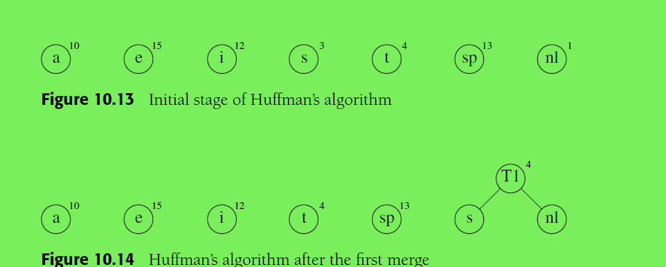
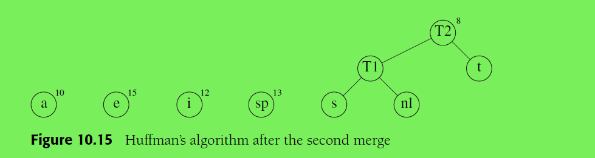
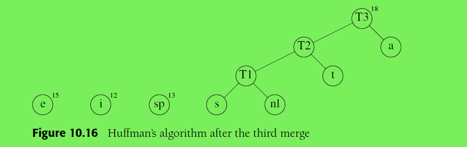
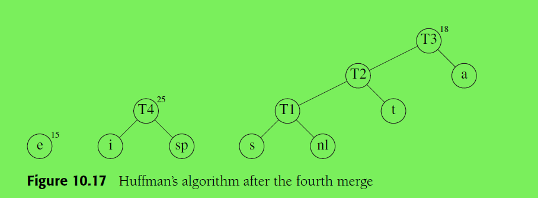
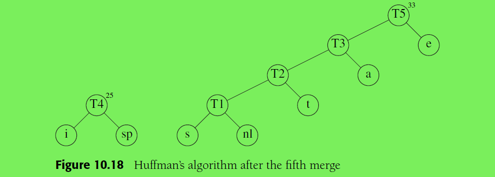
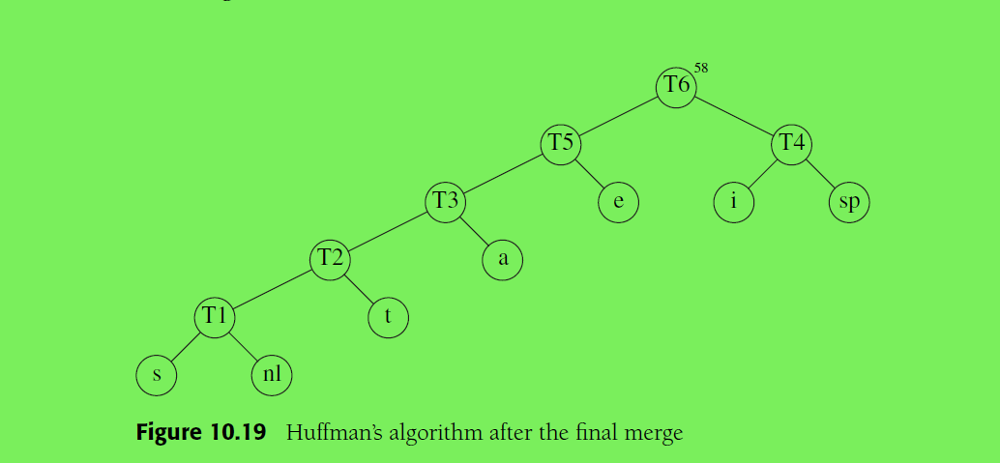

常见的算法设计策略

[TOC]

### 贪婪算法

分阶段求解一个问题，在每个阶段选择当前阶段的最优解。当求解结束后，若局部最优等效于全局最优，就能得到问题的最优解。否则可能是一个次优解

##### 应用

* 找零问题
* 哈夫曼编码
* 求近似解，在不要求准确解的情况下

缺点： 并不总是能成功

##### 哈夫曼编码

哈夫曼编码是根据哈夫曼算法生成的一种最优的编码方式。采用这种方式生成的编码可以用于数据压缩。

前缀码(prefix code):

任意字符的编码都不是其他字符编码的前缀

最小权重树：

假设di 是叶子节点的深度， fi是叶子节点的权重

算法描述：

每个字符的出现频率是其权重。最小权重树是哈夫曼算法可以给出最小权重的树。

1.  开始时，n个字符构成一个森林
2. 挑选权重最小的两棵树为左右子树，合并一棵新树。根节点的权重即左右子树权重的和
3. 重复步骤2，直到森林中只包含一棵树

左分支是1，右分支是0。或者相反

森林的初始状态如下图所示10.13 。10.14是经过一次合并后的森林

第二次合并：

第三次合并：

第四次合并：

第五次合并：

最后一次合并：

### 动态规划（dynamic programming)

啥是动态规划，一种解释是将重复使用的中间结果计算出来并保存到表中

### 分治(divide and conquer)

分解(divide):

合并(conquer):

### 回溯

### 参考

* 《