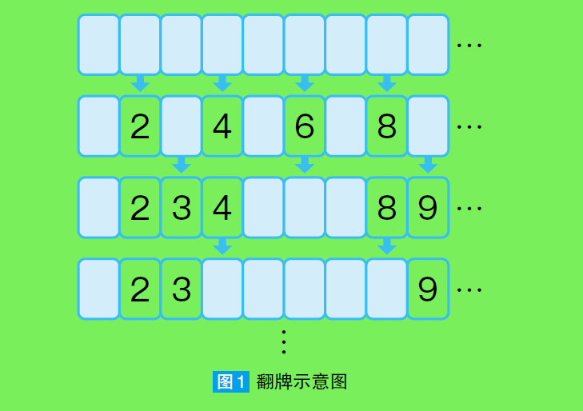

# 算法趣题

##### 翻牌

这里有100 张写着数字1~100 的牌，并按顺序排列着。最开始所有
牌都是背面朝上放置。某人从第2 张牌开始，隔1 张牌翻牌。然后第2,
4, 6, …, 100 张牌就会变成正面朝上。
接下来，另一个人从第3 张牌开始，隔2 张牌翻牌（原本背面朝上
的，翻转成正面朝上；原本正面朝上的，翻转成背面朝上）。再接下来，
又有一个人从第4 张牌开始，隔3 张牌翻牌（ 图1 ）。
像这样，从第n 张牌开始，每隔n－1 张牌翻牌，直到没有可翻动
的牌为止

问题：

求当所有牌不再变动时，所有背面朝上的牌的数字

算法实现本身并不复杂。有没有可以不写代码也能快速确定背面朝上的牌的数字？细想一下可以知道当所有牌不再变动时，若某张牌被翻了偶数次，那么这张牌仍保持背面朝上。问题就变成了确定一张牌被翻了几次，假设从位置n开始翻牌，若处于位置j（n <=j)的牌被翻动，则j 能够被n整除。所以确定处于位置j被翻动了几次，只要确定其有因数个数是偶数还是奇数（1除外)即可，准确的说应该是从第一轮翻动的牌的位置i 到位置j中的数值，j的因数个数。