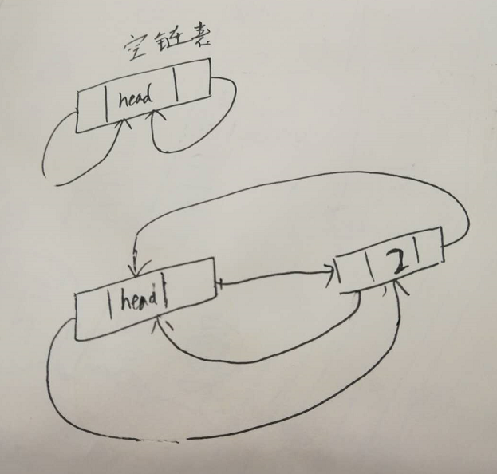

# 链表

[TOC]

现在发现自己有时候写链表的时候，每次都是一个新版本。有带表头的、有不带的，大部分时间不带表头，有时候对表头的设置也有点疑惑。现在彻底实现一遍，对比一下差异

主要关心下面几点：

* 需不需要带头部节点
* 需不需要设计成循环链表。什么情况下设计成循环链表是比较方便的
* 需不需要指向尾部的指针, 除非实现像`队列`这种数据结构，需要频繁的在链表尾部操作，否则无需指向尾部的指针

## 单链表

### 总结

* 带表头和不带表头的链表区别就是，带表头的链表在删除特定元素时，没必要检查前一个节点是不是空。

### 带表头

~~~go
package list

type listNode struct {
	value int
	next  *listNode
}

type LinkList struct {
	head  *listNode
	count int
}

func NewLinkList() LinkList {
	return LinkList{head: &listNode{}}
}

func (l *LinkList) AddHead(val int) {
	node := &listNode{value: val}
	node.next = l.head.next
	l.head.next = node
	l.count++
}

func (l *LinkList) AddTatil() {

}

func (l *LinkList) Find(val int) int {
	p := l.head.next
	for ; p != nil && p.value != val; p = p.next {
	}
	if p == nil {
		return -1
	}
	return p.value
}

func (l *LinkList) RemoveHead() {
	pn := l.head.next
	if pn == nil {
		return
	}
	l.head.next = pn.next
	pn.next = nil
	l.count--
}

//Len 元素个数 O(1)
func (l *LinkList) Len() int {
	return l.count
}

func (l *LinkList) Remove(val int) {
	prev := l.head
	p := l.head.next

	for ; p != nil && p.value != val; p = p.next {
		prev = p
	}
	if p == nil {
		return
	}
	/*
		//head element
		if prev == l.head.next {
			l.list = p.next
			p.next = nil
			l.count--
			return
		}
	*/
	prev.next = p.next
	p.next = nil
	l.count--
}
~~~

### 不带表头

~~~go
package list

type listNode struct {
	value int
	next  *listNode
}

type LinkList struct {
	list  *listNode
	count int
}

func NewLinkList() LinkList {
	return LinkList{}
}

func (l *LinkList) AddHead(val int) {
	node := &listNode{value: val}
	node.next = l.list
	l.list = node
	l.count++
}

func (l *LinkList) AddTatil() {

}

func (l *LinkList) Find(val int) int {
	p := l.list
	for ; p != nil && p.value != val; p = p.next {
	}
	if p == nil {
		return -1
	}
	return p.value
}

func (l *LinkList) RemoveHead() {
	if l.list == nil {
		return
	}
	pn := l.list
	l.list = pn.next
	pn.next = nil
	l.count--
}

//Len 元素个数 O(1)
func (l *LinkList) Len() int {
	return l.count
}

func (l *LinkList) Remove(val int) {
	prev := l.list
	p := l.list

	for ; p != nil && p.value != val; p = p.next {
		prev = p
	}
    //没有包含val的节点
	if p == nil {
		return
	}
	//head element
	if prev == l.list {
		l.list = p.next
		p.next = nil
		l.count--
		return
	}
	prev.next = p.next
	p.next = nil
	l.count--
}
~~~

### 带表头和尾指针

~~~go
package list

import "fmt"

type listNode struct {
	value int
	next  *listNode
}

type LinkList struct {
	head  *listNode
	tail  *listNode
	count int
}

func NewLinkList() LinkList {
	list := LinkList{head: &listNode{}}

	list.tail = list.head
	return list
}

func (l *LinkList) AddAtHead(val int) {
	node := &listNode{value: val}
	node.next = l.head.next
	l.head.next = node
	//链表为空时，l.tail指向头节点
	if l.tail == l.head {
		l.tail = node
	}
	l.count++
}

func (l *LinkList) AddAtTail(val int) {
	node := &listNode{value: val}
	//如果链表在初始化时，l.tail 指向头部节点
	//若当前链表为空，则这条语句会初始化头部节点
	l.tail.next = node
	l.tail = node
	l.count++

	//上面的语句相比下面的，简洁很多

	//2：如果链表在初始化时，l.tail的值为nil
	/*
		if l.head.next == nil {
			l.head.next = node
		}
		if l.tail == nil {
			l.tail = node
		} else {
			l.tail.next = node
		}
	*/
}

func (l *LinkList) Find(val int) int {
	p := l.head.next
	for ; p != nil && p.value != val; p = p.next {
	}
	if p == nil {
		return -1
	}
	return p.value
}

func (l *LinkList) RemoveHead() {
	pn := l.head.next
	if pn == nil {
		return
	}
	//初始化时, 若l.tail指向l.head。那么此时应将l.tail 重新初始化为l.head
	if pn == l.tail {
		l.tail = l.head
	}
	l.head.next = pn.next
	pn.next = nil
	l.count--
}

//Len 元素个数 O(1)
func (l *LinkList) Len() int {
	return l.count
}

func (l *LinkList) Remove(val int) {
	prev := l.head
	p := l.head.next

	for ; p != nil && p.value != val; p = p.next {
		prev = p
	}
	if p == nil {
		return
	}
	/*
		//head element
		if prev == l.head.next {
			l.list = p.next
			p.next = nil
			l.count--
			return
		}
	*/
	//链表只有一个元素的情况
	if p == l.tail {
		l.tail = l.head
	}
	prev.next = p.next
	p.next = nil
	l.count--
}

func (l *LinkList) getPrev(index int) *listNode {
	i := 0
	p := l.head
	for ; i < index; p = p.next {
		i++
	}
	return p
}
func (l *LinkList) Get(index int) int {
	if index < 0 || index >= l.Len() {
		return -1
	}
	prev := l.getPrev(index)
	return prev.next.value
}

func (l *LinkList) AddAtIndex(index int, val int) {
	count := l.Len()
	if index > count {
		return
	} else if index == count {
		l.AddAtTail(val)
		return
	} else if index < 0 {
		l.AddAtHead(val)
		return
	} else {
		prev := l.getPrev(index)
		node := &listNode{value: val}
		node.next = prev.next
		prev.next = node
		l.count++
	}
}

func (l *LinkList) DeleteAtIndex(index int) {
	if index < 0 || index >= l.Len() {
		return
	}
	if index == 0 {
		l.RemoveHead()
		return
	}
	prev := l.getPrev(index)
	node := prev.next
	prev.next = node.next
	node.next = nil

	//最后一个元素
	if node == l.tail {
		l.tail = prev
	}

	l.count--
}

func (l *LinkList) dump() {
	fmt.Printf("count:%d begin dump\n", l.Len())
	for p := l.head.next; p != nil; p = p.next {
		fmt.Printf("value:%d\n", p.value)
	}
}
~~~

## 双向链表

### 带表头的循环链表

下图是空链表和含有一个元素的链表：

~~~go
package list

import "fmt"

/*
	双向循环链表，头节点的prev始终指向最后一个节点。
	最后一个节点的node.next指向头节点
*/

type douListNode struct {
	value int
	next  *douListNode
	prev  *douListNode
}

type DoubleLinkList struct {
	head  *douListNode
	count int
}

func NewDoubleLinkList() DoubleLinkList {
	list := DoubleLinkList{
		head: &douListNode{},
	}
	//这种情况下，list.head.prev始终指向最后一个节点
	list.head.next = list.head
	list.head.prev = list.head
	return list
}

func (l *DoubleLinkList) Len() int {
	return l.count
}

//链表为空时添加
//链表不为空时添加
func (l *DoubleLinkList) AddAtHead(val int) {
	node := &douListNode{value: val}
	/*
		//链表为空
		node.next = l.head.next
		node.prev = l.head.prev

		l.head.next = node
		if l.head.prev == l.head {
			l.head.prev = node
		}
	*/
	//修改前一个节点的prev指向node
	//若链表为空，l.head.next还是指向head。 若不为空，则指向第一个节点。l.head.next.prev能处理两种情况
	l.head.next.prev = node
	node.next = l.head.next

	node.prev = l.head

	l.head.next = node

	l.count++
}

//链表为空
//链表不为空
func (l *DoubleLinkList) AddAtTail(val int) {
	node := &douListNode{value: val}

	node.next = l.head.prev.next
	l.head.prev.next = node

	node.prev = l.head.prev

	l.head.prev = node
	l.count++
}

func (l *DoubleLinkList) get(index int) *douListNode {
	i := 0
	p := l.head.next
	for ; i < index; p = p.next {
		i++
	}
	return p
}
func (l *DoubleLinkList) Get(index int) int {
	if index < 0 || index >= l.Len() {
		return -1
	}
	p := l.get(index)
	return p.value
}

func (l *DoubleLinkList) dump() {
	fmt.Printf("count:%d begin dump double link list\n", l.Len())
	p := l.head.next
	for ; p != l.head; p = p.next {
		fmt.Printf("%d\n", p.value)
	}
}

func (l *DoubleLinkList) AddAtIndex(index, val int) {
	count := l.Len()
	if index > count {
		return
	} else if index == count {
		l.AddAtTail(val)
		return
	} else if index < 0 {
		l.AddAtHead(val)
		return
	} else {
		//
		node := &douListNode{value: val}
		old := l.get(index)

		//node.next = old.prev.next
		node.next = old
		old.prev.next = node

		node.prev = old.prev
		old.prev = node

		l.count++
	}
}

func (l *DoubleLinkList) DeleteAtIndex(index int) {
	if index < 0 || index >= l.Len() {
		return
	}
	node := l.get(index)

	node.prev.next = node.next
	node.next.prev = node.prev

	node.next = nil
	node.prev = nil
	l.count--
}

~~~

### 不带表头

