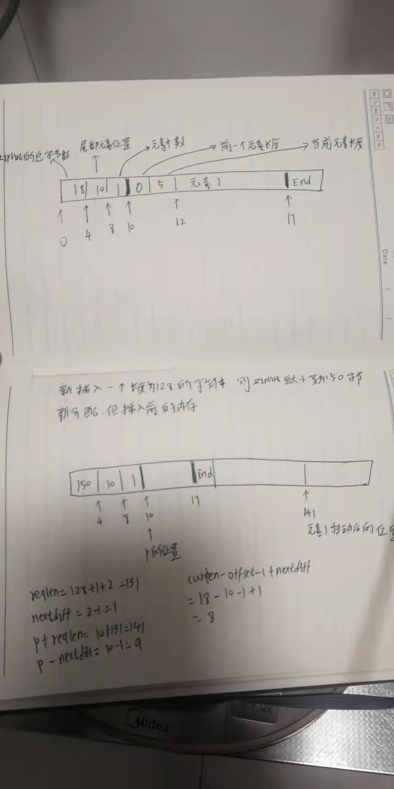

# list
[TOC]


双向链表 2.6.17


## 命令

| 命令                                      | 复杂度     |                                           |
| ----------------------------------------- | ---------- | ----------------------------------------- |
| LPUSH key element [element...]            | O(1)       | 添加到列表头部                            |
| LPUSHX key element [element...]           | O(1)       | 只有列表存在时，才添加                    |
| LINSERT key BEFORE \| AFTER pivot element | O(N)       | 在指定元素之前或之后插入元素              |
| LLEN key                                  | O(1)或O(N) | 2.6.17中可能需要遍历ziplist来统计元素个数 |
| LINDEX key index                          | O(N)       | h获取位于index位置的值                    |
| LSET key index element                    |            | 设置位于列表index处的值为element          |
|                                           |            |                                           |


## 存储结构 

<font color='red'>既然有两种存储结构。那何时选择ziplist作为存储结构，何时选择list(双链表)作为存储结构</font>。

默认选择是ziplist做为存储结构，若待存储的元素长度超过 server.list_max_ziplist_value指定的字节数时，或ziplist中元素个数超过server.list_max_ziplist_entries时，则会将ziplist转换为list

插入元素可能导致存储结构转换

<font color='red'>为啥有两种存储结构，又为啥会在ziplist包含的元素个数超过一定数目时，会从ziplist转为list</font>。


### ziplist存储结构

ziplist 对象的类型REDIS_LIST，编码类型为REDIS_ENCODING_ZIPLIST

z_list.c

```c
#define ZIP_END 255  //ziplist结束标志
#define ZIP_BIGLEN 254  

/* Different encoding/length possibilities */
#define ZIP_STR_MASK 0xc0
#define ZIP_INT_MASK 0x30
#define ZIP_STR_06B (0 << 6)
#define ZIP_STR_14B (1 << 6)
#define ZIP_STR_32B (2 << 6)
#define ZIP_INT_16B (0xc0 | 0 << 4)
#define ZIP_INT_32B (0xc0 | 1 << 4) // 0001 左移4位     0001 0000 0x10
#define ZIP_INT_64B (0xc0 | 2 << 4) // 0000 0010         0010 0000 0x20
#define ZIP_INT_24B (0xc0 | 3 << 4) // 0000 0011 左移4位 0011 0000 0x30
#define ZIP_INT_8B 0xfe
/* 4 bit integer immediate encoding */
#define ZIP_INT_IMM_MASK 0x0f
#define ZIP_INT_IMM_MIN 0xf1 /* 11110001 */
#define ZIP_INT_IMM_MAX 0xfd /* 11111101 */
#define ZIP_INT_IMM_VAL(v) (v & ZIP_INT_IMM_MASK)

#define INT24_MAX 0x7fffff
#define INT24_MIN (-INT24_MAX - 1)

/* Macro to determine type */
/*编码方式是否是字符串编码 0xc0 1100 0000*/
#define ZIP_IS_STR(enc) (((enc)&ZIP_STR_MASK) < ZIP_STR_MASK)

#define ZIPLIST_BYTES(zl) (*((uint32_t *)(zl)))
#define ZIPLIST_TAIL_OFFSET(zl) (*((uint32_t *)((zl) + sizeof(uint32_t))))
#define ZIPLIST_LENGTH(zl) (*((uint16_t *)((zl) + sizeof(uint32_t) * 2)))
#define ZIPLIST_HEADER_SIZE (sizeof(uint32_t) * 2 + sizeof(uint16_t))

//指向ziplist头部
#define ZIPLIST_ENTRY_HEAD(zl) ((zl) + ZIPLIST_HEADER_SIZE)

//指向ziplist尾部最后一个元素位置
#define ZIPLIST_ENTRY_TAIL(zl) ((zl) + intrev32ifbe(ZIPLIST_TAIL_OFFSET(zl)))

//ziplist空间最后一个字节的前一个字节，指向结束符的位置
#define ZIPLIST_ENTRY_END(zl) ((zl) + intrev32ifbe(ZIPLIST_BYTES(zl)) - 1)
```


~~~c
//ziplist的等价struct定义，ziplist.h并没有此ziplist结构体的定义
struct ziplist{
    uint32_t size; //总字节数
    uint32_t tail; //最后一个元素的位置
    uint16_t len; //元素个数
    uint8_t data[];
}


typedef struct zlentry {
  //prevrawlensize 前一个元素的长度所占的字节数
  //prevrawlen 前一个元素的长度
  unsigned int prevrawlensize, prevrawlen;

  //lensize 当前元素的encoding 和 长度 所占字节数
  //len 当前元素所占字节数
  unsigned int lensize, len;

  //headersize = prevrawlensize + lensize
  unsigned int headersize;

  unsigned char encoding;

  //元素起始位置
  unsigned char *p;
} zlentry;
~~~


创建新的ziplist:

```c
unsigned char *ziplistNew(void) {
  unsigned int bytes = ZIPLIST_HEADER_SIZE + 1;
  unsigned char *zl = zmalloc(bytes);
  ZIPLIST_BYTES(zl) = intrev32ifbe(bytes);
  ZIPLIST_TAIL_OFFSET(zl) = intrev32ifbe(ZIPLIST_HEADER_SIZE); //指向 结束标志ZIP_END的内存位置
  ZIPLIST_LENGTH(zl) = 0;
  zl[bytes - 1] = ZIP_END;
  return zl;
}
```


#### 内存结构

```
---------------------------------------------------------------------------------------------
空间大小(4字节)| 最后一个元素位置(4字节) | 元素个数(2字节) | 元素1| 元素2 | ...| 元素n | 结束标志 1字节,值为255
-------------------------------------------------------------------------------------------

每个元素的结构：
---------------------------------------------------------------
前一个元素的长度(字节数,不固定) | 编码格式(1字节) | 当前元素长度(大端方式) | 当前元素 
-------------------------------------------------------------

前一个元素长度:
若长度小于254(ZIP_BIGLEN)，则占用1字节
若长度大于等于254,则占用5个字节。第一个字节的值为(ZIP_BIGLEN 254),实际长度占用四个字节
前一个元素长度=前一个元素得编码长度+ 长度信息占用空间+ 值占用空间

```


#### 编码方式

| 类型   | 值的长度                 | 编码方式           | 编码占用字节数           | 长度占用字节数 |
| ------ | ------------------------ | ------------------ | ------------------------ | -------------- |
| 字符串 | 不超过63字节             | ZIP_STR_06B(0)     | 编码和长度共用一字节     | 0              |
| 字符串 | 不超过16383              | ZIP_STR_14B(0x40)  | 编码和长度共用第一个字节 | 2              |
| 字符串 | 超过16383                | ZIIP_STR_32B(0x80) | 1                        | 4              |
| 整型   | [0, 12]                  | 0xf1 - 0xfd        | 1                        | 0              |
| 整型   | [-128, 127]              | ZIP_INT_8B(0xfe)   | 1                        | 0              |
| 整型   | -32768到32767            | ZIP_INT_16B(0xc0)  | 1                        | 0              |
| 整型   | -8388608 到 8388607      | ZIP_INT_24B(0xf0)  | 1                        | 0              |
| 整型   | -2147483648 到2147483647 | ZIP_INT_32B(0xd0)  | 1                        | 0              |
| 整型   | 超过32位的有符号整数     | ZIP_INT_64B(0xe0)  | 1                        | 0              |


```c
/* Encode the length 'l' writing it in 'p'. If p is NULL it just returns
 * the amount of bytes required to encode such a length. */
static unsigned int zipEncodeLength(unsigned char *p, unsigned char encoding,
                                    unsigned int rawlen) {
  unsigned char len = 1, buf[5];

  if (ZIP_IS_STR(encoding)) {
    /* Although encoding is given it may not be set for strings,
     * so we determine it here using the raw length. */
    //长度小于63
    if (rawlen <= 0x3f) {
      if (!p)
        return len;
      buf[0] = ZIP_STR_06B | rawlen;
    } else if (rawlen <= 0x3fff) { //小于16383(16384 是16KB)
      len += 1;                    // 2字节空间存放长度信息
      if (!p)
        return len;
      // 0000 0001
      // 左移6位 0100 0000
      // rawlen的高8位 & 0011 1111
      buf[0] = ZIP_STR_14B | ((rawlen >> 8) & 0x3f);
      buf[1] = rawlen & 0xff;
    } else {
      //超过16KB 为何加4
      len += 4; // 5字节空间存放长度信息
      if (!p)
        return len;
      buf[0] = ZIP_STR_32B;
      buf[1] = (rawlen >> 24) & 0xff;
      buf[2] = (rawlen >> 16) & 0xff;
      buf[3] = (rawlen >> 8) & 0xff;
      buf[4] = rawlen & 0xff;
    }
  } else {
    /* Implies integer encoding, so length is always 1. */
    if (!p)
      return len;
    buf[0] = encoding;
  }

  /* Store this length at p */
  memcpy(p, buf, len);
  return len;
}
```


#### 插入

插入元素时先尝试看是否能将元素以整型表示，若不能则以字符串形式存储。能够以整型存储的条件，数字字符串长度满足 0<= entrylen <=32且能够转为整型数值。以整型存储可以在一定程度上减少内存的使用，如字符串"1234"若以字符串形式存储需要4个字节，而以整型存储则需要2个字节，内存使用减少了一倍。


~~~c
/* Insert item at "p". */
static unsigned char *__ziplistInsert(unsigned char *zl, unsigned char *p, unsigned char *s, unsigned int slen) {
    size_t curlen = intrev32ifbe(ZIPLIST_BYTES(zl)), reqlen, prevlen = 0;
    size_t offset;
    int nextdiff = 0;
    unsigned char encoding = 0;
    long long value = 123456789; /* initialized to avoid warning. Using a value
                                    that is easy to see if for some reason
                                    we use it uninitialized. */
    zlentry entry, tail;

    /* Find out prevlen for the entry that is inserted. */
    if (p[0] != ZIP_END) {
        entry = zipEntry(p);
        prevlen = entry.prevrawlen;
    } else { 
        unsigned char *ptail = ZIPLIST_ENTRY_TAIL(zl);
        if (ptail[0] != ZIP_END) {
            prevlen = zipRawEntryLength(ptail);
        }
    }

    /* See if the entry can be encoded */
    if (zipTryEncoding(s,slen,&value,&encoding)) {
        /* 'encoding' is set to the appropriate integer encoding */
        //编码后元素长度
        reqlen = zipIntSize(encoding);
    } else {
        /* 'encoding' is untouched, however zipEncodeLength will use the
         * string length to figure out how to encode it. */
        reqlen = slen; 
    }
    /* We need space for both the length of the previous entry and
     * the length of the payload. */
    //加上前一个元素的长度信息所占字节数
    reqlen += zipPrevEncodeLength(NULL,prevlen);
    //当前元素长度所占字节数
    reqlen += zipEncodeLength(NULL,encoding,slen);

    /* When the insert position is not equal to the tail, we need to
     * make sure that the next entry can hold this entry's length in
     * its prevlen field. */
     //当前元素的长度所占字节数 和 下一个元素的“前一个元素长度”所占字节数的差值
    nextdiff = (p[0] != ZIP_END) ? zipPrevLenByteDiff(p,reqlen) : 0;

    /* Store offset because a realloc may change the address of zl. */
    offset = p-zl;
    zl = ziplistResize(zl,curlen+reqlen+nextdiff);
    p = zl+offset;

    /* Apply memory move when necessary and update tail offset. */
    if (p[0] != ZIP_END) {
        /* Subtract one because of the ZIP_END bytes */
        //p+reqlen 是待插入的新元素的结束位置
        //p-nextdiff 需要为当前元素的长度所占字节数超出部分
        memmove(p+reqlen,p-nextdiff,curlen-offset-1+nextdiff);

        //更新下一个元素的"前一个元素长度信息"
        /* Encode this entry's raw length in the next entry. */
        zipPrevEncodeLength(p+reqlen,reqlen);

        /* Update offset for tail */
        ZIPLIST_TAIL_OFFSET(zl) =
            intrev32ifbe(intrev32ifbe(ZIPLIST_TAIL_OFFSET(zl))+reqlen);

        /* When the tail contains more than one entry, we need to take
         * "nextdiff" in account as well. Otherwise, a change in the
         * size of prevlen doesn't have an effect on the *tail* offset. */
        tail = zipEntry(p+reqlen);
        if (p[reqlen+tail.headersize+tail.len] != ZIP_END) {
            ZIPLIST_TAIL_OFFSET(zl) =
                intrev32ifbe(intrev32ifbe(ZIPLIST_TAIL_OFFSET(zl))+nextdiff);
        }
    } else {
        /* This element will be the new tail. */
        ZIPLIST_TAIL_OFFSET(zl) = intrev32ifbe(p-zl);
    }

    /* When nextdiff != 0, the raw length of the next entry has changed, so
     * we need to cascade the update throughout the ziplist */
    if (nextdiff != 0) {
        offset = p-zl;
        zl = __ziplistCascadeUpdate(zl,p+reqlen);
        p = zl+offset;
    }

    /* Write the entry */
    p += zipPrevEncodeLength(p,prevlen);
    p += zipEncodeLength(p,encoding,slen);
    if (ZIP_IS_STR(encoding)) {
        memcpy(p,s,slen);
    } else {
        zipSaveInteger(p,value,encoding);
    }
    ZIPLIST_INCR_LENGTH(zl,1);
    return zl;
}


~~~


插入示意图:




#### 长度


**当元素个数小于65535时，长度在ziplist头部。当超过65535时，元素个数信息不再准确，需要遍历ziplist统计元素个数**

~~~c
unsigned int ziplistLen(unsigned char *zl) {
    unsigned int len = 0;
    if (intrev16ifbe(ZIPLIST_LENGTH(zl)) < UINT16_MAX) {
        len = intrev16ifbe(ZIPLIST_LENGTH(zl));
    } else {
        unsigned char *p = zl+ZIPLIST_HEADER_SIZE;
        while (*p != ZIP_END) {
            p += zipRawEntryLength(p);
            len++;
        }

        /* Re-store length if small enough */
        if (len < UINT16_MAX) ZIPLIST_LENGTH(zl) = intrev16ifbe(len);
    }
    return len;
}
~~~


#### 劣势

每次插入、删除都需要重新分配内存


### list(双链表)存储结构

list对象类型是REDIS_LIST，编码类型是REDIS_ENCODING_LINKEDLIST

双链表 adlist.c


```c
typedef struct listNode {
    struct listNode *prev;
    struct listNode *next;
    void *value;
} listNode;

typedef struct listIter {
    listNode *next;
    int direction;
} listIter;

typedef struct list {
    listNode *head;
    listNode *tail;
    void *(*dup)(void *ptr);
    void (*free)(void *ptr);
    int (*match)(void *ptr, void *key);
    unsigned long len;
} list;
```
###


## TODO

* 比较一下ziplist和list这两种存储方式的性能