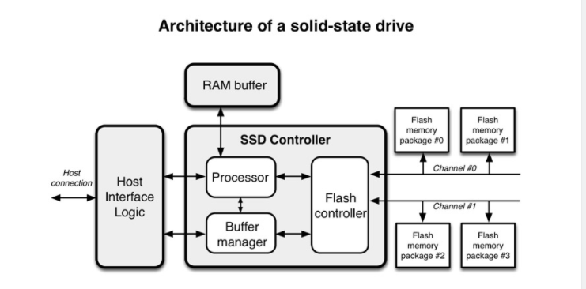
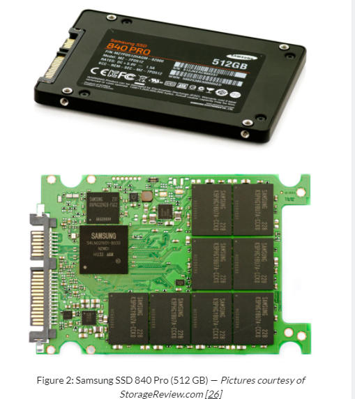
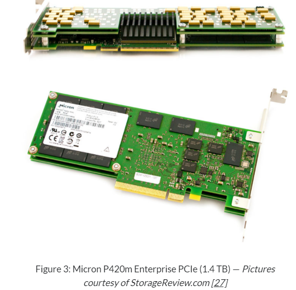
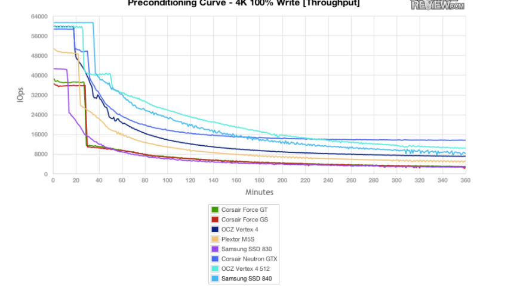
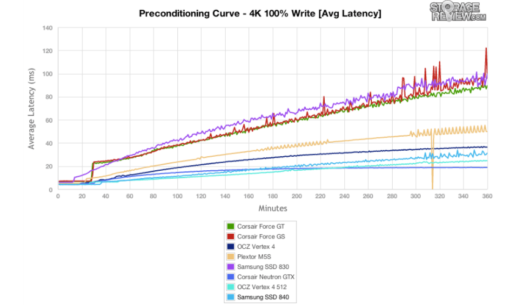

# SSD 的架构

[TOC]

原文：https://codecapsule.com/2014/02/12/coding-for-ssds-part-2-architecture-of-an-ssd-and-benchmarking/

这是“Coding for SSDs" 6篇博文中的第二篇，包含1、2两个章节。其他章节见目录。我写这个系列是为了记录和分享我学到的关于SSD的内容，以及如何才能使代码在SSD上表现的更好。如果你比较着急，也可以直接跳到第6篇，这一篇总结了其他章节讲述的内容。

这一章，我将解释基本的NAND-flash 内存，cell types和基本的SSD内部结构。也讲解了SSD的基准测试以及如何解释这些基准(benchmarks)

## SSD的结构

### 1.1 闪存(NAND-flash)的存储单元

固态硬盘(SSD)是一种基于闪存(flash-memory)的存储设备。比特(Bits)被存储在存储单元中(cells)，这些存储单元由浮栅晶体管(floating-gate-transistors)构成。固态硬盘完全由电子组件组成，没有类似机械硬盘中的可移动或机械部分。

通过给浮栅晶体管提供电压的方式，实现比特的读、写、擦除。Two solutions for wiring transistors: NOR闪存和NAND闪存。这里不再深入NOR和NAND闪存直间更多的细节上的差异。这篇文章只介绍NAND闪存，这也是被大部分厂商采用的方案。更多关于NOR和NAND细节上的差异，可以参考Lee Hutchinson[31]的文章。

**NAND闪存的一个重要特性就是存储单元的磨损(wearing off)， 因此寿命有限。实际上，the transistors forming the cells store bits by holding electrons。在每个P/E周期(Program/Erase， 这里的Program意味着写入)，电子(electrons)可能错误的保留在晶体管中(原文:electrons might get trapped in the transistor by mistake)，and after some time, too many electrons will have been trapped and the cells would become unusable.(不太明白)** 

~~~
有限的寿命(Limited lifespan)
Each cell has a maximum number of P/E cycles (Program/Erase), after which the cell is considered defective. NAND-flash memory wears off and has a limited lifespan. The different types of NAND-flash memory have different lifespans [31].

每个存储单元都有最大数量的P/E周期（编程/擦除），在这之后单元被认为是有缺陷的。NAND闪存会磨损，寿命有限。不同类型的NAND闪存具有不同的寿命

~~~

最近的研究表明对NAND 芯片施加高温，捕获(trapped)的电子可以被清除[14, 51]。SSD的寿命可以大幅(tremendously)提升。然而这仍处于研究阶段，不能确定是否能够在将来的某天投入消费市场。

目前工业上已经出现的存储单元(cell)的类型：

* 单层存储单元(Single level cell, SLC)，每个晶体管只能存储1个比特。但寿命较长
* 多层存储单元(Multiple level cell, MLC)，每个晶体管可以存储2个bit。相较于SLC有着更高的延迟和较短的寿命。
* 三层存储单元(Triple-level cell)，每个晶体管可以存储3个bit, 但有着更高的延迟和更短的寿命

下面的表一展示了每种闪存存储单元类型的详细信息。处于比较的目的，加上了机械硬盘、主存(RAM)、L1/L2 缓存的平均延迟

|                    | SLC                                                          | MLC  | TLC  | HDD       | RAM      | L1 cache | L2 cache |
| ------------------ | ------------------------------------------------------------ | ---- | ---- | --------- | -------- | -------- | -------- |
| P/E cycles         | 100k                                                         | 10k  | 5k   | *         | *        | *        | *        |
| Bits per cell      | 1                                                            | 2    | 3    | *         | *        | *        | *        |
| Seek latency (μs)  | *                                                            | *    | *    | 9000      | *        | *        | *        |
| Read latency (μs)  | 25                                                           | 50   | 100  | 2000-7000 | 0.04-0.1 | 0.001    | 0.004    |
| Write latency (μs) | 250                                                          | 900  | 1500 | 2000-7000 | 0.04-0.1 | 0.001    | 0.004    |
| Erase latency (μs) | 1500                                                         | 3000 | 5000 | *         | *        | *        | *        |
| *Notes*            | * metric is not applicable for that type of memory           |      |      |           |          |          |          |
| *Sources*          | P/E cycles [[20\]](https://codecapsule.com/2014/02/12/coding-for-ssds-part-2-architecture-of-an-ssd-and-benchmarking/#ref) SLC/MLC latencies [[1\]](https://codecapsule.com/2014/02/12/coding-for-ssds-part-2-architecture-of-an-ssd-and-benchmarking/#ref) TLC latencies [[23\]](https://codecapsule.com/2014/02/12/coding-for-ssds-part-2-architecture-of-an-ssd-and-benchmarking/#ref) Hard disk drive latencies [[18, 19, 25\]](https://codecapsule.com/2014/02/12/coding-for-ssds-part-2-architecture-of-an-ssd-and-benchmarking/#ref) RAM latencies [[30, 52\]](https://codecapsule.com/2014/02/12/coding-for-ssds-part-2-architecture-of-an-ssd-and-benchmarking/#ref) L1 and L2 cache latencies [[52\]](https://codecapsule.com/2014/02/12/coding-for-ssds-part-2-architecture-of-an-ssd-and-benchmarking/#ref) |      |      |           |          |          |          |

​		表1：NAND-flash存储和其他存储组件相比的特性和延迟

同样数量的晶体管存储更多的比特位减小了厂商的成本。基于SLC的固态硬盘比基于MLC的固态硬盘更加可靠和更长的寿命预期，当然生产成本较高。因此，大多数固态硬盘基于MLC或TLC，只有专业的固态硬盘基于SLC。正确的存储类型的选择取决于硬盘的使用场景、以及数据可能被更新的频率。对于频繁更新的场景，基于SLC的固态硬盘是最佳选择。然俄，对高频读和低频写场景来说(例如视频存储和流)，TLC会更好一些。而且，在真实使用场景对基于TLC的固态硬盘的基准测试表明，基于TLC的固态硬盘的寿命在实际当中并不成问题。

闪存的页和块(NAND-flash pages and blocks):

~~~
存储单元被组成网格（grid),被称为块(block)，多个块组成面(planes)。块可以被最小的读写单元是页面(page)。页面不能被单独擦除，只有整个块可以被擦除。闪存的页面大小并不固定，大部分驱动(drive)的页面大小为2KB、4KB、8KB或16KB。大部分的的固态硬盘的块包含128或256个页面，这就意味着块的大小在256KB到4MB之间。比如，三星的840 EVO固态硬盘的块大小为2048KB，每个块包含256个8KB的页面。访问页面和块的方式的细节见3.1节
~~~

### 1.2 固态硬盘的组织结构

下面的图1表示固态硬盘和它的主要组件。z

​				图1 固态硬盘的架构

用户的命令通过主机接口传递到硬盘。在我写这篇博文时，新上市的固态硬盘装备两种最常见的接口是Serial ATA(SATA), PCI Express(PCIe)。固态硬盘控制器里的处理器接收命令并传递给 Flash controller。固态硬盘也有嵌入式的内存，通常用作缓存以及存储映射信息(mapping information)。第4小节更详细的讲述了映射策略。The packages of NAND flash memory are organized in gangs， over multiple channels，which is covered in Section 6。

下面的图2和3，复制于StorageReview.com[26, 27]，展示了现实生活中的固态硬盘。图2展示了512GB版的三星840 Pro SSD，2013秋季上市。从电路板上可以看到主要的组件包括：

* 1 个SATA 3.0接口
* 1个SSD控制器(Samsung MDX S4LN021X01-8030)
* 1个内存模块(256MB DDR2 Samsung K4P4G324EB-FGC2)
* 8个MLC NAND-flash模块，每个提供64GB存储空间(Samsung K9PHGY8U7A-CCK0)
* 

图3是一块 Micron P420m 企业级PCIe，2013年上市。主要组件包括：

* 8 lanes PCI Express 2.0接口
* 1个SSD控制器
* 1个内存模块(DRAM DDR3)
* 64个MLC NAND-flash 模块32通道，每个模块提供32GB存储空间(Micron 31C12NQ314 25nm)

总的容量是2048GB，但是预留空间后(over-provisioning)只有1.4TB可用

### 1.3 生产过程

许多固态硬盘厂家使用serface-mount technology(SMT)生产固态硬盘，一种将电子组件直接放在印刷电路板（PCBs)上的生产方法。SMT生产线由几台机器组成，每台机器依次衔接并完成整个制作过程中的特定任务，比如安装组件或者融化焊料。

## 2 基准和性能指标

### 2.1 基本的基准（basic benchmarks)

下面的表2展示了不同的固态硬盘在顺序和随机负载下的吞吐量。出于比较的目的，包括了2008年和2013年上市的固态硬盘、机械硬盘和RAM存储芯片

| Samsung 64 GB             | Samsung 64 GB                                                | Intel X25-M                   | Samsung 840 EVO             | Micron P420m | HDD                            | RAM                    |
| ------------------------- | ------------------------------------------------------------ | ----------------------------- | --------------------------- | ------------ | ------------------------------ | ---------------------- |
| Brand/Model               | Samsung (MCCDE64G5MPP-OVA)                                   | Intel X25-M (SSDSA2MH080G1GC) | Samsung (SSD 840 EVO mSATA) | Micron P420m | Western Digital Black 7200 rpm | Corsair Vengeance DDR3 |
| Memory cell type          | MLC                                                          | MLC                           | TLC                         | MLC          | *                              | *                      |
| Release year              | 2008                                                         | 2008                          | 2013                        | 2013         | 2013                           | 2012                   |
| Interface                 | SATA 2.0                                                     | SATA 2.0                      | SATA 3.0                    | PCIe 2.0     | SATA 3.0                       | *                      |
| Total capacity            | 64 GB                                                        | 80 GB                         | 1 TB                        | 1.4 TB       | 4 TB                           | 4 x 4 GB               |
| Pages per block           | 128                                                          | 128                           | 256                         | 512          | *                              | *                      |
| Page size                 | 4 KB                                                         | 4 KB                          | 8 KB                        | 16 KB        | *                              | *                      |
| Block size                | 512 KB                                                       | 512 KB                        | 2048 KB                     | 8196 KB      | *                              | *                      |
| Sequential reads (MB/s)   | 100                                                          | 254                           | 540                         | 3300         | 185                            | 7233                   |
| Sequential writes (MB/s)  | 92                                                           | 78                            | 520                         | 630          | 185                            | 5872                   |
| 4KB random reads (MB/s)   | 17                                                           | 23.6                          | 383                         | 2292         | 0.54                           | 5319 **                |
| 4KB random writes (MB/s)  | 5.5                                                          | 11.2                          | 352                         | 390          | 0.85                           | 5729 **                |
| 4KB Random reads (KIOPS)  | 4                                                            | 6                             | 98                          | 587          | 0.14                           | 105                    |
| 4KB Random writes (KIOPS) | 1.5                                                          | 2.8                           | 90                          | 100          | 0.22                           | 102                    |
| *Notes*                   | * metric is not applicable for that storage solution ** measured with 2 MB chunks, not 4 KB |                               |                             |              |                                |                        |
| *Metrics*                 | MB/s: Megabytes per Second KIOPS: Kilo IOPS, i.e 1000 Input/Output Operations Per Second |                               |                             |              |                                |                        |
| *Sources*                 | Samsung 64 GB [[21\]](https://codecapsule.com/2014/02/12/coding-for-ssds-part-2-architecture-of-an-ssd-and-benchmarking/#ref) Intel X25-M [[2, 28\]](https://codecapsule.com/2014/02/12/coding-for-ssds-part-2-architecture-of-an-ssd-and-benchmarking/#ref) Samsung SSD 840 EVO [[22\]](https://codecapsule.com/2014/02/12/coding-for-ssds-part-2-architecture-of-an-ssd-and-benchmarking/#ref) Micron P420M [[27\]](https://codecapsule.com/2014/02/12/coding-for-ssds-part-2-architecture-of-an-ssd-and-benchmarking/#ref) Western Digital Black 4 TB [[25\]](https://codecapsule.com/2014/02/12/coding-for-ssds-part-2-architecture-of-an-ssd-and-benchmarking/#ref) Corsair Vengeance DDR3 RAM [[30\]](https://codecapsule.com/2014/02/12/coding-for-ssds-part-2-architecture-of-an-ssd-and-benchmarking/#ref) |                               |                             |              |                                |                        |

Table 2: Characteristics and throughput of solid-state drives compared to other storage solutions

影响性能的一个重要因素的主机接口(host interface)。新上市的固态硬盘装备的最常见的接口是SATA3.0、 PCI Express 3.0。SATA 3.0接口，数据传输速率可以达到6Gbit/s，实际可达到550MB/s左右，PCIe 3.0接口，数据传输速率可以达到8GT/s per lane，实际可达到1GB/s(GT/s表示Gigatransfers per second)。使用PCIe 3.0接口的SSD硬盘具有多个lane。若具备4个lane，PCIe 3.0能提供最大4GB/s的带宽，比SATA3.0快8倍。一些企业级固态硬盘也提供Serial Attached SCSI interface(SAS)，最新版本的SAS可以提供近12GBit/s，虽然现在SAS只占市场的一小部分。

最新的固态硬盘内部足够快很容易达到SATA3.0的550MB/s的上限，因此对它们来说接口是个瓶颈。使用PCI Exress 3.0或SAS接口的硬盘的性能得到了极大提升。

### 2.2 前提条件(Pre-condition)

固态硬盘厂家提供的data sheets写满了令人惊叹的性能参数。事实上，通过长时间的随机操作，制造商似乎总能找到一种方法，在他们的营销传单上显示出闪亮的数字。这些数字是否真的有意义，是否允许预测生产系统的性能，则是另一个问题。

在他的关于固态硬盘基准中的常见缺陷的文章中[66]，Marc Bevand 提到随机写

~~~
In his articles about common flaws in SSD benchmarking [66], Marc Bevand mentioned that for instance it is common for the IOPS of random write workloads to be reported without any mention of the span of the LBA, and that many IOPS are also reported for queue depth of 1 instead of the maximum value for the drive being tested. There are also many cases of bugs and misuses of the benchmarking tools.
~~~

正确评估固态硬盘的性能并不是个简单的任务。许多来自硬件审核(reviewing)的博客运行十分钟的随机写入，就声称硬盘已经为测试准备就绪，测试结果是可信的。然而，固态硬盘的性能只有在随机写入负载饱和时才开始下降，根据固态硬盘的大小可能耗费30分钟或3个小时。这就是为什么更加严谨的基准测试始于饱和的随机写入，也被称为"前提条件"(pre-condition)[50]。下面的图7，出自StorageReview.com[26]的一篇文章，展示了在多个固态硬盘上的前提条件的效果。大约30分钟之后可以观察到性能明显的下降，此时所有的硬盘吞吐量下降、延迟增加。4个小时之后，性能慢慢的衰退成一个小的常量。

​			图7： 多个固态硬盘上的前置条件的效果

在图7中发生的事情本质上是，如第5.2节所解释的，随机写入的数量非常大，并且以一种持续的方式应用，以至于垃圾收集过程在后台无法跟上。垃圾回收必须在写入命令到达时擦除块，因此与主机的前台操作相竞争。使用预处理的人声称，它生成的基准测试准确地表示了驱动器在可能的最坏状态下的行为。对于驱动器在所有工作负载下的行为，这是否是一个好的模型是有争议的。。

### 2.3 负载和指标(workloads and metrics)

性能基准测试共享同样的可变参数，并且使用同样的指标提供结果。在这一节，我希望提供一些关于如何解释这些参数和指标的见解。

通常使用的参数如下：

* 负载类型: 可以是基于从用户收集的数据特定基准，或者只是同一种类型的顺序或随机访问
* 并发应用读写(如30%的读和70%的写入)
* 队列长度：即在驱动上并发执行命令的线程数目
* 正在访问的数据块的大小(如4KB、8KB)

基准测试结果通过不同的指标表现出来。最常见的如下:

* 吞吐量(throughput)：传输速度，通常是KB/s或MB/s，即KB每秒或MB每秒。这是衡量顺序读写基准的指标
* IOPS: 每秒执行输入/输出操作的数量。每个操作使用同样大小的数据块(通常是4KB)。这是衡量随机读写基准的指标
* 延迟： 发出指令后设备的响应时间。通常是us或ms，即微秒或毫秒

虽然吞吐量容易理解，IOPS就比较难理解了。**比如，如果一个硬盘展现出随机写入4KB达1000IOPS的性能，这就意味着吞吐量是1000* 4096=4MB/s(注: 原作者这里的吞吐量计算，显然跟上面的有冲突**)。因此，只有在数据块的大小尽可能大的时候，高IOPS可以转换为高吞吐量。低的平均数据块大小、高IOPS可以转换为低吞吐量。（注:原作者这一段都和上面冲突）

为了阐明这一点，让我们假设我们有个日志系统每分钟对几千个文件进行小的更新，假定性，能为10kIOPS。因为更新分散到如此多的文件，吞吐量可能接近20MB/s，若同样的系统顺序只写一个文件吞吐量可能增加到200MB/s(注:这是怎么计算的)，10倍地提升。为这个例子假设了这些数字，虽然它们接近我遇到过的生产系统。

另一个需要理解的概念是高吞吐量并不一定意味着一个快速的系统。事实上，如果延迟很高，无论吞吐量多好，系统整体将会慢。让我们假设一个需要链接25个数据库的单线程进程的例子，每个链接有20ms的延迟。因为链接延迟有积累性，获取25个连接需要25 * 20ms = 500ms。因此，即使运行数据库的机器具备速度快的网卡，假设5GBits/s的带宽，the script will still be slow due to the latency

The takeaway from this section is that it is important to keep an eye on all the metrics, as they will show different aspects of the system and will allow to identify the bottlenecks when they come up. When looking at the benchmarks of SSDs and deciding which model to pick, keeping in mind which metric is the most critical to the system in which those SSDs will used is generally a good rule of thumb. Then of course, nothing will replace proper in-house benchmarking as explained in Section 2.2.

An interesting follow-up on the topic is the article “*IOPS are a scam*” by Jeremiah Peschka [[46\]](https://codecapsule.com/2014/02/12/coding-for-ssds-part-2-architecture-of-an-ssd-and-benchmarking/#ref).