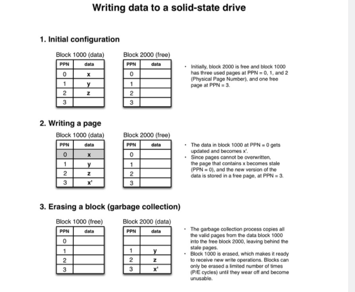
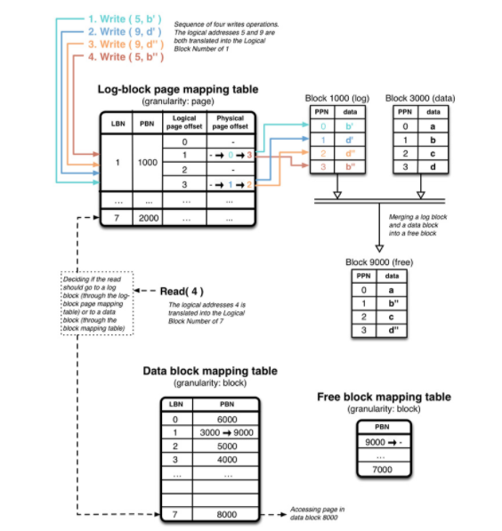

# 页面、块和缓存转换层(Flash translation layer)

[TOC]

这是6篇"为SSD编码"中的第三篇。包含3、4节。其他章节，见目录。我写的这一系列的文章是为了分享我在记录SSD中学到的，并且如何使代码在SSD上表现良好。如果你比较着急，可以直奔第6篇博文，这一篇总结了所有其他章节的内容。

在这部分，我会解释如何在页面和块这一层处理写操作，也会讨论写放大(write amplification)和wear leveling。而且，我还会介绍什么是FTL(Flash Translation Layer)，以及它的两个主要用途，逻辑块映射和垃圾回收。更具体地，我会解释混合日志块映射(log-block mapping)模式下写操作如何工作

## 3 基本操作

### 3.1 读、写、擦除

由于NAND-flash存储单元的组织方式。不可能单独地读写单个存储单元。存储以特殊的特性组织和访问。了解这些特性对优化针对固态硬盘的数据结构和理解其行为很关键。下面我将介绍SSD的读、写和擦除操作的基本特性

#### 读以页面大小对齐(Reads are aligned on page size)

一次读取不可能小于一个页面。当然可以从操作系统只请求一个字节，但是会从SSD读取整个页面，强制读取多于所必需的数据

#### 写以页面大小对齐(Writes are aligned on page size)

当写入SSD时，writes happen by increments of the page size。所以即使一个写操作只影响一个字节，也会导致一整个页面被写入。写入的数据超过必须的就被称为写放大(write amplification)，这一概念在3.3节中会介绍。此外，写入数据到页面有时称为”编程"(to program)一个页面，因此术语"写”和"编程"在大部分关于SSD的出版物和文章中可互换使用

#### 页面不能被覆盖(Pages cannot be overwritten)

一个NAND-flash 页面只有在"空闲"(free)状态下才能被写入。当数据改变时，页面的内容被拷贝到内部寄存器，然后更新数据并将新数据存入“空闲”页面，这种操作又被叫做"读-更改-写入"(read-modify-write)。数据不能在位更新（updated in-place)(注：即覆盖写入)，因为"空闲"页面不同于原来含有数据的页面(注：数据被更改后写入另一个空闲页面）。一旦数据被持久化到硬盘，原来的页面就被标记位"stale"，直到页面内容被擦除

#### 擦除以块大小对齐

页面不能被覆盖写入，一旦它们变成stale，使它们成为空闲的唯一方式就是擦除它们。然俄，不能擦除单个页面，只能一次擦除整个块。从用户的角度来看，访问数据时只能发出读和写的命令。当需要回收stale页面生成空闲空间时，由SSD控制器进行垃圾回收时会自动触发擦除命令

### 3.2 写入的例子

让我们展示一下3.1节的概念。下面的图4展示了写入数据到SSD的例子。只展示了两个数据块，每个块包含4个页面。很明显地这是个NAND-flash package的简化表示，为了我在这里展示的简化示例而创建。图中的每一步，右边的项目符号解释了正在发生的

​			图4：写数据到固态硬盘

### 3.3 写放大(Write amplification)

因为写操作以页面大小对齐，任何未对齐页面且不是页面大小整数倍的写操作将写入超过必须的量的更多数据，被称为写放大(write amplification)。写入一个字节将会导致写入整个页面，对某些类型的SSD来说可能达到16KB，效率非常低

但这并不是唯一的问题。除了写入超过必须的更多数据，这些写操作也会触发更多的超过必须的内部操作。事实上，以非对齐的方式写入数据会导致页面在修改之前读入缓存然后写回硬盘，比直接写入磁盘要慢。这个操作被称为读—写—更改(read-modify-write)，应该尽可能避免

永远不要写小于一个页面：

避免写小于NAND-flash页面大小的数据块以减小写放大(write amplification)和阻止读—写—更改操作。当前最大的页面大小是16KB，因此这是应该使用的默认值。页面大小依赖于SSD的模型，以后随着SSD的提升，你有可能需要增大这个值。

写对齐：

写以页面对齐，而且被写的数据块大小应该是页面的倍数

缓存小的写入：

为了最大化吞吐量，应该尽可能的使小的写入保留在RAM缓冲区中，当缓存满时，将批处理所有小的写入进行一次大的写入

### 3.4 wear leveling

正如1.1节讨论的，NAND-flash存储单元寿命有限由于它们有限数目的P/E周期。让我们想象一下，我们有块总是读写同一个数据块的SSD。这个块很快就会超过P/E周期限制，wear off，SSD控制器会将其标记为不可用。硬盘的总容量就会下降。想象一下你买了一个500GB的硬盘，几年之后只剩下250GB，那挺令SS人惊讶的。

处于这个原因，SSD控制器的一个主要目标是实现wear leveling，使P/E周期尽可能均匀地分部到这些块。理想情况下，所有块将同时达到它们的P/E周期限制并磨损。

为了达到最佳的wear leveling，在写入时SSD控制器需要公平的选择块，可能不得不移动某些块，这个过程会招致写放大的增加。因此，块管理就是在最大化wear leveling和最小化写放大之间取得平衡。

厂家提出了各种功能来实现wear leveling，比如下一节会讲到的垃圾回收。

## 4 闪存转换层(Flash translation layer)

### 4.1 FTL存在的必要性

采用SSD如此容易的一个主要因素是它们和HDD一样使用了相同的主机接口。虽然呈现LBA(Logical Block Addresses)阵列对HDD是有意义的，因为它们的扇区可以被重写(overwritten)，但并不完全适合闪存的工作方式（原文: Although presenting an array of LBA makes sense for HDDs as their sectors can be overwritten, it is not fully suited to the way flash memory works)。因为这个原因，就需要一个额外的组件来隐藏NAND flash memory 的内部特性并只暴露LBA阵列给主机。这个组件被称为Flash Translation Layer(FTL)，

### 4.2 逻辑块映射(logic block mapping)

逻辑块地址映射将主机空间(host space)的逻辑块地址(LBAs)转换成物理NAND-flash 内存空间的的物理块地址(physical block addresses PBA)。这个映射以表的形式出现，给出任意LBA对应的PBA。映射表存储在SSD的RAM中以提升访问速度，为了避免掉电丢失而永久存储在flash 内存(flash memory)中。当SSD上电时，映射表从永久存储版本中读入并在SSD的RAM中重新构造

一种单纯的方法是用页面级映射(page-level mapping)将任意的主机逻辑页面映射到物理页面。这种映射策略提供了极大的灵活性，但主要的缺点是映射表需要很多的内存空间，增加了生产商的成本。一种解决方案是映射块而不是页面，使用块级映射(block-level mapping)。假设一块SSD硬盘的每个块有256个页面。这就意味着块级映射需要的内存比页面级映射小256倍，对空间的利用是个巨大的提升。然俄，为避免掉电丢失，映射表仍然需要持久化到磁盘，而且为了存在许多少量更新(small updates)的情况，full blocks of flash memory will be written whereas pages would have been enough。这就增加了写放大且使得块级映射广泛的低效。

页面级映射和块级映射之间的权衡是时间和空间。一些研究者已经尝试获得两者的最佳结果，就诞生了所谓的”混合(hybrid)方法。最常见的是日志-块映射(log-block mmaping)，使用的方法类似日志结构文件系统(log-structured file systems)。到来的写操作顺序地写入日志块。当一个日志块满时，将它和关联到同一个logical block number(LBN)的数据块合并成一个空闲块。只需要维护几个块，允许页面粒度维护它们。与此相反，数据块以块粒度维护

下面的图5展示了hybrid log-block FTL的简化表示，每个块有四个页面。4个写操作需要FTL处理，所有写入都是整页大小。5和9的逻辑页面号都指向逻辑块1，而逻辑块1对应物理块号1000。初始时，在log-block 映射表的逻辑块1中的所有的物理页面偏移量都是空，并且log block 1000也是空。第一个写入操作， 在LPN=5写入b'，通过log-block 映射表解析到LBN=1，这个逻辑块关联的是物理块PBN=1000(log block 1000)。页面b' 因此写入物理块1000的偏移量0处。关于映射的元数据需要更新，因此，和逻辑偏移量1关联的物理偏移量被由空更新为0

继续写操作并对应地更新映射元数据。当log block 1000完全填满时，他将和关联到同一个逻辑块的数据块合并，也就是此处的物理块号为3000的块。这个信息（注：逻辑块对应的数据块）可以从data-block映射表提取，此表将逻辑块号映射到物理块号。合并的结果会被写到一个空闲块，此处是块9000。当合并结束时，块1000和3000都可以被擦除并成为空闲块，而块9000则成为数据块。在data-block映射表中LBN=1的元数据从初始的数据块3000更新为数据块9000

需要注意的一个重要事项就是4个写操作被集中到两个LPN。log-block方法能够隐藏合并过程中的b'和d'的操作，直接使用更新的b''和d''版本，以实现更好的写放大。

最后，如果一个读命令正在请求一个刚刚被更新的页面且页面所在的块尚未合并，页面则位于log block。否则，将在data block 找到该页面。这就是为啥读取请求需要检查log-block 映射表和data-block映射表。

​			图5 hybrid log-block FTL

log-block FTL有优化的空间，最引人注意的就是switch-merge，有时被称为swap-merge。让我们假设在逻辑块中的所有地址一次性写入。这意味着这些地址对应的新数据将会写到同一个log block。由于这个log block 包含整个逻辑块的所有数据，将这个log block 和一个data block合并成一个空闲块将变得无用，因为合并后的空闲块将和log block 含有同样的数据。只更新data block 映射表的元数据将会更快， 然后交换data block映射表中的数据块和log block，这就是switch-merge

The log-block mapping scheme has been the topic of many papers, which has lead to a series of improvements, such as FAST (Fully Associative Sector Translation), superblock mapping, and flexible group mapping [[10\]](https://codecapsule.com/2014/02/12/coding-for-ssds-part-3-pages-blocks-and-the-flash-translation-layer/#ref). There are also other mapping schemes, such as the Mitsubishi algorithm, and SSR [[9\]](https://codecapsule.com/2014/02/12/coding-for-ssds-part-3-pages-blocks-and-the-flash-translation-layer/#ref). Two great starting points to learn more about the FTL and mapping schemes are the two following papers:

- “*A Survey of Flash Translation Layer*“, Chung et al., 2009 [[9\]](https://codecapsule.com/2014/02/12/coding-for-ssds-part-3-pages-blocks-and-the-flash-translation-layer/#ref)
- “*A Reconfigurable FTL (Flash Translation Layer) Architecture for NAND Flash-Based Applications*“, Park et al., 2008 [[10\]](https://codecapsule.com/2014/02/12/coding-for-ssds-part-3-pages-blocks-and-the-flash-translation-layer/#ref)

~~~
Flash Translation Layer

Flash Translation Layer 是SSD控制器的一个组件，将主机空间的LBA(logical block address)映射为设备上的PBA(Physical Block address)。大部分现在的驱动实现一种称为"hybrid log-block mapping"的方法或其变种，工作方式类似log-structured file systems。允许像处理顺序写入一样处理随机写入
~~~

### 4.3 Notes on the state of the industry

### 4.4 垃圾回收

