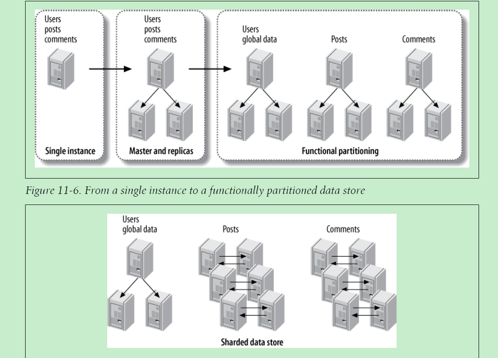

# 架构

[TOC]

架构的主要目的是确保应用能够拓展

针对电商类应用如何确保数据的伸缩性和高可用,虽然做了一段时间web后台开发，但并没有这方面的经验。所以有比较多的疑问。

* 如何确定从mysql单实例版本走向采用replication、partition或sharding的时机，一种方案是做测试得到一个基准。基准的哪些指标作为衡量的依据呢
* 如何使用redis缓存、缓存什么数据以及采用的缓存策略

### scale out(scale horizontally)

水平拓展通过增加更多的机器来提升性能

### scale up(scale vertically)

垂直拓展通过使用更好的软硬件来提升性能

## mysql

mysql 常见的伸缩策略

* replication
* partition
* sharding

这些策略也适用于一般的数据存储

### replication

使用replication 策略可以提升`read`的性能，也可以提高可用性。

### functional partition

这里的partition指functional partition, 即按功能划分数据库，比如商品和订单使用一个单独的数据库、用户数据使用一个单独的数据库。这可能就是常说的`分库`

### sharding

sharding即将数据分成多片，每片数据存放在不同的数据节点. 这可能就是常说的`分表`

《高性能mysql》的第11章-伸缩mysql ，给出了一些使用sharding的建议，总结如下:

* 若能基本确定最终会使用sharding,则尽量从一开始就按照这种架构来设计应用。使用单机的架构跟使用sharding的架构还是有相当大的区别。当然也可以逐步的演进架构

* 确定需要`分片`的数据，仅针对那些会增长到一定量级比如千万级的数据使用`分片`

* 选择一个合适的数据中间件,如vitess

* 选择合适的作为`分片`依据的`partition key`, 选择的标准是使比较重要和经常使用的查询访问尽可能少的`分片`.

* 使用多个`partition key`

* 使用`分片`一个难点就是处理需要访问多个`分片`的查询

* `分片`应该选择合适的大小，避免过大造成维护上的不便。过小可能会导致大量的表，增加跨分片访问的机率

* `分片`在数据节点的放置策略，详细的策略看下面的`分片和数据节点`

* `分片`的划分方式，静态划分和动态划分，或二者结合。建议使用`动态划分`

* rebalancing(再平衡)

  

#### 确定需要分片的数据

并非所有数据都需要分片，针对那些会增长到

#### 分片和数据节点

* 每个分片对应一个数据库，所有数据库使用相同的名称
* 来自几个不同分片的表使用一个数据库
* 每个分片对应一个数据库，并且数据库包含`application`使用的所有表。数据库名称包含shard编号
* 每个分片对应一个数据库，并且数据库和表名称都含有`分片`编号
* 每个节点运行多个实例，每个实例包含一个或多个使用上面放置策略的`分片`

#### 划分分片的方式

划分分片有以下两种方式：

* 静态划分
* 动态划分

静态划分，使用hash函数。这种方式的优势是简单；劣势如下

* 分片较大且分片数目较少时，可能导致负载不均衡

* 不能决定数据存放的分片，导致热点数据集中在某一个分片
* 调整分片数目变得困难，需要进行rehash

动态划分

创建一个`分片`和`partition key`的映射，比如创建一张表

~~~sql
create table user_to_shard(
user_id int not null,
shard_id int not null,
primary key (user_id)
)
~~~

下图展示了单实例、副本(Replication)、按功能划分(Functional partioning)以及sharding. 来源于《高性能mysql》

## redis

## 参考

* 《high performance mysql》3rd edition.  chapter 11. Scaling MySQL 

  