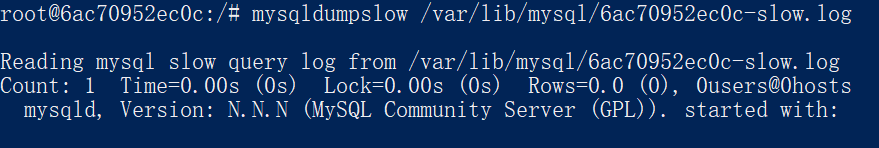

# mysql 文件

[TOC]

### 配置文件

### 错误日志

错误日志记录了mysql启动、运行、关闭过程。

### 慢查询日志

##### 记录慢查询日志的条件

* 运行时间(参数：long_query_time)

* 索引使用情况(参数：log_throttle_queries_not_using_indexes)

* **io 逻辑读取次数(参数:slow_query_type 及long_query_io), 在mysql 5.6.45 未找到这两个参数,在innoSQL中有**

  

##### 运行时间

慢查询日志记录了运行时间超过指定阈值的sql语句，阈值的值可以通过long_query_time来设置

下面的语句查看long_query_time的当前值

~~~sql
show variables like "long_query_time"// 5.1之后单位是微秒，之前是秒

show variables like "slow_query_log" //是否启用慢查询日志
show variables like "slow_query_log_file" //慢查询日志对应的文件
~~~

##### 未使用索引

也可以记录没有使用索引的sql语句，通过参数log_queries_not_using_indexes设置

5.6.5 新增参数log_throttle_queries_not_using_indexes来设置每分钟允许记录到slow log且未使用索引的sql语句的次数.默认值为0，表示没有限制。在生产环境中应该重新配置此参数

##### io

##### 分析慢查询日志

mysqldumpslow 工具可以用来分析慢查询日志

##### 慢查询日志表

从mysql 5.1 开始可以将慢查询日志放入表中，该表即mysql.slow_log

可以通过参数log_output，修改慢查询日志是写入到表还是文件。默认是文件

~~~sql
show variables like "log_output" //FILE TABLE
~~~

### 二进制日志

