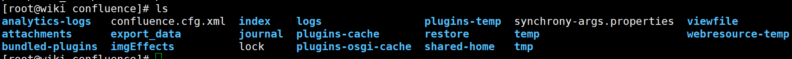
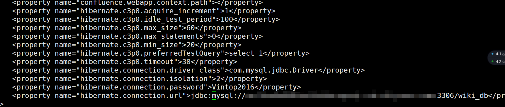

# confluence

[TOC]

公司使用confluence保存文档。confluence最初直接部署在裸机上，好像遇到过一次攻击，后面迁移到了docker。迁移的时候由于估计不足，使用的磁盘(使用的云盘)空间太小（100GB)，当时的文档占用的空间已经60多个G了。confluence有时候会导出文件备份，就会把磁盘占满。我也不得不经常去处理磁盘满的问题，由于我的原因，没有去彻底解决这个问题。

直到最近，同事不知做了什么骚操作,导致confluence容器丢失了。而自己又没有对数据进行备份，顿时就觉得如临巨坑啊:(。唯一值得庆幸的是文档数据还在云盘上，数据库也还在，可是该怎么恢复呢？

最初以为没有confluence导出的备份，恢复无望了。还好从网上找到了一篇《从其他备份恢复数据》的文章，打算试一试。结果还真的可以

## 之前的安装

最初使用的部署confluence的命令如下:

~~~shell
 docker run --name wiki -p 8093:8090 --user root:root --mount type=bind,source=/mnt/wiki_data/wiki/restore,target=/var/atlassian/confluence/restore --mount type=bind,source=/mnt/wiki_data/wiki/attachments,target=/var/atlassian/confluence/attachments --mount type=bind,source=/mnt/wiki_data/wiki/tmp,target=/var/atlassian/confluence/temp -d registry.cn-beijing.aliyuncs.com/isy/wiki:0.2
~~~

上面的命令将文档数据attachments、恢复数据用的目录restore、临时目录tmp挂载到了容器内。所以在容器丢失后，也会丢失配置文件confluence.cfg.xml

## 恢复过程

1. 重新安装confluence，会生成新的配置文件confluence.cfg.xml(容器内目录：/var/atlassian/confluence/confluence.cfg.xml)。然后将新生成的配置文件和之前的数据文件放在同一个目录下
2. 修改confluence.cfg.xml使用的数据库地址，将其修改为之前使用的数据库的地址。要修改的内容如下:

3. 重新运行容器即可

### 避免confluence.cfg.xml丢失

避免配置和数据丢失的方法就是将磁盘挂载到容器内的/var/atlassian/confluence目录下。

使用的部署confluence的命令:

~~~shell
 docker run --name wiki_recover -p 8094:8090 --user root:root --mount type=bind,source=/mnt/wiki_recover/atlassian/confluence,target=/var/atlassian/confluence --mount type=bind,source=/mnt/wiki_data/atlassian/logs,target=/opt/atlassian/confluence/logs -d registry.cn-beijing.aliyuncs.com/isy/wiki:0.2

~~~

使用上面的命令，数据和confluence.cfg.xml就一起保存到云盘上。

## 总结

* 没有/mnt/wiki_data/atlassian/confluence/confluence.cfg.xml 这个文件，应该会导致confluence重新走安装流程
* 从其他备份恢复的关键就是confluence.cfg.xml文件和 attachments文件夹，还有就是之前confluence使用的数据库
* 随时做好备份啊

## 参考

* 从其他备份恢复数据 https://www.cwiki.us/display/CONFLUENCEWIKI/Restoring+Data+from+other+Backups 