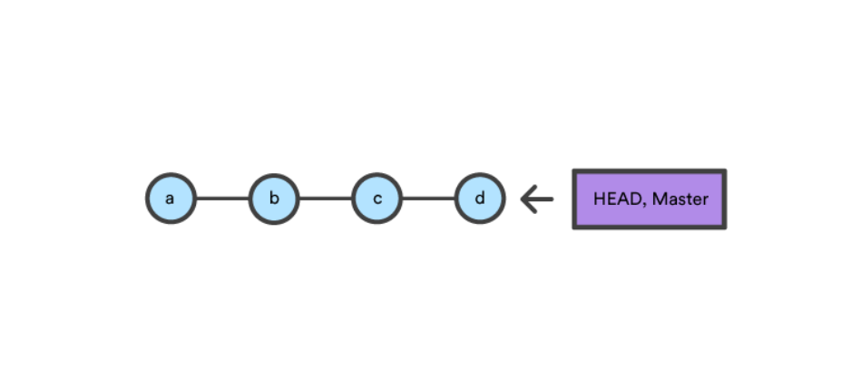
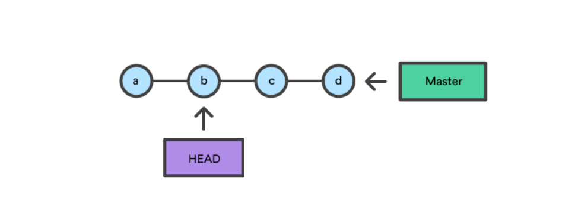
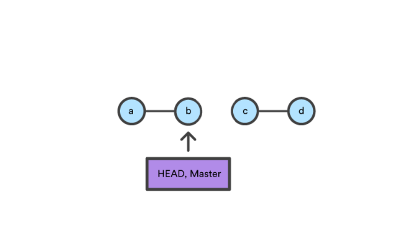
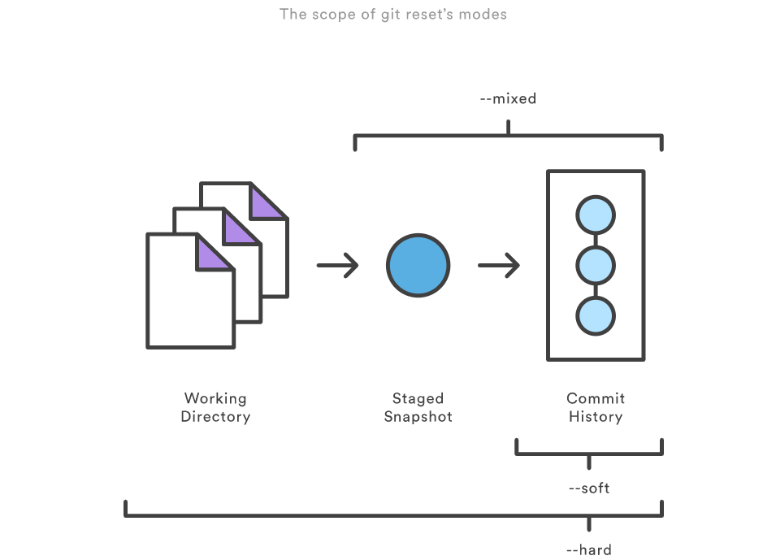
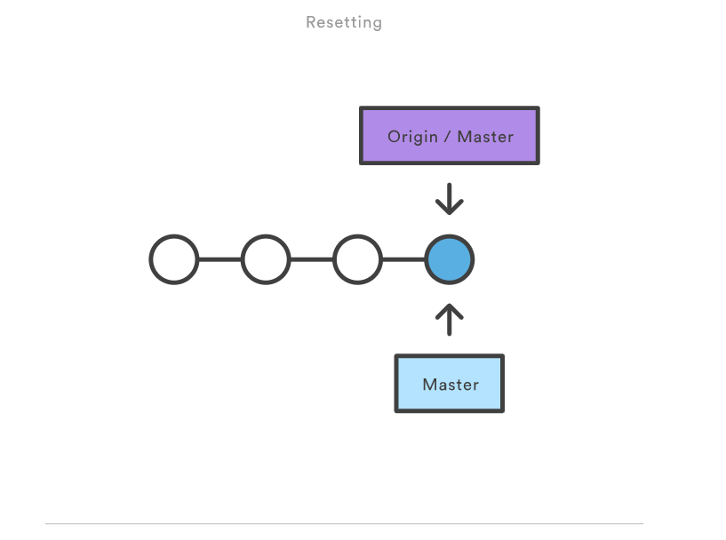
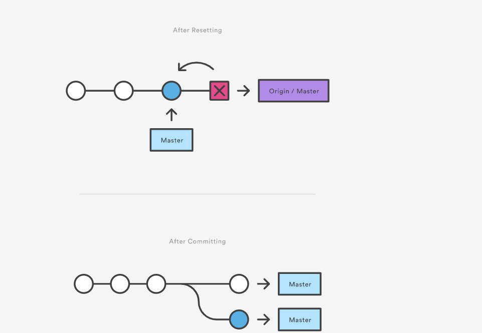

# git reset

[TOC]


[git checkout](https://www.atlassian.com/git/tutorials/undoing-changes)[git clean](https://www.atlassian.com/git/tutorials/undoing-changes/git-clean)[git revert](https://www.atlassian.com/git/tutorials/undoing-changes/git-revert)[git reset](https://www.atlassian.com/git/tutorials/undoing-changes/git-reset)[git rm](https://www.atlassian.com/git/tutorials/undoing-changes/git-reset)

The `git reset` command is a complex and versatile tool for undoing changes. It has three primary forms of invocation. These forms correspond to command line arguments `--soft, --mixed, --hard`. The three arguments each correspond to Git's three internal state management mechanism's, The Commit Tree (HEAD), The Staging Index, and The Working Directory.

## Git Reset & Three Trees of Git

To properly understand `git reset` usage, we must first understand Git's internal state management systems. Sometimes these mechanisms are called Git's "three trees". Trees may be a misnomer, as they are not strictly traditional tree data-structures. They are, however, node and pointer-based data structures that Git uses to track a timeline of edits. The best way to demonstrate these mechanisms is to create a changeset in a repository and follow it through the three trees. 

To get started we will create a new repository with the commands below:

```bash
$ mkdir git_reset_test
$ cd git_reset_test/
$ git init .
Initialized empty Git repository in /git_reset_test/.git/

$ touch reset_lifecycle_file
$ git add reset_lifecycle_file
$ git commit -m"initial commit"
[master (root-commit) d386d86] initial commit
1 file changed, 0 insertions(+), 0 deletions(-)
create mode 100644 reset_lifecycle_file
```

The above example code creates a new git repository with a single empty file, `reset_lifecycle_file`. At this point, the example repository has a single commit (`d386d86`) from adding `reset_lifecycle_file`.

### The working directory

The first tree we will examine is "The Working Directory". This tree is in sync with the local filesystem and is representative of the immediate changes made to content in files and directories.

```bash
$ echo 'hello git reset' > reset_lifecycle_file
$ git status 
On branch master 
Changes not staged for commit: 
(use "git add ..." to update what will be committed) 
(use "git checkout -- ..." to discard changes in working directory) 
modified: reset_lifecycle_file
```

In our demo repository, we modify and add some content to the `reset_lifecycle_file`. Invoking `git status` shows that Git is aware of the changes to the file. These changes are currently a part of the first tree, "The Working Directory". `Git status` can be used to show changes to the Working Directory. They will be displayed in the red with a 'modified' prefix.

### Staging index

Next up is the 'Staging Index' tree. This tree is tracking Working Directory changes, that have been promoted with `git add`, to be stored in the next commit. This tree is a complex internal caching mechanism. Git generally tries to hide the implementation details of the Staging Index from the user.

To accurately view the state of the Staging Index we must utilize a lesser known Git command `git ls-files`. The `git ls-files` command is essentially a debug utility for inspecting the state of the Staging Index tree.

```bash
git ls-files -s
100644 e69de29bb2d1d6434b8b29ae775ad8c2e48c5391 0 reset_lifecycle_file
```

<font color="green">Here we have executed `git ls-files` with the `-s` or `--stage` option. Without the `-s` option the `git ls-files` output is simply a list of file names and paths that are currently part of the index. The `-s` option displays additional metadata for the files in the Staging Index. This metadata is the staged contents' mode bits, object name, and stage number. Here we are interested in the object name, the second value (`d7d77c1b04b5edd5acfc85de0b592449e5303770`). This is a standard Git object SHA-1 hash. It is a hash of the content of the files. The Commit History stores its own object SHA's for identifying pointers to commits and refs and the Staging Index has its own object SHA's for tracking versions of files in the index.</font>

Next, we will promote the modified `reset_lifecycle_file` into the Staging Index.

```bash
$ git add reset_lifecycle_file 
$ git status 
On branch master Changes to be committed: 
(use "git reset HEAD ..." to unstage) 
modified: reset_lifecycle_file
```

Here we have invoked `git add reset_lifecycle_file` which adds the file to the Staging Index. Invoking `git status` now shows `reset_lifecycle_file` in green under "Changes to be committed". It is important to note that `git status` is not a true representation of the Staging Index. The `git status` command output displays changes between the Commit History and the Staging Index. Let us examine the Staging Index content at this point.

```bash
$ git ls-files -s
100644 d7d77c1b04b5edd5acfc85de0b592449e5303770 0 reset_lifecycle_file
```

We can see that the object SHA for `reset_lifecycle_file` has been updated from `e69de29bb2d1d6434b8b29ae775ad8c2e48c5391` to `d7d77c1b04b5edd5acfc85de0b592449e5303770`.

### Commit history

The final tree is the Commit History. The `git commit` command adds changes to a permanent snapshot that lives in the Commit History. This snapshot also includes the state of the Staging Index at the time of commit.

```
$ git commit -am"update content of reset_lifecycle_file"
[master dc67808] update content of reset_lifecycle_file
1 file changed, 1 insertion(+)
$ git status
On branch master
nothing to commit, working tree clean
```

Here we have created a new commit with a message of `"update content of resetlifecyclefile"`. The changeset has been added to the Commit History. Invoking `git status` at this point shows that there are no pending changes to any of the trees. Executing `git log` will display the Commit History. Now that we have followed this changeset through the three trees we can begin to utilize `git reset`.

## How it works

git checkout 只更新HEAD， 而git reset会更新HEAD文件和.git/refs/heads/分支文件

<font color="red">At a surface level, `git reset` is similar in behavior to `git checkout`. Where `git checkout` solely operates on the `HEAD` ref pointer, `git reset` will move the `HEAD` ref pointer and the current branch ref pointer. To better demonstrate this behavior consider the following example:</font>



This example demonstrates a sequence of commits on the `master` branch. The `HEAD` ref and `master` branch ref currently point to commit d. Now let us execute and compare, both `git checkout b` and `git reset b.`

### git checkout b



With `git checkout`, the `master` ref is still pointing to `d`. The `HEAD` ref has been moved, and now points at commit `b`. The repo is now in a 'detached `HEAD`' state.

### git reset b



Comparatively, `git reset`, moves both the `HEAD` and branch refs to the specified commit.

In addition to updating the commit ref pointers, `git reset` will modify the state of the three trees. The ref pointer modification always happens and is an update to the third tree, the Commit tree. The command line arguments `--soft, --mixed`, and `--hard` direct how to modify the Staging Index, and Working Directory trees.

## Main Options

The default invocation of `git reset` has implicit arguments of `--mixed` and `HEAD`. This means executing `git reset` is equivalent to executing `git reset --mixed HEAD`. In this form `HEAD` is the specified commit. Instead of `HEAD` any Git SHA-1 commit hash can be used.



### --hard

<font color="red">This is the most direct, DANGEROUS, and frequently used option. When passed `--hard` The Commit History ref pointers are updated to the specified commit. Then, the Staging Index and Working Directory are reset to match that of the specified commit. Any previously pending changes to the Staging Index and the Working Directory gets reset to match the state of the Commit Tree. This means any pending work that was hanging out in the Staging Index and Working Directory will be lost.</font>

To demonstrate this, let's continue with the three tree example repo we established earlier. First let's make some modifications to the repo. Execute the following commands in the example repo:

```bash
$ echo 'new file content' > new_file
$ git add new_file
$ echo 'changed content' >> reset_lifecycle_file
```

These commands have created a new file named `new_file` and added it to the repo. Additionally, the content of `reset_lifecycle_file` will be modified. With these changes in place let us now examine the state of the repo using `git status`.

```bash
$ git status
On branch master
Changes to be committed:
(use "git reset HEAD ..." to unstage)
new file: new_file

Changes not staged for commit:
(use "git add ..." to update what will be committed)
(use "git checkout -- ..." to discard changes in working directory)
modified: reset_lifecycle_file
```

We can see that there are now pending changes to the repo. The Staging Index tree has a pending change for the addition of `new_file` and the Working Directory has a pending change for the modifications to `reset_lifecycle_file`.

Before moving forward let us also examine the state of the Staging Index:

```bash
$ git ls-files -s
100644 8e66654a5477b1bf4765946147c49509a431f963 0 new_file
100644 d7d77c1b04b5edd5acfc85de0b592449e5303770 0 reset_lifecycle_file
```

We can see that `new_file` has been added to the index. We have made updates to `reset_lifecycle_file` but the Staging Index SHA (`d7d77c1b04b5edd5acfc85de0b592449e5303770`) remains the same. This is expected behavior because have not used `git add` to promote these changes to the Staging Index. These changes exist in the Working Directory.

Let us now execute a `git reset --hard` and examine the new state of the repository.

```bash
$ git reset --hard
HEAD is now at dc67808 update content of reset_lifecycle_file
$ git status
On branch master
nothing to commit, working tree clean

$ git ls-files -s
100644 d7d77c1b04b5edd5acfc85de0b592449e5303770 0 reset_lifecycle_file
```

Here we have executed a "hard reset" using the `--hard` option. Git displays output indicating that `HEAD` is pointing to the latest commit `dc67808`. Next, we check the state of the repo with `git status`. Git indicates there are no pending changes. We also examine the state of the Staging Index and see that it has been reset to a point before `new_file` was added. Our modifications to `reset_lifecycle_file` and the addition of `new_file` have been destroyed. This data loss cannot be undone, this is critical to take note of.

### --mixed

***This is the default operating mode*.** The ref pointers are updated. The Staging Index is reset to the state of the specified commit. Any changes that have been undone from the Staging Index are moved to the Working Directory. Let us continue.

```bash
$ echo 'new file content' > new_file
$ git add new_file
$ echo 'append content' >> reset_lifecycle_file
$ git add reset_lifecycle_file
$ git status
On branch master
Changes to be committed:
(use "git reset HEAD ..." to unstage)
new file: new_file
modified: reset_lifecycle_file

$ git ls-files -s
100644 8e66654a5477b1bf4765946147c49509a431f963 0 new_file
100644 7ab362db063f9e9426901092c00a3394b4bec53d 0 reset_lifecycle_file
```

In the example above we have made some modifications to the repository. Again, we have added a `new_file` and modified the contents of `reset_lifecycle_file`. These changes are then applied to the Staging Index with `git add`. With the repo in this state, we will now execute the reset.

```bash
$ git reset --mixed
$ git status
On branch master
Changes not staged for commit:
(use "git add ..." to update what will be committed)
(use "git checkout -- ..." to discard changes in working directory)
modified: reset_lifecycle_file
Untracked files:
(use "git add ..." to include in what will be committed)
new_file
no changes added to commit (use "git add" and/or "git commit -a")
$ git ls-files -s
100644 d7d77c1b04b5edd5acfc85de0b592449e5303770 0 reset_lifecycle_file
```

Here we have executed a "mixed reset". To reiterate, `--mixed` is the default mode and the same effect as executing `git reset`. Examining the output from `git status` and `git ls-files`, shows that the Staging Index has been reset to a state where `reset_lifecycle_file` is the only file in the index. The object SHA for `reset_lifecycle_file` has been reset to the previous version.

The important things to take note of here is that `git status` shows us that there are modifications to `reset_lifecycle_file` and there is an untracked file: `new_file`. This is the explicit `--mixed` behavior. The Staging Index has been reset and the pending changes have been moved into the Working Directory. Compare this to the `--hard` reset case where the Staging Index was reset and the Working Directory was reset as well, losing these updates.

### --soft

When the `--soft` argument is passed, the ref pointers are updated and the reset stops there. The Staging Index and the Working Directory are left untouched. This behavior can be hard to clearly demonstrate. Let's continue with our demo repo and prepare it for a soft reset.

```bash
$ git add reset_lifecycle_file 
$ git ls-files -s 
100644 67cc52710639e5da6b515416fd779d0741e3762e 0 reset_lifecycle_file 

$ git status 
On branch master 
Changes to be committed: 
(use "git reset HEAD ..." to unstage) 
modified: reset_lifecycle_file 

Untracked files: 
(use "git add ..." to include in what will be committed) 
new_file
```

Here we have again used `git add` to promote the modified `reset_lifecycle_file` into the Staging Index. We confirm that the index has been updated with the `git ls-files` output. The output from `git status` now displays the "Changes to be committed" in green. The `new_file` from our previous examples is floating around in the Working Directory as an untracked file. Lets quickly execute `rm new_file` to delete the file as we will not need it for the upcoming examples.

With the repository in this state we now execute a soft reset.

```bash
$ git reset --soft
$ git status
On branch master
Changes to be committed:
(use "git reset HEAD ..." to unstage)
modified: reset_lifecycle_file
$ git ls-files -s
100644 67cc52710639e5da6b515416fd779d0741e3762e 0 reset_lifecycle_file
```

We have executed a 'soft reset'. Examining the repo state with `git status` and `git ls-files` shows that nothing has changed. This is expected behavior. A soft reset will only reset the Commit History. **By default, `git reset` is invoked with `HEAD` as the target commit**. Since our Commit History was already sitting on `HEAD` and we implicitly reset to `HEAD` nothing really happened.

To better understand and utilize `--soft` we need a target commit that is not `HEAD`. We have `reset_lifecycle_file` waiting in the Staging Index. Let's create a new commit.

```bash
$ git commit -m"prepend content to reset_lifecycle_file"
```

At this point, our repo should have three commits. We will be going back in time to the first commit. To do this we will need the first commit's ID. This can be found by viewing output from `git log`.

```bash
$ git log
commit 62e793f6941c7e0d4ad9a1345a175fe8f45cb9df
Author: bitbucket 
Date: Fri Dec 1 15:03:07 2017 -0800
prepend content to reset_lifecycle_file

commit dc67808a6da9f0dec51ed16d3d8823f28e1a72a
Author: bitbucket 
Date: Fri Dec 1 10:21:57 2017 -0800
update content of reset_lifecycle_file

commit 780411da3b47117270c0e3a8d5dcfd11d28d04a4
Author: bitbucket 
Date: Thu Nov 30 16:50:39 2017 -0800
initial commit
```

Keep in mind that Commit History ID's will be unique to each system. This means the commit ID's in this example will be different from what you see on your personal machine. The commit ID we are interested in for this example is `780411da3b47117270c0e3a8d5dcfd11d28d04a4`. This is the ID that corresponds to the "initial commit". Once we have located this ID we will use it as the target for our soft reset.

Before we travel back in time lets first check the current state of the repo.

```bash
$ git status && git ls-files -s
On branch master
nothing to commit, working tree clean
100644 67cc52710639e5da6b515416fd779d0741e3762e 0 reset_lifecycle_file
```

Here we execute a combo command of `git status and ``git ls-files -s` this shows us there are pending changes to the repo and `reset_lifecycle_file` in the Staging Index is at a version of `67cc52710639e5da6b515416fd779d0741e3762e`. With this in mind lets execute a soft reset back to our first commit.

```bash
$git reset --soft 780411da3b47117270c0e3a8d5dcfd11d28d04a4
$ git status && git ls-files -s
On branch master
Changes to be committed:
(use "git reset HEAD ..." to unstage)
modified: reset_lifecycle_file
100644 67cc52710639e5da6b515416fd779d0741e3762e 0 reset_lifecycle_file
```

The code above executes a "soft reset" and also invokes the `git status` and `git ls-files` combo command, which outputs the state of the repository. We can examine the repo state output and note some interesting observations. First, `git status` indicates there are modifications to `reset_lifecycle_file` and highlights them indicating they are changes staged for the next commit. Second, the `git ls-files` input indicates that the Staging Index has not changed and retains the SHA 67cc52710639e5da6b515416fd779d0741e3762e we had earlier.

To further clarify what has happened in this reset let us examine the `git log:`

```bash
$ git log
commit 780411da3b47117270c0e3a8d5dcfd11d28d04a4
Author: bitbucket 
Date: Thu Nov 30 16:50:39 2017 -0800
initial commit
```

The log output now shows that there is a single commit in the Commit History. This helps to clearly illustrate what `--soft` has done. As with all `git reset` invocations, the first action reset takes is to reset the commit tree. Our previous examples with `--hard` and `--mixed` have both been against the `HEAD` and have not moved the Commit Tree back in time. During a soft reset, this is all that happens.

<font color="red">This may then be confusing as to why `git status` indicates there are modified files. `--soft` does not touch the Staging Index, so the updates to our Staging Index followed us back in time through the commit history. This can be confirmed by the output of `git ls-files -s` showing that the SHA for `reset_lifecycle_file` is unchanged. As a reminder, `git status` does not show the state of 'the three trees', it essentially shows a diff between them. In this case, it is displaying that the Staging Index is ahead of the changes in the Commit History as if we have already staged them.</font>

## Resetting vs Reverting

If `git revert` is a “safe” way to undo changes, you can think of `git reset` as the dangerous method. There is a real risk of losing work with `git reset`. `Git reset` will never delete a commit, however, commits can become 'orphaned' which means there is no direct path from a ref to access them. These orphaned commits can usually be found and restored using `git reflog`. Git will permanently delete any orphaned commits after it runs the internal garbage collector. By default, Git is configured to run the garbage collector every 30 days. Commit History is one of the 'three git trees' the other two, Staging Index and Working Directory are not as permanent as Commits. Care must be taken when using this tool, as it’s one of the only Git commands that have the potential to lose your work.

Whereas reverting is designed to safely undo a public commit, `git reset` is designed to undo local changes to the Staging Index and Working Directory. Because of their distinct goals, the two commands are implemented differently: resetting completely removes a changeset, whereas reverting maintains the original changeset and uses a new commit to apply the undo.

## Don't Reset Public History

You should never use `git reset ` when any snapshots after <commit> have been pushed to a public repository. After publishing a commit, you have to assume that other developers are reliant upon it.

Removing a commit that other team members have continued developing poses serious problems for collaboration. When they try to sync up with your repository, it will look like a chunk of the project history abruptly disappeared. The sequence below demonstrates what happens when you try to reset a public commit. The `origin/master` branch is the central repository’s version of your local `master` branch.






As soon as you add new commits after the reset, Git will think that your local history has diverged from `origin/master`, and the merge commit required to synchronize your repositories is likely to confuse and frustrate your team.

The point is, make sure that you’re using `git reset ` on a local experiment that went wrong—not on published changes. If you need to fix a public commit, the `git revert` command was designed specifically for this purpose.

## Examples

```
git reset <file>
```

Remove the specified file from the staging area, but leave the working directory unchanged. This unstages a file without overwriting any changes.

```
git reset
```

Reset the staging area to match the most recent commit, but leave the working directory unchanged. This unstages all files without overwriting any changes, giving you the opportunity to re-build the staged snapshot from scratch.

```
git reset --hard
```

Reset the staging area and the working directory to match the most recent commit. In addition to unstaging changes, the `--hard` flag tells Git to overwrite all changes in the working directory, too. Put another way: this obliterates all uncommitted changes, so make sure you really want to throw away your local developments before using it.

```
git reset <commit> 
```

Move the current branch tip backward to `commit`, reset the staging area to match, but leave the working directory alone. All changes made since ` `will reside in the working directory, which lets you re-commit the project history using cleaner, more atomic snapshots.

```
git reset --hard <commit> 
```

Move the current branch tip backward to ` ` and reset both the staging area and the working directory to match. This obliterates not only the uncommitted changes, but all commits after, as well.

## Unstaging a file

The `git reset` command is frequently encountered while preparing the staged snapshot. The next example assumes you have two files called `hello.py` and `main.py` that you’ve already added to the repository.

```
# Edit both hello.py and main.py
# Stage everything in the current directory
git add .
# Realize that the changes in hello.py and main.py
# should be committed in different snapshots
# Unstage main.py
git reset main.py
# Commit only hello.py
git commit -m "Make some changes to hello.py"
# Commit main.py in a separate snapshot
git add main.py
git commit -m "Edit main.py"
```

As you can see, `git reset` helps you keep your commits highly-focused by letting you unstage changes that aren’t related to the next commit.

## Removing Local Commits

The next example shows a more advanced use case. It demonstrates what happens when you’ve been working on a new experiment for a while, but decide to completely throw it away after committing a few snapshots.

```
# Create a new file called `foo.py` and add some code to it
# Commit it to the project history
git add foo.py
git commit -m "Start developing a crazy feature"
# Edit `foo.py` again and change some other tracked files, too
# Commit another snapshot
git commit -a -m "Continue my crazy feature"
# Decide to scrap the feature and remove the associated commits
git reset --hard HEAD~2
```

The `git reset HEAD~2` command moves the current branch backward by two commits, effectively removing the two snapshots we just created from the project history. Remember that this kind of reset should only be used on unpublished commits. Never perform the above operation if you’ve already pushed your commits to a shared repository.

## Summary

To review, `git reset` is a powerful command that is used to undo local changes to the state of a Git repo. `Git reset` operates on "The Three Trees of Git". These trees are the Commit History (`HEAD`), the Staging Index, and the Working Directory. There are three command line options that correspond to the three trees. The options `--soft, --mixed`, and `--hard` can be passed to `git reset`.

In this article we leveraged several other Git commands to help demonstrate the reset processes. Learn more about those commands on their individual pages at: `git status, git log, git add, git checkout, git reflog,` and `git revert`.

Ready to learn git reset?

Try this interactive tutorial.

[Get started now](https://www.atlassian.com/git/tutorials/learn-undoing-changes-with-bitbucket)


##### Next up:

#### Git RM

[START NEXT TUTORIAL](https://www.atlassian.com/git/tutorials/undoing-changes/git-rm)