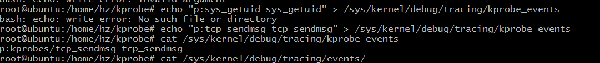

# ebpf

[TOC]

### 注意事项

ebpf代码不能使用string.h中的函数

### helpers

#### kernel

map相关函数的头文件/usr/include/linux/bpf.h

bpf_map_update_elem

~~~
int bpf_map_update_elem(struct bpf_map *map, const void *key, const void *value, u64 flags)
 *      Description
 *              Add or update the value of the entry associated to *key* in
 *              *map* with *value*. *flags* is one of:
 *
 *              **BPF_NOEXIST**
 *                      The entry for *key* must not exist in the map.
 *              **BPF_EXIST**
 *                      The entry for *key* must already exist in the map.
 *              **BPF_ANY**
 *                      No condition on the existence of the entry for *key*.
 *
 *              Flag value **BPF_NOEXIST** cannot be used for maps of types
 *              **BPF_MAP_TYPE_ARRAY** or **BPF_MAP_TYPE_PERCPU_ARRAY**  (all
 *              elements always exist), the helper would return an error.
 *      Return
 *              0 on success, or a negative error in case of failure.
~~~

bpf_map_lookup_elem

~~~
* void *bpf_map_lookup_elem(struct bpf_map *map, const void *key)
 *      Description
 *              Perform a lookup in *map* for an entry associated to *key*.
 *      Return
 *              Map value associated to *key*, or **NULL** if no entry was
 *              found.
~~~

## 调试工具

bpf_printk 用来输出信息，用法类似printf。bpf_printk实际是bpf_trace_printk的封装。bpf_trace_printk的输出信息可通过/sys/kernel/debug/tracing/trace_pipe查看

bpf_printk的详细介绍:https://nakryiko.com/posts/bpf-tips-printk/

#### userspace

### 拨测

* 如何将满足特征条件的包交给应用层继续处理
* ebpf内核代码如何获取应用层的特征包规则(如url)

### 常用命令

加载 

~~~bash
ip link set dev lo xdpgeneric obj xdp_pass_kern.o sec xdp
~~~

卸载

~~~
ip link set dev lo xdpgeneric off

~~~

## xdp

~~~go
package main

import(
	"fmt"
	"net"
	"time"

	"github.com/vishvananda/netlink"
	"github.com/cilium/ebpf"

)

func main(){
	spec, err := ebpf.LoadCollectionSpec("xdp_tcp.o")
	if err != nil{
		panic(err)
	}

	var objs struct {
		Prog  *ebpf.Program `ebpf:"xdp_parser_func"`
		Stats *ebpf.Map     `ebpf:"xdp_five_tuples"`
	}

	if err := spec.LoadAndAssign(&objs, nil); err != nil {
		panic(err)
	}
	defer objs.Prog.Close()
	defer objs.Stats.Close()

	lo, err := netlink.LinkByName("lo")
	if err != nil{
		panic(err)
	}

	if err := netlink.LinkSetXdpFd(lo, objs.Prog.FD()); err != nil{
		panic(err)
	}

	for {
		time.Sleep(time.Second)
		iter := objs.Stats.Iterate()
		if iter == nil{
			fmt.Printf("iter is nil\n")
			break
		}
		key := uint64(0)
		value := struct{
			Addr uint32
			Port uint32
		}{
		}
		for iter.Next(&key, &value){
			fmt.Printf("%v %v\n", key, value)
			srcPort :=  uint16(key >> 32)
			srcAddr := uint32(key & 0xffffffff)
			addr, port := convertIPPort(srcAddr, srcPort)
			daddr, dport := convertIPPort(value.Addr, uint16(value.Port))
			fmt.Printf("<%s:%d %s:%d>\n", addr, port, daddr, dport)	
		}
	}

}

func convertIPPort(ip uint32, port uint16)(string, uint16){
	//port := uint16(6323)
	//ip := uint32(2080417984)
	bytes := make([]byte, 4)
	for i := 0; i < 4;i++{
		b := byte(ip & 0xff)
		ip = ip >> 8
		bytes[i] = b
	}
	l := port & 0xff
	port = (l << 8) | (port  >> 8)
	p := net.IPv4(bytes[0], bytes[1], bytes[2], bytes[3])
	//fmt.Printf("%s:%d\n", p.String(), port)
	return p.String(), port
}
~~~

~~~go
/* SPDX-License-Identifier: GPL-2.0 */
#include <stddef.h>
#include <linux/bpf.h>
#include <linux/in.h>
#include <linux/if_ether.h>
#include <linux/if_packet.h>
#include <linux/ipv6.h>
#include <linux/ip.h>
#include <linux/tcp.h>
#include <linux/icmpv6.h>
#include <bpf/bpf_helpers.h>
#include <bpf/bpf_endian.h>
/* Defines xdp_stats_map from packet04 */
#include "../common/xdp_stats_kern_user.h"
#include "../common/xdp_stats_kern.h"

#define MAX_FIVE_TUPLES 1024
/* Header cursor to keep track of current parsing position */
struct hdr_cursor {
	void *pos;
};

struct port_pair{
	__u16 src;
	__u16 dest;
};

struct kv_pair {
	__u32 addr;
	__u32 port;	
};

struct ip_pair{
	__u32 saddr;
	__u32 daddr;
};

/* Keeps stats per (enum) xdp_action */
struct bpf_map_def SEC("maps") xdp_five_tuples = {
	.type        = BPF_MAP_TYPE_HASH,
      	.key_size    = sizeof(__u64),
	.value_size  = sizeof(struct kv_pair),
	.max_entries = MAX_FIVE_TUPLES,
};

/* Packet parsing helpers.
 *
 * Each helper parses a packet header, including doing bounds checking, and
 * returns the type of its contents if successful, and -1 otherwise.
 *
 * For Ethernet and IP headers, the content type is the type of the payload
 * (h_proto for Ethernet, nexthdr for IPv6), for ICMP it is the ICMP type field.
 * All return values are in host byte order.
 */
static __always_inline int parse_ethhdr(struct hdr_cursor *nh,
					void *data_end,
					struct ethhdr **ethhdr)
{
	struct ethhdr *eth = nh->pos;
	int hdrsize = sizeof(*eth);

	/* Byte-count bounds check; check if current pointer + size of header
	 * is after data_end.
	 */
	//if (nh->pos + 1 > data_end)
	if (eth + 1 > data_end)
		return -1;

	nh->pos += hdrsize;
	*ethhdr = eth;

	return eth->h_proto; /* network-byte-order */
}

/* Assignment 2: Implement and use this */
static __always_inline int parse_iphdr(struct hdr_cursor *nh,
					void *data_end,
					struct iphdr **iphdr, struct ip_pair *addrs)
{
	struct iphdr *ip = nh->pos;
	int hdrsize = sizeof(*ip);
	
	//bounds check
	if (ip + 1 > data_end)
		return -1;

	nh->pos += hdrsize;
	*iphdr = ip;
	addrs->saddr = ip->saddr;
	addrs->daddr = ip->daddr;

	return ip->protocol;
}

/*
 * pase_tcphdr parse sorce port and destination port
 * 
 */
static __always_inline int parse_tcphdr(struct hdr_cursor *nh,
					void *data_end,
					 struct port_pair *ports)
{
	struct tcphdr *tcp = nh->pos;
	int hdrsize = sizeof(*tcp);
	
	//bounds check
	if (tcp + 1 > data_end)
		return -1;

	nh->pos += hdrsize;
	//*tcphdr = tcp;

	ports->src = tcp->source;
	ports->dest = tcp->dest;
	return 0;
}

/* Assignment 2: Implement and use this */
/*static __always_inline int parse_ip6hdr(struct hdr_cursor *nh,
					void *data_end,
					struct ipv6hdr **ip6hdr)
{
}*/

/* Assignment 3: Implement and use this */
/*static __always_inline int parse_icmp6hdr(struct hdr_cursor *nh,
					  void *data_end,
					  struct icmp6hdr **icmp6hdr)
{
}*/

/* Assignment 3: Implement and use this */
/*
static __always_inline int parse_icmp6hdr(struct hdr_cursor *nh,
					  void *data_end,
					  struct icmp6hdr **icmp6hdr)
{
}
*/

/* Assignment 3: Implement and use this */
/*static __always_inline int parse_tcp(struct hdr_cursor *nh,
					  void *data_end,
					  struct icmp6hdr **icmp6hdr)
{
}*/

SEC("xdp_packet_parser")
int  xdp_parser_func(struct xdp_md *ctx)
{
	void *data_end = (void *)(long)ctx->data_end;
	void *data = (void *)(long)ctx->data;
	struct ethhdr *eth;
	struct iphdr *ip;
	struct port_pair ports;
	struct ip_pair addrs;
	struct kv_pair kv ;
	__u64 key = 0;
	

	/* Default action XDP_PASS, imply everything we couldn't parse, or that
	 * we don't want to deal with, we just pass up the stack and let the
	 * kernel deal with it.
	 */
	__u32 action = XDP_PASS; /* Default action */

        /* These keep track of the next header type and iterator pointer */
	struct hdr_cursor nh;
	int nh_type;

	/*
	const int icmp = 1;
	const int icmpv6 = 58;
	*/
	const int tcp = 6;
	/* Start next header cursor position at data start */
	nh.pos = data;

	/* Packet parsing in steps: Get each header one at a time, aborting if
	 * parsing fails. Each helper function does sanity checking (is the
	 * header type in the packet correct?), and bounds checking.
	 */
	nh_type = parse_ethhdr(&nh, data_end, &eth);
	if (nh_type != bpf_htons(ETH_P_IP))
		goto out;
	
	/*
	 * drop icmp packet
	nh_type = parse_iphdr(&nh, data_end, &ip);
	if (nh_type != icmp && nh_type != icmpv6)
		goto out;
	*/
	
	
	nh_type = parse_iphdr(&nh, data_end, &ip, &addrs);
	if (nh_type == tcp){
		if (0 == parse_tcphdr(&nh, data_end, &ports)){
			key = ports.src;
			key = (key <<32) | addrs.saddr;
			kv.port = ports.dest;
			kv.addr = addrs.daddr;
			bpf_map_update_elem(&xdp_five_tuples, &key, &kv, BPF_ANY);
		}
	}	

	/* Assignment additions go below here */

	//action = XDP_DROP;
out:
	return xdp_stats_record_action(ctx, action); /* read via xdp_stats */
}

char _license[] SEC("license") = "GPL";

~~~

### 挂载(attach)

### 参考

* github.com/vishvananda/netlink
* github.com/cilium/ebpf
* xdp-tutorial

### 疑问

xdp 只能挂载到设备上么

## kprobe

在内核树下面编译步骤:

* make menuconfig
* make prepare
* make M=samples/bpf 编译指定模块

~~~c

//#include <linux/types.h>
#include <uapi/linux/ptrace.h>
#include <net/sock.h>
//#include <stddef.h>
#include <linux/bpf.h>
#include <uapi/linux/bpf.h>
#include "bpf_helpers.h"
//#include <bpf/bpf_helpers.h>
//#include <bpf/bpf_endian.h>

#define MAX_FIVE_TUPLES 1024
struct ipv4_key_t {
    u32 pid;
    u32 saddr;
    u32 daddr;
    u16 lport;
    u16 dport;
};

//BPF_HASH(ipv4_send_bytes, struct ipv4_key_t);
//BPF_HASH(ipv4_recv_bytes, struct ipv4_key_t);

/*
struct ipv6_key_t {
    unsigned __int128 saddr;
    unsigned __int128 daddr;
    u32 pid;
    u16 lport;
    u16 dport;
    __u64 __pad__;
};
*/

/* Keeps stats per (enum) xdp_action */
struct bpf_map_def SEC("maps") ipv4_table = {
	.type        = BPF_MAP_TYPE_HASH,
      	.key_size    = sizeof(struct ipv4_key_t),
	.value_size  = sizeof(u32),
	.max_entries = 1000,
};

/*
struct bpf_map_def SEC("maps") ipv6_table = {
	.type        = BPF_MAP_TYPE_HASH,
      	.key_size    = sizeof(struct ipv6_key_t),
	.value_size  = sizeof(u32),
	.max_entries = MAX_FIVE_TUPLES,
};
*/
//BPF_HASH(ipv6_send_bytes, struct ipv6_key_t);
//BPF_HASH(ipv6_recv_bytes, struct ipv6_key_t);

SEC("kprobe/tcp_sendmsg")

//int kprobe__tcp_sendmsg(struct pt_regs *ctx, struct sock *sk,
//   struct msghdr *msg, size_t size)
int kprobe__tcp_sendmsg(struct pt_regs *ctx)
{
	char msg[] = "hello tcp_sendmsg:%d";
	//u64 pid = bpf_get_current_pid_tgid();
    struct sock *sk = (struct sock*)PT_REGS_PARM1(ctx);
    u32 pid = 0;
    u16 dport = 0;
    u16 family;
    int ret;
    struct ipv4_key_t key={ .pid = 1};
    //ret = bpf_map_update_elem(&ipv4_table, &key, &pid, BPF_ANY);
    //bpf_trace_printk(msg, sizeof(msg), ret);
    ret = bpf_probe_read(&family, sizeof(family), &sk->__sk_common.skc_family);
    if (ret){
	    return 0;
    }
    if (family == AF_INET) {
        struct ipv4_key_t ipv4_key = {.pid = pid};
        //bpf_ipv4_key.saddr = sk->__sk_common.skc_rcv_saddr;
        ret = bpf_probe_read(&ipv4_key.saddr, sizeof(ipv4_key.saddr), &sk->__sk_common.skc_rcv_saddr);
	if (ret){
		return 0;
	}
	ret = bpf_probe_read(&ipv4_key.daddr, sizeof(ipv4_key.daddr), &sk->__sk_common.skc_daddr);
	if (ret){
		return 0;
	}
        ret = bpf_probe_read(&ipv4_key.lport, sizeof(ipv4_key.lport),  &sk->__sk_common.skc_num);
	if (ret){
		return 0;
	}
        //dport = sk->__sk_common.skc_dport;
	ret = bpf_probe_read(&ipv4_key.dport, sizeof( ipv4_key.dport), &sk->__sk_common.skc_dport);
	if (ret){
		return 0;
	}

        //ipv4_send_bytes.increment(ipv4_key, size);
	bpf_map_update_elem(&ipv4_table, &ipv4_key, &pid, BPF_ANY);
    }

    /*
    else if (family == AF_INET6) {

        struct ipv6_key_t ipv6_key = {.pid = pid};
        bpf_probe_read_kernel(&ipv6_key.saddr, sizeof(ipv6_key.saddr),
            &sk->__sk_common.skc_v6_rcv_saddr.in6_u.u6_addr32);
        bpf_probe_read_kernel(&ipv6_key.daddr, sizeof(ipv6_key.daddr),
            &sk->__sk_common.skc_v6_daddr.in6_u.u6_addr32);
        ipv6_key.lport = sk->__sk_common.skc_num;
        dport = sk->__sk_common.skc_dport;
        ipv6_key.dport = ntohs(dport);

        //ipv6_send_bytes.increment(ipv6_key, size);
	bpf_map_update_elem(&ipv6_table, &ipv6_key, NULL, BPF_ANY);
    }
    */
    // else drop
    return 0;
}
/*
 * tcp_recvmsg() would be obvious to trace, but is less suitable because:
 * - we'd need to trace both entry and return, to have both sock and size
 * - misses tcp_read_sock() traffic
 * we'd much prefer tracepoints once they are available.
 */

//static __always_inline 
//int kprobe__tcp_cleanup_rbuf(struct pt_regs *ctx, struct sock *sk, int copied)
/*
SEC("kprobe/tcp_cleanup_rbuf")
int kprobe__tcp_cleanup_rbuf(struct pt_regs *ctx )
{
    if (container_should_be_filtered()) {
        return 0;
    }
    u32 pid = bpf_get_current_pid_tgid() >> 32;
    FILTER_PID

   struct sock *sk = (void*)PT_REGS_PARM1(ctx);
   int copied = (int)PT_REGS_PARM2(ctx);
   u32 pid = 0;
    u16 dport = 0, family = sk->__sk_common.skc_family;
    __u64 *val, zero = 0;
    if (copied <= 0)
        return 0;
    if (family == AF_INET) {
        struct ipv4_key_t ipv4_key = {.pid = pid};
        ipv4_key.saddr = sk->__sk_common.skc_rcv_saddr;
        ipv4_key.daddr = sk->__sk_common.skc_daddr;
        ipv4_key.lport = sk->__sk_common.skc_num;
        dport = sk->__sk_common.skc_dport;
        ipv4_key.dport = ntohs(dport);
        //ipv4_recv_bytes.increment(ipv4_key, copied);
	bpf_map_update_elem(&ipv4_table, &ipv4_key, &pid, BPF_ANY);
    } 
    else if (family == AF_INET6) {
        struct ipv6_key_t ipv6_key = {.pid = pid};
        bpf_probe_read_kernel(&ipv6_key.saddr, sizeof(ipv6_key.saddr),
            &sk->__sk_common.skc_v6_rcv_saddr.in6_u.u6_addr32);
        bpf_probe_read_kernel(&ipv6_key.daddr, sizeof(ipv6_key.daddr),
            &sk->__sk_common.skc_v6_daddr.in6_u.u6_addr32);
        ipv6_key.lport = sk->__sk_common.skc_num;
        dport = sk->__sk_common.skc_dport;
        ipv6_key.dport = ntohs(dport);

	bpf_map_update_elem(&ipv6_table, &ipv6_key, NULL, BPF_ANY);
        //ipv6_recv_bytes.increment(ipv6_key, copied);
    }
    // else drop
    return 0;
}
*/

char _license[] SEC("license") = "GPL";

~~~

### 挂载（attach)

##### load_and_attach

load_and_attach 定义在 samples/bpf/bpf_load.c 中，用于挂载kprobe。

* 将被kprobe跟踪的`事件名称`追加到 /sys/kernel/debug/tracing/kprobe_events 文件中，`事件名称`的具体格式见代码
* 从文件 /sys/kernel/debug/tracing/events/kprobes/$event_prefix_$event/id，读取一个ID。该id用来设置perf_event_attr.id字段。在
* 调用系统调用perf_event_open

~~~c
static int load_and_attach(const char *event, struct bpf_insn *prog, int size)
{
	bool is_socket = strncmp(event, "socket", 6) == 0;
	bool is_kprobe = strncmp(event, "kprobe/", 7) == 0;
	bool is_kretprobe = strncmp(event, "kretprobe/", 10) == 0;
	bool is_tracepoint = strncmp(event, "tracepoint/", 11) == 0;
	bool is_raw_tracepoint = strncmp(event, "raw_tracepoint/", 15) == 0;
	bool is_xdp = strncmp(event, "xdp", 3) == 0;
	bool is_perf_event = strncmp(event, "perf_event", 10) == 0;
	bool is_cgroup_skb = strncmp(event, "cgroup/skb", 10) == 0;
	bool is_cgroup_sk = strncmp(event, "cgroup/sock", 11) == 0;
	bool is_sockops = strncmp(event, "sockops", 7) == 0;
	bool is_sk_skb = strncmp(event, "sk_skb", 6) == 0;
	bool is_sk_msg = strncmp(event, "sk_msg", 6) == 0;
	size_t insns_cnt = size / sizeof(struct bpf_insn);
	enum bpf_prog_type prog_type;
	char buf[256];
	int fd, efd, err, id;
	struct perf_event_attr attr = {};

	attr.type = PERF_TYPE_TRACEPOINT;
	attr.sample_type = PERF_SAMPLE_RAW;
	attr.sample_period = 1;
	attr.wakeup_events = 1;

	if (is_socket) {
		prog_type = BPF_PROG_TYPE_SOCKET_FILTER;
	} else if (is_kprobe || is_kretprobe) {
		prog_type = BPF_PROG_TYPE_KPROBE;
	} else if (is_tracepoint) {
		prog_type = BPF_PROG_TYPE_TRACEPOINT;
	} else if (is_raw_tracepoint) {
		prog_type = BPF_PROG_TYPE_RAW_TRACEPOINT;
	} else if (is_xdp) {
		prog_type = BPF_PROG_TYPE_XDP;
	} else if (is_perf_event) {
		prog_type = BPF_PROG_TYPE_PERF_EVENT;
	} else if (is_cgroup_skb) {
		prog_type = BPF_PROG_TYPE_CGROUP_SKB;
	} else if (is_cgroup_sk) {
		prog_type = BPF_PROG_TYPE_CGROUP_SOCK;
	} else if (is_sockops) {
		prog_type = BPF_PROG_TYPE_SOCK_OPS;
	} else if (is_sk_skb) {
		prog_type = BPF_PROG_TYPE_SK_SKB;
	} else if (is_sk_msg) {
		prog_type = BPF_PROG_TYPE_SK_MSG;
	} else {
		printf("Unknown event '%s'\n", event);
		return -1;
	}

	if (prog_cnt == MAX_PROGS)
		return -1;

	fd = bpf_load_program(prog_type, prog, insns_cnt, license, kern_version,
			      bpf_log_buf, BPF_LOG_BUF_SIZE);
	if (fd < 0) {
		printf("bpf_load_program() err=%d\n%s", errno, bpf_log_buf);
		return -1;
	}

	prog_fd[prog_cnt++] = fd;

	if (is_xdp || is_perf_event || is_cgroup_skb || is_cgroup_sk)
		return 0;

	if (is_socket || is_sockops || is_sk_skb || is_sk_msg) {
		if (is_socket)
			event += 6;
		else
			event += 7;
		if (*event != '/')
			return 0;
		event++;
		if (!isdigit(*event)) {
			printf("invalid prog number\n");
			return -1;
		}
		return populate_prog_array(event, fd);
	}

	if (is_raw_tracepoint) {
		efd = bpf_raw_tracepoint_open(event + 15, fd);
		if (efd < 0) {
			printf("tracepoint %s %s\n", event + 15, strerror(errno));
			return -1;
		}
		event_fd[prog_cnt - 1] = efd;
		return 0;
	}
	//若是kprobe/tcp_sendmsg
	

	if (is_kprobe || is_kretprobe) {
		bool need_normal_check = true;
		const char *event_prefix = "";

		//event 指向tcp_sendmsg
		if (is_kprobe)
			event += 7;
		else
			event += 10;

		if (*event == 0) {
			printf("event name cannot be empty\n");
			return -1;
		}

		if (isdigit(*event))
			return populate_prog_array(event, fd);

		// 
#ifdef __x86_64__
		if (strncmp(event, "sys_", 4) == 0) {
			snprintf(buf, sizeof(buf), "%c:__x64_%s __x64_%s",
				is_kprobe ? 'p' : 'r', event, event);
			err = write_kprobe_events(buf);
			if (err >= 0) {
				need_normal_check = false;
				event_prefix = "__x64_";
			}
		}
#endif
		//  /sys/kernel/debug/tracing/kprobe_events 是一个文件
		// 将 p:tcp_sendmsg tcp_sendmsg 追加到该文件
		
		if (need_normal_check) {
			snprintf(buf, sizeof(buf), "%c:%s %s",
				is_kprobe ? 'p' : 'r', event, event);
			err = write_kprobe_events(buf);
			if (err < 0) {
				printf("failed to create kprobe '%s' error '%s'\n",
				       event, strerror(errno));
				return -1;
			}
		}

		//buf的内容:  /sys/kernel/debug/tracing/events/kprobes/tcp_senmsg/id
		strcpy(buf, DEBUGFS);
		strcat(buf, "events/kprobes/");
		strcat(buf, event_prefix);
		strcat(buf, event);
		strcat(buf, "/id");
	} else if (is_tracepoint) {
		event += 11;

		if (*event == 0) {
			printf("event name cannot be empty\n");
			return -1;
		}
		strcpy(buf, DEBUGFS);
		strcat(buf, "events/");
		strcat(buf, event);
		strcat(buf, "/id");
	}

	efd = open(buf, O_RDONLY, 0);
	if (efd < 0) {
		printf("failed to open event %s\n", event);
		return -1;
	}

	err = read(efd, buf, sizeof(buf));
	if (err < 0 || err >= sizeof(buf)) {
		printf("read from '%s' failed '%s'\n", event, strerror(errno));
		return -1;
	}

	close(efd);

	buf[err] = 0;
	id = atoi(buf);
	attr.config = id;

	efd = sys_perf_event_open(&attr, -1/*pid*/, 0/*cpu*/, -1/*group_fd*/, 0);
	if (efd < 0) {
		printf("event %d fd %d err %s\n", id, efd, strerror(errno));
		return -1;
	}
	event_fd[prog_cnt - 1] = efd;
	err = ioctl(efd, PERF_EVENT_IOC_ENABLE, 0);
	if (err < 0) {
		printf("ioctl PERF_EVENT_IOC_ENABLE failed err %s\n",
		       strerror(errno));
		return -1;
	}
	err = ioctl(efd, PERF_EVENT_IOC_SET_BPF, fd);
	if (err < 0) {
		printf("ioctl PERF_EVENT_IOC_SET_BPF failed err %s\n",
		       strerror(errno));
		return -1;
	}

	return 0;
}

~~~

### 遇到的问题

写入"p:sys_get_uid sys_get_uid" 到文件时 /sys/kernel/debug/tracing/kprobe_events ，出现"No such file or directory"。开始以为是文件 /sys/kernel/debug/tracing/kprobe_events 不存在导致的，但是发现该文件确实存在，就有点迷惑了。后面尝试将"p:tcp_sendmsg tcp_sendmsg"写入时，写入成功。说明写入该文件的内容应该和内核暴露的跟踪点有关，每种跟踪点的格式可能不同

### 参考

* 内核源码 samples/bpf/bpf_load.c