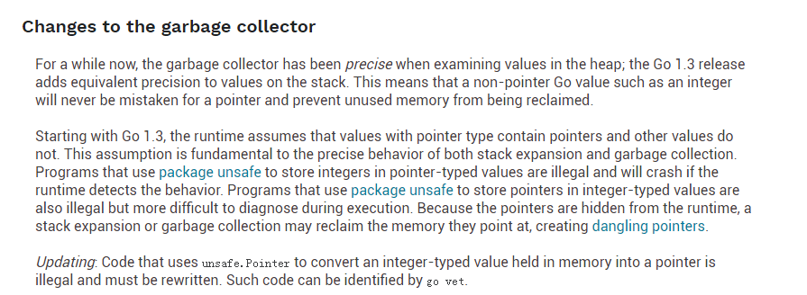
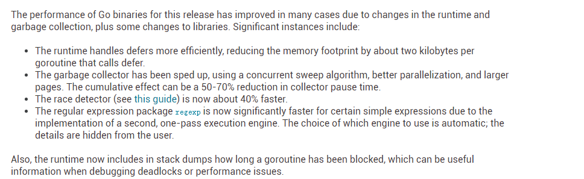

# go的进化史

[TOC]

### go1

### go1.1

### go1.2

### go1.3

##### stack

协程使用的栈模型由"分段"模型(segemented model)改为"连续"模型(contiguos model)

##### GC

##### map 迭代

在go1.1和1.2版本中，map的元素个数小于等于8时，迭代顺序是非随机的。在1.3中无论map元素个数是多少，迭代顺序都是随机的

##### 性能

### go1.4

#### 语言

##### for-range loop

在1.3及之前版本，for-range loop有两种形式

~~~go
//第一种
for i, v := range x{
    ...
}

//第二种
for i := range x{
    ...
}
~~~

在1.4版本中新增了下面的形式:

~~~go
for range x{
    
}
~~~

##### Method calls on **T

假定以下声明

~~~
type T int
func (T) M(){}
var x **T
~~~

以下调用方式不再合法：

~~~
x.M()
~~~

#### 语言实现及runtime

* runtime的大部分采用go重写
* 重写之后gc更加精确
* stack不再采用分段方式(segement),而采用连续的模式。初始的栈大小从8KB缩减为2KB
* 使用新的gc之后，写指针以write barrier的形式
* interface的实现

Prior to Go 1.4, the runtime (garbage collector, concurrency support, interface management, maps, slices, strings, ...) was mostly written in C, with some assembler support. In 1.4, much of the code has been translated to Go so that the garbage collector can scan the stacks of programs in the runtime and get accurate information about what variables are active. This change was large but should have no semantic effect on programs.

This rewrite allows the garbage collector in 1.4 to be fully precise, meaning that it is aware of the location of all active pointers in the program. This means the heap will be smaller as there will be no false positives keeping non-pointers alive. Other related changes also reduce the heap size, which is smaller by 10%-30% overall relative to the previous release.

A consequence is that stacks are no longer segmented, eliminating the "hot split" problem. When a stack limit is reached, a new, larger stack is allocated, all active frames for the goroutine are copied there, and any pointers into the stack are updated. Performance can be noticeably better in some cases and is always more predictable. Details are available in [the design document](https://golang.org/s/contigstacks).

The use of contiguous stacks means that stacks can start smaller without triggering performance issues, so the default starting size for a goroutine's stack in 1.4 has been reduced from 8192 bytes to 2048 bytes.

As preparation for the concurrent garbage collector scheduled for the 1.5 release, writes to pointer values in the heap are now done by a function call, called a write barrier, rather than directly from the function updating the value. In this next release, this will permit the garbage collector to mediate writes to the heap while it is running. This change has no semantic effect on programs in 1.4, but was included in the release to test the compiler and the resulting performance.

The implementation of interface values has been modified. In earlier releases, the interface contained a word that was either a pointer or a one-word scalar value, depending on the type of the concrete object stored. This implementation was problematical for the garbage collector, so as of 1.4 interface values always hold a pointer. In running programs, most interface values were pointers anyway, so the effect is minimal, but programs that store integers (for example) in interfaces will see more allocations.

As of Go 1.3, the runtime crashes if it finds a memory word that should contain a valid pointer but instead contains an obviously invalid pointer (for example, the value 3). Programs that store integers in pointer values may run afoul of this check and crash. In Go 1.4, setting the [`GODEBUG`](https://golang.google.cn/pkg/runtime/) variable `invalidptr=0` disables the crash as a workaround, but we cannot guarantee that future releases will be able to avoid the crash; the correct fix is to rewrite code not to alias integers and pointers.

##### internal package 机制

一种访问控制机制，即只在内部使用的包。包的名字以internal 命名。如包.../a/b/c/internal/d/e/f,只能被位于.../a/b/c下的包使用。不能被.../a/b/g或其他外部仓库使用

##### canonical import path 待完善

#### 性能

* 新的gc在指针的使用方面会降低性能，写指针采用write barrier的形式

Most programs will run about the same speed or slightly faster in 1.4 than in 1.3; some will be slightly slower. There are many changes, making it hard to be precise about what to expect.

As mentioned above, much of the runtime was translated to Go from C, which led to some reduction in heap sizes. It also improved performance slightly because the Go compiler is better at optimization, due to things like inlining, than the C compiler used to build the runtime.

The garbage collector was sped up, leading to measurable improvements for garbage-heavy programs. On the other hand, the new write barriers slow things down again, typically by about the same amount but, depending on their behavior, some programs may be somewhat slower or faster.

### go1.5

#### 语言

以下的map定义

~~~
m := map[Point]string{
    Point{20.11, 20.22}: "t",
    Point{22.11, 22.22}: "k",
}
~~~

改写成以下的形式也是合法的

~~~
m := map[Point]string{
    {20.11, 20.22}:"t",
    {22.11, 22.22}:"k",
}
~~~

#### 实现及runtime

##### 完全替代C

编译器、runtime、assembler完全被GO的代码替代

##### 编译器及工具集

旧编译器使用的名称6g,8g被移除，使用唯一的go tool compile 

##### GC

* GC 算法的改进
* stop the world 几乎都在10毫秒之下

##### Runtime

* 协程的调度顺序发生了更改，应用程序不应该依赖协程的调度顺序
* 默认开启的线程数目是cpu核数，在之前版本中开启的线程数目是1。可以通过设置GOMAXPROCS来设定开启的线程数目

#### 性能

As always, the changes are so general and varied that precise statements about performance are difficult to make. The changes are even broader ranging than usual in this release, which includes a new garbage collector and a conversion of the runtime to Go. Some programs may run faster, some slower. On average the programs in the Go 1 benchmark suite run a few percent faster in Go 1.5 than they did in Go 1.4, while as mentioned above the garbage collector's pauses are dramatically shorter, and almost always under 10 milliseconds.

Builds in Go 1.5 will be slower by a factor of about two. The automatic translation of the compiler and linker from C to Go resulted in unidiomatic Go code that performs poorly compared to well-written Go. Analysis tools and refactoring helped to improve the code, but much remains to be done. Further profiling and optimization will continue in Go 1.6 and future releases. For more details, see these [slides](https://talks.golang.org/2015/gogo.slide) and associated [video](https://www.youtube.com/watch?v=cF1zJYkBW4A).

### go1.6

#### 语言

没有变更

#### 实现及runtime

parser手写替代yacc生成

### go1.7

#### 语言

没有变更

#### tools

#### 性能

As always, the changes are so general and varied that precise statements about performance are difficult to make. Most programs should run a bit faster, due to speedups in the garbage collector and optimizations in the core library. On x86-64 systems, many programs will run significantly faster, due to improvements in generated code brought by the new compiler back end. As noted above, in our own benchmarks, the code generation changes alone typically reduce program CPU time by 5-35%.

There have been significant optimizations bringing more than 10% improvements to implementations in the[`crypto/sha1`](https://golang.google.cn/pkg/crypto/sha1/), [`crypto/sha256`](https://golang.google.cn/pkg/crypto/sha256/), [`encoding/binary`](https://golang.google.cn/pkg/encoding/binary/), [`fmt`](https://golang.google.cn/pkg/fmt/), [`hash/adler32`](https://golang.google.cn/pkg/hash/adler32/), [`hash/crc32`](https://golang.google.cn/pkg/hash/crc32/), [`hash/crc64`](https://golang.google.cn/pkg/hash/crc64/), [`image/color`](https://golang.google.cn/pkg/image/color/), [`math/big`](https://golang.google.cn/pkg/math/big/), [`strconv`](https://golang.google.cn/pkg/strconv/),[`strings`](https://golang.google.cn/pkg/strings/), [`unicode`](https://golang.google.cn/pkg/unicode/), and [`unicode/utf16`](https://golang.google.cn/pkg/unicode/utf16/) packages.

Garbage collection pauses should be significantly shorter than they were in Go 1.6 for programs with large numbers of idle goroutines, substantial stack size fluctuation, or large package-level variables.

#### 核心库

##### context

1.7将context库从golang.org/x/net/context 移动到src/context

##### HTTP Tracing

新增net/http/httptrace 追踪HTTP 请求

##### runtime

All panics started by the runtime now use panic values that implement both the builtin [`error`](https://golang.google.cn/ref/spec#Errors), and [`runtime.Error`](https://golang.google.cn/pkg/runtime/#Error), as [required by the language specification](https://golang.google.cn/ref/spec#Run_time_panics).

During panics, if a signal's name is known, it will be printed in the stack trace. Otherwise, the signal's number will be used, as it was before Go1.7.

The new function [`KeepAlive`](https://golang.google.cn/pkg/runtime/#KeepAlive) provides an explicit mechanism for declaring that an allocated object must be considered reachable at a particular point in a program, typically to delay the execution of an associated finalizer.

The new function [`CallersFrames`](https://golang.google.cn/pkg/runtime/#CallersFrames) translates a PC slice obtained from [`Callers`](https://golang.google.cn/pkg/runtime/#Callers) into a sequence of frames corresponding to the call stack. This new API should be preferred instead of direct use of [`FuncForPC`](https://golang.google.cn/pkg/runtime/#FuncForPC), because the frame sequence can more accurately describe call stacks with inlined function calls.

The new function [`SetCgoTraceback`](https://golang.google.cn/pkg/runtime/#SetCgoTraceback) facilitates tighter integration between Go and C code executing in the same process called using cgo.

On 32-bit systems, the runtime can now use memory allocated by the operating system anywhere in the address space, eliminating the “memory allocated by OS not in usable range” failure common in some environments.

The runtime can now return unused memory to the operating system on all architectures. In Go 1.6 and earlier, the runtime could not release memory on ARM64, 64-bit PowerPC, or MIPS.

On Windows, Go programs in Go 1.5 and earlier forced the global Windows timer resolution to 1ms at startup by calling `timeBeginPeriod(1)`. Changing the global timer resolution caused problems on some systems, and testing suggested that the call was not needed for good scheduler performance, so Go 1.6 removed the call. Go 1.7 brings the call back: under some workloads the call is still needed for good scheduler performance

### go1.8

### go1.9

### go1.10

### go1.11

### go1.12

### go1.13

### go1.14