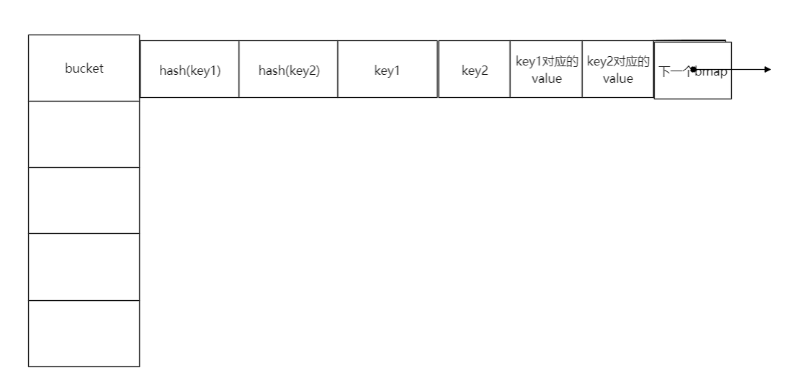

# map 的实现

[TOC]

代码中的注解：

~~~go
// This file contains the implementation of Go's map type.
//
// A map is just a hash table. The data is arranged
// into an array of buckets. Each bucket contains up to
// 8 key/value pairs. The low-order bits of the hash are
// used to select a bucket. Each bucket contains a few
// high-order bits of each hash to distinguish the entries
// within a single bucket.
//
// If more than 8 keys hash to a bucket, we chain on
// extra buckets.
//
// When the hashtable grows, we allocate a new array
// of buckets twice as big. Buckets are incrementally
// copied from the old bucket array to the new bucket array.
//
// Map iterators walk through the array of buckets and
// return the keys in walk order (bucket #, then overflow
// chain order, then bucket index).  To maintain iteration
// semantics, we never move keys within their bucket (if
// we did, keys might be returned 0 or 2 times).  When
// growing the table, iterators remain iterating through the
// old table and must check the new table if the bucket
// they are iterating through has been moved ("evacuated")
// to the new table.

// Picking loadFactor: too large and we have lots of overflow
// buckets, too small and we waste a lot of space. I wrote
// a simple program to check some stats for different loads:
// (64-bit, 8 byte keys and values)
//  loadFactor    %overflow  bytes/entry     hitprobe    missprobe
//        4.00         2.13        20.77         3.00         4.00
//        4.50         4.05        17.30         3.25         4.50
//        5.00         6.85        14.77         3.50         5.00
//        5.50        10.55        12.94         3.75         5.50
//        6.00        15.27        11.67         4.00         6.00
//        6.50        20.90        10.79         4.25         6.50
//        7.00        27.14        10.15         4.50         7.00
//        7.50        34.03         9.73         4.75         7.50
//        8.00        41.10         9.40         5.00         8.00
//
// %overflow   = percentage of buckets which have an overflow bucket
// bytes/entry = overhead bytes used per key/value pair
// hitprobe    = # of entries to check when looking up a present key
// missprobe   = # of entries to check when looking up an absent key
//
// Keep in mind this data is for maximally loaded tables, i.e. just
// before the table grows. Typical tables will be somewhat less loaded.
~~~

一些常量定义:

~~~go
const (
	// Maximum number of key/value pairs a bucket can hold.
	bucketCntBits = 3
	bucketCnt     = 1 << bucketCntBits

	// Maximum average load of a bucket that triggers growth.
	loadFactor = 6.5

	// Maximum key or value size to keep inline (instead of mallocing per element).
	// Must fit in a uint8.
	// Fast versions cannot handle big values - the cutoff size for
	// fast versions in ../../cmd/internal/gc/walk.go must be at most this value.
	maxKeySize   = 128
	maxValueSize = 128

	// data offset should be the size of the bmap struct, but needs to be
	// aligned correctly. For amd64p32 this means 64-bit alignment
	// even though pointers are 32 bit.
	dataOffset = unsafe.Offsetof(struct {
		b bmap
		v int64
	}{}.v)

	// Possible tophash values. We reserve a few possibilities for special marks.
	// Each bucket (including its overflow buckets, if any) will have either all or none of its
	// entries in the evacuated* states (except during the evacuate() method, which only happens
	// during map writes and thus no one else can observe the map during that time).
	empty          = 0 // cell is empty
	evacuatedEmpty = 1 // cell is empty, bucket is evacuated.
	evacuatedX     = 2 // key/value is valid.  Entry has been evacuated to first half of larger table.
	evacuatedY     = 3 // same as above, but evacuated to second half of larger table.
	minTopHash     = 4 // minimum tophash for a normal filled cell.

	// flags
	iterator     = 1 // there may be an iterator using buckets
	oldIterator  = 2 // there may be an iterator using oldbuckets
	hashWriting  = 4 // a goroutine is writing to the map
	sameSizeGrow = 8 // the current map growth is to a new map of the same size

	// sentinel bucket ID for iterator checks
	noCheck = 1<<(8*sys.PtrSize) - 1
)
~~~

## 总结

map的大致结构

有意思的两点:

* bucket的存储方式, go的map实现为什么不采用`单链表`来解决冲突。而是采用类似于数组块的bmap
* 什么时候触发rehash。只有插入key-value时， 且满足一定的条件，就会触发rehash
* rehash。rehash是通过增量方式完成的。 查找时，根据当前bucket是否完成迁移确定在新哈希表还是旧哈希表中查找`key`；添加时若正在进行rehash，则先迁移当前key所在的bucket到新哈希表中,然后再多迁移一个bucket。所以总在新哈希表中添加，插入过程会不断的推进bucket的迁移；删除时，会先检查是否正在进行rehash。若正在进行rehash则先迁移被删除的`key`所在的bucket，然后再删除;
* 查找和删除都会推动bucket的迁移
* **有个这样的疑问，即有大量删除元素时，为什么不减小哈希表的大小来回收空间这？仔细阅读代码之后才发现，大量删除元素不会有bmap被单独释放。而是通过调整哈希表(哈希表大小不变），调整时所有bucket的键值对拷贝到新哈希表中（调整后新哈希表的bucket的bmap更加紧凑），来释放整个哈希表，已达到释放大量空闲bmap的目的**

假设某个bucket的bmap如下

~~~
迁移前
bucket1 hash(key1)| empty|hash(key2)|....|key1|empty|key2|...|value1||value2|...

迁移后：
bucket1 hash(key1)|hash(key2)|...|key1|key2|...|value1|value2
~~~

## 实现

### hmap的定义

~~~go
// A header for a Go map.
type hmap struct {
	// Note: the format of the Hmap is encoded in ../../cmd/internal/gc/reflect.go and
	// ../reflect/type.go. Don't change this structure without also changing that code!
	count     int // # live cells == size of map.  Must be first (used by len() builtin)
	flags     uint8
	B         uint8  // log_2 of # of buckets (can hold up to loadFactor * 2^B items)
	noverflow uint16 // approximate number of overflow buckets; see incrnoverflow for details
	hash0     uint32 // hash seed

	buckets    unsafe.Pointer // array of 2^B Buckets. may be nil if count==0.
	oldbuckets unsafe.Pointer // previous bucket array of half the size, non-nil only when growing
	nevacuate  uintptr        // progress counter for evacuation (buckets less than this have been evacuated)

	// If both key and value do not contain pointers and are inline, then we mark bucket
	// type as containing no pointers. This avoids scanning such maps.
	// However, bmap.overflow is a pointer. In order to keep overflow buckets
	// alive, we store pointers to all overflow buckets in hmap.overflow.
	// Overflow is used only if key and value do not contain pointers.
	// overflow[0] contains overflow buckets for hmap.buckets.
	// overflow[1] contains overflow buckets for hmap.oldbuckets.
	// The first indirection allows us to reduce static size of hmap.
	// The second indirection allows to store a pointer to the slice in hiter.
	overflow *[2]*[]*bmap
}
~~~

bmap

~~~go
// A bucket for a Go map.
type bmap struct {
	// tophash generally contains the top byte of the hash value
	// for each key in this bucket. If tophash[0] < minTopHash,
	// tophash[0] is a bucket evacuation state instead.
	tophash [bucketCnt]uint8
	// Followed by bucketCnt keys and then bucketCnt values.
	// NOTE: packing all the keys together and then all the values together makes the
	// code a bit more complicated than alternating key/value/key/value/... but it allows
	// us to eliminate padding which would be needed for, e.g., map[int64]int8.
	// Followed by an overflow pointer.
}
~~~

### makemap 创建map

~~~go
// makemap implements a Go map creation make(map[k]v, hint)
// If the compiler has determined that the map or the first bucket
// can be created on the stack, h and/or bucket may be non-nil.
// If h != nil, the map can be created directly in h.
// If bucket != nil, bucket can be used as the first bucket.
func makemap(t *maptype, hint int64, h *hmap, bucket unsafe.Pointer) *hmap {
	if sz := unsafe.Sizeof(hmap{}); sz > 48 || sz != t.hmap.size {
		println("runtime: sizeof(hmap) =", sz, ", t.hmap.size =", t.hmap.size)
		throw("bad hmap size")
	}

	if hint < 0 || int64(int32(hint)) != hint {
		panic(plainError("makemap: size out of range"))
		// TODO: make hint an int, then none of this nonsense
	}

	if !ismapkey(t.key) {
		throw("runtime.makemap: unsupported map key type")
	}

	// check compiler's and reflect's math
	if t.key.size > maxKeySize && (!t.indirectkey || t.keysize != uint8(sys.PtrSize)) ||
		t.key.size <= maxKeySize && (t.indirectkey || t.keysize != uint8(t.key.size)) {
		throw("key size wrong")
	}
	if t.elem.size > maxValueSize && (!t.indirectvalue || t.valuesize != uint8(sys.PtrSize)) ||
		t.elem.size <= maxValueSize && (t.indirectvalue || t.valuesize != uint8(t.elem.size)) {
		throw("value size wrong")
	}

	// invariants we depend on. We should probably check these at compile time
	// somewhere, but for now we'll do it here.
	if t.key.align > bucketCnt {
		throw("key align too big")
	}
	if t.elem.align > bucketCnt {
		throw("value align too big")
	}
	if t.key.size%uintptr(t.key.align) != 0 {
		throw("key size not a multiple of key align")
	}
	if t.elem.size%uintptr(t.elem.align) != 0 {
		throw("value size not a multiple of value align")
	}
	if bucketCnt < 8 {
		throw("bucketsize too small for proper alignment")
	}
	if dataOffset%uintptr(t.key.align) != 0 {
		throw("need padding in bucket (key)")
	}
	if dataOffset%uintptr(t.elem.align) != 0 {
		throw("need padding in bucket (value)")
	}

	// find size parameter which will hold the requested # of elements
	B := uint8(0)
	for ; overLoadFactor(hint, B); B++ {
	}

	// allocate initial hash table
	// if B == 0, the buckets field is allocated lazily later (in mapassign)
	// If hint is large zeroing this memory could take a while.
	buckets := bucket
	if B != 0 {
		buckets = newarray(t.bucket, 1<<B)
	}

	// initialize Hmap
	if h == nil {
		h = (*hmap)(newobject(t.hmap))
	}
	h.count = 0
	h.B = B
	h.flags = 0
	h.hash0 = fastrand()
	h.buckets = buckets
	h.oldbuckets = nil
	h.nevacuate = 0
	h.noverflow = 0

	return h
}
~~~

### mapassign 插入元素

mapassign 会返回待插入value的内存位置

bucket 的结构： hash(key)| hash(key2) | key| key2 | value| value2

1. 检查hmap是否为nil,若为nil，则panic
2. **检测hashWriting标志位是否被设置，若设置则panic(并发写)。否则设置hashWriting标志位**
3. 计算key的哈希值，使用的哈希函数依赖于key的类型，并确定其将要存储的bucket
4. **检查是否正在重新哈希,若正在rehash。则将当前key所在的bucket从旧的哈希表迁移到新哈希表。然后再多迁移一个bucket,由hmap.nevacuate确定**
5. 根据哈希值的最高8位，确定在bmap中的位置。查找空闲槽位。找到后仍然需要遍历所有的bmap，以确当是否有重复的key
6. **若当前未正在调整哈希表， 且满足下面两个条件之一，则调整哈希表大小：1）key的数量超过bucket数量的6.5倍(6.5由loadFactor定义),这种情况调整策略是哈希表变为原来的2倍；2）bmap的数量超过bucket数量（不十分准确），这种情况新哈希表的大小和原哈希表的大小一致**
7. 当前bucket没有空闲槽位，新分配一个bmap,并调整h.noverflow
8. 若需要进行rehash,则跳到步骤2
9. 返回存放value的内存位置

~~~go
// Like mapaccess, but allocates a slot for the key if it is not present in the map.
func mapassign(t *maptype, h *hmap, key unsafe.Pointer) unsafe.Pointer {
	if h == nil {
		panic(plainError("assignment to entry in nil map"))
	}
	if raceenabled {
		callerpc := getcallerpc(unsafe.Pointer(&t))
		pc := funcPC(mapassign)
		racewritepc(unsafe.Pointer(h), callerpc, pc)
		raceReadObjectPC(t.key, key, callerpc, pc)
	}
	if msanenabled {
		msanread(key, t.key.size)
	}
	if h.flags&hashWriting != 0 {
		throw("concurrent map writes")
	}
	h.flags |= hashWriting

    //计算哈希值的函数是绑定在key上的
	alg := t.key.alg
	hash := alg.hash(key, uintptr(h.hash0))

	if h.buckets == nil {
		h.buckets = newarray(t.bucket, 1)
	}

again:
	bucket := hash & (uintptr(1)<<h.B - 1)
    //这分两种情况
    //正在rehash, 迁移bucket
	if h.growing() {
		growWork(t, h, bucket)
	}
	b := (*bmap)(unsafe.Pointer(uintptr(h.buckets) + bucket*uintptr(t.bucketsize)))
    
    //高8位
	top := uint8(hash >> (sys.PtrSize*8 - 8))
    //minTopHash的值是常量4
	if top < minTopHash {
		top += minTopHash
	}

	var inserti *uint8
	var insertk unsafe.Pointer
	var val unsafe.Pointer
    //有三种情况需要处理
    //case 1，要么key存在于hmap中。
    //case 2, key要不存在于hmap中，且bmap有空闲位置
    //case 3, key 不存在于hmap中，且bmap没有空闲位置，需要增加bmap
	for {
        //bucketCnt的值是常量8
		for i := uintptr(0); i < bucketCnt; i++ {
			if b.tophash[i] != top {
                //找到空闲位置, 若找到了为啥还continue？因为key冲突的存在，所以还需要检查其他槽位
				if b.tophash[i] == empty && inserti == nil {
					inserti = &b.tophash[i]
					insertk = add(unsafe.Pointer(b),
                                  dataOffset+i*uintptr(t.keysize))
                    //待插入value的内存位置
					val = add(unsafe.Pointer(b), 		  dataOffset+bucketCnt*uintptr(t.keysize)+i*uintptr(t.valuesize))
				}
				continue
			}//end if b.tophash[i] != top
            
            //下面就是哈希值冲突的情况,冲突时还需要确定key是否相等
            
            //k 应该是key
			k := add(unsafe.Pointer(b), dataOffset+i*uintptr(t.keysize))
			if t.indirectkey {
				k = *((*unsafe.Pointer)(k))
			}
         	//哈希值冲突，但key不同。继续查找
			if !alg.equal(key, k) {
				continue
			}
            
            //键已经存在的情况
			// already have a mapping for key. Update it.
			if t.needkeyupdate {
				typedmemmove(t.key, k, key)
			}
			val = add(unsafe.Pointer(b), dataOffset+bucketCnt*uintptr(t.keysize)+i*uintptr(t.valuesize))
			goto done
        }//end for i:= uintptr(0)
        
        //下一个bmap
		ovf := b.overflow(t)
        //所有的bmap都没有空位
		if ovf == nil {
			break
		}
		b = ovf
	}//end for

	// Did not find mapping for key. Allocate new cell & add entry.

	// If we hit the max load factor or we have too many overflow buckets,
	// and we're not already in the middle of growing, start growing.
    //没有在调整哈希表大小， 且满足以下两个条件之一
    //1 key的数目超过bucket数目的6.5倍
    //2
	if !h.growing() && (overLoadFactor(int64(h.count), h.B) || tooManyOverflowBuckets(h.noverflow, h.B)) {
		hashGrow(t, h)
		goto again // Growing the table invalidates everything, so try again
	}

    //当前bucket没有空闲槽位
	if inserti == nil {
		// all current buckets are full, allocate a new one.
		newb := (*bmap)(newobject(t.bucket))
		h.setoverflow(t, b, newb)
		inserti = &newb.tophash[0]
		insertk = add(unsafe.Pointer(newb), dataOffset)
		val = add(insertk, bucketCnt*uintptr(t.keysize))
	}

	// store new key/value at insert position
	if t.indirectkey {
		kmem := newobject(t.key)
		*(*unsafe.Pointer)(insertk) = kmem
		insertk = kmem
	}
	if t.indirectvalue {
		vmem := newobject(t.elem)
		*(*unsafe.Pointer)(val) = vmem
	}
	typedmemmove(t.key, insertk, key)
	*inserti = top
	h.count++

done:
	if h.flags&hashWriting == 0 {
		throw("concurrent map writes")
	}
	h.flags &^= hashWriting
	if t.indirectvalue {
		val = *((*unsafe.Pointer)(val))
	}
	return val
}
~~~

### mapaccess1 查找指定的key-value

* **若hmap为nil或没有key返回对应类型的0值**
* 检查hashWriting标志位，若被设置说明存在并发读写，抛出异常

* 首先计算key的哈希值，然后根据哈希值确定bucket
* 根据当前是否正在rehash, 以及确定的bucket迁移是否完成确定在新哈希表还是旧哈希表中查找

~~~go
// mapaccess1 returns a pointer to h[key].  Never returns nil, instead
// it will return a reference to the zero object for the value type if
// the key is not in the map.
// NOTE: The returned pointer may keep the whole map live, so don't
// hold onto it for very long.
func mapaccess1(t *maptype, h *hmap, key unsafe.Pointer) unsafe.Pointer {
	if raceenabled && h != nil {
		callerpc := getcallerpc(unsafe.Pointer(&t))
		pc := funcPC(mapaccess1)
		racereadpc(unsafe.Pointer(h), callerpc, pc)
		raceReadObjectPC(t.key, key, callerpc, pc)
	}
	if msanenabled && h != nil {
		msanread(key, t.key.size)
	}
	if h == nil || h.count == 0 {
		return unsafe.Pointer(&zeroVal[0])
	}
    //检查标志位
	if h.flags&hashWriting != 0 {
		throw("concurrent map read and map write")
	}
	alg := t.key.alg
	hash := alg.hash(key, uintptr(h.hash0))
	m := uintptr(1)<<h.B - 1
	b := (*bmap)(add(h.buckets, (hash&m)*uintptr(t.bucketsize)))
    
    //正在进行rehash
	if c := h.oldbuckets; c != nil {
        //确定新哈希表是否为原来的一倍
		if !h.sameSizeGrow() {
			// There used to be half as many buckets; mask down one more power of two.
			m >>= 1
		}
        //key在旧哈希表中所在的bucket
		oldb := (*bmap)(add(c, (hash&m)*uintptr(t.bucketsize)))
        
        //检查当前旧哈希表bucket是否迁移完成, 若完成则从新哈希表中的bucket中查找， 否则总旧哈希表中查找
         //若b.tophash[0] > empty && b.tophash[0] < minTopHash, 则evacuated返回true
    //反之就是empty, minTopHash, 正常的key就会执行if 逻辑
        //迁移完成会将b.tophash[0]设置成 evacuatedX, evacuated(oldb)就会返回true.从而不执行if
		if !evacuated(oldb) {
			b = oldb
		}
	}
	top := uint8(hash >> (sys.PtrSize*8 - 8))
    //加4 因为前0， 1， 2， 3都作为状态值使用了
	if top < minTopHash {
		top += minTopHash
	}
	for {
		for i := uintptr(0); i < bucketCnt; i++ {
            //哈希值的高8位是否相同
			if b.tophash[i] != top {
				continue
			}
			k := add(unsafe.Pointer(b), dataOffset+i*uintptr(t.keysize))
			if t.indirectkey {
				k = *((*unsafe.Pointer)(k))
			}
            //键相等的情况
			if alg.equal(key, k) {
				v := add(unsafe.Pointer(b), dataOffset+bucketCnt*uintptr(t.keysize)+i*uintptr(t.valuesize))
				if t.indirectvalue {
					v = *((*unsafe.Pointer)(v))
				}
				return v
			}
		}
        //检查下一个bmap
		b = b.overflow(t)
		if b == nil {
			return unsafe.Pointer(&zeroVal[0])
		}
	}
}
~~~

### mapdelete 删除指定的key-value

* 若hmap是nil或大小是0，则直接返回

* 检测hashWriting标志位，若已经设置则panic(并发写)。否则设置hashWriting标志位
* 计算`key`的哈希值，并获取所在的bucket
* 检查是否正在rehash，若正在rehash则尝试将当前bucket从旧哈希表中迁移到新哈希表中,并再多迁移一个bucket
* 在bucket中查找指定键
* 检测hashWriting标志位，看是否已被清除若清除则panic(并发写)。否则清除hashWriting标志位

~~~go
func mapdelete(t *maptype, h *hmap, key unsafe.Pointer) {
	if raceenabled && h != nil {
		callerpc := getcallerpc(unsafe.Pointer(&t))
		pc := funcPC(mapdelete)
		racewritepc(unsafe.Pointer(h), callerpc, pc)
		raceReadObjectPC(t.key, key, callerpc, pc)
	}
	if msanenabled && h != nil {
		msanread(key, t.key.size)
	}
	if h == nil || h.count == 0 {
		return
	}
	if h.flags&hashWriting != 0 {
		throw("concurrent map writes")
	}
	h.flags |= hashWriting

	alg := t.key.alg
	hash := alg.hash(key, uintptr(h.hash0))
	bucket := hash & (uintptr(1)<<h.B - 1)
    //增量迁移
	if h.growing() {
		growWork(t, h, bucket)
	}
	b := (*bmap)(unsafe.Pointer(uintptr(h.buckets) + bucket*uintptr(t.bucketsize)))
	top := uint8(hash >> (sys.PtrSize*8 - 8))
	if top < minTopHash {
		top += minTopHash
	}
	for {
		for i := uintptr(0); i < bucketCnt; i++ {
            //哈希值不等
			if b.tophash[i] != top {
				continue
			}
			k := add(unsafe.Pointer(b), dataOffset+i*uintptr(t.keysize))
			k2 := k
			if t.indirectkey {
				k2 = *((*unsafe.Pointer)(k2))
			}
            //键不等
			if !alg.equal(key, k2) {
				continue
			}
            //清空key
			if t.indirectkey {
				*(*unsafe.Pointer)(k) = nil
			} else {
				typedmemclr(t.key, k)
			}
            //清空value
			v := unsafe.Pointer(uintptr(unsafe.Pointer(b)) + dataOffset + bucketCnt*uintptr(t.keysize) + i*uintptr(t.valuesize))
			if t.indirectvalue {
				*(*unsafe.Pointer)(v) = nil
			} else {
				typedmemclr(t.elem, v)
			}
            //哈希值置为empty,可用
			b.tophash[i] = empty
			h.count--
			goto done
		}
		b = b.overflow(t)
		if b == nil {
			goto done
		}
	}

done:
	if h.flags&hashWriting == 0 {
		throw("concurrent map writes")
	}
	h.flags &^= hashWriting
}
~~~

### 遍历

### rehash 调整哈希表大小

#### hmap.growing 确定是否正在进行rehash

若hmap.oldbuckets不为nil,则正在进行rehash

~~~go
// growing reports whether h is growing. The growth may be to the same size or bigger.
func (h *hmap) growing() bool {
	return h.oldbuckets != nil
}
~~~

#####  hashGrow 调整哈希表

注意hmap.nevacuate和hmap.noverflow会被重置

在负载因子没超过6.5倍，即key的数目时bucket数目的6.5倍时。仍然调整哈希表（大小不变)是因为bmap数量过多，使用新的哈希表可以释放过多的空闲bmap。所以bmap不是单独释放的而是通过调整哈希表，释放整个哈希表

* 若负载没超过特定的值即loadFactor(6.5倍)，则不增大哈希表
* 若负载超过loadFactor，则哈希表调整为原来的2倍大小

~~~go
func hashGrow(t *maptype, h *hmap) {
	// If we've hit the load factor, get bigger.
	// Otherwise, there are too many overflow buckets,
	// so keep the same number of buckets and "grow" laterally.
	bigger := uint8(1)
	if !overLoadFactor(int64(h.count), h.B) {
		bigger = 0
		h.flags |= sameSizeGrow
	}
	oldbuckets := h.buckets
	newbuckets := newarray(t.bucket, 1<<(h.B+bigger))
	flags := h.flags &^ (iterator | oldIterator)
	if h.flags&iterator != 0 {
		flags |= oldIterator
	}
	// commit the grow (atomic wrt gc)
	h.B += bigger
	h.flags = flags
	h.oldbuckets = oldbuckets
	h.buckets = newbuckets
	h.nevacuate = 0
	h.noverflow = 0

	if h.overflow != nil {
		// Promote current overflow buckets to the old generation.
		if h.overflow[1] != nil {
			throw("overflow is not nil")
		}
		h.overflow[1] = h.overflow[0]
		h.overflow[0] = nil
	}

	// the actual copying of the hash table data is done incrementally
	// by growWork() and evacuate().
}
~~~

##### growwork迁移bucket

插入过程会调用此函数，推进bucket的迁移

* 先迁移当前正在使用的bucket
* 然后再迁移一个bucket

~~~go
func growWork(t *maptype, h *hmap, bucket uintptr) {
	// make sure we evacuate the oldbucket corresponding
	// to the bucket we're about to use
    //bucket参数是在新的哈希表中的位置，所以需要bucket &h.oldbucketmask()来确定其在旧哈希表中的位置
	evacuate(t, h, bucket&h.oldbucketmask())

	// evacuate one more oldbucket to make progress on growing
    //nevacuate从0开始
	if h.growing() {
		evacuate(t, h, h.nevacuate)
	}
}
~~~

##### evacuate 在新旧哈希表之间迁移键值对

迁移分两种情况处理：

* case 1: 哈希表大小不变，将旧哈希表的`键值对`拷贝到新哈希表
* case 2: 哈希表大小增加

疑问: **哈希表增大的情况下，应该是通过key 的哈希值确定新的bucket，evacuate怎么是用 `y = (*bmap)(add(h.buckets, (oldbucket+newbit)*uintptr(t.bucketsize)))`；oldbucket+newbit 确定新bucket**

~~~go
func evacuate(t *maptype, h *hmap, oldbucket uintptr) {
	b := (*bmap)(add(h.oldbuckets, oldbucket*uintptr(t.bucketsize)))
	newbit := h.noldbuckets()
	alg := t.key.alg
    
    //检查bucket是否已经迁移
    //若b.tophash[0] > empty && b.tophash[0] < minTopHash, 则evacuated返回true。表示这个bucket已经迁移完成
    //反之就是empty, minTopHash, 正常的key就会执行if 逻辑
	if !evacuated(b) {
		// TODO: reuse overflow buckets instead of using new ones, if there
		// is no iterator using the old buckets.  (If !oldIterator.)

		var (
			x, y   *bmap          // current low/high buckets in new map
			xi, yi int            // key/val indices into x and y
			xk, yk unsafe.Pointer // pointers to current x and y key storage
			xv, yv unsafe.Pointer // pointers to current x and y value storage
		)
        
        //x指向新哈希表管理的第一个bitmap
		x = (*bmap)(add(h.buckets, oldbucket*uintptr(t.bucketsize)))
		xi = 0
		xk = add(unsafe.Pointer(x), dataOffset)
		xv = add(xk, bucketCnt*uintptr(t.keysize))
        
        /*
        0 % 4 = 0 
        1 % 4= 1
        3 %4 =3
        4 %4 = 0  100   %8=4
        5 %4=1    101   %8 =5
        6%4=2      110  %8=6
        7 % 4      111 %8 =7
        8 % 4 = 0  1000 %8=0
        9%4 = 1    1001 %8=1
        10%4=2     1010 %8=2
        11%4=3     1011 %8=3
        12%4=0     1100 %8=4
        13%4=1     1101
                   x0xx
        
        0%8=0
        1%8=1
        2%8=2
        3%8 = 3
        4%8=4
        5%8=5
        7%8=7
        */
        //哈希表增大一倍
        //??????????????????????????, 确定新bucket的原因没搞明白
		if !h.sameSizeGrow() {
			// Only calculate y pointers if we're growing bigger.
			// Otherwise GC can see bad pointers.
            //为什么是oldbucket + newbit
			y = (*bmap)(add(h.buckets, (oldbucket+newbit)*uintptr(t.bucketsize)))
			yi = 0
			yk = add(unsafe.Pointer(y), dataOffset)
			yv = add(yk, bucketCnt*uintptr(t.keysize))
		}
        //针对b 是旧哈希表的bucket管理的所有bmap
		for ; b != nil; b = b.overflow(t) {
			k := add(unsafe.Pointer(b), dataOffset)
			v := add(k, bucketCnt*uintptr(t.keysize))
			for i := 0; i < bucketCnt; i, k, v = i+1, add(k, uintptr(t.keysize)), add(v, uintptr(t.valuesize)) {
				top := b.tophash[i]
				if top == empty {
					b.tophash[i] = evacuatedEmpty
					continue
				}
				if top < minTopHash {
					throw("bad map state")
				}
				k2 := k
				if t.indirectkey {
					k2 = *((*unsafe.Pointer)(k2))
				}
				useX := true
                //新哈希表是旧哈希表的2倍
				if !h.sameSizeGrow() {
					// Compute hash to make our evacuation decision (whether we need
					// to send this key/value to bucket x or bucket y).
					hash := alg.hash(k2, uintptr(h.hash0))
                    
                    //map 正在被迭代
					if h.flags&iterator != 0 {
						if !t.reflexivekey && !alg.equal(k2, k2) {
							// If key != key (NaNs), then the hash could be (and probably
							// will be) entirely different from the old hash. Moreover,
							// it isn't reproducible. Reproducibility is required in the
							// presence of iterators, as our evacuation decision must
							// match whatever decision the iterator made.
							// Fortunately, we have the freedom to send these keys either
							// way. Also, tophash is meaningless for these kinds of keys.
							// We let the low bit of tophash drive the evacuation decision.
							// We recompute a new random tophash for the next level so
							// these keys will get evenly distributed across all buckets
							// after multiple grows.
							if top&1 != 0 {
								hash |= newbit
							} else {
								hash &^= newbit
							}
							top = uint8(hash >> (sys.PtrSize*8 - 8))
							if top < minTopHash {
								top += minTopHash
							}
						}
					}//end if h.flags & iterator != 0
                    
                    //newbit 是旧哈希表的大小
                    //那种情况hash & newbit 是0, 为啥是0就用usex
                    //哪种情况hash & newbit 是1
                    //这个的原理没搞清楚
                    
					useX = hash&newbit == 0
                }//end if !h.sameSizeGrow()
                
                
                //从旧哈希表迁移到新哈希表
				if useX {
                    //将旧哈希表的bmap管理的tophash的值设为evacuatedX
					b.tophash[i] = evacuatedX
					if xi == bucketCnt {
						newx := (*bmap)(newobject(t.bucket))
						h.setoverflow(t, x, newx)
						x = newx
						xi = 0
						xk = add(unsafe.Pointer(x), dataOffset)
						xv = add(xk, bucketCnt*uintptr(t.keysize))
					}
					x.tophash[xi] = top
					if t.indirectkey {
						*(*unsafe.Pointer)(xk) = k2 // copy pointer
					} else {
						typedmemmove(t.key, xk, k) // copy value
					}
					if t.indirectvalue {
						*(*unsafe.Pointer)(xv) = *(*unsafe.Pointer)(v)
					} else {
						typedmemmove(t.elem, xv, v)
					}
					xi++
					xk = add(xk, uintptr(t.keysize))
					xv = add(xv, uintptr(t.valuesize))
				} else {
					b.tophash[i] = evacuatedY
					if yi == bucketCnt {
						newy := (*bmap)(newobject(t.bucket))
						h.setoverflow(t, y, newy)
						y = newy
						yi = 0
						yk = add(unsafe.Pointer(y), dataOffset)
						yv = add(yk, bucketCnt*uintptr(t.keysize))
					}
					y.tophash[yi] = top
					if t.indirectkey {
						*(*unsafe.Pointer)(yk) = k2
					} else {
						typedmemmove(t.key, yk, k)
					}
					if t.indirectvalue {
						*(*unsafe.Pointer)(yv) = *(*unsafe.Pointer)(v)
					} else {
						typedmemmove(t.elem, yv, v)
					}
					yi++
					yk = add(yk, uintptr(t.keysize))
					yv = add(yv, uintptr(t.valuesize))
				}//end else
			}
		}//end for
        
        //帮助gc
		// Unlink the overflow buckets & clear key/value to help GC.
		if h.flags&oldIterator == 0 {
			b = (*bmap)(add(h.oldbuckets, oldbucket*uintptr(t.bucketsize)))
			// Preserve b.tophash because the evacuation
			// state is maintained there.
            //清理存放key-value的内存
			if t.bucket.kind&kindNoPointers == 0 {
				memclrHasPointers(add(unsafe.Pointer(b), dataOffset), uintptr(t.bucketsize)-dataOffset)
			} else {
				memclrNoHeapPointers(add(unsafe.Pointer(b), dataOffset), uintptr(t.bucketsize)-dataOffset)
			}
		}
	}//end if !evacuated

	// Advance evacuation mark
    //h.nevacuate 的初始值是0
    //在以evacuate(t, h, h.nevacuate)调用时，oldbucket是等于h.nevacuate的,这样就会迁移下一个bucket
    //growWork 函数会调用evacuate(t, h, h.nevacuate),逐个清理
	if oldbucket == h.nevacuate {
		h.nevacuate = oldbucket + 1
		if oldbucket+1 == newbit { // newbit == # of oldbuckets
			// Growing is all done. Free old main bucket array.
			h.oldbuckets = nil
			// Can discard old overflow buckets as well.
			// If they are still referenced by an iterator,
			// then the iterator holds a pointers to the slice.
			if h.overflow != nil {
				h.overflow[1] = nil
			}
			h.flags &^= sameSizeGrow
		}
	}
}
~~~

### 确定是否需要调整哈希表大小的因素

插入key-value时，若满足如下两个条件中的任意一个，就调整哈希表的大小

* key的数量超过8，并且key的数量超过bucket数目的6.5倍

* 所有bucket的bmap数量超过一定的数值时

#### overLoadFactor 确定哈希表是否过载

若哈希表当前的元素数超过bucketCnt(8)并且 元素数是哈希表大小的loadFactor(6.5)倍。

~~~go
// overLoadFactor reports whether count items placed in 1<<B buckets is over loadFactor.
func overLoadFactor(count int64, B uint8) bool {
	// TODO: rewrite to use integer math and comparison?
	return count >= bucketCnt && float32(count) >= loadFactor*float32((uintptr(1)<<B))
}
~~~

#### tooManyOverFlowBuckets

* B小于16，所有bucket的bmap数量超过(1<<B)
* B大于等于16时， 所有bucket的bmap数量超过32768。

~~~go
// tooManyOverflowBuckets reports whether noverflow buckets is too many for a map with 1<<B buckets.
// Note that most of these overflow buckets must be in sparse use;
// if use was dense, then we'd have already triggered regular map growth.
func tooManyOverflowBuckets(noverflow uint16, B uint8) bool {
	// If the threshold is too low, we do extraneous work.
	// If the threshold is too high, maps that grow and shrink can hold on to lots of unused memory.
	// "too many" means (approximately) as many overflow buckets as regular buckets.
	// See incrnoverflow for more details.
	if B < 16 {
		return noverflow >= uint16(1)<<B
	}
	return noverflow >= 1<<15
}
~~~

### 当bucket没有空闲槽位时

hmap.noverflow的计算有点意思

* 若h.B < 16,即bucket数目小于65536时，h.noverflow直接加1
* 若h.B>16,

~~~go
// incrnoverflow increments h.noverflow.
// noverflow counts the number of overflow buckets.
// This is used to trigger same-size map growth.
// See also tooManyOverflowBuckets.
// To keep hmap small, noverflow is a uint16.
// When there are few buckets, noverflow is an exact count.
// When there are many buckets, noverflow is an approximate count.
func (h *hmap) incrnoverflow() {
	// We trigger same-size map growth if there are
	// as many overflow buckets as buckets.
	// We need to be able to count to 1<<h.B.
	if h.B < 16 {
		h.noverflow++
		return
	}
	// Increment with probability 1/(1<<(h.B-15)).
	// When we reach 1<<15 - 1, we will have approximately
	// as many overflow buckets as buckets.
	mask := uint32(1)<<(h.B-15) - 1
	// Example: if h.B == 18, then mask == 7,
	// and fastrand & 7 == 0 with probability 1/8.
	if fastrand()&mask == 0 {
		h.noverflow++
	}
}

func (h *hmap) setoverflow(t *maptype, b, ovf *bmap) {
	h.incrnoverflow()
	if t.bucket.kind&kindNoPointers != 0 {
		h.createOverflow()
		*h.overflow[0] = append(*h.overflow[0], ovf)
	}
	*(**bmap)(add(unsafe.Pointer(b), uintptr(t.bucketsize)-sys.PtrSize)) = ovf
}

func (h *hmap) createOverflow() {
	if h.overflow == nil {
		h.overflow = new([2]*[]*bmap)
	}
	if h.overflow[0] == nil {
		h.overflow[0] = new([]*bmap)
	}
}
~~~

