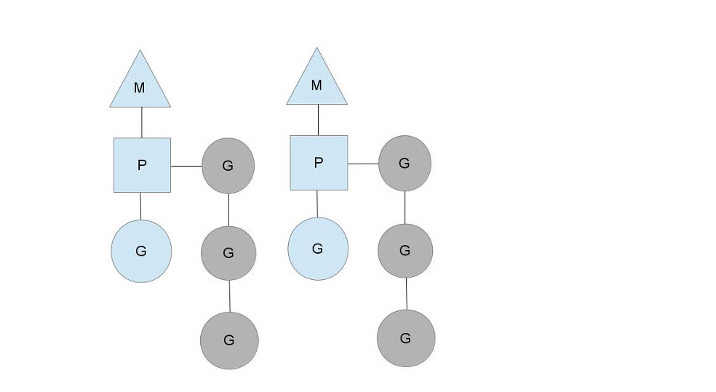
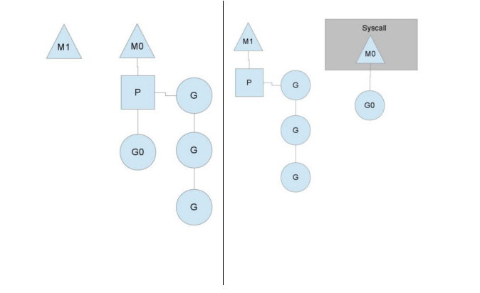

# The Go scheduler

[TOC]

出自 https://morsmachine.dk/go-scheduler

## Introduction

One of the big features for Go 1.1 is the new scheduler, contributed by Dmitry Vyukov. The new scheduler has given a dramatic increase in performance for parallel Go programs and with nothing better to do, I figured I'd write something about it.

Most of what's written in this blog post is already described in the [original design doc](https://docs.google.com/document/d/1TTj4T2JO42uD5ID9e89oa0sLKhJYD0Y_kqxDv3I3XMw). It's a fairly comprehensive document, but pretty technical.

All you need to know about the new scheduler is in that design document but this post has pictures, so it's clearly superior.

## What does the Go runtime need with a scheduler?

But before we look at the new scheduler, we need to understand why it's needed. Why create a userspace scheduler when the operating system can schedule threads for you?

The POSIX thread API is very much a logical extension to the existing Unix process model and as such, threads get a lot of the same controls as processes. Threads have their own signal mask, can be assigned CPU affinity, can be put into cgroups and can be queried for which resources they use. All these controls add overhead for features that are simply not needed for how Go programs use goroutines and they quickly add up when you have 100,000 threads in your program.

Another problem is that the OS can't make informed scheduling decisions, based on the Go model. For example, the Go garbage collector requires that all threads are stopped when running a collection and that memory must be in a consistent state. This involves waiting for running threads to reach a point where we know that the memory is consistent.

When you have many threads scheduled out at random points, chances are that you're going to have to wait for a lot of them to reach a consistent state. The Go scheduler can make the decision of only scheduling at points where it knows that memory is consistent. This means that when we stop for garbage collection, we only have to wait for the threads that are being actively run on a CPU core.

## Our Cast of Characters

There are 3 usual models for threading. One is N:1 where several userspace threads are run on one OS thread. This has the advantage of being very quick to context switch but cannot take advantage of multi-core systems. Another is 1:1 where one thread of execution matches one OS thread. It takes advantage of all of the cores on the machine, but context switching is slow because it has to trap through the OS.

Go tries to get the best of both worlds by using a M:N scheduler. It schedules an arbitrary number of goroutines onto an arbitrary number of OS threads. You get quick context switches and you take advantage of all the cores in your system. The main disadvantage of this approach is the complexity it adds to the scheduler.

To acomplish the task of scheduling, the Go Scheduler uses 3 main entities:

The triangle represents an OS thread. It's the thread of execution managed by the OS and works pretty much like your standard POSIX thread. In the runtime code, it's called **M** for machine.

The circle represents a goroutine. It includes the stack, the instruction pointer and other information important for scheduling goroutines, like any channel it might be blocked on. In the runtime code, it's called a **G**.

The rectangle represents a context for scheduling. You can look at it as a localized version of the scheduler which runs Go code on a single thread. It's the important part that lets us go from a N:1 scheduler to a M:N scheduler. In the runtime code, it's called **P** for processor. More on this part in a bit.

Here we see 2 threads (**M**), each holding a context (**P**), each running a goroutine (**G**). In order to run goroutines, a thread must hold a context.

**The number of contexts is set on startup to the value of the `GOMAXPROCS` environment variable or through the runtime function `GOMAXPROCS()`. Normally this doesn't change during execution of your program. The fact that the number of contexts is fixed means that only `GOMAXPROCS` are running Go code at any point. We can use that to tune the invocation of the Go process to the individual computer, such at a 4 core PC is running Go code on 4 threads**.

The greyed out goroutines are not running, but ready to be scheduled. They're arranged in lists called runqueues. Goroutines are added to the end of a runqueue whenever a goroutine executes a `go` statement. Once a context has run a goroutine until a scheduling point, it pops a goroutine off its runqueue, sets stack and instruction pointer and begins running the goroutine.

To bring down mutex contention, each context has its own local runqueue. A previous version of the Go scheduler only had a global runqueue with a mutex protecting it. Threads were often blocked waiting for the mutex to unlocked. This got really bad when you had 32 core machines that you wanted to squeeze as much performance out of as possible.

The scheduler keeps on scheduling in this steady state as long as all contexts have goroutines to run. However, there are a couple of scenarios that can change that.

## Who you gonna (sys)call?

**You might wonder now, why have contexts at all? Can't we just put the runqueues on the threads and get rid of contexts? Not really. The reason we have contexts is so that we can hand them off to other threads if the running thread needs to block for some reason**.

这里说，在需要的时候可以将context交给其他线程。不能将runqueue交给其他线程么？

An example of when we need to block, is when we call into a syscall. Since a thread cannot both be executing code and be blocked on a syscall, we need to hand off the context so it can keep scheduling.

Here we see a thread giving up its context so that another thread can run it. **The scheduler makes sure there are enough threads to run all contexts**. **M1** in the illustration above might be created just for the purpose of handling this syscall or it could come from a thread cache. The syscalling thread will hold on to the goroutine that made the syscall since it's technically still executing, albeit blocked in the OS.

When the syscall returns, the thread must try and get a context in order to run the returning goroutine. The normal mode of operation is to steal a context from one of the other threads. If it can't steal one, it will put the goroutine on a global runqueue, put itself on the thread cache and go to sleep.

The global runqueue is a runqueue that contexts pull from when they run out of their local runqueue. Contexts also periodically check the global runqueue for goroutines. Otherwise the goroutines on global runqueue could end up never running because of starvation.

This handling of syscalls is why Go programs run with multiple threads, even when `GOMAXPROCS` is 1. The runtime uses goroutines that call syscalls, leaving threads behind.

## Stealing work

Another way that the steady state of the system can change is when a context runs out of goroutines to schedule to. This can happen if the amount of work on the contexts' runqueues is unbalanced. This can cause a context to end up exhausting it's runqueue while there is still work to be done in the system. To keep running Go code, a context can take goroutines out of the global runqueue but if there are no goroutines in it, it'll have to get them from somewhere else.

That somewhere is the other contexts. When a context runs out, it will try to steal about half of the runqueue from another context. This makes sure there is always work to do on each of the contexts, which in turn makes sure that all threads are working at their maximum capacity.

## Where to go?

There are many more details to the scheduler, like cgo threads, the `LockOSThread()`function and integration with the network poller. These are outside the scope of this post, but still merit study. I might write about these later. There are certainly plenty of interesting constructions to be found in the Go runtime library.

By Daniel Morsing

## 总结

为什么需要`p`,上面`who you gonna (sys)call`提到为啥需要`p`。但仍然不是很清楚

从上面的介绍，可以得出以下几点：

* P 的最大数目是固定的(GOMAXPROCS()即最大数目)，依赖于CPU核数
* M即线程的最大数目不是固定的，因为syscall的存在，导致部分线程被阻塞