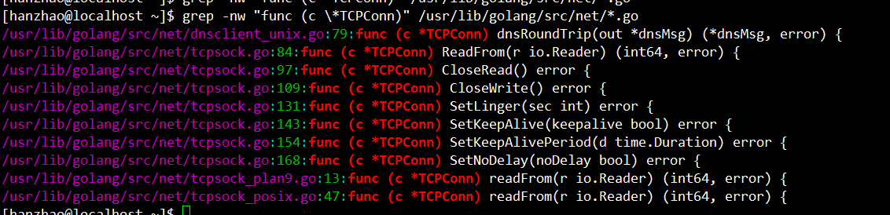

# TCPConn

[TOC]

### Conn

net/net.go

Conn是一个接口类型，定义了一些通用的接口

* Conn.Close实际调用的是conn.Close

~~~go
// Conn is a generic stream-oriented network connection.
//
// Multiple goroutines may invoke methods on a Conn simultaneously.
type Conn interface {
	// Read reads data from the connection.
	// Read can be made to time out and return an Error with Timeout() == true
	// after a fixed time limit; see SetDeadline and SetReadDeadline.
	Read(b []byte) (n int, err error)

	// Write writes data to the connection.
	// Write can be made to time out and return an Error with Timeout() == true
	// after a fixed time limit; see SetDeadline and SetWriteDeadline.
	Write(b []byte) (n int, err error)

	// Close closes the connection.
	// Any blocked Read or Write operations will be unblocked and return errors.
	Close() error

	// LocalAddr returns the local network address.
	LocalAddr() Addr

	// RemoteAddr returns the remote network address.
	RemoteAddr() Addr

	// SetDeadline sets the read and write deadlines associated
	// with the connection. It is equivalent to calling both
	// SetReadDeadline and SetWriteDeadline.
	//
	// A deadline is an absolute time after which I/O operations
	// fail with a timeout (see type Error) instead of
	// blocking. The deadline applies to all future and pending
	// I/O, not just the immediately following call to Read or
	// Write. After a deadline has been exceeded, the connection
	// can be refreshed by setting a deadline in the future.
	//
	// An idle timeout can be implemented by repeatedly extending
	// the deadline after successful Read or Write calls.
	//
	// A zero value for t means I/O operations will not time out.
	SetDeadline(t time.Time) error

	// SetReadDeadline sets the deadline for future Read calls
	// and any currently-blocked Read call.
	// A zero value for t means Read will not time out.
	SetReadDeadline(t time.Time) error

	// SetWriteDeadline sets the deadline for future Write calls
	// and any currently-blocked Write call.
	// Even if write times out, it may return n > 0, indicating that
	// some of the data was successfully written.
	// A zero value for t means Write will not time out.
	SetWriteDeadline(t time.Time) error
}
~~~

### TCPConn

TCPConn并没有定义Read、Write，所以使用的是conn.Read、Write方法

##### TCPConn的定义

~~~go
// TCPConn is an implementation of the Conn interface for TCP network
// connections.
type TCPConn struct {
	conn
}
~~~

TCPConn定义的方法

##### newTCPConn

net/tcpsock.go

~~~go
func newTCPConn(fd *netFD) *TCPConn {
	c := &TCPConn{conn{fd}}
	setNoDelay(c.fd, true)
	return c
}
~~~

### conn

##### conn的定义

net/net.go

~~~go
type conn struct {
	fd *netFD
}
~~~

##### conn.Close

~~~go
// Close closes the connection.
func (c *conn) Close() error {
	if !c.ok() {
		return syscall.EINVAL
	}
	err := c.fd.Close()
	if err != nil {
		err = &OpError{Op: "close", Net: c.fd.net, Source: c.fd.laddr, Addr: c.fd.raddr, Err: err}
	}
	return err
}
~~~

