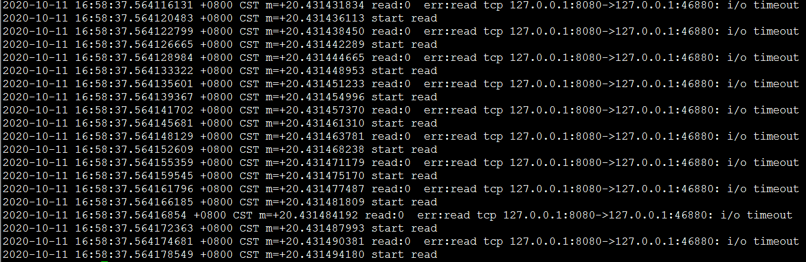

#                                                        总结

  

[TOC]

​         下面的内容均以go.1.8.3为参考

之前还在想，当关闭服务器时，如何优雅的关闭没有采用设置读写超时的协程。现在看来这个不是问题,因为conn.Close会唤醒等待的协程

### go1.8.3 的网络模型

### 等待IO就绪的过程

### poller的执行过程

### TCP链接的并行读写

### 疑问

* 多个协程使用同一个listener，是否线程安全？协程被唤醒时，只唤醒其中一个还是都唤醒

### 注意

* **设想这样一种场景，协程A正在对TCP链接`c`进行阻塞读（未设置超时时间)。协程A仍在阻塞时，协程B对TCP链接`c`设置了一个`过去`的超时时间（或稍后的超时时间）。对A协程会产生怎样的影响。得出的结论是，会唤醒协程A,设置超时时间的代码在参考runtime/netpoll.go 中定义的函数`net_runtime_pollSetDeadline**`
* 若只对读设置了一次超时，超时触发后不再重置超时时间。后面的读取也会返回超时错误。之所以会如此是runtime.netpollcheckerr导致的。可以用案例给出的代码验证这两个问题。
* 调用conn.Close也会唤醒正在因读写进入等待状态的协程

* 即使打开多个不同的监听套接字，使用的epoll的文件描述符也只有一个
* go使用epoll时，用的是ET（edge-triggerd)触发方式。
* 学习下go 对epoll的使用方式
* tcp链接的读写是协程安全的

### 案例

~~~go
func main(){
        l, err := net.Listen("tcp",":8080")
        if err != nil{
                panic(err)
        }
        for{

                conn, err := l.Accept()
                if err != nil{
                        panic(err)
                }
                go handleConn(conn)
                go timeout(conn)
        }
}

func handleConn(conn net.Conn){
        buf := make([]byte, 128)
        for{
                fmt.Printf("%s start read\n", time.Now())
                n, err := conn.Read(buf)
                fmt.Printf("%s read:%d %s err:%v\n", time.Now(), n, string(buf), err)
        }
}

func timeout(conn net.Conn){
        time.Sleep(time.Second *10)
        conn.SetReadDeadline(time.Now().Add(time.Second * -5))
}

~~~

运行上面的代码，并建立一个新链接后的运行结果，如下图所示

