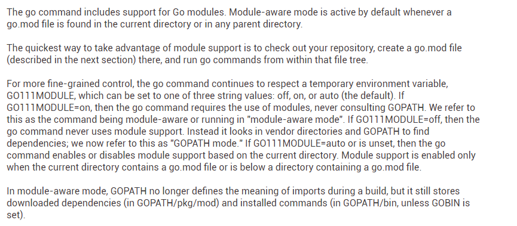

# go 工具集

[TOC]

以下命令中需要包名的参数[packages]需要指定完整的包路径

如有以下代码包test.io/server/model,若在test.io/server/目录下，使用go clean model清除编译model时生成的目标文件，则会报错。若使用go clean test.io/server/model 则ok

### go build 

#### go build

使用方法:

~~~
go build [-o output] [-i] [build flags] [packages]
~~~

go build 编译指定的包和其依赖，但不会安装编译结果

如果编译文件参数由一系列.go文件指定，则认为这一系列文件代指定了要给单一的包

编译packages时，会忽略以'_test.go'结尾的文件。

编译多个包或单一的非main package时，build 会编译packages但会丢弃编译结果，只是检查包是否能购编译

-i 标志会安装编译的包到相应的位置

#### 条件编译

构建约束(build constraint)或构建标签，以注释的形式出现，构建标签必须出现在"包声明"之前。如下

~~~go
// +build
~~~

构建约束的求值规则: 以空格分隔的选项使用OR操作符；以逗号分隔的选项使用AND操作符;以!为前缀的选项使用not

~~~
// +build linux,386 darwin,!cgo
~~~

对应

~~~
(linux AND 386) OR (darwin AND (not cgo))
~~~


一个文件可以有多个构建约束

~~~go
// +build linux darwin
// +build 386
~~~

对应

~~~
(linux OR darwin) AND 386
~~~


##### 阻止文件被编译

使用以下的构建约束可以防止文件被编译

~~~go
// +build ignore
~~~


##### 特殊的文件名

若某个文件去掉文件的拓展名或_test后缀后，匹配以下任意一个模式，如source_windows_amd64.go。GOOS和GOARCH代表已知的操作系统或CPU架构，这个文件则定义了隐式的“构建约束”。如dns_windows.go，只有为windows系统编译时，dns_windows.go才会被编译。math_386.s只有为32位的x86架构才会被编译

~~~
*_GOOS
*_GOARCH 
*_GOOS_GOARCH
~~~

Using GOOS=android matches build tags and files as for GOOS=linux in addition to android tags and files.

Using GOOS=illumos matches build tags and files as for GOOS=solaris in addition to illumos tags and files.


### go clean

用法:

~~~bash
go clean [clean flags] [build flags] [packages]
~~~

clean 移除代码包中的目标文件


flags:

* -cache 移除 go build cache
* -testcache 过期go test产生的cache
* -modcache 移除下载模块时产生的cache

### go doc


### go fix 代码升级

用法:

~~~
go fix [packages]
~~~


### go fmt

用法:

~~~
go fmt [-n][-x] [packages]
~~~

对包中的代码文件进行格式化

-n 输出将要执行的命令，但不执行

-x 输出将要执行的命令，以及执行时的结果。但不执行


### go get

go get 下载指定的包及其依赖，并安装

在go支持module以后，有两种工作模式

* module-aware 模式
* GOPATH 模式

用法:

~~~
go get [-d] [-t] [-u] [-v] [-insecure] [build flags] [packages]
-d 指示get只下载指定包，不安装
-u 命令get使用网络更新本地的包和其依赖。默认情况下,get使用网络获取指定包但不寻找现有包的更新

~~~

##### 确定依赖包的版本

##### 下载、安装依赖包

### go install

用法：

~~~
go install [-i] [build flags] [packages]
~~~

go install 命令编译并安装指定的包

可执行文件被安装在环境变量GOBIN定义的目录下，默认情况下安装在$GOPATH/bin 或者$HOME/go/bin如果环境变量GOPATH未设置的话。

当处于module-aware模式时，其他的包只是被构建并缓存，但不会安装。当module-aware被禁止时构建的包被安装在$GOPATH/pkg/$GOOS_$GOARCH

-i 标志，编译安装指定的包的同时安装其依赖


### go mod

用法:

~~~
go mod <command> [arguments]
~~~

command:

~~~
download    download modules to local cache
edit        edit go.mod from tools or scripts
graph       print module requirement graph
init        initialize new module in current directory
tidy        add missing and remove unused modules
vendor      make vendored copy of dependencies
verify      verify dependencies have expected content
why         explain why packages or modules are needed
~~~


##### GOPATH and Modules

当使用modules时，GOPATH不再用来解析package包的路径


### vendor

假设一个包在GOPATH指定的目录下，又存在于vendor目录中，导入时优先使用vendor中的包


### module



module是一组相关的包的集合。module 取代了之前基于GOPATH解析包的方式

当go.mod文件在当前目录或父母录时，默认使用 module-aware模式


##### GO111MODULE 环境变量

GO111MODULE环境变量控制go使用哪种模式来解析包依赖,可以取on、off、auto三个值

* on，go 命令要求使用module模式，不再使用GOPATH
* off 使用GOPATH和vendor解析包依赖
* auto 若有go.mod文件则使用module模式，否则使用GOPATH模式

##### module的定义

A module is defined by a tree of Go source files with a go.mod file in the tree's root directory. The directory containing the go.mod file is called the module root. Typically the module root will also correspond to a source code repository root (but in general it need not). The module is the set of all Go packages in the module root and its subdirectories, but excluding subtrees with their own go.mod files.


##### main module

The "main module" is the module containing the directory where the go command is run. The go command finds the module root by looking for a go.mod in the current directory, or else the current directory's parent directory, or else the parent's parent directory, and so on.

The main module's go.mod file defines the precise set of packages available for use by the go command, through require, replace, and exclude statements. Dependency modules, found by following require statements, also contribute to the definition of that set of packages, but only through their go.mod files' require statements: any replace and exclude statements in dependency modules are ignored. The replace and exclude statements therefore allow the main module complete control over its own build, without also being subject to complete control by dependencies.

The set of modules providing packages to builds is called the "build list". The build list initially contains only the main module. Then the go command adds to the list the exact module versions required by modules already on the list, recursively, until there is nothing left to add to the list. If multiple versions of a particular module are added to the list, then at the end only the latest version (according to semantic version ordering) is kept for use in the build.

The 'go list' command provides information about the main module and the build list. For example:

```
go list -m              # print path of main module
go list -m -f={{.Dir}}  # print root directory of main module
go list -m all          # print build list
```

##### 疑问

在不使用vendor的情况下，module怎么解决本地依赖