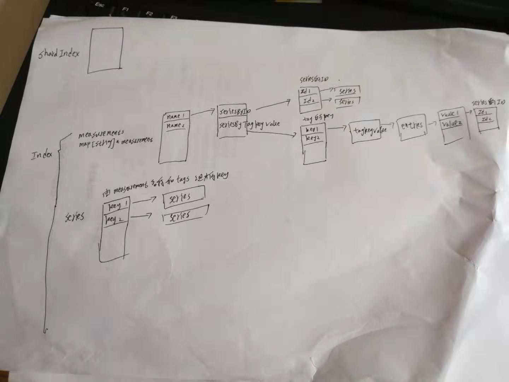

# inmem index

[TOC]

## 总结

* 每个分片一个索引
* series由 "measurment 名称“ 和tags组成的字符串表示
* inmem 索引实际上是一种倒排索引

series :

~~~
————————————————————————————————————————————————————————————————————————
measurement		|tag=value		|	tag=value	|		|
————————————————————————————————————————————————————————————————————————
~~~

整体结构:

来自官方的介绍

~~~
/*
Package inmem implements a shared, in-memory index for each database.

The in-memory index is the original index implementation and provides fast
access to index data. However, it also forces high memory usage for large
datasets and can cause OOM errors.

Index is the shared index structure that provides most of the functionality.
However, ShardIndex is a light per-shard wrapper that adapts this original
shared index format to the new per-shard format.
*/
~~~

##### init 索引注册

~~~go
// IndexName is the name of this index.
const IndexName = tsdb.InmemIndexName

func init() {
	tsdb.NewInmemIndex = func(name string, sfile *tsdb.SeriesFile) (interface{}, error) { return NewIndex(name, sfile), nil }

	tsdb.RegisterIndex(IndexName, func(id uint64, database, path string, seriesIDSet *tsdb.SeriesIDSet, sfile *tsdb.SeriesFile, opt tsdb.EngineOptions) tsdb.Index {
		return NewShardIndex(id, seriesIDSet, opt)
	})
}
~~~

就先看看inmem index是如何工作的

Index 通过维护一个measurements 哈希表(map[string]*measurement)

##### Index的定义

成员:

* series map[string]*series类型的哈希表。key是series(由measurement name 和tags组成)，value是\*series类型的指针。该成员维护该数据库的所有的measurement的所有series
* measurements map[string]*measurement。key是measurement 的名称，value 是\*measurement类型的指针

~~~go
// Index is the in memory index of a collection of measurements, time
// series, and their tags. Exported functions are goroutine safe while
// un-exported functions assume the caller will use the appropriate locks.
type Index struct {
	mu sync.RWMutex

	database string
	sfile    *tsdb.SeriesFile
	fieldset *tsdb.MeasurementFieldSet

	// In-memory metadata index, built on load and updated when new series come in
	measurements map[string]*measurement // measurement name to object and index
	series       map[string]*series      // map series key to the Series object

	seriesSketch, seriesTSSketch             estimator.Sketch
	measurementsSketch, measurementsTSSketch estimator.Sketch

	// Mutex to control rebuilds of the index
	rebuildQueue sync.Mutex
}

~~~

##### NewIndex

~~~go
// NewIndex returns a new initialized Index.
func NewIndex(database string, sfile *tsdb.SeriesFile) *Index {
	index := &Index{
		database:     database,
		sfile:        sfile,
		measurements: make(map[string]*measurement),
		series:       make(map[string]*series),
	}

	index.seriesSketch = hll.NewDefaultPlus()
	index.seriesTSSketch = hll.NewDefaultPlus()
	index.measurementsSketch = hll.NewDefaultPlus()
	index.measurementsTSSketch = hll.NewDefaultPlus()

	return index
}
~~~

### 创建series

##### Index.CreateMeasurementIndexIfNotExists 根据名称获取或创建measurement

~~~go
/ CreateMeasurementIndexIfNotExists creates or retrieves an in memory index
// object for the measurement
func (i *Index) CreateMeasurementIndexIfNotExists(name []byte) *measurement {
	name = escape.Unescape(name)

	// See if the measurement exists using a read-lock
	i.mu.RLock()
	m := i.measurements[string(name)]
	if m != nil {
		i.mu.RUnlock()
		return m
	}
	i.mu.RUnlock()

	// Doesn't exist, so lock the index to create it
	i.mu.Lock()
	defer i.mu.Unlock()

	// Make sure it was created in between the time we released our read-lock
	// and acquire the write lock
	m = i.measurements[string(name)]
	if m == nil {
		m = newMeasurement(i.database, string(name))
		i.measurements[string(name)] = m

		// Add the measurement to the measurements sketch.
		i.measurementsSketch.Add([]byte(name))
	}
	return m
}
~~~

##### Index.CreateSeriesListIfNotExists   创建series

写数据时, 被ShardIndex.CreateSeriesListIfNotExists调用

* 检查series数量是否超过MaxSeriesPerDatabase 默认值是100万
* 调用CreateSeriesListIfNotExists

~~~go
// CreateSeriesListIfNotExists adds the series for the given measurement to the
// index and sets its ID or returns the existing series object
func (i *Index) CreateSeriesListIfNotExists(seriesIDSet *tsdb.SeriesIDSet, measurements map[string]int,
	keys, names [][]byte,
         tagsSlice []models.Tags, opt *tsdb.EngineOptions, ignoreLimits bool) error {

	// Verify that the series will not exceed limit.
	if !ignoreLimits {
		i.mu.RLock()
		if max := opt.Config.MaxSeriesPerDatabase; max > 0 && len(i.series)+len(keys) > max {
			i.mu.RUnlock()
			return errMaxSeriesPerDatabaseExceeded{limit: opt.Config.MaxSeriesPerDatabase}
		}
		i.mu.RUnlock()
	}

	seriesIDs, err := i.sfile.CreateSeriesListIfNotExists(names, tagsSlice)
	if err != nil {
		return err
	}

	i.mu.RLock()
    //？？？？？？？？？？？？？？？？？？？？？？？？？？？？？
    //所有的measurment的key共用一个series, 这样难道不会有问题么？？？
    //没有问题，每个series由 measurement名称和所有tag组成
	// If there is a series for this ID, it's already been added.
	seriesList := make([]*series, len(seriesIDs))
	for j, key := range keys {
		seriesList[j] = i.series[string(key)]
	}
	i.mu.RUnlock()

    //检查是否存在新的 series, key
	var hasNewSeries bool
	for _, ss := range seriesList {
		if ss == nil {
			hasNewSeries = true
			continue
		}

		// This series might need to be added to the local bitset, if the series
		// was created on another shard.
		seriesIDSet.Lock()
		if !seriesIDSet.ContainsNoLock(ss.ID) {
			seriesIDSet.AddNoLock(ss.ID)
			measurements[ss.Measurement.Name]++
		}
		seriesIDSet.Unlock()
	}
	if !hasNewSeries {
		return nil
	}

    //创建measurement
	// get or create the measurement index
	mms := make([]*measurement, len(names))
	for j, name := range names {
		mms[j] = i.CreateMeasurementIndexIfNotExists(name)
	}

	i.mu.Lock()
	defer i.mu.Unlock()

	// Check for the series again under a write lock
	var newSeriesN int
	for j, key := range keys {
		if seriesList[j] != nil {
			continue
		}

		ss := i.series[string(key)]
		if ss == nil {
			newSeriesN++
			continue
		}
		seriesList[j] = ss

		// This series might need to be added to the local bitset, if the series
		// was created on another shard.
        //每个分片索引，一个seriesIDSet
		seriesIDSet.Lock()
		if !seriesIDSet.ContainsNoLock(ss.ID) {
			seriesIDSet.AddNoLock(ss.ID)
			measurements[ss.Measurement.Name]++
		}
		seriesIDSet.Unlock()
	}
	if newSeriesN == 0 {
		return nil
	}
    
    //
	for j, key := range keys {
		// Note, keys may contain duplicates (e.g., because of points for the same series
		// in the same batch). If the duplicate series are new, the index must
		// be rechecked on each iteration.
        //seriesList存放已经存在的series
		if seriesList[j] != nil || i.series[string(key)] != nil {
			continue
		}

        //创建新的series
		// set the in memory ID for query processing on this shard
		// The series key and tags are clone to prevent a memory leak
		skey := string(key)
		ss := newSeries(seriesIDs[j], mms[j], skey, tagsSlice[j].Clone())
		i.series[skey] = ss

		mms[j].AddSeries(ss)

		// Add the series to the series sketch.
		i.seriesSketch.Add(key)

		// This series needs to be added to the bitset tracking undeleted series IDs.
		seriesIDSet.Lock()
		seriesIDSet.AddNoLock(seriesIDs[j])
		measurements[mms[j].Name]++
		seriesIDSet.Unlock()
	}

	return nil
}
~~~

##### Index.assignExistingSeries 过滤掉已经存在的series

参数: key 应该是包含measurement 和 tags的 字节数组

* 过滤掉已经存在的key

~~~go
// assignExistingSeries assigns the existing series to shardID and returns the series, names and tags that
// do not exists yet.
func (i *Index) assignExistingSeries(shardID uint64, seriesIDSet *tsdb.SeriesIDSet, measurements map[string]int,
	keys, names [][]byte,
    tagsSlice []models.Tags)
([][]byte, [][]byte, []models.Tags) {

	i.mu.RLock()
	var n int
	for j, key := range keys {
        //添加不存在的, key 对应series是否已经存在
		if ss := i.series[string(key)]; ss == nil {
			keys[n] = keys[j]
			names[n] = names[j]
			tagsSlice[n] = tagsSlice[j]
			n++
		} else {
			// Add the existing series to this shard's bitset, since this may
			// be the first time the series is added to this shard.
			if !seriesIDSet.Contains(ss.ID) {
				seriesIDSet.Lock()
				if !seriesIDSet.ContainsNoLock(ss.ID) {
					seriesIDSet.AddNoLock(ss.ID)
					measurements[string(names[j])]++
				}
				seriesIDSet.Unlock()
			}
		}
	}
	i.mu.RUnlock()
	return keys[:n], names[:n], tagsSlice[:n]
}
~~~

##### Index.HasTagKey 确定tag key是否存在于指定的measurement

~~~go

// HasTagKey returns true if tag key exists.
func (i *Index) HasTagKey(name, key []byte) (bool, error) {
	i.mu.RLock()
	mm := i.measurements[string(name)]
	i.mu.RUnlock()

	if mm == nil {
		return false, nil
	}
	return mm.HasTagKey(string(key)), nil
}
~~~

##### Index.HasTagValue

~~~go
// HasTagValue returns true if tag value exists.
func (i *Index) HasTagValue(name, key, value []byte) (bool, error) {
	i.mu.RLock()
	mm := i.measurements[string(name)]
	i.mu.RUnlock()

	if mm == nil {
		return false, nil
	}
	return mm.HasTagKeyValue(key, value), nil
}
~~~

## 数据查询

##### Index.TagSets

~~~go
// TagSets returns a list of tag sets.
func (i *Index) TagSets(shardSeriesIDs *tsdb.SeriesIDSet, name []byte, opt query.IteratorOptions) ([]*query.TagSet, error) {
	i.mu.RLock()
	defer i.mu.RUnlock()

	mm := i.measurements[string(name)]
	if mm == nil {
		return nil, nil
	}

	tagSets, err := mm.TagSets(shardSeriesIDs, opt)
	if err != nil {
		return nil, err
	}

	return tagSets, nil
}
~~~

## ShardIndex

##### ShardIndex的定义

~~~go
// Ensure index implements interface.
var _ tsdb.Index = &ShardIndex{}

// ShardIndex represents a shim between the TSDB index interface and the shared
// in-memory index. This is required because per-shard in-memory indexes will
// grow the heap size too large.
type ShardIndex struct {
	id uint64 // shard id

	*Index // Shared reference to global database-wide index.

	// Bitset storing all undeleted series IDs associated with this shard.
	seriesIDSet *tsdb.SeriesIDSet

	// mapping of measurements to the count of series ids in the set. protected
	// by the seriesIDSet lock.
	measurements map[string]int

	opt tsdb.EngineOptions
}
~~~

##### NewShardIndex

~~~go
// NewShardIndex returns a new index for a shard.
func NewShardIndex(id uint64, seriesIDSet *tsdb.SeriesIDSet, opt tsdb.EngineOptions) tsdb.Index {
	return &ShardIndex{
		Index:        opt.InmemIndex.(*Index),
		id:           id,
		seriesIDSet:  seriesIDSet,
		measurements: make(map[string]int),
		opt:          opt,
	}
}
~~~

### 为series添加索引

##### ShardIndex.CreateSeriesListIfNotExists 为tag添加索引

参数:

* keys 包含measurement 和tag
* names measurement 名称数组
* tagsSlice

* 调用 Index.assignExistingSeries , 过滤掉已经存在的 series，一个key就是一个series
* 确保tag的cardinality不超过MaxValuesPerTag(默认值10万)，若超过则丢弃
* 调用Index.CreateSeriesListIfNotExists 添加keys

~~~go
// CreateSeriesListIfNotExists creates a list of series if they doesn't exist in bulk.
func (idx *ShardIndex) CreateSeriesListIfNotExists(keys, names [][]byte, tagsSlice []models.Tags) error {
    //idx.assignExistingSeries实际调用的是Index.assignExistingSeries
	keys, names, tagsSlice = idx.assignExistingSeries(idx.id, idx.seriesIDSet, idx.measurements, keys, names, tagsSlice)
	if len(keys) == 0 {
		return nil
	}

	var (
		reason      string
		droppedKeys [][]byte
	)

    //确保tag的value的唯一值数目不超过MaxValusePerTag
    //MaxValuesPerTag的默认值是10万，在tsdb/config.go中定义
	// Ensure that no tags go over the maximum cardinality.
	if maxValuesPerTag := idx.opt.Config.MaxValuesPerTag; maxValuesPerTag > 0 {
		var n int

	outer:
		for i, name := range names {
			tags := tagsSlice[i]
			for _, tag := range tags {
                //跳过已经存在的tag
				// Skip if the tag value already exists.
				if ok, _ := idx.HasTagValue(name, tag.Key, tag.Value); ok {
					continue
				}

				// Read cardinality. Skip if we're below the threshold.
				n := idx.TagValueN(name, tag.Key)
				if n < maxValuesPerTag {
					continue
				}

				if reason == "" {
					reason = fmt.Sprintf("max-values-per-tag limit exceeded (%d/%d): measurement=%q tag=%q value=%q",
						n, maxValuesPerTag, name, string(tag.Key), string(tag.Value))
				}

				droppedKeys = append(droppedKeys, keys[i])
				continue outer
			}

			// Increment success count if all checks complete.
			if n != i {
				keys[n], names[n], tagsSlice[n] = keys[i], names[i], tagsSlice[i]
			}
			n++
		}

		// Slice to only include successful points.
		keys, names, tagsSlice = keys[:n], names[:n], tagsSlice[:n]
	}

    //MaxSeriesPerDatabase 只应用于inmem 索引,默认值是100万。定义在tsdb/config.go中
	if err := idx.Index.CreateSeriesListIfNotExists(idx.seriesIDSet, idx.measurements, keys, names, tagsSlice, &idx.opt, idx.opt.Config.MaxSeriesPerDatabase == 0); err != nil {
		reason = err.Error()
		droppedKeys = append(droppedKeys, keys...)
	}

	// Report partial writes back to shard.
	if len(droppedKeys) > 0 {
		dropped := len(droppedKeys) // number dropped before deduping
		bytesutil.SortDedup(droppedKeys)
		return tsdb.PartialWriteError{
			Reason:      reason,
			Dropped:     dropped,
			DroppedKeys: droppedKeys,
		}
	}

	return nil
}
~~~

##### Index.TagValueN 获得某个tag的键对应所有值的集合的大小

~~~go
// TagValueN returns the cardinality of a tag value.
func (i *Index) TagValueN(name, key []byte) int {
	i.mu.RLock()
	mm := i.measurements[string(name)]
	i.mu.RUnlock()

	if mm == nil {
		return 0
	}
	return mm.CardinalityBytes(key)
}
~~~

## measurement

先看看measurement 实现了一个怎样的索引结构

measurement 相当于实现了一个倒排索引(invert index) 。哈希表measurement.seriesByID，可以通过series的哈希值，快速确定series对象。而哈希表measurement.seriesByTagKeyValue(key 是tag的key, value是tagKeyValue类型的指针)，则可以通过tag的key找到其对应的所有值(tagKeyValue)。而tagKeyValue又维护了哈希表tagKeyValue.entries (类型map[string]*tagKeyValueEntry , key 是tag的某个key对应的value, 值是\*tagKeyValue类型的指针），tagKeyValueEntry则维护了该value所在的所有series的ID

成员:  

* seriesByID map[suint64]*series 哈希表。key是series的哈希值。value 是\*series类型的指针
* seriesByTagKeyValue map[string]*tagKeyValue。key是tag的key， value是\*tagKeyValue类型的指针。

measurement 定义了表包含的tag的索引

~~~go
// Measurement represents a collection of time series in a database. It also
// contains in memory structures for indexing tags. Exported functions are
// goroutine safe while un-exported functions assume the caller will use the
// appropriate locks.
type measurement struct {
	Database  string
	Name      string `json:"name,omitempty"`
	NameBytes []byte // cached version as []byte

	mu         sync.RWMutex
	fieldNames map[string]struct{}

	// in-memory index fields
	seriesByID          map[uint64]*series      // lookup table for series by their id
    //定义了该measurement包含的所有tag，tag由“键值对”组成。“键”对应map的key,值的集合对应tagKeyValue
	seriesByTagKeyValue map[string]*tagKeyValue // map from tag key to value to sorted set of series ids

	// lazyily created sorted series IDs
	sortedSeriesIDs seriesIDs // sorted list of series IDs in this measurement

	// Indicates whether the seriesByTagKeyValueMap needs to be rebuilt as it contains deleted series
	// that waste memory.
	dirty bool
}

// newMeasurement allocates and initializes a new Measurement.
func newMeasurement(database, name string) *measurement {
	return &measurement{
		Database:  database,
		Name:      name,
		NameBytes: []byte(name),

		fieldNames:          make(map[string]struct{}),
		seriesByID:          make(map[uint64]*series),
		seriesByTagKeyValue: make(map[string]*tagKeyValue),
	}
}
~~~

##### measurement.HasTagKey 检查含有key的tag是否存在

~~~go

// HasTagKey returns true if at least one series in this measurement has written a value for the passed in tag key
func (m *measurement) HasTagKey(k string) bool {
	m.mu.RLock()
	defer m.mu.RUnlock()
	_, hasTag := m.seriesByTagKeyValue[k]
	return hasTag
}

~~~

##### measurement.HasTagKeyValue 是否包含指定的 tag

tag由 key和value组成

~~~go

func (m *measurement) HasTagKeyValue(k, v []byte) bool {
	m.mu.RLock()
	defer m.mu.RUnlock()
	return m.seriesByTagKeyValue[string(k)].Contains(string(v))
}
~~~

##### measurement.CardinalityBytes 某个key的唯一值个数

~~~go
// CardinalityBytes returns the number of values associated with the given tag key.
func (m *measurement) CardinalityBytes(key []byte) int {
	m.mu.RLock()
	defer m.mu.RUnlock()
    //实际是返回的len(tagKeyVlaue.entries)
	return m.seriesByTagKeyValue[string(key)].Cardinality()
}
~~~

##### measurement.AddSeries 添加series，创建映射关系

~~~go
// AddSeries adds a series to the measurement's index.
// It returns true if the series was added successfully or false if the series was already present.
func (m *measurement) AddSeries(s *series) bool {
	if s == nil {
		return false
	}

	m.mu.RLock()
	if m.seriesByID[s.ID] != nil {
		m.mu.RUnlock()
		return false
	}
	m.mu.RUnlock()

	m.mu.Lock()
	defer m.mu.Unlock()

	if m.seriesByID[s.ID] != nil {
		return false
	}

	m.seriesByID[s.ID] = s

	if len(m.seriesByID) == 1 || (len(m.sortedSeriesIDs) == len(m.seriesByID)-1 && s.ID > m.sortedSeriesIDs[len(m.sortedSeriesIDs)-1]) {
		m.sortedSeriesIDs = append(m.sortedSeriesIDs, s.ID)
	}

	// add this series id to the tag index on the measurement
	for _, t := range s.Tags {
		valueMap := m.seriesByTagKeyValue[string(t.Key)]
		if valueMap == nil {
			valueMap = newTagKeyValue()
			m.seriesByTagKeyValue[string(t.Key)] = valueMap
		}
		valueMap.InsertSeriesIDByte(t.Value, s.ID)
	}

	return true
}

~~~

### 数据查询

##### measurement.TagSets

~~~go
// TagSets returns the unique tag sets that exist for the given tag keys. This is used to determine
// what composite series will be created by a group by. i.e. "group by region" should return:
// {"region":"uswest"}, {"region":"useast"}
// or region, service returns
// {"region": "uswest", "service": "redis"}, {"region": "uswest", "service": "mysql"}, etc...
// This will also populate the TagSet objects with the series IDs that match each tagset and any
// influx filter expression that goes with the series
// TODO: this shouldn't be exported. However, until tx.go and the engine get refactored into tsdb, we need it.
func (m *measurement) TagSets(shardSeriesIDs *tsdb.SeriesIDSet, opt query.IteratorOptions) ([]*query.TagSet, error) {
	// get the unique set of series ids and the filters that should be applied to each
	ids, filters, err := m.filters(opt.Condition)
	if err != nil {
		return nil, err
	}

	var dims []string
	if len(opt.Dimensions) > 0 {
		dims = make([]string, len(opt.Dimensions))
		copy(dims, opt.Dimensions)
		sort.Strings(dims)
	}

	m.mu.RLock()
	// For every series, get the tag values for the requested tag keys i.e. dimensions. This is the
	// TagSet for that series. Series with the same TagSet are then grouped together, because for the
	// purpose of GROUP BY they are part of the same composite series.
	tagSets := make(map[string]*query.TagSet, 64)
	var seriesN int
	for _, id := range ids {
		// Abort if the query was killed
		select {
		case <-opt.InterruptCh:
			m.mu.RUnlock()
			return nil, query.ErrQueryInterrupted
		default:
		}

		if opt.MaxSeriesN > 0 && seriesN > opt.MaxSeriesN {
			m.mu.RUnlock()
			return nil, fmt.Errorf("max-select-series limit exceeded: (%d/%d)", seriesN, opt.MaxSeriesN)
		}

		s := m.seriesByID[id]
		if s == nil || s.Deleted() || !shardSeriesIDs.Contains(id) {
			continue
		}

		if opt.Authorizer != nil && !opt.Authorizer.AuthorizeSeriesRead(m.Database, m.NameBytes, s.Tags) {
			continue
		}

		var tagsAsKey []byte
		if len(dims) > 0 {
			tagsAsKey = tsdb.MakeTagsKey(dims, s.Tags)
		}

		tagSet := tagSets[string(tagsAsKey)]
		if tagSet == nil {
			// This TagSet is new, create a new entry for it.
			tagSet = &query.TagSet{
				Tags: nil,
				Key:  tagsAsKey,
			}
			tagSets[string(tagsAsKey)] = tagSet
		}
		// Associate the series and filter with the Tagset.
		tagSet.AddFilter(s.Key, filters[id])
		seriesN++
	}
	// Release the lock while we sort all the tags
	m.mu.RUnlock()

	// Sort the series in each tag set.
	for _, t := range tagSets {
		// Abort if the query was killed
		select {
		case <-opt.InterruptCh:
			return nil, query.ErrQueryInterrupted
		default:
		}

		sort.Sort(t)
	}

	// The TagSets have been created, as a map of TagSets. Just send
	// the values back as a slice, sorting for consistency.
	sortedTagsSets := make([]*query.TagSet, 0, len(tagSets))
	for _, v := range tagSets {
		sortedTagsSets = append(sortedTagsSets, v)
	}
	sort.Sort(byTagKey(sortedTagsSets))

	return sortedTagsSets, nil
}
~~~

##### measurement.filters

~~~go
// filters walks the where clause of a select statement and returns a map with all series ids
// matching the where clause and any filter expression that should be applied to each
func (m *measurement) filters(condition influxql.Expr) ([]uint64, map[uint64]influxql.Expr, error) {
	if condition == nil {
		return m.SeriesIDs(), nil, nil
	}
	return m.WalkWhereForSeriesIds(condition)
}
~~~

### tagKeyValue

tagKeyValue 定义了某个tag 的key所对应的所有value

~~~go

// TagKeyValue provides goroutine-safe concurrent access to the set of series
// ids mapping to a set of tag values.
type tagKeyValue struct {
	mu      sync.RWMutex
	entries map[string]*tagKeyValueEntry
}
~~~

##### tagKeyValue.Contains 

检查在某个tag的所有值中是否包含值value

~~~go
// Contains returns true if the TagKeyValue contains value.
func (t *tagKeyValue) Contains(value string) bool {
	if t == nil {
		return false
	}

	t.mu.RLock()
	defer t.mu.RUnlock()
	_, ok := t.entries[value]
	return ok
}
~~~

##### tagKeyValue.InsertSeriesIDByte

~~~go
// InsertSeriesIDByte adds a series id to the tag key value.
func (t *tagKeyValue) InsertSeriesIDByte(value []byte, id uint64) {
	t.mu.Lock()
	entry := t.entries[string(value)]
	if entry == nil {
		entry = newTagKeyValueEntry()
		t.entries[string(value)] = entry
	}
	entry.m[id] = struct{}{}
	t.mu.Unlock()
}
~~~

#### tagKeyValueEntry

~~~go
type tagKeyValueEntry struct {
	m map[uint64]struct{} // series id set
	a seriesIDs           // lazily sorted list of series.
}
~~~

### seriesIDs

~~~go
// SeriesIDs is a convenience type for sorting, checking equality, and doing
// union and intersection of collections of series ids.
type seriesIDs []uint6
~~~

## series

series定义了其所在的measurement、key(由measurement name和tags组成)、Tags

~~~go
// series belong to a Measurement and represent unique time series in a database.
type series struct {
	mu      sync.RWMutex
	deleted bool

	// immutable
	ID          uint64
	Measurement *measurement
	Key         string
	Tags        models.Tags //Tags 其实是一个 []model.Tag类型的切片
}
~~~

