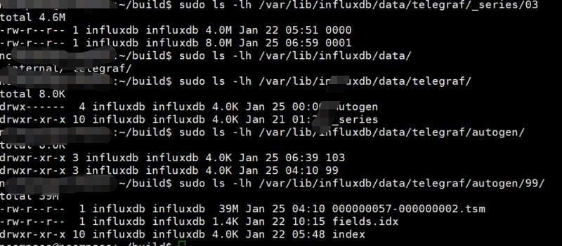

# store

[TOC]

| 目录                                                 | 用途                                                         | 类型                |
| ---------------------------------------------------- | ------------------------------------------------------------ | ------------------- |
| .influxdb/data目录结构                               |                                                              |                     |
| ./influxdb/data                                      | 数据存放路径                                                 |                     |
| ./influxdb/data/数据库名称/policy                    | 每个持久化策略一个目录                                       |                     |
| .influxdb/data/数据库名称/policy/shard_id            | 每个分片一个目录                                             | tsdb/engine模块创建 |
| .influxdb/data/数据库名称/policy名称/shard_id/index  | 分片对应的索引文件                                           | 文件                |
| .influxdb/data/数据库名称/policy/shard_id/fields.idx | 存放表结构的文件                                             | 文件                |
|                                                      |                                                              |                     |
| .influxdb/data/数据库名称/_series                    | 未知                                                         |                     |
| .influxdb/data/数据库名称/_series/partition_id       | 分片目录对应SeriesPartion                                    | 目录                |
| .influxdb/data/数据库名称/_series/partition_id/0000  | 对应SeriesSegmenet,存放序列化后的series                      | 文件                |
| .influxdb/data/数据库名称/_series/partition_id/index | 索引文件, index和SeriesSegment的关系是啥。这个index文件记录的是series在SeriesSegment管理的文件中的位置 | 文件                |
|                                                      |                                                              |                     |
| WAL 目录结构                                         |                                                              |                     |
| .influxdb/wal/数据库名称/policy/shardid              | wal存放目录                                                  |                     |

大致的存储结构：

Store实现了TSDBStore接口，提供CreateShard和WriteToShard接口。coordinator包会使用Store提供的接口

## 总结

索引和SeriesFile的关系

#### .influxdb/data/数据库名称/_series/partition_id/index series 的索引文件格式

一个index文件索引整个partition。series的索引是以hash map形式实现。写入文件的内容也是两个哈希表

第一个哈希表: key_id_map   key: series(由叫做key，由measurement name 和tags组成) value: key的id,这个id仅是一个序列号并非哈希值

第二个哈希表: if_offset_map key: series的哈希值(id)  value: series 在文件中的位置

~~~
magic(4字节 SIDX)		   | version (1字节)
________________________________________________________
max_series_id 			| max offset
________________________________________
count 					| capacity
____________________________________________________________________
key_id_map.offset 		| key_id_map.size
_____________________________________________
id_offset_map.offset	| id_offset_map.size

~~~

#### .influxdb/data/数据库名称/_series/partition_id/0000 存放series的文件格式

#### series的格式

~~~
flag(1字节)|id(8字节)|size|measurement name长度(2字节)|name|tag数量|key长度(2字节)|key| value长度(2字节)|value|key2长度|key2...
~~~

~~~
magic(4字节 SSGE)		|	version(1字节)
____________________________________
series
___________________________________
series
~~~

### 索引

在写入数据的过程中，会为series（由measurement 名称和tags)建立索引。并将每个series写入路径.influxdb/data/数据库/\_series/partition_id/0000的文件，同时每个series在上述文件中的位置及id会写入另一个文件.influxdb/data/数据库/_series/partition_id/index文件

## Store

##### Store的定义

~~~go
// Store manages shards and indexes for databases.
type Store struct {
	mu                sync.RWMutex
	shards            map[uint64]*Shard
	databases         map[string]*databaseState
	sfiles            map[string]*SeriesFile
	SeriesFileMaxSize int64 // Determines size of series file mmap. Can be altered in tests.
	path              string //默认路径是 ~/.influxdb/data

	// shared per-database indexes, only if using "inmem".
	indexes map[string]interface{}

	// Maintains a set of shards that are in the process of deletion.
	// This prevents new shards from being created while old ones are being deleted.
	pendingShardDeletes map[uint64]struct{}

	// Epoch tracker helps serialize writes and deletes that may conflict. It
	// is stored by shard.
	epochs map[uint64]*epochTracker

	EngineOptions EngineOptions

	baseLogger *zap.Logger
	Logger     *zap.Logger

	closing chan struct{}
	wg      sync.WaitGroup
	opened  bool
}
~~~

### 写数据

##### Store.WriteToShard

~~~go
// WriteToShard writes a list of points to a shard identified by its ID.
func (s *Store) WriteToShard(shardID uint64, points []models.Point) error {
	return s.WriteToShardWithContext(context.Background(), shardID, points)
}
~~~

##### Store.WriteToShardWithContext 写数据到分片

~~~go
func (s *Store) WriteToShardWithContext(ctx context.Context, shardID uint64, points []models.Point) error {
	s.mu.RLock()

	select {
	case <-s.closing:
		s.mu.RUnlock()
		return ErrStoreClosed
	default:
	}

    //shards是什么时候创建的, coordinator在遇到此错误后，会调用Store.CreateShard创建
	sh := s.shards[shardID]
	if sh == nil {
		s.mu.RUnlock()
		return ErrShardNotFound
	}

	epoch := s.epochs[shardID]

	s.mu.RUnlock()

	// enter the epoch tracker
	guards, gen := epoch.StartWrite()
	defer epoch.EndWrite(gen)

	// wait for any guards before writing the points.
	for _, guard := range guards {
		if guard.Matches(points) {
			guard.Wait()
		}
	}

	// Ensure snapshot compactions are enabled since the shard might have been cold
	// and disabled by the monitor.
	if sh.IsIdle() {
		sh.SetCompactionsEnabled(true)
	}

	return sh.WritePointsWithContext(ctx, points)
}
~~~

### 创建分片

分片的存储结构是什么样的？

##### Store.CreateShard 创建分片

注意opt.InmemIndex的赋值

写数据时，若没有分片，则会创建分片

* 检查分片是否已经存在，若存在则返回。不存在，则继续
* 检查分片是否处于正在删除状态
* 创建存放分片数据的目录，目录名称 s.path/数据库名称/policy名称。默认(~/.influxdb/data/数据库名称/policy名称)
* 创建分片使用的WAL目录, .influxdb/wal/数据库名称/rention policy名称/shard_id
* 调用Store.openSeriesFile建立SeriesFile和Shard的关联

~~~go
// CreateShard creates a shard with the given id and retention policy on a database.
func (s *Store) CreateShard(database, retentionPolicy string, shardID uint64, enabled bool) error {
	s.mu.Lock()
	defer s.mu.Unlock()

	select {
	case <-s.closing:
		return ErrStoreClosed
	default:
	}

	// Shard already exists.
	if _, ok := s.shards[shardID]; ok {
		return nil
	}

	// Shard may be undergoing a pending deletion. While the shard can be
	// recreated, it must wait for the pending delete to finish.
	if _, ok := s.pendingShardDeletes[shardID]; ok {
		return ErrShardDeletion
	}

    //创建存放分片的目录 s.path的值是: .influxdb/data/
    //完整路径就是: .influxdb/data/数据库名称/rententionPolicy 名称
	// Create the db and retention policy directories if they don't exist.
	if err := os.MkdirAll(filepath.Join(s.path, database, retentionPolicy), 0700); err != nil {
		return err
	}

    //WAL目录 .influxdb/wal/数据库名称/policy名称/shard_id
	// Create the WAL directory.
	walPath := filepath.Join(s.EngineOptions.Config.WALDir, database, retentionPolicy, fmt.Sprintf("%d", shardID))
	if err := os.MkdirAll(walPath, 0700); err != nil {
		return err
	}

    
    //series file的用途还没搞清楚????????????????????????????????
    //搞清楚了: series file 存储的是series(又被称作key),由measurement name和tags组成
	// Retrieve database series file.
	sfile, err := s.openSeriesFile(database)
	if err != nil {
		return err
	}

    //创建索引
	// Retrieve shared index, if needed.
	idx, err := s.createIndexIfNotExists(database)
	if err != nil {
		return err
	}

	// Copy index options and pass in shared index.
	opt := s.EngineOptions
    //===================================
	opt.InmemIndex = idx
	opt.SeriesIDSets = shardSet{store: s, db: database}

    
    //创建分片 path: .influxdb/data/数据库名称/retentionPolicy/shard_id
	path := filepath.Join(s.path, database, retentionPolicy, strconv.FormatUint(shardID, 10))
    //关联shard 和SeriesFile
	shard := NewShard(shardID, path, walPath, sfile, opt)
	shard.WithLogger(s.baseLogger)
	shard.EnableOnOpen = enabled

	if err := shard.Open(); err != nil {
		return err
	}

	s.shards[shardID] = shard
	s.epochs[shardID] = newEpochTracker()
	if _, ok := s.databases[database]; !ok {
		s.databases[database] = new(databaseState)
	}
	s.databases[database].addIndexType(shard.IndexType())
	if state := s.databases[database]; state.hasMultipleIndexTypes() {
		var fields []zapcore.Field
		for idx, cnt := range state.indexTypes {
			fields = append(fields, zap.Int(fmt.Sprintf("%s_count", idx), cnt))
		}
		s.Logger.Warn("Mixed shard index types", append(fields, logger.Database(database))...)
	}

	return nil
}
~~~

##### Store.openSeriesFile 打开或创建series文件

创建分片Store.CreateShard会调用此函数

SeriesFile 是用来存放什么数据的, 用来存放series

~~~go
// openSeriesFile either returns or creates a series file for the provided
// database. It must be called under a full lock.
func (s *Store) openSeriesFile(database string) (*SeriesFile, error) {
	if sfile := s.sfiles[database]; sfile != nil {
		return sfile, nil
	}

    //SeriesFileDirectory是一个字符串常量，字面值是_series
    //.influxdb/data/数据库名称/_series
	sfile := NewSeriesFile(filepath.Join(s.path, database, SeriesFileDirectory))
	sfile.WithMaxCompactionConcurrency(s.EngineOptions.Config.SeriesFileMaxConcurrentSnapshotCompactions)
	sfile.Logger = s.baseLogger
	if err := sfile.Open(); err != nil {
		return nil, err
	}
	s.sfiles[database] = sfile
	return sfile, nil
}
~~~

##### Store.createIndexIfNotExists 创建存放series 的索引文件

参数name 是数据库名称

~~~go
// createIndexIfNotExists returns a shared index for a database, if the inmem
// index is being used. If the TSI index is being used, then this method is
// basically a no-op.
//NewInmemIndex明确指明的是inmem index, 为啥注释说 if the TSI index is being used,
func (s *Store) createIndexIfNotExists(name string) (interface{}, error) {
	if idx := s.indexes[name]; idx != nil {
		return idx, nil
	}

	sfile, err := s.openSeriesFile(name)
	if err != nil {
		return nil, err
	}

    //NewInmemIndex 定义在tsdb/engine.go中
    //在tsdb/index/inmem/inmem.go中被初始化
	idx, err := NewInmemIndex(name, sfile)
	if err != nil {
		return nil, err
	}

	s.indexes[name] = idx
	return idx, nil
}
~~~

## SeriesFile

一个分片对应一个SeriesFile

SeriesFile 是用来存放什么数据的

##### SeriesFile的定义

SeriesFile 包含：

* 分片数组 partitions
* 最大并发数 maxSnapshotConcurrency

~~~go
// SeriesFile represents the section of the index that holds series data.
type SeriesFile struct {
	path       string
	partitions []*SeriesPartition

	maxSnapshotConcurrency int

	refs sync.RWMutex // RWMutex to track references to the SeriesFile that are in use.

	Logger *zap.Logger
}

const SeriesIDSize = 8

const (
	// SeriesFilePartitionN is the number of partitions a series file is split into.
	SeriesFilePartitionN = 8
)
~~~

##### NewSeriesFile 

~~~go 
// NewSeriesFile returns a new instance of SeriesFile.
//path 是一个文件夹路径 值是: influxdb/data/数据库名称/_series
func NewSeriesFile(path string) *SeriesFile {
	maxSnapshotConcurrency := runtime.GOMAXPROCS(0)
	if maxSnapshotConcurrency < 1 {
		maxSnapshotConcurrency = 1
	}

	return &SeriesFile{
		path:                   path,
		maxSnapshotConcurrency: maxSnapshotConcurrency,
		Logger:                 zap.NewNop(),
	}
}
~~~

##### SeriesFile.Open

* 创建目录.influxdb/data/数据库名称/_series

~~~go
// Open memory maps the data file at the file's path.
func (f *SeriesFile) Open() error {
	// Wait for all references to be released and prevent new ones from being acquired.
	f.refs.Lock()
	defer f.refs.Unlock()

    //创建目录
	// Create path if it doesn't exist.
	if err := os.MkdirAll(filepath.Join(f.path), 0777); err != nil {
		return err
	}

	// Limit concurrent series file compactions
	compactionLimiter := limiter.NewFixed(f.maxSnapshotConcurrency)

    //SeriesFilePartitionN 是8
    //f.SeriesPartitionPath返回的路径是: .influxdb/data/数据库名称/_series/partition id
    //
	// Open partitions.
	f.partitions = make([]*SeriesPartition, 0, SeriesFilePartitionN)
	for i := 0; i < SeriesFilePartitionN; i++ {
		p := NewSeriesPartition(i, f.SeriesPartitionPath(i), compactionLimiter)
		p.Logger = f.Logger.With(zap.Int("partition", p.ID()))
		if err := p.Open(); err != nil {
			f.Logger.Error("Unable to open series file",
				zap.String("path", f.path),
				zap.Int("partition", p.ID()),
				zap.Error(err))
			f.close()
			return err
		}
		f.partitions = append(f.partitions, p)
	}

	return nil
}
~~~

### 将series写入文件

对于inmem类型的索引，创建索引时， Index.CreateSeriesListIfNotExists 会调用此处的函数

##### SeriesFile.CreateSeriesListIfNotExists 将series序列化后写入文件

* 调用GenerateSeriesKeys, 生成序列化的内容:  size|measurement name长度|name|tag数量|key长度|key| value长度|value|key2长度|key2...
* 调用SeriesFile.SeriesKeysPartitionIDs， 确定series 放入哪个partition
* 调用SeriesPartition.CreateSeriesListIfNotExists 将序列化的keys写入文件

~~~go
// CreateSeriesListIfNotExists creates a list of series in bulk if they don't exist.
// The returned ids slice returns IDs for every name+tags, creating new series IDs as needed.
func (f *SeriesFile) CreateSeriesListIfNotExists(names [][]byte, tagsSlice []models.Tags) ([]uint64, error) {
	keys := GenerateSeriesKeys(names, tagsSlice)

    //SeriesKeysPartitionIDS 会计算每个key的哈希值，然后计算hash(key)% SeriesFilePartitionN ,看key落在哪个partition
	keyPartitionIDs := f.SeriesKeysPartitionIDs(keys)
	ids := make([]uint64, len(keys))

	var g errgroup.Group
	for i := range f.partitions {
		p := f.partitions[i]
		g.Go(func() error {
			return p.CreateSeriesListIfNotExists(keys, keyPartitionIDs, ids)
		})
	}
	if err := g.Wait(); err != nil {
		return nil, err
	}
	return ids, nil
}
~~~

##### GenerateSeriesKeys 将measurement 和tags序列化

~~~go
// GenerateSeriesKeys generates series keys for a list of names & tags using
// a single large memory block.
func GenerateSeriesKeys(names [][]byte, tagsSlice []models.Tags) [][]byte {
    //SeriesKeysSize会计算 所需要的空间总大小
	buf := make([]byte, 0, SeriesKeysSize(names, tagsSlice))
	keys := make([][]byte, len(names))
	for i := range names {
		offset := len(buf)
        //AppendSeriesKey 将name序列化到buf中
    //buf的内容是: size|name长度|name|tag数量|key长度|key| value长度|value|key2长度|key2...
		buf = AppendSeriesKey(buf, names[i], tagsSlice[i])
		keys[i] = buf[offset:]
	}
	return keys
}
~~~

##### AppendSeriesKey 序列化series

~~~go
// AppendSeriesKey serializes name and tags to a byte slice.
// The total length is prepended as a uvarint.
func AppendSeriesKey(dst []byte, name []byte, tags models.Tags) []byte {
    //binary.MaxVarintLen64的值是10
	buf := make([]byte, binary.MaxVarintLen64)
	origLen := len(dst)

	// The tag count is variable encoded, so we need to know ahead of time what
	// the size of the tag count value will be.
	tcBuf := make([]byte, binary.MaxVarintLen64)
	tcSz := binary.PutUvarint(tcBuf, uint64(len(tags)))

	// Size of name/tags. Does not include total length.
	size := 0 + //
		2 + // size of measurement
		len(name) + // measurement
		tcSz + // size of number of tags
		(4 * len(tags)) + // length of each tag key and value 为啥乘以4,因为每个tag的key、value的长度各需要2字节
		tags.Size() // size of tag keys/values

    
	// Variable encode length.
	totalSz := binary.PutUvarint(buf, uint64(size))

	// If caller doesn't provide a buffer then pre-allocate an exact one.
	if dst == nil {
		dst = make([]byte, 0, size+totalSz)
	}
    //此时buf的内容是: size|
	// Append total length.
	dst = append(dst, buf[:totalSz]...)

    //buf内容: name长度
    //dst内容: size| name长度| name
	// Append name.
	binary.BigEndian.PutUint16(buf, uint16(len(name)))
	dst = append(dst, buf[:2]...)
	dst = append(dst, name...)

    //dst内容: size|name长度|name|tag数量
	// Append tag count.
	dst = append(dst, tcBuf[:tcSz]...)

    //dst内容: size|name长度|name|tag数量|key长度|key| value长度|value|key2长度|key2...
	// Append tags.
	for _, tag := range tags {
		binary.BigEndian.PutUint16(buf, uint16(len(tag.Key)))
		dst = append(dst, buf[:2]...)
		dst = append(dst, tag.Key...)

		binary.BigEndian.PutUint16(buf, uint16(len(tag.Value)))
		dst = append(dst, buf[:2]...)
		dst = append(dst, tag.Value...)
	}

	// Verify that the total length equals the encoded byte count.
	if got, exp := len(dst)-origLen, size+totalSz; got != exp {
		panic(fmt.Sprintf("series key encoding does not match calculated total length: actual=%d, exp=%d, key=%x", got, exp, dst))
	}

	return dst
}
~~~

## SeriesPartition

tsdb/series_partition.go 文件

一个SeriesPartition包含多个SeriesSegment

~~~go
// SeriesPartition represents a subset of series file data.
type SeriesPartition struct {
	mu   sync.RWMutex
	wg   sync.WaitGroup
	id   int
    path string //目录路径: .influxdb/data/数据库名称/_series/partion_id

	closed  bool
	closing chan struct{}
	once    sync.Once

	segments []*SeriesSegment
	index    *SeriesIndex
	seq      uint64 // series id sequence

	compacting          bool
	compactionLimiter   limiter.Fixed
	compactionsDisabled int

	CompactThreshold int

	Logger *zap.Logger
}
~~~

##### NewSeriesPartition

~~~go
// NewSeriesPartition returns a new instance of SeriesPartition.
func NewSeriesPartition(id int, path string, compactionLimiter limiter.Fixed) *SeriesPartition {
	return &SeriesPartition{
		id:                id, //partition_id
		path:              path, //.influxdb/data/数据库名称/_series/partition_id
		closing:           make(chan struct{}),
		compactionLimiter: compactionLimiter,
		CompactThreshold:  DefaultSeriesPartitionCompactThreshold,
		Logger:            zap.NewNop(),
		seq:               uint64(id) + 1,
	}
}
~~~

##### SeriesPartition.Open 创建 .influxdb/data/数据库名称/_series/partion_id目录

* 创建目录 .influxdb/data/数据库名称/_series/partition_id
* 调用p.openSegments创建文件
* 调用NewSeriesIndex创建索引文件

~~~go
// Open memory maps the data file at the partition's path.
func (p *SeriesPartition) Open() error {
	if p.closed {
		return errors.New("tsdb: cannot reopen series partition")
	}

	// Create path if it doesn't exist.
	if err := os.MkdirAll(filepath.Join(p.path), 0777); err != nil {
		return err
	}

    //为写初始化
	// Open components.
	if err := func() (err error) {
		if err := p.openSegments(); err != nil {
			return err
		}

		// Init last segment for writes.
		if err := p.activeSegment().InitForWrite(); err != nil {
			return err
		}

        //创建索引文件.influxdb/data/数据库名称/_series/partion_id/index
		p.index = NewSeriesIndex(p.IndexPath())
		if err := p.index.Open(); err != nil {
			return err
		} else if p.index.Recover(p.segments); err != nil {
			return err
		}

		return nil
	}(); err != nil {
		p.Close()
		return err
	}

	return nil
}
~~~

##### SeriesPartition.openSegments

* 读取目录.influxdb/data/数据库名称/_series/partion_id 中的所有文件

* 创建初始的SeriesSegment

~~~go
func (p *SeriesPartition) openSegments() error {
	fis, err := ioutil.ReadDir(p.path)
	if err != nil {
		return err
	}

    //加载已经存在的segment文件
	for _, fi := range fis {
		segmentID, err := ParseSeriesSegmentFilename(fi.Name())
		if err != nil {
			continue
		}

		segment := NewSeriesSegment(segmentID, filepath.Join(p.path, fi.Name()))
		if err := segment.Open(); err != nil {
			return err
		}
		p.segments = append(p.segments, segment)
	}

    //MaxSeriesID 会读取segment文件，遍历所有series 获取最大的id
	// Find max series id by searching segments in reverse order.
	for i := len(p.segments) - 1; i >= 0; i-- {
		if seq := p.segments[i].MaxSeriesID(); seq >= p.seq {
			// Reset our sequence num to the next one to assign
			p.seq = seq + SeriesFilePartitionN
			break
		}
	}

    //创建初始的段 .influxdb/data/数据库名称/_series/partion_id/0000
	// Create initial segment if none exist.
	if len(p.segments) == 0 {
        
        //CreateSeriesSegment 会打开文件.influxdb/data/数据库名称/_series/partition_id/0000, 并将该文件映射到内存mmap
		segment, err := CreateSeriesSegment(0, filepath.Join(p.path, "0000"))
		if err != nil {
			return err
		}
		p.segments = append(p.segments, segment)
	}

	return nil
}
~~~

### 写series到文件

##### SeriesPartition.CreateSeriesListIfNotExists 将series写入文件并建立series的位置索引

参数:

* keys 是字节数组的数组， 每个key是measurement 和tags序列化后的内容
* keyPartitionIDs 是每个key对应的partition id
* 调用p.insert将series写入SeriesSegment管理的文件，并返回series在文件中的位置和id
* 调用p.Index.Insert 为上面写入的series建立索引

~~~go
// CreateSeriesListIfNotExists creates a list of series in bulk if they don't exist.
// The ids parameter is modified to contain series IDs for all keys belonging to this partition.
func (p *SeriesPartition) CreateSeriesListIfNotExists(keys [][]byte, keyPartitionIDs []int, ids []uint64) error {
	var writeRequired bool
	p.mu.RLock()
	if p.closed {
		p.mu.RUnlock()
		return ErrSeriesPartitionClosed
	}
    
	for i := range keys {
		if keyPartitionIDs[i] != p.id {
			continue
		}
		id := p.index.FindIDBySeriesKey(p.segments, keys[i])
		if id == 0 {
			writeRequired = true
			continue
		}
		ids[i] = id
	}
	p.mu.RUnlock()

	// Exit if all series for this partition already exist.
	if !writeRequired {
		return nil
	}

	type keyRange struct {
		id     uint64
		offset int64
	}
	newKeyRanges := make([]keyRange, 0, len(keys))

	// Obtain write lock to create new series.
	p.mu.Lock()
	defer p.mu.Unlock()

	if p.closed {
		return ErrSeriesPartitionClosed
	}

	// Track offsets of duplicate series.
	newIDs := make(map[string]uint64, len(ids))

	for i := range keys {
		// Skip series that don't belong to the partition or have already been created.
		if keyPartitionIDs[i] != p.id || ids[i] != 0 {
			continue
		}

		// Re-attempt lookup under write lock.
		key := keys[i]
		if ids[i] = newIDs[string(key)]; ids[i] != 0 {
			continue
		} else if ids[i] = p.index.FindIDBySeriesKey(p.segments, key); ids[i] != 0 {
			continue
		}

        //写入文件 .influxdb/data/数据库名称/_series/partition_id/0000
        //id 由p.seq维护
        //id有什么用， offset 是key在文件中的位置
		// Write to series log and save offset.
		id, offset, err := p.insert(key)
		if err != nil {
			return err
		}
		// Append new key to be added to hash map after flush.
		ids[i] = id
		newIDs[string(key)] = id
		newKeyRanges = append(newKeyRanges, keyRange{id, offset})
	}
    
	//
	// Flush active segment writes so we can access data in mmap.
	if segment := p.activeSegment(); segment != nil {
		if err := segment.Flush(); err != nil {
			return err
		}
	}

    // 也就是说SeriesIndex 记录的是series在文件中的位置及id
	// Add keys to hash map(s).
	for _, keyRange := range newKeyRanges {
        //seriesKeyByOffset 会读取位于keyRange.offset的series
		p.index.Insert(p.seriesKeyByOffset(keyRange.offset), keyRange.id, keyRange.offset)
	}

    /*
   每当内存中series的索引数目超过128k,就开始写盘。但是写的是同一个文件。
   那问题就来了。series的索引以hash实现，那已经在磁盘上的数据和新追加的数据是合并到一起然后重新写盘么？？？ 还是只保存最后一次的
   
   目前看是这样的，假设写第一次磁盘成功，写入后会重新为所有的series建立索引。后面的数据会追加到
    */
    // 压缩
	// Check if we've crossed the compaction threshold.
    //p.CompactThreshold的默认值是128K 近12万
  //  DefaultSeriesPartitionCompactThreshold 指定
    //index.InMemCount 是SeriesIndex.idOffsetMap 的长度
	if p.compactionsEnabled() && !p.compacting &&
		p.CompactThreshold != 0 && p.index.InMemCount() >= uint64(p.CompactThreshold) &&
		p.compactionLimiter.TryTake() {
		p.compacting = true
		log, logEnd := logger.NewOperation(p.Logger, "Series partition compaction", "series_partition_compaction", zap.String("path", p.path))

		p.wg.Add(1)
		go func() {
			defer p.wg.Done()
			defer p.compactionLimiter.Release()

			compactor := NewSeriesPartitionCompactor()
			compactor.cancel = p.closing
			if err := compactor.Compact(p); err != nil {
				log.Error("series partition compaction failed", zap.Error(err))
			}

			logEnd()

			// Clear compaction flag.
			p.mu.Lock()
			p.compacting = false
			p.mu.Unlock()
		}()
	}

	return nil
}
~~~

##### SeriesPartition.insert 将series写入segment

p.seq 作为series的id，为啥每个加8

* 生成key的id, id 即SeriesPartition.seq的值
* 调用AppendSeriesEntry, 将id、SeriesEntryInsertFlag和key序列化到一个buffer中
* 

~~~go
func (p *SeriesPartition) insert(key []byte) (id uint64, offset int64, err error) {
    //这个id
	id = p.seq
	offset, err = p.writeLogEntry(AppendSeriesEntry(nil, SeriesEntryInsertFlag, id, key))
	if err != nil {
		return 0, 0, err
	}
    //下一个id为何加8
	//SeriesFilePartitionN 是整形常量8
	p.seq += SeriesFilePartitionN
	return id, offset, nil
}

~~~

##### SeriesPartition.writeLogEntry

*  调用SeriesPartition.activeSegment 获取当前的SeriesSegment
* 若segment为nil或调用segment.CanWrite检查是否可以继续写入数据。若segment管理的存放series的文件大小超过阈值(最小4M，最大256M)。则需要创建新的segment

~~~go
// writeLogEntry appends an entry to the end of the active segment.
// If there is no more room in the segment then a new segment is added.
func (p *SeriesPartition) writeLogEntry(data []byte) (offset int64, err error) {
	segment := p.activeSegment()
	if segment == nil || !segment.CanWrite(data) {
		if segment, err = p.createSegment(); err != nil {
			return 0, err
		}
	}
	return segment.WriteLogEntry(data)
}

//
// createSegment appends a new segment
func (p *SeriesPartition) createSegment() (*SeriesSegment, error) {
	// Close writer for active segment, if one exists.
    //关闭旧的segment, 需要注意的是被关闭的segment并没有从p.segments中移出
	if segment := p.activeSegment(); segment != nil {
		if err := segment.CloseForWrite(); err != nil {
			return nil, err
		}
	}

	// Generate a new sequential segment identifier.
	var id uint16
	if len(p.segments) > 0 {
		id = p.segments[len(p.segments)-1].ID() + 1
	}
	filename := fmt.Sprintf("%04x", id)

	// Generate new empty segment.
	segment, err := CreateSeriesSegment(id, filepath.Join(p.path, filename))
	if err != nil {
		return nil, err
	}
	p.segments = append(p.segments, segment)

	// Allow segment to write.
	if err := segment.InitForWrite(); err != nil {
		return nil, err
	}

	return segment, nil
}
~~~

### series的位置索引写入磁盘

##### SeriesPartitionCompactor

~~~go
// SeriesPartitionCompactor represents an object reindexes a series partition and optionally compacts segments.
type SeriesPartitionCompactor struct {
	cancel <-chan struct{}
}

// NewSeriesPartitionCompactor returns a new instance of SeriesPartitionCompactor.
func NewSeriesPartitionCompactor() *SeriesPartitionCompactor {
	return &SeriesPartitionCompactor{}
}
~~~

##### SeriesPartitionCompactor.Compact

~~~go

// Compact rebuilds the series partition index.
func (c *SeriesPartitionCompactor) Compact(p *SeriesPartition) error {
	// Snapshot the partitions and index so we can check tombstones and replay at the end under lock.
	p.mu.RLock()
	segments := CloneSeriesSegments(p.segments)
	index := p.index.Clone()
    //seriesN 包括磁盘和内存中的总数
	seriesN := p.index.Count()
	p.mu.RUnlock()

    //假设之前有一个index文件, 这不就覆盖了原来的么
	// Compact index to a temporary location.
	indexPath := index.path + ".compacting"
	if err := c.compactIndexTo(index, seriesN, segments, indexPath); err != nil {
		return err
	}

	// Swap compacted index under lock & replay since compaction.
	if err := func() error {
		p.mu.Lock()
		defer p.mu.Unlock()

		// Reopen index with new file.
		if err := p.index.Close(); err != nil {
			return err
		} else if err := os.Rename(indexPath, index.path); err != nil {
			return err
		} else if err := p.index.Open(); err != nil {
			return err
		}

		// Replay new entries.
		if err := p.index.Recover(p.segments); err != nil {
			return err
		}
		return nil
	}(); err != nil {
		return err
	}

	return nil
}

~~~

##### SeriesPartitionCompactor.compactIndexTo 索引数据写入磁盘

参数：

* index 此时的index是个副本

即便是在内存中的series,也已经写入segment管理的文件中了

~~~go

func (c *SeriesPartitionCompactor) compactIndexTo(index *SeriesIndex, seriesN uint64, segments []*SeriesSegment, path string) error {
	hdr := NewSeriesIndexHeader()
	hdr.Count = seriesN
    //SeriesIndexLoadFactor的值是90 
    //为啥hdr.Count * 100 
	hdr.Capacity = pow2((int64(hdr.Count) * 100) / SeriesIndexLoadFactor)

    //SeriesIndexElemSize 的值是16
	// Allocate space for maps.
	keyIDMap := make([]byte, (hdr.Capacity * SeriesIndexElemSize))
	idOffsetMap := make([]byte, (hdr.Capacity * SeriesIndexElemSize))

    //
	// Reindex all partitions.
	var entryN int
	for _, segment := range segments {
		errDone := errors.New("done")

        //遍历所有已经写入segment的series
		if err := segment.ForEachEntry(func(flag uint8, id uint64, offset int64, key []byte) error {

            //series在文件中的位置, index.maxOffset是创建index副本时的最大值
			// Make sure we don't go past the offset where the compaction began.
			if offset > index.maxOffset {
				return errDone
			}

			// Check for cancellation periodically.
			if entryN++; entryN%1000 == 0 {
				select {
				case <-c.cancel:
					return ErrSeriesPartitionCompactionCancelled
				default:
				}
			}

			// Only process insert entries.
			switch flag {
			case SeriesEntryInsertFlag: // fallthrough
			case SeriesEntryTombstoneFlag:
				return nil
			default:
				return fmt.Errorf("unexpected series partition log entry flag: %d", flag)
			}

			// Save max series identifier processed.
			hdr.MaxSeriesID, hdr.MaxOffset = id, offset

			// Ignore entry if tombstoned.
			if index.IsDeleted(id) {
				return nil
			}

			// Insert into maps.
			c.insertIDOffsetMap(idOffsetMap, hdr.Capacity, id, offset)
			return c.insertKeyIDMap(keyIDMap, hdr.Capacity, segments, key, offset, id)
		}); err == errDone {//end
			break
		} else if err != nil {
			return err
		}
	}//end for

	// Open file handler.
	f, err := os.Create(path)
	if err != nil {
		return err
	}
	defer f.Close()

	// Calculate map positions.
	hdr.KeyIDMap.Offset, hdr.KeyIDMap.Size = SeriesIndexHeaderSize, int64(len(keyIDMap))
	hdr.IDOffsetMap.Offset, hdr.IDOffsetMap.Size = hdr.KeyIDMap.Offset+hdr.KeyIDMap.Size, int64(len(idOffsetMap))

	// Write header.
	if _, err := hdr.WriteTo(f); err != nil {
		return err
	}

	// Write maps.
	if _, err := f.Write(keyIDMap); err != nil {
		return err
	}  else if _, err := f.Write(idOffsetMap); err != nil {
		return err
	}

	// Sync & close.
	if err := f.Sync(); err != nil {
		return err
	} else if err := f.Close(); err != nil {
		return err
	}

	return nil
}
~~~

##### SeriesPartitionCompactor.insertIDOffsetMap 

参数:

* dst 字节数组，以其作为哈希表的存储

tsdb/series_partition.go

~~~go
func (c *SeriesPartitionCompactor) insertIDOffsetMap(dst []byte, capacity int64, id uint64, offset int64) {
	mask := capacity - 1
	hash := rhh.HashUint64(id)

	// Continue searching until we find an empty slot or lower probe distance.
	for i, dist, pos := int64(0), int64(0), hash&mask; ; i, dist, pos = i+1, dist+1, (pos+1)&mask {
		assert(i <= capacity, "id/offset map full")
        //SeriesIndexElemSize 定义在tsdb/series_index.go中，大小为16
		elem := dst[(pos * SeriesIndexElemSize):]

        
		// If empty slot found or matching id, insert and exit.
		elemID := binary.BigEndian.Uint64(elem[:8])
		elemOffset := int64(binary.BigEndian.Uint64(elem[8:]))
        //elemOffset 为0。说明是空闲的位置
        //elemOffset == offset, elemID一定相等么???????????
		if elemOffset == 0 || elemOffset == offset {
			binary.BigEndian.PutUint64(elem[:8], id)
			binary.BigEndian.PutUint64(elem[8:], uint64(offset))
			return
		}

		// Hash key.
		elemHash := rhh.HashUint64(elemID)

        /* Dist的实现
// Dist returns the probe distance for a hash in a slot index.
// NOTE: Capacity must be a power of 2.
func Dist(hash, i, capacity int64) int64 {
	mask := capacity - 1
	dist := (i + capacity - (hash & mask)) & mask
	return dist
}
        */
		// If the existing elem has probed less than us, then swap places with
		// existing elem, and keep going to find another slot for that elem.
		if d := rhh.Dist(elemHash, pos, capacity); d < dist {
			// Insert current values.
			binary.BigEndian.PutUint64(elem[:8], id)
			binary.BigEndian.PutUint64(elem[8:], uint64(offset))

			// Swap with values in that position.
			hash, id, offset = elemHash, elemID, elemOffset

			// Update current distance.
			dist = d
		}
	}
}
~~~

##### SeriesPartitionCompactor.insertKeyIDMap 

~~~go
func (c *SeriesPartitionCompactor) insertKeyIDMap(dst []byte, capacity int64, segments []*SeriesSegment, key []byte, offset int64, id uint64) error {
	mask := capacity - 1
	hash := rhh.HashKey(key)

	// Continue searching until we find an empty slot or lower probe distance.
	for i, dist, pos := int64(0), int64(0), hash&mask; ; i, dist, pos = i+1, dist+1, (pos+1)&mask {
		assert(i <= capacity, "key/id map full")
		elem := dst[(pos * SeriesIndexElemSize):]

		// If empty slot found or matching offset, insert and exit.
		elemOffset := int64(binary.BigEndian.Uint64(elem[:8]))
		elemID := binary.BigEndian.Uint64(elem[8:])
		if elemOffset == 0 || elemOffset == offset {
			binary.BigEndian.PutUint64(elem[:8], uint64(offset))
			binary.BigEndian.PutUint64(elem[8:], id)
			return nil
		}

		// Read key at position & hash.
		elemKey := ReadSeriesKeyFromSegments(segments, elemOffset+SeriesEntryHeaderSize)
		elemHash := rhh.HashKey(elemKey)

		// If the existing elem has probed less than us, then swap places with
		// existing elem, and keep going to find another slot for that elem.
		if d := rhh.Dist(elemHash, pos, capacity); d < dist {
			// Insert current values.
			binary.BigEndian.PutUint64(elem[:8], uint64(offset))
			binary.BigEndian.PutUint64(elem[8:], id)

			// Swap with values in that position.
			hash, key, offset, id = elemHash, elemKey, elemOffset, elemID

			// Update current distance.
			dist = d
		}
	}
}
~~~

## SeriesIndex  series的索引文件

创建索引文件.influxdb/data/数据库名称/_series/partion_id/index

##### SeriesIndex的定义

因为存储在index文件中的是两个哈希表。每次写盘时，都需要将已经在磁盘中的数据重新加载到哈希表中然后和内存数据写入磁盘。

SeriesIndex维护的series的索引一部分在内存中，由SeriesIndex.keyIDMap和SeriesIndex.idOffsetMap维护。另一部分在磁盘上，由SeriesIndex.keyIDData维护

~~~go
// SeriesIndex represents an index of key-to-id & id-to-offset mappings.
type SeriesIndex struct {
	path string

	count    uint64
	capacity int64
	mask     int64

	maxSeriesID uint64
	maxOffset   int64

	data         []byte // mmap data 磁盘映射
	keyIDData    []byte // key/id mmap data
	idOffsetData []byte // id/offset mmap data

	// In-memory data since rebuild.
	keyIDMap    *rhh.HashMap
	idOffsetMap map[uint64]int64
	tombstones  map[uint64]struct{}
}

//创建索引文件.influxdb/data/数据库名称/_series/partion_id/index
func NewSeriesIndex(path string) *SeriesIndex {
	return &SeriesIndex{
		path: path,
	}
}
~~~

##### SeriesIndex.Open 打开索引文件

索引文件名称是: influxdb/data/数据库名称/_series/partion_id/index

~~~go
// Open memory-maps the index file.
func (idx *SeriesIndex) Open() (err error) {
	// Map data file, if it exists.
	if err := func() error {
		if _, err := os.Stat(idx.path); err != nil && !os.IsNotExist(err) {
			return err
		} else if err == nil { //文件存在
			if idx.data, err = mmap.Map(idx.path, 0); err != nil {
				return err
			}

			hdr, err := ReadSeriesIndexHeader(idx.data)
			if err != nil {
				return err
			}
			idx.count, idx.capacity, idx.mask = hdr.Count, hdr.Capacity, hdr.Capacity-1
			idx.maxSeriesID, idx.maxOffset = hdr.MaxSeriesID, hdr.MaxOffset

			idx.keyIDData = idx.data[hdr.KeyIDMap.Offset : hdr.KeyIDMap.Offset+hdr.KeyIDMap.Size]
			idx.idOffsetData = idx.data[hdr.IDOffsetMap.Offset : hdr.IDOffsetMap.Offset+hdr.IDOffsetMap.Size]
		}
		return nil
	}(); err != nil {
		idx.Close()
		return err
	}

	idx.keyIDMap = rhh.NewHashMap(rhh.DefaultOptions)
	idx.idOffsetMap = make(map[uint64]int64)
	idx.tombstones = make(map[uint64]struct{})
	return nil
}
~~~

##### SeriesIndex.Recover

Recover 在series的索引刷到磁盘之后，会调用此函数。目的是将刷盘时新增的series的索引，放到内存中。

~~~go
// Recover rebuilds the in-memory index for all new entries.
func (idx *SeriesIndex) Recover(segments []*SeriesSegment) error {
	// Allocate new in-memory maps.
	idx.keyIDMap = rhh.NewHashMap(rhh.DefaultOptions)
	idx.idOffsetMap = make(map[uint64]int64)
	idx.tombstones = make(map[uint64]struct{})

	// Process all entries since the maximum offset in the on-disk index.
	minSegmentID, _ := SplitSeriesOffset(idx.maxOffset)
	for _, segment := range segments {
		if segment.ID() < minSegmentID {
			continue
		}

		if err := segment.ForEachEntry(func(flag uint8, id uint64, offset int64, key []byte) error {
			if offset <= idx.maxOffset {
				return nil
			}
			idx.execEntry(flag, id, offset, key)
			return nil
		}); err != nil {
			return err
		}
	}
	return nil
}
~~~

##### SeriesIndex.FindIDBySeriesKey 

~~~~go
func (idx *SeriesIndex) FindIDBySeriesKey(segments []*SeriesSegment, key []byte) uint64 {
	if v := idx.keyIDMap.Get(key); v != nil {
		if id, _ := v.(uint64); id != 0 && !idx.IsDeleted(id) {
			return id
		}
	}
	if len(idx.data) == 0 {
		return 0
	}

	hash := rhh.HashKey(key)
	for d, pos := int64(0), hash&idx.mask; ; d, pos = d+1, (pos+1)&idx.mask {
		elem := idx.keyIDData[(pos * SeriesIndexElemSize):]
		elemOffset := int64(binary.BigEndian.Uint64(elem[:8]))

		if elemOffset == 0 {
			return 0
		}

		elemKey := ReadSeriesKeyFromSegments(segments, elemOffset+SeriesEntryHeaderSize)
		elemHash := rhh.HashKey(elemKey)
		if d > rhh.Dist(elemHash, pos, idx.capacity) {
			return 0
		} else if elemHash == hash && bytes.Equal(elemKey, key) {
			id := binary.BigEndian.Uint64(elem[8:])
			if idx.IsDeleted(id) {
				return 0
			}
			return id
		}
	}
}

~~~~

### series的位置信息放入内存

##### SeriesIndex.Insert、SeriesDelete 将 series 的索引写入内存

~~~~go
func (idx *SeriesIndex) Insert(key []byte, id uint64, offset int64) {
	idx.execEntry(SeriesEntryInsertFlag, id, offset, key)
}

// Delete marks the series id as deleted.
func (idx *SeriesIndex) Delete(id uint64) {
	idx.execEntry(SeriesEntryTombstoneFlag, id, 0, nil)
}

// IsDeleted returns true if series id has been deleted.
func (idx *SeriesIndex) IsDeleted(id uint64) bool {
	if _, ok := idx.tombstones[id]; ok {
		return true
	}
	return idx.FindOffsetByID(id) == 0
}

func (idx *SeriesIndex) execEntry(flag uint8, id uint64, offset int64, key []byte) {
	switch flag {
	case SeriesEntryInsertFlag:
		idx.keyIDMap.Put(key, id)
		idx.idOffsetMap[id] = offset

		if id > idx.maxSeriesID {
			idx.maxSeriesID = id
		}
		if offset > idx.maxOffset {
			idx.maxOffset = offset
		}

	case SeriesEntryTombstoneFlag:
		idx.tombstones[id] = struct{}{}

	default:
		panic("unreachable")
	}
}
~~~~

## SeriesSegment 管理存储series的文件

每个SeriesSegment对应一个物理文件，.influxdb/data/数据库名称/_series/partition_id/0000

每个series会写入SeriesSegment管理的文件，而series在文件中的位置则由SeriesIndex负责

写入series时，使用的是SeriesSegment.w。为何不使用SeriesSegment.data

~~~go
// SeriesSegment represents a log of series entries.
type SeriesSegment struct {
	id   uint16
	path string

    //为何既有mmap还有file
	data []byte        // mmap file
	file *os.File      // write file handle
	w    *bufio.Writer // bufferred file handle
	size uint32        // current file size
}
~~~

##### ParseSeriesSegmentFilename

tsdb/series_segement.go

~~~go
// ParseSeriesSegmentFilename returns the id represented by the hexadecimal filename.
func ParseSeriesSegmentFilename(filename string) (uint16, error) {
	i, err := strconv.ParseUint(filename, 16, 32)
	return uint16(i), err
}
~~~

##### NewSeriesSegment

~~~go
// NewSeriesSegment returns a new instance of SeriesSegment.
func NewSeriesSegment(id uint16, path string) *SeriesSegment {
	return &SeriesSegment{
		id:   id,
		path: path,
	}
}
~~~

##### CreateSeriesSegment 创建文件并写入头部信息

* 创建文件.influxdb/data/数据库名称/_series/partition_id/0000
* 写入头部信息
* 调用SeriesSegmentsSize 确定文件大小，最小4M，最大256M。调用os.File.Truncate预留空间

~~~go
// CreateSeriesSegment generates an empty segment at path.
func CreateSeriesSegment(id uint16, path string) (*SeriesSegment, error) {
	// Generate segment in temp location.
	f, err := os.Create(path + ".initializing")
	if err != nil {
		return nil, err
	}
	defer f.Close()

	// Write header to file and close.
	hdr := NewSeriesSegmentHeader()
	if _, err := hdr.WriteTo(f); err != nil {
		return nil, err
        //预留指定大小，为啥有这一步
	} else if err := f.Truncate(int64(SeriesSegmentSize(id))); err != nil {
		return nil, err
	} else if err := f.Sync(); err != nil {
		return nil, err
	} else if err := f.Close(); err != nil {
		return nil, err
	}

	// Swap with target path.
	if err := os.Rename(f.Name(), path); err != nil {
		return nil, err
	}

	// Open segment at new location.
	segment := NewSeriesSegment(id, path)
	if err := segment.Open(); err != nil {
		return nil, err
	}
	return segment, nil
}
~~~

##### SeriesSegment.Open 

* 调用mmap.Map创建内存映射
* 检查映射文件

~~~go
// Open memory maps the data file at the file's path.
func (s *SeriesSegment) Open() error {
	if err := func() (err error) {
		// Memory map file data.
		if s.data, err = mmap.Map(s.path, int64(SeriesSegmentSize(s.id))); err != nil {
			return err
		}

		// Read header.
		hdr, err := ReadSeriesSegmentHeader(s.data)
		if err != nil {
			return err
		} else if hdr.Version != SeriesSegmentVersion {
			return ErrInvalidSeriesSegmentVersion
		}

		return nil
	}(); err != nil {
		s.Close()
		return err
	}

	return nil
}
~~~

##### SeriesSegment.InitForWrite 初始化

~~~go
// InitForWrite initializes a write handle for the segment.
// This is only used for the last segment in the series file.
func (s *SeriesSegment) InitForWrite() (err error) {
	// Only calculcate segment data size if writing.
	for s.size = uint32(SeriesSegmentHeaderSize); s.size < uint32(len(s.data)); {
		flag, _, _, sz := ReadSeriesEntry(s.data[s.size:])
		if !IsValidSeriesEntryFlag(flag) {
			break
		}
		s.size += uint32(sz)
	}

	// Open file handler for writing & seek to end of data.
	if s.file, err = os.OpenFile(s.path, os.O_WRONLY|os.O_CREATE, 0666); err != nil {
		return err
	} else if _, err := s.file.Seek(int64(s.size), io.SeekStart); err != nil {
		return err
	}
	s.w = bufio.NewWriterSize(s.file, 32*1024)

	return nil
}
~~~

### 读取series

##### SeriesSegment.ForEachEntry 读取SeriesSegment管理的所有series

~~~go
// ForEachEntry executes fn for every entry in the segment.
func (s *SeriesSegment) ForEachEntry(fn func(flag uint8, id uint64, offset int64, key []byte) error) error {
    //SeriesSegmentHeaderSize的大小是5
	for pos := uint32(SeriesSegmentHeaderSize); pos < uint32(len(s.data)); {
		flag, id, key, sz := ReadSeriesEntry(s.data[pos:])
		if !IsValidSeriesEntryFlag(flag) {
			break
		}

		offset := JoinSeriesOffset(s.id, pos)
		if err := fn(flag, id, offset, key); err != nil {
			return err
		}
		pos += uint32(sz)
	}
	return nil
}
~~~

##### ReadSeriesEntry

flag|id|size|measurement name长度|name|tag数量|key长度|key| value长度|value|key2长度|key2...

~~~go
func ReadSeriesEntry(data []byte) (flag uint8, id uint64, key []byte, sz int64) {
	// If flag byte is zero then no more entries exist.
	flag, data = uint8(data[0]), data[1:]
    //flag 若取下面两个值，就是有效的
    //	SeriesEntryInsertFlag    = 0x01
	//SeriesEntryTombstoneFlag = 0x02
	if !IsValidSeriesEntryFlag(flag) {
		return 0, 0, nil, 1
	}

	id, data = binary.BigEndian.Uint64(data), data[8:]
	switch flag {
	case SeriesEntryInsertFlag:
		key, _ = ReadSeriesKey(data)
	}
    //id 和flag占用9个字节， SeriesEntryHeaderSize 即id 和flag占用空间大小
	return flag, id, key, int64(SeriesEntryHeaderSize + len(key))
}
~~~

##### ReadSeriesKey

tsdb/series_file.go

~~~go
// ReadSeriesKey returns the series key from the beginning of the buffer.
func ReadSeriesKey(data []byte) (key, remainder []byte) {
	sz, n := binary.Uvarint(data)
	return data[:int(sz)+n], data[int(sz)+n:]
}
~~~

### 写series到文件

##### AppendSeriesEntry  将id和flag写入series前面

定义在influxdb/tsdb/series_segment.go文件中

写入文件的完整内容是:

flag|id|size|measurement name长度|name|tag数量|key长度|key| value长度|value|key2长度|key2...

~~~go
func AppendSeriesEntry(dst []byte, flag uint8, id uint64, key []byte) []byte {
	buf := make([]byte, 8)
	binary.BigEndian.PutUint64(buf, id)

	dst = append(dst, flag)
	dst = append(dst, buf...)

	switch flag {
	case SeriesEntryInsertFlag:
		dst = append(dst, key...)
	case SeriesEntryTombstoneFlag:
	default:
		panic(fmt.Sprintf("unreachable: invalid flag: %d", flag))
	}
	return dst
}
~~~

##### SeriesSegment.WriteLogEntry 写入序列化的series到文件

~~~go
// WriteLogEntry writes entry data into the segment.
// Returns the offset of the beginning of the entry.
func (s *SeriesSegment) WriteLogEntry(data []byte) (offset int64, err error) {
	if !s.CanWrite(data) {
		return 0, ErrSeriesSegmentNotWritable
	}
    /*
    // JoinSeriesOffset returns an offset that combines the 2-byte segmentID and 4-byte pos.
func JoinSeriesOffset(segmentID uint16, pos uint32) int64 {
	return (int64(segmentID) << 32) | int64(pos)
}
    */

    //offset 64位， 高32位为segmentID (s.id)， 低32位为文件偏移量
	offset = JoinSeriesOffset(s.id, s.size)
	if _, err := s.w.Write(data); err != nil {
		return 0, err
	}
	s.size += uint32(len(data))

	return offset, nil
~~~

### SeriesSegmentHeader

~~~go
// SeriesSegmentHeader represents the header of a series segment.
type SeriesSegmentHeader struct {
	Version uint8
}

// NewSeriesSegmentHeader returns a new instance of SeriesSegmentHeader.
func NewSeriesSegmentHeader() SeriesSegmentHeader {
	return SeriesSegmentHeader{Version: SeriesSegmentVersion}
}
~~~

## epochTracker

## databaseState 

~~~go
// databaseState keeps track of the state of a database.
type databaseState struct{ indexTypes map[string]int }

// addIndexType records that the database has a shard with the given index type.
func (d *databaseState) addIndexType(indexType string) {
	if d.indexTypes == nil {
		d.indexTypes = make(map[string]int)
	}
	d.indexTypes[indexType]++
}

// addIndexType records that the database no longer has a shard with the given index type.
func (d *databaseState) removeIndexType(indexType string) {
	if d.indexTypes != nil {
		d.indexTypes[indexType]--
		if d.indexTypes[indexType] <= 0 {
			delete(d.indexTypes, indexType)
		}
	}
}

// hasMultipleIndexTypes returns true if the database has multiple index types.
func (d *databaseState) hasMultipleIndexTypes() bool { return d != nil && len(d.indexTypes) > 1 }

// Store man
~~~

