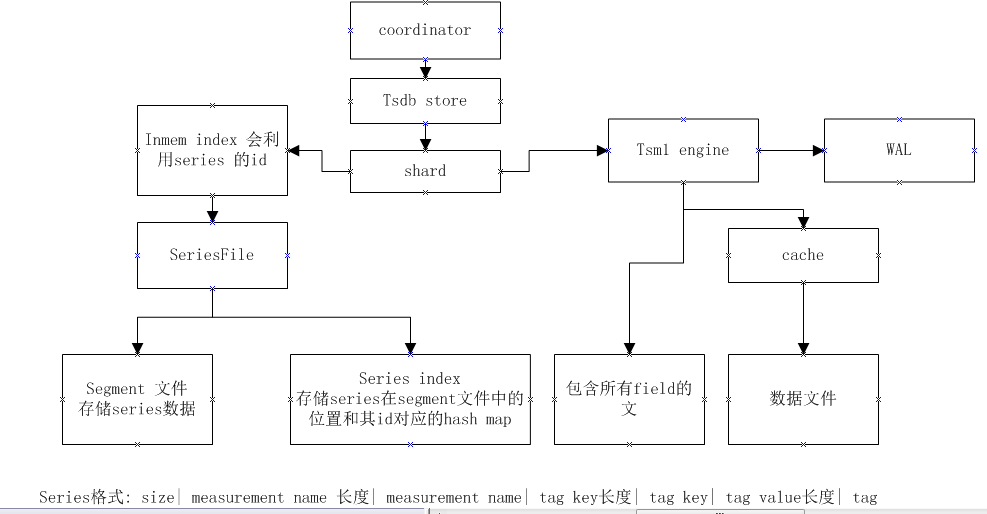

# influxdb

[TOC]

并不是每个表的数据单独放在一起，个人认为会影响性能

## 目录

第一章 http service

负责提供读写接口

第二章 meta 元数据

负责元数据

第三章 coordinator

负责协调

第四章 tsdb

第五章 tsdb.engine

第六章 tsdb.inmem index

第七章 tsdb.tsi1 index

第八章 query

查询数据

## 总结

* 总结一些influxdb暴露出来的数据，利用这些数据分析influxdb的性能
* 数据存储的精度会影响存储的空间么
* 数据类型的选择对存储性能的影响。tag没的选只能是字符串。field的值有的选字符串和整型
* 搞清楚索引格式、数据存储的格式

### 写数据的过程

* 检查point(待写数据)所在shard是否存在，若不存在则创建
* 写由measurement name和tag(key-value)组成的series 到series文件。写入文件后，将series的id和在segment文件中的位置写入索引文件
* 写数据(field部分)

#### 创建分片

写数据时，若对应的存储分片不存在则会创建shard。

### 读取数据的过程

### 写请求的相关统计信息

