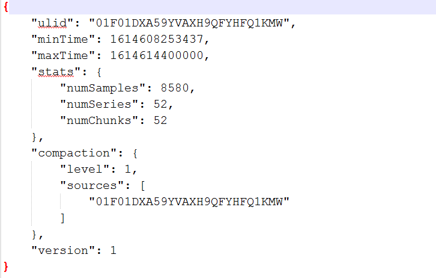

# block

[TOC]

## 写元数据 meta.json

meta.json文件内容

##### writeMetFile

tsdb/block.go

~~~go
func writeMetaFile(logger log.Logger, dir string, meta *BlockMeta) (int64, error) {
	meta.Version = metaVersion1

	// Make any changes to the file appear atomic.
	path := filepath.Join(dir, metaFilename)
	tmp := path + ".tmp"
	defer func() {
		if err := os.RemoveAll(tmp); err != nil {
			level.Error(logger).Log("msg", "remove tmp file", "err", err.Error())
		}
	}()

	f, err := os.Create(tmp)
	if err != nil {
		return 0, err
	}

	jsonMeta, err := json.MarshalIndent(meta, "", "\t")
	if err != nil {
		return 0, err
	}

	n, err := f.Write(jsonMeta)
	if err != nil {
		return 0, tsdb_errors.NewMulti(err, f.Close()).Err()
	}

	// Force the kernel to persist the file on disk to avoid data loss if the host crashes.
	if err := f.Sync(); err != nil {
		return 0, tsdb_errors.NewMulti(err, f.Close()).Err()
	}
	if err := f.Close(); err != nil {
		return 0, err
	}
	return int64(n), fileutil.Replace(tmp, path)
}
~~~

## 接口类型

##### BlockReader

~~~go
// BlockReader provides reading access to a data block.
type BlockReader interface {
	// Index returns an IndexReader over the block's data.
	Index() (IndexReader, error)

	// Chunks returns a ChunkReader over the block's data.
	Chunks() (ChunkReader, error)

	// Tombstones returns a tombstones.Reader over the block's deleted data.
	Tombstones() (tombstones.Reader, error)

	// Meta provides meta information about the block reader.
	Meta() BlockMeta

	// Size returns the number of bytes that the block takes up on disk.
	Size() int64
}
~~~

##### IndexReader

~~~go
// IndexReader provides reading access of serialized index data.
type IndexReader interface {
	// Symbols return an iterator over sorted string symbols that may occur in
	// series' labels and indices. It is not safe to use the returned strings
	// beyond the lifetime of the index reader.
	Symbols() index.StringIter

	// SortedLabelValues returns sorted possible label values.
	SortedLabelValues(name string) ([]string, error)

	// LabelValues returns possible label values which may not be sorted.
	LabelValues(name string) ([]string, error)

	// Postings returns the postings list iterator for the label pairs.
	// The Postings here contain the offsets to the series inside the index.
	// Found IDs are not strictly required to point to a valid Series, e.g.
	// during background garbage collections. Input values must be sorted.
	Postings(name string, values ...string) (index.Postings, error)

	// SortedPostings returns a postings list that is reordered to be sorted
	// by the label set of the underlying series.
	SortedPostings(index.Postings) index.Postings

	// Series populates the given labels and chunk metas for the series identified
	// by the reference.
	// Returns storage.ErrNotFound if the ref does not resolve to a known series.
	Series(ref uint64, lset *labels.Labels, chks *[]chunks.Meta) error

	// LabelNames returns all the unique label names present in the index in sorted order.
	LabelNames() ([]string, error)

	// Close releases the underlying resources of the reader.
	Close() error
}
~~~

##### ChunkWriter

~~~go
// ChunkWriter serializes a time block of chunked series data.
type ChunkWriter interface {
	// WriteChunks writes several chunks. The Chunk field of the ChunkMetas
	// must be populated.
	// After returning successfully, the Ref fields in the ChunkMetas
	// are set and can be used to retrieve the chunks from the written data.
	WriteChunks(chunks ...chunks.Meta) error

	// Close writes any required finalization and closes the resources
	// associated with the underlying writer.
	Close() error
}
~~~

##### ChunkReader

~~~go
// ChunkReader provides reading access of serialized time series data.
type ChunkReader interface {
	// Chunk returns the series data chunk with the given reference.
	Chunk(ref uint64) (chunkenc.Chunk, error)

	// Close releases all underlying resources of the reader.
	Close() error
}
~~~

