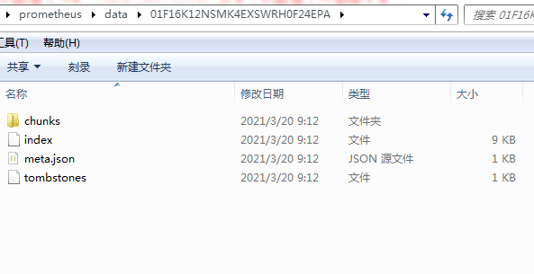
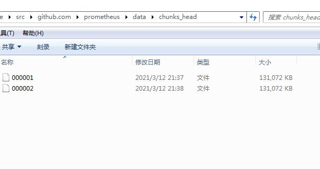

# chunk

[TOC]

## chunk

* segment 对应一个文件
* chunk 对应segment内的一个数据块

文件格式

Writer使用的chunk:

~~~

+++++++++++++++++++++++++++++++++++++++++++=++++++++++++++++
magic (4字节) | chunk format (1字节) | padding(3) | 
++++++++++++++++++++++++++++++++++++++++++++++++++++++++++++
chunk | chunk | chunk
++++++++++++++++++++++++++++++++++++++++++++++++++++++++++++

magic: 0x85BD40DD
chunk format: 1 

chunk的格式：
++++++++++++++++++++++++++++++++++++++++++++++++++++++++++++
长度 (可变,最大5字节)| 编码方式(1字节) | 数据 | 校验和(4字节)
++++++++++++++++++++++++++++++++++++++++++++++++++++++++++++

~~~

### chunks_heade目录下的文件格式

headAppender.Commit 会涉及到这块的逻辑

ChunkDiskMapper的文件格式(chunks_head目录下的文件)：

存放sample数据

~~~
+++++++++++++++++++++++++++++++++++++++++++++++++++++++++++++++++++++++++
magic 4字节  |  chunk format(1字节) | padding(3字节)
+++++++++++++++++++++++++++++++++++++++++++++++++++++++++++++++++++++++++
chunk  | chunk | chunk |....
+++++++++++++++++++++++++++++++++++++++++++++++++++++++++++++++++++++++++

magic: 0x0130BC91
chunk format: 1

chunk 的格式: 
chunk 由header、data、crc32三部分组成,如下图
+++++++++++++++++++++++++++++++++++++++++++++++++++++++++++++++++++++++++
header(可变，最大34字节) | data | crc32(4字节)
+++++++++++++++++++++++++++++++++++++++++++++++++++++++++++++++++++++++++
data的编码格式还不清除

header 格式:
完整的chunk如下图：
+++++++++++++++++++++++++++++++++++++++++++++++++++++++++++++++++++++++++
series ref_id（8）| mint 时间戳(8字节)| maxt (8字节)|ecoding(1字节)|
+++++++++++++++++++++++++++++++++++++++++++++++++++++++++++++++++++++++++
数据长度（可变,最大5字节）
+++++++++++++++++++++++++++++++++++++++++++++++++++++++++++++++++++++++++

8 +8 +8 +1 + 5 +4(crc32) = 34字节
~~~

目录及文件组织：

### 流程

headAppender.Commit 会将一段时间内的某个series(memSeries存储)对应的所有samples，以chunk形式写入文件(chunks_head目录下的文件)。写入时先写入缓存，若缓存空间不足则将缓存刷到磁盘。再写入缓存

### 待解决问题

* ./data/chunks_head/目录下的数据文件和 ./data/ulid/chunks/目录下的数据文件是啥关系。**compact会将chunks_head目录下的文件中的数据再次写入./data/ulid/chunks/目录下，同时建立索引。写入完成后，会删除chunks_head目录下已经写入的数据文件。**
* chunk的编码方式

### Writer

Writer 负责./data/ulid/目录下的数据和索引文件

tsdb/chunks

##### Writer

~~~go
// Writer implements the ChunkWriter interface for the standard
// serialization format.
type Writer struct {
	dirFile *os.File
	files   []*os.File
	wbuf    *bufio.Writer
	n       int64 //已经写入的字节数
	crc32   hash.Hash
	buf     [binary.MaxVarintLen32]byte

	segmentSize int64
}
~~~

##### NewWriter

LeveledCompactor.write 会调用NewWriter

目录： ./data/ulid.tmp-for-creation/chunks/

~~~go
// NewWriter returns a new writer against the given directory
// using the default segment size.
//DefaultChunkSegmentSize 是512M
func NewWriter(dir string) (*Writer, error) {
	return newWriter(dir, DefaultChunkSegmentSize)
}

func newWriter(dir string, segmentSize int64) (*Writer, error) {
	if segmentSize <= 0 {
        //512MB DefaultChunkSegmentSize
		segmentSize = DefaultChunkSegmentSize
	}

	if err := os.MkdirAll(dir, 0777); err != nil {
		return nil, err
	}
	dirFile, err := fileutil.OpenDir(dir)
	if err != nil {
		return nil, err
	}
	return &Writer{
		dirFile:     dirFile,
		n:           0,
		crc32:       newCRC32(),
		segmentSize: segmentSize,
	}, nil
}
~~~

##### Writer.WriteChunks 写入Meta

数据写入./data/ulid/chunks/目录下的数据文件

~~~go
// WriteChunks writes as many chunks as possible to the current segment,
// cuts a new segment when the current segment is full and
// writes the rest of the chunks in the new segment.
func (w *Writer) WriteChunks(chks ...Meta) error {
	var (
		batchSize  = int64(0)
		batchStart = 0
		batches    = make([][]Meta, 1)
		batchID    = 0
		firstBatch = true
	)

    /*
    分两种情况讨论：
    1 新创建的segment
    
    2 已经有部分数据的segment
    
    确定哪些chunk可以作为一个批次??
    */
	for i, chk := range chks {
        //MaxChunkLenghtFieldSize 的值是常数5
		// Each chunk contains: data length + encoding + the data itself + crc32
		chkSize := int64(MaxChunkLengthFieldSize) // The data length is a variable length field so use the maximum possible value.
        
        //ChunkEncodingSize 的值是1
		chkSize += ChunkEncodingSize              // The chunk encoding.
		chkSize += int64(len(chk.Chunk.Bytes()))  // The data itself.
		chkSize += crc32.Size                     // The 4 bytes of crc32.
        //总大小
		batchSize += chkSize

        //SegmentHeaderSize 是8
        //超过当前文件大小且不是第一个chunk
		// Cut a new batch when it is not the first chunk(to avoid empty segments) and
		// the batch is too large to fit in the current segment.
        //cutNewBatch 只有在非第一个chunk 并且剩余空间不足时方为true
		cutNewBatch := (i != 0) && (batchSize+SegmentHeaderSize > w.segmentSize)

        //这里仅处理第二种情况，既segment已经有部分数据
		// When the segment already has some data than
		// the first batch size calculation should account for that.
		if firstBatch && w.n > SegmentHeaderSize {
            //当前数据块大小+已经写入大小 超过文件大小
			cutNewBatch = batchSize+w.n > w.segmentSize
			if cutNewBatch {
				firstBatch = false
			}
		}

        //需要将某个chunk切分
		if cutNewBatch {
			batchStart = i
			batches = append(batches, []Meta{})
			batchID++
            //调整当前批次的大小
			batchSize = chkSize
		}
		batches[batchID] = chks[batchStart : i+1]
	}//end for

    //创建新的存储数据的文件
	// Create a new segment when one doesn't already exist.
	if w.n == 0 {
		if err := w.cut(); err != nil {
			return err
		}
	}

	for i, chks := range batches {
		if err := w.writeChunks(chks); err != nil {
			return err
		}
		// Cut a new segment only when there are more chunks to write.
		// Avoid creating a new empty segment at the end of the write.
		if i < len(batches)-1 {
			if err := w.cut(); err != nil {
				return err
			}
		}
	}
	return nil
}
~~~

##### Writer.writeChunks

~~~go
// writeChunks writes the chunks into the current segment irrespective
// of the configured segment size limit. A segment should have been already
// started before calling this.
func (w *Writer) writeChunks(chks []Meta) error {
	if len(chks) == 0 {
		return nil
	}

    //w.seq 是用作文件名的序号(数值)
    //w.seq 是len(w.files) -1
	var seq = uint64(w.seq()) << 32
	for i := range chks {
		chk := &chks[i]

		// The reference is set to the segment index and the offset where
		// the data starts for this chunk.
		//
		// The upper 4 bytes are for the segment index and
		// the lower 4 bytes are for the segment offset where to start reading this chunk.
        //w.n 是文件头大小
		chk.Ref = seq | uint64(w.n)

        //chunk数据的长度
		n := binary.PutUvarint(w.buf[:], uint64(len(chk.Chunk.Bytes())))

		if err := w.write(w.buf[:n]); err != nil {
			return err
		}
        //数据编码方式
		w.buf[0] = byte(chk.Chunk.Encoding())
		if err := w.write(w.buf[:1]); err != nil {
			return err
		}
        //数据部分
		if err := w.write(chk.Chunk.Bytes()); err != nil {
			return err
		}

        //
		w.crc32.Reset()
		if err := chk.writeHash(w.crc32, w.buf[:]); err != nil {
			return err
		}
        //写校验和
		if err := w.write(w.crc32.Sum(w.buf[:0])); err != nil {
			return err
		}
	}
	return nil
}
~~~

##### Writer.write

~~~go
func (w *Writer) write(b []byte) error {
	n, err := w.wbuf.Write(b)
	w.n += int64(n)
	return err
}
~~~

##### Writer.cut 创建保存数据的文件,并初始化写缓冲

~~~go
func (w *Writer) cut() error {
	// Sync current tail to disk and close.
	if err := w.finalizeTail(); err != nil {
		return err
	}

	n, f, _, err := cutSegmentFile(w.dirFile, MagicChunks, chunksFormatV1, w.segmentSize)
	if err != nil {
		return err
	}
	w.n = int64(n)

	w.files = append(w.files, f)
	if w.wbuf != nil {
		w.wbuf.Reset(f)
	} else {
		w.wbuf = bufio.NewWriterSize(f, 8*1024*1024)
	}

	return nil
}

~~~

##### cutSegmentFile 创建用于保存数据的文件

* 调用nextSequenceFile 获取保存数据的文件的名称及序列号
* 文件名加上.tmp后缀，打开文件，并调用fileutil.Preallocate预留空间
* 写入头部信息8字节。关闭文件并重命名文件（去掉.tmp后缀)
* 再次打开文件

~~~go
func cutSegmentFile(dirFile *os.File, magicNumber uint32, 
                    chunksFormat byte, allocSize int64) 
(headerSize int, newFile *os.File, seq int, returnErr error) {
    //文件名称及其序列号
	p, seq, err := nextSequenceFile(dirFile.Name())
	if err != nil {
		return 0, nil, 0, errors.Wrap(err, "next sequence file")
	}
    
    
	ptmp := p + ".tmp"
	f, err := os.OpenFile(ptmp, os.O_WRONLY|os.O_CREATE, 0666)
	if err != nil {
		return 0, nil, 0, errors.Wrap(err, "open temp file")
	}
	defer func() {
		if returnErr != nil {
			errs := tsdb_errors.NewMulti(returnErr)
			if f != nil {
				errs.Add(f.Close())
			}
			// Calling RemoveAll on a non-existent file does not return error.
			errs.Add(os.RemoveAll(ptmp))
			returnErr = errs.Err()
		}
	}()
    //若是windows系统，且ChunkDiskMapper.cut调用此函数，则allocSize 是128M,MaxHeadChunkFileSize
    //为什么windows需要指定allocSize
	if allocSize > 0 {
		if err = fileutil.Preallocate(f, allocSize, true); err != nil {
			return 0, nil, 0, errors.Wrap(err, "preallocate")
		}
	}
	if err = dirFile.Sync(); err != nil {
		return 0, nil, 0, errors.Wrap(err, "sync directory")
	}

    //头部SegmentHeaderSize 8字节
    //MagicChunsSize 是常数4
	// Write header metadata for new file.
	metab := make([]byte, SegmentHeaderSize)
	binary.BigEndian.PutUint32(metab[:MagicChunksSize], magicNumber)
	metab[4] = chunksFormat

	n, err := f.Write(metab)
	if err != nil {
		return 0, nil, 0, errors.Wrap(err, "write header")
	}
	if err := f.Close(); err != nil {
		return 0, nil, 0, errors.Wrap(err, "close temp file")
	}
	f = nil

    //文件重命名
	if err := fileutil.Rename(ptmp, p); err != nil {
		return 0, nil, 0, errors.Wrap(err, "replace file")
	}

    //以只写方式打开文件
	f, err = os.OpenFile(p, os.O_WRONLY, 0666)
	if err != nil {
		return 0, nil, 0, errors.Wrap(err, "open final file")
	}
	// Skip header for further writes.
	if _, err := f.Seek(int64(n), 0); err != nil {
		return 0, nil, 0, errors.Wrap(err, "seek in final file")
	}
	return n, f, seq, nil
}
~~~

##### nextSequenceFile 获取下一个用于保存数据的文件名称个

* 遍历当前目录下的所有文件，确定下一个文件名称用的序列号

~~~go
func nextSequenceFile(dir string) (string, int, error) {
	files, err := ioutil.ReadDir(dir)
	if err != nil {
		return "", 0, err
	}

	i := uint64(0)
	for _, f := range files {
		j, err := strconv.ParseUint(f.Name(), 10, 64)
		if err != nil {
			continue
		}
		// It is not necessary that we find the files in number order,
		// for example with '1000000' and '200000', '1000000' would come first.
		// Though this is a very very race case, we check anyway for the max id.
		if j > i {
			i = j
		}
	}
	return segmentFile(dir, int(i+1)), int(i + 1), nil
}

func segmentFile(baseDir string, index int) string {
	return filepath.Join(baseDir, fmt.Sprintf("%0.6d", index))
}
~~~

##### Meta

~~~go
// Meta holds information about a chunk of data.
type Meta struct {
	// Ref and Chunk hold either a reference that can be used to retrieve
	// chunk data or the data itself.
	// When it is a reference it is the segment offset at which the chunk bytes start.
	// Generally, only one of them is set.
	Ref   uint64
	Chunk chunkenc.Chunk //chunkenc.Chunk是接口

	// Time range the data covers.
	// When MaxTime == math.MaxInt64 the chunk is still open and being appended to.
	MinTime, MaxTime int64
}
~~~

### ChunkDiskMapper 负责存储sample的文件

主要是./data/chunks_head 目录下的文件, 这些文件的用途是什么？ 结合memSeries和写入的数据来看，这些文件主要存放的是sample数据(sereis的 ref_id、t 时间戳、v 值)。

headAppender.Commit 会涉及到这块的逻辑

~~~go
// Head chunk file header fields constants.
const (
	// MagicHeadChunks is 4 bytes at the beginning of a head chunk file.
	MagicHeadChunks = 0x0130BC91

	headChunksFormatV1 = 1
)
	
	// MintMaxtSize is the size of the mint/maxt for head chunk file and chunks.
	MintMaxtSize = 8
	// SeriesRefSize is the size of series reference on disk.
	SeriesRefSize = 8
	// HeadChunkFileHeaderSize is the total size of the header for the head chunk file.
	HeadChunkFileHeaderSize = SegmentHeaderSize
	// MaxHeadChunkFileSize is the max size of a head chunk file.
	MaxHeadChunkFileSize = 128 * 1024 * 1024 // 128 MiB.
	// CRCSize is the size of crc32 sum on disk.
	CRCSize = 4
	// MaxHeadChunkMetaSize is the max size of an mmapped chunks minus the chunks data.
	// Max because the uvarint size can be smaller.
	MaxHeadChunkMetaSize = SeriesRefSize + 2*MintMaxtSize + ChunksFormatVersionSize + MaxChunkLengthFieldSize + CRCSize
	// MinWriteBufferSize is the minimum write buffer size allowed.
	MinWriteBufferSize = 64 * 1024 // 64KB.
	// MaxWriteBufferSize is the maximum write buffer size allowed.
	MaxWriteBufferSize = 8 * 1024 * 1024 // 8 MiB.
	// DefaultWriteBufferSize is the default write buffer size.
	DefaultWriteBufferSize = 4 * 1024 * 1024 // 4 MiB.
~~~

##### ChunkDiskMapper的定义

~~~go
// ChunkDiskMapper is for writing the Head block chunks to the disk
// and access chunks via mmapped file.
type ChunkDiskMapper struct {
	curFileNumBytes atomic.Int64 // Bytes written in current open file.

	/// Writer.
	dir             *os.File
	writeBufferSize int

	curFile         *os.File // File being written to.
	curFileSequence int      // Index of current open file being appended to.
	curFileMaxt     int64    // Used for the size retention.

	byteBuf      [MaxHeadChunkMetaSize]byte // Buffer used to write the header of the chunk.
	chkWriter    *bufio.Writer              // Writer for the current open file.
	crc32        hash.Hash
	writePathMtx sync.Mutex

	/// Reader.
	// The int key in the map is the file number on the disk.
	mmappedChunkFiles map[int]*mmappedChunkFile // Contains the m-mapped files for each chunk file mapped with its index.
	closers           map[int]io.Closer         // Closers for resources behind the byte slices.
	readPathMtx       sync.RWMutex              // Mutex used to protect the above 2 maps.
	pool              chunkenc.Pool             // This is used when fetching a chunk from the disk to allocate a chunk.

	// Writer and Reader.
	// We flush chunks to disk in batches. Hence, we store them in this buffer
	// from which chunks are served till they are flushed and are ready for m-mapping.
	chunkBuffer *chunkBuffer

	// If 'true', it indicated that the maxt of all the on-disk files were set
	// after iterating through all the chunks in those files.
	fileMaxtSet bool

	closed bool
}
~~~

##### NewChunkDiskMapper 创建ChunkDiskMapper

* 检查writeBuferSize 是否满足预期条件， 即大于64KB同时小于8MB，还必须是1024的整数倍
* 创建存放数据的目录 ./data/chunks_head

~~~go
// NewChunkDiskMapper returns a new writer against the given directory
// using the default head chunk file duration.
// NOTE: 'IterateAllChunks' method needs to be called at least once after creating ChunkDiskMapper
// to set the maxt of all the file.
func NewChunkDiskMapper(dir string, pool chunkenc.Pool, writeBufferSize int) (*ChunkDiskMapper, error) {
    //MinWriteBufferSize 的值是64KB 
    //MaxWriteBufferSize的值是8MB
    //writeBufferSize 默认值是4M
	// Validate write buffer size.
	if writeBufferSize < MinWriteBufferSize || writeBufferSize > MaxWriteBufferSize {
		return nil, errors.Errorf("ChunkDiskMapper write buffer size should be between %d and %d (actual: %d)", MinWriteBufferSize, MaxHeadChunkFileSize, writeBufferSize)
	}
    
    //必须是1KB的整数倍
	if writeBufferSize%1024 != 0 {
		return nil, errors.Errorf("ChunkDiskMapper write buffer size should be a multiple of 1024 (actual: %d)", writeBufferSize)
	}

    //创建chunks_head目录
	if err := os.MkdirAll(dir, 0777); err != nil {
		return nil, err
	}
	dirFile, err := fileutil.OpenDir(dir)
	if err != nil {
		return nil, err
	}

	m := &ChunkDiskMapper{
		dir:             dirFile,
		pool:            pool,
		writeBufferSize: writeBufferSize,
		crc32:           newCRC32(),
		chunkBuffer:     newChunkBuffer(),
	}

	if m.pool == nil {
		m.pool = chunkenc.NewPool()
	}

	return m, m.openMMapFiles()
}
~~~

#### 文件相关

~~~go

type mmappedChunkFile struct {
	byteSlice ByteSlice
	maxt      int64
}

~~~

##### ChunkDiskMapper.shouldCutNewFile 确定是否需要创建新的文件

~~~go
// shouldCutNewFile decides the cutting of a new file based on time and size retention.
// Size retention: because depending on the system architecture, there is a limit on how big of a file we can m-map.
// Time retention: so that we can delete old chunks with some time guarantee in low load environments.
//MaxHeadChunkFileSize 是128M
//MaxHeadChunkMetaSize 是34
func (cdm *ChunkDiskMapper) shouldCutNewFile(chunkSize int) bool {
    //cdm.curFileSize 获取cdm.curFileNumBytes
	return cdm.curFileSize() == 0 || // First head chunk file.
		cdm.curFileSize()+int64(chunkSize+MaxHeadChunkMetaSize) > MaxHeadChunkFileSize // Exceeds the max head chunk file size.
}
~~~

##### ChunkDiskMapper.openMMapFiles 将已有的数据文件都映射到内存

为何将已有的数据文件映射到内存

~~~go
func (cdm *ChunkDiskMapper) openMMapFiles() (returnErr error) {
	cdm.mmappedChunkFiles = map[int]*mmappedChunkFile{}
	cdm.closers = map[int]io.Closer{}
	defer func() {
		if returnErr != nil {
			returnErr = tsdb_errors.NewMulti(returnErr, closeAllFromMap(cdm.closers)).Err()

			cdm.mmappedChunkFiles = nil
			cdm.closers = nil
		}
	}()

    //列出./data/chunks_head/ 目录下的所有chunk文件
    //返回map[int]string key 是用作文件名的整数序号、value是文件名称
	files, err := listChunkFiles(cdm.dir.Name())
	if err != nil {
		return err
	}

    //删除最后一个为空的文件, files 是map[int]string类型, key是文件序号，value是文件名称
	files, err = repairLastChunkFile(files)
	if err != nil {
		return err
	}

	chkFileIndices := make([]int, 0, len(files))
	for seq, fn := range files {
        //调用mmap创建文件-内存映射
		f, err := fileutil.OpenMmapFile(fn)
		if err != nil {
			return errors.Wrapf(err, "mmap files, file: %s", fn)
		}
        //realByteSlice 是[]byte 类型
		cdm.closers[seq] = f
		cdm.mmappedChunkFiles[seq] = &mmappedChunkFile{byteSlice: realByteSlice(f.Bytes())}
		chkFileIndices = append(chkFileIndices, seq)
	}

    //没有数据文件
	// Check for gaps in the files.
	sort.Ints(chkFileIndices)
	if len(chkFileIndices) == 0 {
		return nil
	}
    //检查文件序号是否连续
	lastSeq := chkFileIndices[0]
	for _, seq := range chkFileIndices[1:] {
		if seq != lastSeq+1 {
			return errors.Errorf("found unsequential head chunk files %s (index: %d) and %s (index: %d)", files[lastSeq], lastSeq, files[seq], seq)
		}
		lastSeq = seq
	}

    //校验chunk文件的完整性
	for i, b := range cdm.mmappedChunkFiles {
        //HeadChunkFileHeaderSize 是8
		if b.byteSlice.Len() < HeadChunkFileHeaderSize {
			return errors.Wrapf(errInvalidSize, "%s: invalid head chunk file header", files[i])
		}
        //校验魔数
        //MagicChunksSize 是4
		// Verify magic number.
		if m := binary.BigEndian.Uint32(b.byteSlice.Range(0, MagicChunksSize)); m != MagicHeadChunks {
			return errors.Errorf("%s: invalid magic number %x", files[i], m)
		}
        
	  //
        //ChunksFormatVersionSize 是1
		// Verify chunk format version.
		if v := int(b.byteSlice.Range(MagicChunksSize, MagicChunksSize+ChunksFormatVersionSize)[0]); v != chunksFormatV1 {
			return errors.Errorf("%s: invalid chunk format version %d", files[i], v)
		}
	}

	return nil
}
~~~

##### ChunkDiskMapper.cut 创建新的内存映射文件

~~~go
// cut creates a new m-mapped file. The write lock should be held before calling this.
func (cdm *ChunkDiskMapper) cut() (returnErr error) {
	// Sync current tail to disk and close.
	if err := cdm.finalizeCurFile(); err != nil {
		return err
	}

    //MagicHeadChunks = 0x0130BC91
    //	headChunksFormatV1 = 1
    //HeadChunkFilePreallocationSize 是128M ,windows
    //若是非windows系统，则HeadChunkFilePreallocationSize 是0
	n, newFile, seq, err := cutSegmentFile(cdm.dir, MagicHeadChunks, headChunksFormatV1, HeadChunkFilePreallocationSize)
	if err != nil {
		return err
	}
	defer func() {
		// The file should not be closed if there is no error,
		// its kept open in the ChunkDiskMapper.
		if returnErr != nil {
			returnErr = tsdb_errors.NewMulti(returnErr, newFile.Close()).Err()
		}
	}()

    //记录已经写入的字节数
	cdm.curFileNumBytes.Store(int64(n))

    //curFileMaxt是什么东西, 是最后一个sample的时间戳
    //最后的肯定最大
	if cdm.curFile != nil {
		cdm.readPathMtx.Lock()
		cdm.mmappedChunkFiles[cdm.curFileSequence].maxt = cdm.curFileMaxt
		cdm.readPathMtx.Unlock()
	}

	mmapFile, err := fileutil.OpenMmapFileWithSize(newFile.Name(), int(MaxHeadChunkFileSize))
	if err != nil {
		return err
	}

	cdm.readPathMtx.Lock()
	cdm.curFileSequence = seq
	cdm.curFile = newFile
	if cdm.chkWriter != nil {
		cdm.chkWriter.Reset(newFile)
	} else {
        //writeBufferSize 默认4M, 最小64KB， 最大8MB
		cdm.chkWriter = bufio.NewWriterSize(newFile, cdm.writeBufferSize)
	}

	cdm.closers[cdm.curFileSequence] = mmapFile
	cdm.mmappedChunkFiles[cdm.curFileSequence] = &mmappedChunkFile{byteSlice: realByteSlice(mmapFile.Bytes())}
	cdm.readPathMtx.Unlock()

	cdm.curFileMaxt = 0

	return nil
}
~~~

##### ChunkDiskMapper.finalizeCurFile 将当前文件中还在缓存的数据写到磁盘，并关闭文件

~~~go
// finalizeCurFile writes all pending data to the current tail file,
// truncates its size, and closes it.
func (cdm *ChunkDiskMapper) finalizeCurFile() error {
	if cdm.curFile == nil {
		return nil
	}

	if err := cdm.flushBuffer(); err != nil {
		return err
	}

	if err := cdm.curFile.Sync(); err != nil {
		return err
	}

	return cdm.curFile.Close()
}
~~~

#### 清除数据文件

##### ChunkDiskMapper.Truncate

~~~go
// Truncate deletes the head chunk files which are strictly below the mint.
// mint should be in milliseconds.
func (cdm *ChunkDiskMapper) Truncate(mint int64) error {
	if !cdm.fileMaxtSet {
		return errors.New("maxt of the files are not set")
	}
	cdm.readPathMtx.RLock()

	// Sort the file indices, else if files deletion fails in between,
	// it can lead to unsequential files as the map is not sorted.
	chkFileIndices := make([]int, 0, len(cdm.mmappedChunkFiles))
	for seq := range cdm.mmappedChunkFiles {
		chkFileIndices = append(chkFileIndices, seq)
	}
	sort.Ints(chkFileIndices)

	var removedFiles []int
	for _, seq := range chkFileIndices {
		if seq == cdm.curFileSequence || cdm.mmappedChunkFiles[seq].maxt >= mint {
			break
		}
		if cdm.mmappedChunkFiles[seq].maxt < mint {
			removedFiles = append(removedFiles, seq)
		}
	}
	cdm.readPathMtx.RUnlock()

	errs := tsdb_errors.NewMulti()
	// Cut a new file only if the current file has some chunks.
	if cdm.curFileSize() > HeadChunkFileHeaderSize {
		errs.Add(cdm.CutNewFile())
	}
	errs.Add(cdm.deleteFiles(removedFiles))
	return errs.Err()
}

func (cdm *ChunkDiskMapper) deleteFiles(removedFiles []int) error {
	cdm.readPathMtx.Lock()
	for _, seq := range removedFiles {
		if err := cdm.closers[seq].Close(); err != nil {
			cdm.readPathMtx.Unlock()
			return err
		}
		delete(cdm.mmappedChunkFiles, seq)
		delete(cdm.closers, seq)
	}
	cdm.readPathMtx.Unlock()

	// We actually delete the files separately to not block the readPathMtx for long.
	for _, seq := range removedFiles {
		if err := os.Remove(segmentFile(cdm.dir.Name(), seq)); err != nil {
			return err
		}
	}

	return nil
}
~~~

#### 写数据相关 (chunk_head目录)

##### ChunkDiskMapper.WriteChunk chunk写入文件

memSeries.mmapCurrentHeadChunk会调用此函数

参数：

返回值:

* chkRef 由文件号（高32位）和当前chunk在文件中的位置（低32位）构成。

~~~go
// WriteChunk writes the chunk to the disk.
// The returned chunk ref is the reference from where the chunk encoding starts for the chunk.
func (cdm *ChunkDiskMapper) WriteChunk(seriesRef uint64, mint, maxt int64, chk chunkenc.Chunk) (chkRef uint64, err error) {
	cdm.writePathMtx.Lock()
	defer cdm.writePathMtx.Unlock()

	if cdm.closed {
		return 0, ErrChunkDiskMapperClosed
	}

    //当前文件为空或空间不足， 创建新文件
	if cdm.shouldCutNewFile(len(chk.Bytes())) {
		if err := cdm.cut(); err != nil {
			return 0, err
		}
	}

	// if len(chk.Bytes())+MaxHeadChunkMetaSize >= writeBufferSize, it means that chunk >= the buffer size;
	// so no need to flush here, as we have to flush at the end (to not keep partial chunks in buffer).
    //MaxHeadChunkMetaSize 是34字节
    //剩余空间不足, 也就是直到buffer空间不足，才会刷buffer到磁盘
	if len(chk.Bytes())+MaxHeadChunkMetaSize < cdm.writeBufferSize && cdm.chkWriter.Available() < MaxHeadChunkMetaSize+len(chk.Bytes()) {
		if err := cdm.flushBuffer(); err != nil {
			return 0, err
		}
	}

	cdm.crc32.Reset()
	bytesWritten := 0

    //chunkRef(8字节) | mint 时间戳(8字节)| maxt (8字节)|ecoding(1字节)|数据长度(可变)|数据| crc32
	// The upper 4 bytes are for the head chunk file index and
	// the lower 4 bytes are for the head chunk file offset where to start reading this chunk.
    //高32位文件序号，低32位文件偏移量, chkRef 用于被写入索引文件
	chkRef = chunkRef(uint64(cdm.curFileSequence), uint64(cdm.curFileSize()))
   
    //sereis的id SeriesRefSize 是常量8
	binary.BigEndian.PutUint64(cdm.byteBuf[bytesWritten:], seriesRef)
	bytesWritten += SeriesRefSize
    
    //最小时间戳 MintMaxtSize 是8 
	binary.BigEndian.PutUint64(cdm.byteBuf[bytesWritten:], uint64(mint))
	bytesWritten += MintMaxtSize
    
	binary.BigEndian.PutUint64(cdm.byteBuf[bytesWritten:], uint64(maxt))
	bytesWritten += MintMaxtSize
    
    //encoding , ChunkEncodingSize 是1
	cdm.byteBuf[bytesWritten] = byte(chk.Encoding())
	bytesWritten += ChunkEncodingSize
    
    //长度
	n := binary.PutUvarint(cdm.byteBuf[bytesWritten:], uint64(len(chk.Bytes())))
	bytesWritten += n

    //writeAndAppendToCRC32 数据同时写入文件和计算crc32的buffer
	if err := cdm.writeAndAppendToCRC32(cdm.byteBuf[:bytesWritten]); err != nil {
		return 0, err
	}
	if err := cdm.writeAndAppendToCRC32(chk.Bytes()); err != nil {
		return 0, err
	}
    //计算crc32，并写入文件
	if err := cdm.writeCRC32(); err != nil {
		return 0, err
	}

    //时间戳
	if maxt > cdm.curFileMaxt {
		cdm.curFileMaxt = maxt
	}

    //chunkBuffer 有什么用途
	cdm.chunkBuffer.put(chkRef, chk)

    //MaxHeadChunkMetaSize 是34字节
	if len(chk.Bytes())+MaxHeadChunkMetaSize >= cdm.writeBufferSize {
		// The chunk was bigger than the buffer itself.
		// Flushing to not keep partial chunks in buffer.
		if err := cdm.flushBuffer(); err != nil {
			return 0, err
		}
	}

	return chkRef, nil
}
~~~

##### ChunkDiskMapper.writeAndAppendToCRC32 先写数据

~~~go
func (cdm *ChunkDiskMapper) writeAndAppendToCRC32(b []byte) error {
	if err := cdm.write(b); err != nil {
		return err
	}
	_, err := cdm.crc32.Write(b)
	return err
}

func (cdm *ChunkDiskMapper) write(b []byte) error {
	n, err := cdm.chkWriter.Write(b)
	cdm.curFileNumBytes.Add(int64(n))
	return err
}

func (cdm *ChunkDiskMapper) writeCRC32() error {
	return cdm.write(cdm.crc32.Sum(cdm.byteBuf[:0]))
}
~~~

##### ChunkDiskMapper.flushBuffer

~~~go
// flushBuffer flushes the current in-memory chunks.
// Assumes that writePathMtx is _write_ locked before calling this method.
func (cdm *ChunkDiskMapper) flushBuffer() error {
	if err := cdm.chkWriter.Flush(); err != nil {
		return err
	}
	cdm.chunkBuffer.clear()
	return nil
}
~~~

##### ChunkDiskMapper.Chunk

~~~go
// Chunk returns a chunk from a given reference.
func (cdm *ChunkDiskMapper) Chunk(ref uint64) (chunkenc.Chunk, error) {
	cdm.readPathMtx.RLock()
	// We hold this read lock for the entire duration because if the Close()
	// is called, the data in the byte slice will get corrupted as the mmapped
	// file will be closed.
	defer cdm.readPathMtx.RUnlock()

	var (
		// Get the upper 4 bytes.
		// These contain the head chunk file index.
		sgmIndex = int(ref >> 32)
		// Get the lower 4 bytes.
		// These contain the head chunk file offset where the chunk starts.
		// We skip the series ref and the mint/maxt beforehand.
		chkStart = int((ref<<32)>>32) + SeriesRefSize + (2 * MintMaxtSize)
		chkCRC32 = newCRC32()
	)

	if cdm.closed {
		return nil, ErrChunkDiskMapperClosed
	}

	// If it is the current open file, then the chunks can be in the buffer too.
	if sgmIndex == cdm.curFileSequence {
		chunk := cdm.chunkBuffer.get(ref)
		if chunk != nil {
			return chunk, nil
		}
	}

	mmapFile, ok := cdm.mmappedChunkFiles[sgmIndex]
	if !ok {
		if sgmIndex > cdm.curFileSequence {
			return nil, &CorruptionErr{
				Dir:       cdm.dir.Name(),
				FileIndex: -1,
				Err:       errors.Errorf("head chunk file index %d more than current open file", sgmIndex),
			}
		}
		return nil, &CorruptionErr{
			Dir:       cdm.dir.Name(),
			FileIndex: sgmIndex,
			Err:       errors.New("head chunk file index %d does not exist on disk"),
		}
	}

	if chkStart+MaxChunkLengthFieldSize > mmapFile.byteSlice.Len() {
		return nil, &CorruptionErr{
			Dir:       cdm.dir.Name(),
			FileIndex: sgmIndex,
			Err:       errors.Errorf("head chunk file doesn't include enough bytes to read the chunk size data field - required:%v, available:%v", chkStart+MaxChunkLengthFieldSize, mmapFile.byteSlice.Len()),
		}
	}

	// Encoding.
	chkEnc := mmapFile.byteSlice.Range(chkStart, chkStart+ChunkEncodingSize)[0]

	// Data length.
	// With the minimum chunk length this should never cause us reading
	// over the end of the slice.
	chkDataLenStart := chkStart + ChunkEncodingSize
	c := mmapFile.byteSlice.Range(chkDataLenStart, chkDataLenStart+MaxChunkLengthFieldSize)
	chkDataLen, n := binary.Uvarint(c)
	if n <= 0 {
		return nil, &CorruptionErr{
			Dir:       cdm.dir.Name(),
			FileIndex: sgmIndex,
			Err:       errors.Errorf("reading chunk length failed with %d", n),
		}
	}

	// Verify the chunk data end.
	chkDataEnd := chkDataLenStart + n + int(chkDataLen)
	if chkDataEnd > mmapFile.byteSlice.Len() {
		return nil, &CorruptionErr{
			Dir:       cdm.dir.Name(),
			FileIndex: sgmIndex,
			Err:       errors.Errorf("head chunk file doesn't include enough bytes to read the chunk - required:%v, available:%v", chkDataEnd, mmapFile.byteSlice.Len()),
		}
	}

	// Check the CRC.
	sum := mmapFile.byteSlice.Range(chkDataEnd, chkDataEnd+CRCSize)
	if _, err := chkCRC32.Write(mmapFile.byteSlice.Range(chkStart-(SeriesRefSize+2*MintMaxtSize), chkDataEnd)); err != nil {
		return nil, &CorruptionErr{
			Dir:       cdm.dir.Name(),
			FileIndex: sgmIndex,
			Err:       err,
		}
	}
	if act := chkCRC32.Sum(nil); !bytes.Equal(act, sum) {
		return nil, &CorruptionErr{
			Dir:       cdm.dir.Name(),
			FileIndex: sgmIndex,
			Err:       errors.Errorf("checksum mismatch expected:%x, actual:%x", sum, act),
		}
	}

	// The chunk data itself.
	chkData := mmapFile.byteSlice.Range(chkDataEnd-int(chkDataLen), chkDataEnd)
	chk, err := cdm.pool.Get(chunkenc.Encoding(chkEnc), chkData)
	if err != nil {
		return nil, &CorruptionErr{
			Dir:       cdm.dir.Name(),
			FileIndex: sgmIndex,
			Err:       err,
		}
	}
	return chk, nil
}

~~~

####　chunkBuffer 

chunkBuffer 有什么用

~~~go
const inBufferShards = 128 // 128 is a randomly chosen number.

// chunkBuffer is a thread safe buffer for chunks.
type chunkBuffer struct {
	inBufferChunks     [inBufferShards]map[uint64]chunkenc.Chunk
	inBufferChunksMtxs [inBufferShards]sync.RWMutex
}

func newChunkBuffer() *chunkBuffer {
	cb := &chunkBuffer{}
	for i := 0; i < inBufferShards; i++ {
		cb.inBufferChunks[i] = make(map[uint64]chunkenc.Chunk)
	}
	return cb
}

func (cb *chunkBuffer) put(ref uint64, chk chunkenc.Chunk) {
	shardIdx := ref % inBufferShards

	cb.inBufferChunksMtxs[shardIdx].Lock()
	cb.inBufferChunks[shardIdx][ref] = chk
	cb.inBufferChunksMtxs[shardIdx].Unlock()
}

func (cb *chunkBuffer) get(ref uint64) chunkenc.Chunk {
	shardIdx := ref % inBufferShards

	cb.inBufferChunksMtxs[shardIdx].RLock()
	defer cb.inBufferChunksMtxs[shardIdx].RUnlock()

	return cb.inBufferChunks[shardIdx][ref]
}

func (cb *chunkBuffer) clear() {
	for i := 0; i < inBufferShards; i++ {
		cb.inBufferChunksMtxs[i].Lock()
		cb.inBufferChunks[i] = make(map[uint64]chunkenc.Chunk)
		cb.inBufferChunksMtxs[i].Unlock()
	}
}
~~~

## chunkenc samples序列化

##### Chunk 接口

~~~go
// Chunk holds a sequence of sample pairs that can be iterated over and appended to.
type Chunk interface {
	// Bytes returns the underlying byte slice of the chunk.
	Bytes() []byte

	// Encoding returns the encoding type of the chunk.
	Encoding() Encoding

	// Appender returns an appender to append samples to the chunk.
	Appender() (Appender, error)

	// The iterator passed as argument is for re-use.
	// Depending on implementation, the iterator can
	// be re-used or a new iterator can be allocated.
	Iterator(Iterator) Iterator

	// NumSamples returns the number of samples in the chunk.
	NumSamples() int

	// Compact is called whenever a chunk is expected to be complete (no more
	// samples appended) and the underlying implementation can eventually
	// optimize the chunk.
	// There's no strong guarantee that no samples will be appended once
	// Compact() is called. Implementing this function is optional.
	Compact()
}
~~~

##### NewPool

~~~go
// NewPool returns a new pool.
func NewPool() Pool {
	return &pool{
		xor: sync.Pool{
			New: func() interface{} {
				return &XORChunk{b: bstream{}}
			},
		},
	}
}
~~~

### XORChunk 数据序列化(TODO)

~~~go
// XORChunk holds XOR encoded sample data.
type XORChunk struct {
	b bstream
}
~~~

##### xorAppender

~~~go
type xorAppender struct {
	b *bstream

	t      int64
	v      float64
	tDelta uint64

	leading  uint8
	trailing uint8
}
~~~

##### xorAppender.Append

~~~go
func (a *xorAppender) Append(t int64, v float64) {
	var tDelta uint64
	num := binary.BigEndian.Uint16(a.b.bytes())

	if num == 0 {
		buf := make([]byte, binary.MaxVarintLen64)
		for _, b := range buf[:binary.PutVarint(buf, t)] {
			a.b.writeByte(b)
		}
		a.b.writeBits(math.Float64bits(v), 64)

	} else if num == 1 {
		tDelta = uint64(t - a.t)

		buf := make([]byte, binary.MaxVarintLen64)
		for _, b := range buf[:binary.PutUvarint(buf, tDelta)] {
			a.b.writeByte(b)
		}

		a.writeVDelta(v)

	} else {
		tDelta = uint64(t - a.t)
		dod := int64(tDelta - a.tDelta)

		// Gorilla has a max resolution of seconds, Prometheus milliseconds.
		// Thus we use higher value range steps with larger bit size.
		switch {
		case dod == 0:
			a.b.writeBit(zero)
		case bitRange(dod, 14):
			a.b.writeBits(0x02, 2) // '10'
			a.b.writeBits(uint64(dod), 14)
		case bitRange(dod, 17):
			a.b.writeBits(0x06, 3) // '110'
			a.b.writeBits(uint64(dod), 17)
		case bitRange(dod, 20):
			a.b.writeBits(0x0e, 4) // '1110'
			a.b.writeBits(uint64(dod), 20)
		default:
			a.b.writeBits(0x0f, 4) // '1111'
			a.b.writeBits(uint64(dod), 64)
		}

		a.writeVDelta(v)
	}

	a.t = t
	a.v = v
	binary.BigEndian.PutUint16(a.b.bytes(), num+1)
	a.tDelta = tDelta
}
~~~

### bstream

~~~go
// bstream is a stream of bits.
type bstream struct {
	stream []byte // the data stream
	count  uint8  // how many bits are valid in current byte
}

func (b *bstream) bytes() []byte {
	return b.stream
}

type bit bool

const (
	zero bit = false
	one  bit = true
)

func (b *bstream) writeBit(bit bit) {
	if b.count == 0 {
		b.stream = append(b.stream, 0)
		b.count = 8
	}

	i := len(b.stream) - 1

	if bit {
		b.stream[i] |= 1 << (b.count - 1)
	}

	b.count--
}

func (b *bstream) writeByte(byt byte) {
	if b.count == 0 {
		b.stream = append(b.stream, 0)
		b.count = 8
	}

	i := len(b.stream) - 1

	// fill up b.b with b.count bits from byt
	b.stream[i] |= byt >> (8 - b.count)

	b.stream = append(b.stream, 0)
	i++
	b.stream[i] = byt << b.count
}

func (b *bstream) writeBits(u uint64, nbits int) {
	u <<= (64 - uint(nbits))
	for nbits >= 8 {
		byt := byte(u >> 56)
		b.writeByte(byt)
		u <<= 8
		nbits -= 8
	}

	for nbits > 0 {
		b.writeBit((u >> 63) == 1)
		u <<= 1
		nbits--
	}
}

type bstreamReader struct {
	stream       []byte
	streamOffset int // The offset from which read the next byte from the stream.

	buffer uint64 // The current buffer, filled from the stream, containing up to 8 bytes from which read bits.
	valid  uint8  // The number of bits valid to read (from left) in the current buffer.
}

func newBReader(b []byte) bstreamReader {
	return bstreamReader{
		stream: b,
	}
}

func (b *bstreamReader) readBit() (bit, error) {
	if b.valid == 0 {
		if !b.loadNextBuffer(1) {
			return false, io.EOF
		}
	}

	return b.readBitFast()
}

// readBitFast is like readBit but can return io.EOF if the internal buffer is empty.
// If it returns io.EOF, the caller should retry reading bits calling readBit().
// This function must be kept small and a leaf in order to help the compiler inlining it
// and further improve performances.
func (b *bstreamReader) readBitFast() (bit, error) {
	if b.valid == 0 {
		return false, io.EOF
	}

	b.valid--
	bitmask := uint64(1) << b.valid
	return (b.buffer & bitmask) != 0, nil
}

func (b *bstreamReader) readBits(nbits uint8) (uint64, error) {
	if b.valid == 0 {
		if !b.loadNextBuffer(nbits) {
			return 0, io.EOF
		}
	}

	if nbits <= b.valid {
		return b.readBitsFast(nbits)
	}

	// We have to read all remaining valid bits from the current buffer and a part from the next one.
	bitmask := (uint64(1) << b.valid) - 1
	nbits -= b.valid
	v := (b.buffer & bitmask) << nbits
	b.valid = 0

	if !b.loadNextBuffer(nbits) {
		return 0, io.EOF
	}

	bitmask = (uint64(1) << nbits) - 1
	v = v | ((b.buffer >> (b.valid - nbits)) & bitmask)
	b.valid -= nbits

	return v, nil
}

// readBitsFast is like readBits but can return io.EOF if the internal buffer is empty.
// If it returns io.EOF, the caller should retry reading bits calling readBits().
// This function must be kept small and a leaf in order to help the compiler inlining it
// and further improve performances.
func (b *bstreamReader) readBitsFast(nbits uint8) (uint64, error) {
	if nbits > b.valid {
		return 0, io.EOF
	}

	bitmask := (uint64(1) << nbits) - 1
	b.valid -= nbits

	return (b.buffer >> b.valid) & bitmask, nil
}

func (b *bstreamReader) ReadByte() (byte, error) {
	v, err := b.readBits(8)
	if err != nil {
		return 0, err
	}
	return byte(v), nil
}

// loadNextBuffer loads the next bytes from the stream into the internal buffer.
// The input nbits is the minimum number of bits that must be read, but the implementation
// can read more (if possible) to improve performances.
func (b *bstreamReader) loadNextBuffer(nbits uint8) bool {
	if b.streamOffset >= len(b.stream) {
		return false
	}

	// Handle the case there are more then 8 bytes in the buffer (most common case)
	// in a optimized way. It's guaranteed that this branch will never read from the
	// very last byte of the stream (which suffers race conditions due to concurrent
	// writes).
	if b.streamOffset+8 < len(b.stream) {
		b.buffer = binary.BigEndian.Uint64(b.stream[b.streamOffset:])
		b.streamOffset += 8
		b.valid = 64
		return true
	}

	// We're here if the are 8 or less bytes left in the stream. Since this reader needs
	// to handle race conditions with concurrent writes happening on the very last byte
	// we make sure to never over more than the minimum requested bits (rounded up to
	// the next byte). The following code is slower but called less frequently.
	nbytes := int((nbits / 8) + 1)
	if b.streamOffset+nbytes > len(b.stream) {
		nbytes = len(b.stream) - b.streamOffset
	}

	buffer := uint64(0)
	for i := 0; i < nbytes; i++ {
		buffer = buffer | (uint64(b.stream[b.streamOffset+i]) << uint(8*(nbytes-i-1)))
	}

	b.buffer = buffer
	b.streamOffset += nbytes
	b.valid = uint8(nbytes * 8)

	return true
}

~~~

