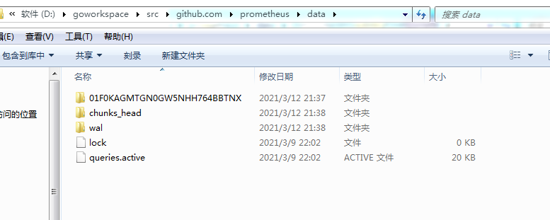

# db

[TOC]

## 总结

在prometheus tsdb存储中，需要搞清楚的几个概念：

* series: 由label（键值对）构成
* sample:  series的id、时间戳、时间序列对应的值
* 

时序数据的特点：

* 随时间变化
* series大量重复

整体文件目录布局：

chunks_head目录中的文件的用途是什么

### 流程

##### 写WAL文件

headAppender.Commit被调用时，将series、samples写入WAL文件

##### 写入chunks_head/目录下的文件

headAppender.Commit被调用时，将samples先写入chunk。然后再将chunk写入chunks_head目录下的文件

##### compact过程(异步)

db.run 定期将chunks_head目录下的文件中的数据写入 ./data/ulid/chunks/目录的文件中，并为./data/ulid/chunks目录下的数据文件建立索引。完成之后再将chunks_head目录下的数据文件删除。

## DB

##### DB 的定义

~~~go
// DB handles reads and writes of time series falling into
// a hashed partition of a seriedb.
type DB struct {
	dir   string
	lockf fileutil.Releaser

	logger         log.Logger
	metrics        *dbMetrics
	opts           *Options
	chunkPool      chunkenc.Pool
	compactor      Compactor
	blocksToDelete BlocksToDeleteFunc

	// Mutex for that must be held when modifying the general block layout.
	mtx    sync.RWMutex
	blocks []*Block

	head *Head

	compactc chan struct{}
	donec    chan struct{}
	stopc    chan struct{}

	// cmtx ensures that compactions and deletions don't run simultaneously.
	cmtx sync.Mutex

	// autoCompactMtx ensures that no compaction gets triggered while
	// changing the autoCompact var.
	autoCompactMtx sync.Mutex
	autoCompact    bool

	// Cancel a running compaction when a shutdown is initiated.
	compactCancel context.CancelFunc
}
~~~

##### 默认配置

prometheus/cmd/prometheus/main.go

~~~~go
func (opts tsdbOptions) ToTSDBOptions() tsdb.Options {
	return tsdb.Options{
		WALSegmentSize:         int(opts.WALSegmentSize),//无默认值
		RetentionDuration:      int64(time.Duration(opts.RetentionDuration) / time.Millisecond), //15天
		MaxBytes:               int64(opts.MaxBytes),
		NoLockfile:             opts.NoLockfile, //默认是false
		AllowOverlappingBlocks: opts.AllowOverlappingBlocks, //默认false
		WALCompression:         opts.WALCompression,//默认true
		StripeSize:             opts.StripeSize,
		MinBlockDuration:       int64(time.Duration(opts.MinBlockDuration) / time.Millisecond), //默认值2小时
		MaxBlockDuration:       int64(time.Duration(opts.MaxBlockDuration) / time.Millisecond), //无默认值
	}
}

~~~~

确定MaxBlockDuration:

~~~go
	{ // Max block size  settings.
		if cfg.tsdb.MaxBlockDuration == 0 {
			maxBlockDuration, err := model.ParseDuration("31d")
			if err != nil {
				panic(err)
			}
			// When the time retention is set and not too big use to define the max block duration.
            
            //cfg.tsdb.RetentionDuration 默认是15天
			if cfg.tsdb.RetentionDuration != 0 && cfg.tsdb.RetentionDuration/10 < maxBlockDuration {
				maxBlockDuration = cfg.tsdb.RetentionDuration / 10
			}

			cfg.tsdb.MaxBlockDuration = maxBlockDuration
		}
	}
~~~

##### Open 获取数据库实例

参数:

* dir 的默认值是./data

~~~go
// Open returns a new DB in the given directory. If options are empty, DefaultOptions will be used.
func Open(dir string, l log.Logger, r prometheus.Registerer, opts *Options) (db *DB, err error) {
	var rngs []int64
	opts, rngs = validateOpts(opts, nil)
	return open(dir, l, r, opts, rngs)
}
~~~

##### validateOpts

~~~go
// DefaultOptions used for the DB. They are sane for setups using
// millisecond precision timestamps.
func DefaultOptions() *Options {
	return &Options{
		WALSegmentSize:            wal.DefaultSegmentSize,
		RetentionDuration:         int64(15 * 24 * time.Hour / time.Millisecond),
		MinBlockDuration:          DefaultBlockDuration,
		MaxBlockDuration:          DefaultBlockDuration,
		NoLockfile:                false,
		AllowOverlappingBlocks:    false,
		WALCompression:            false,
		StripeSize:                DefaultStripeSize,
		HeadChunksWriteBufferSize: chunks.DefaultWriteBufferSize,
	}

func validateOpts(opts *Options, rngs []int64) (*Options, []int64) {
	if opts == nil {
		opts = DefaultOptions()
	}
	if opts.StripeSize <= 0 {
        //DefaultStripeSize 定义在head.go  默认:16KB
		opts.StripeSize = DefaultStripeSize
	}
	if opts.HeadChunksWriteBufferSize <= 0 {
        //4M DefaultWriteBufferSize
		opts.HeadChunksWriteBufferSize = chunks.DefaultWriteBufferSize
	}
	if opts.MinBlockDuration <= 0 {
        //默认2小时
		opts.MinBlockDuration = DefaultBlockDuration
	}
	if opts.MinBlockDuration > opts.MaxBlockDuration {
		opts.MaxBlockDuration = opts.MinBlockDuration
	}

	if len(rngs) == 0 {
		// Start with smallest block duration and create exponential buckets until the exceed the
		// configured maximum block duration.
        /*
        Expo的实现
        // ExponentialBlockRanges returns the time ranges based on the stepSize.
func ExponentialBlockRanges(minSize int64, steps, stepSize int) []int64 {
	ranges := make([]int64, 0, steps)
	curRange := minSize
	for i := 0; i < steps; i++ {
		ranges = append(ranges, curRange)
		curRange = curRange * int64(stepSize)
		2 * 3 = 6
		2 * 3 * 3 = 18
		2 * (3^9) = 
	}
	
	return ranges
}
        
        */
        //持久化时间呈3的倍数增长, 若MinBlockDuration 是2小时. 2 * 3的i次方
        //那么就是: 2 6 18 54 
		rngs = ExponentialBlockRanges(opts.MinBlockDuration, 10, 3)
	}
	return opts, rngs
}
~~~

##### open

~~~go
tsdb.Options{WALSegmentSize:0, 
             RetentionDuration:1296000000, //15天
             MaxBytes:0, 
             NoLockfile:false, 
             AllowOverlappingBlocks:false, 
             WALCompression:true, 
             StripeSize:16384, 
             MinBlockDuration:7200000, //2小时， 毫秒单位
             MaxBlockDuration:129600000, //36小时
             HeadChunksWriteBufferSize:4194304, SeriesLifecycleCallback:tsdb.SeriesLifecycleCallback(nil),
             BlocksToDelete:(tsdb.BlocksToDeleteFunc)(nil)}

func open(dir string, l log.Logger, r prometheus.Registerer, opts *Options, rngs []int64) (_ *DB, returnedErr error) {
	if err := os.MkdirAll(dir, 0777); err != nil {
		return nil, err
	}
	if l == nil {
		l = log.NewNopLogger()
	}

    //持久化时间不超过opts.MaxBlockDuration
	for i, v := range rngs {
		if v > opts.MaxBlockDuration {
			rngs = rngs[:i]
			break
		}
	}

	// Fixup bad format written by Prometheus 2.1.
	if err := repairBadIndexVersion(l, dir); err != nil {
		return nil, errors.Wrap(err, "repair bad index version")
	}

    //./data/wal
	walDir := filepath.Join(dir, "wal")

    //TODO:迁移WAL和删除临时数据块放到后面看
	// Migrate old WAL if one exists.
	if err := MigrateWAL(l, walDir); err != nil {
		return nil, errors.Wrap(err, "migrate WAL")
	}
	// Remove garbage, tmp blocks.
	if err := removeBestEffortTmpDirs(l, dir); err != nil {
		return nil, errors.Wrap(err, "remove tmp dirs")
	}

	db := &DB{
		dir:            dir,
		logger:         l,
		opts:           opts,
		compactc:       make(chan struct{}, 1),
		donec:          make(chan struct{}),
		stopc:          make(chan struct{}),
		autoCompact:    true,
		chunkPool:      chunkenc.NewPool(),
		blocksToDelete: opts.BlocksToDelete,
	}
	defer func() {
		// Close files if startup fails somewhere.
		if returnedErr == nil {
			return
		}

		close(db.donec) // DB is never run if it was an error, so close this channel here.

		returnedErr = tsdb_errors.NewMulti(
			returnedErr,
			errors.Wrap(db.Close(), "close DB after failed startup"),
		).Err()
	}()

    
    //删除块使用的函数指针
	if db.blocksToDelete == nil {
		db.blocksToDelete = DefaultBlocksToDelete(db)
	}

	if !opts.NoLockfile {
		absdir, err := filepath.Abs(dir)
		if err != nil {
			return nil, err
		}
		lockf, _, err := fileutil.Flock(filepath.Join(absdir, "lock"))
		if err != nil {
			return nil, errors.Wrap(err, "lock DB directory")
		}
		db.lockf = lockf
	}

	var err error
	ctx, cancel := context.WithCancel(context.Background())
	db.compactor, err = NewLeveledCompactor(ctx, r, l, rngs, db.chunkPool)
	if err != nil {
		cancel()
		return nil, errors.Wrap(err, "create leveled compactor")
	}
	db.compactCancel = cancel

	var wlog *wal.WAL
    //DefaultSegmentSize 128M
	segmentSize := wal.DefaultSegmentSize
	// Wal is enabled.
	if opts.WALSegmentSize >= 0 {
		// Wal is set to a custom size.
		if opts.WALSegmentSize > 0 {
			segmentSize = opts.WALSegmentSize
		}
		wlog, err = wal.NewSize(l, r, walDir, segmentSize, opts.WALCompression)
		if err != nil {
			return nil, err
		}
	}

	db.head, err = NewHead(r, l, wlog, rngs[0], dir, db.chunkPool, opts.HeadChunksWriteBufferSize, opts.StripeSize, opts.SeriesLifecycleCallback)
	if err != nil {
		return nil, err
	}

	// Register metrics after assigning the head block.
	db.metrics = newDBMetrics(db, r)
	maxBytes := opts.MaxBytes
	if maxBytes < 0 {
		maxBytes = 0
	}
	db.metrics.maxBytes.Set(float64(maxBytes))

	if err := db.reload(); err != nil {
		return nil, err
	}
	// Set the min valid time for the ingested samples
	// to be no lower than the maxt of the last block.
	blocks := db.Blocks()
	minValidTime := int64(math.MinInt64)
	if len(blocks) > 0 {
		minValidTime = blocks[len(blocks)-1].Meta().MaxTime
	}

	if initErr := db.head.Init(minValidTime); initErr != nil {
		db.head.metrics.walCorruptionsTotal.Inc()
		level.Warn(db.logger).Log("msg", "Encountered WAL read error, attempting repair", "err", initErr)
		if err := wlog.Repair(initErr); err != nil {
			return nil, errors.Wrap(err, "repair corrupted WAL")
		}
	}

	go db.run()

	return db, nil
}
~~~

### 启动时加载数据  TODO

##### DB.reload

~~~go
// reload reloads blocks and truncates the head and its WAL.
func (db *DB) reload() error {
	if err := db.reloadBlocks(); err != nil {
		return errors.Wrap(err, "reloadBlocks")
	}
	if len(db.blocks) == 0 {
		return nil
	}
	if err := db.head.Truncate(db.blocks[len(db.blocks)-1].MaxTime()); err != nil {
		return errors.Wrap(err, "head truncate")
	}
	return nil
}
~~~

##### DB.reloadBlocks

~~~go
// reloadBlocks reloads blocks without touching head.
// Blocks that are obsolete due to replacement or retention will be deleted.
func (db *DB) reloadBlocks() (err error) {
	defer func() {
		if err != nil {
			db.metrics.reloadsFailed.Inc()
		}
		db.metrics.reloads.Inc()
	}()

	loadable, corrupted, err := openBlocks(db.logger, db.dir, db.blocks, db.chunkPool)
	if err != nil {
		return err
	}

	deletableULIDs := db.blocksToDelete(loadable)
	deletable := make(map[ulid.ULID]*Block, len(deletableULIDs))

	// Mark all parents of loaded blocks as deletable (no matter if they exists). This makes it resilient against the process
	// crashing towards the end of a compaction but before deletions. By doing that, we can pick up the deletion where it left off during a crash.
	for _, block := range loadable {
		if _, ok := deletableULIDs[block.meta.ULID]; ok {
			deletable[block.meta.ULID] = block
		}
		for _, b := range block.Meta().Compaction.Parents {
			if _, ok := corrupted[b.ULID]; ok {
				delete(corrupted, b.ULID)
				level.Warn(db.logger).Log("msg", "Found corrupted block, but replaced by compacted one so it's safe to delete. This should not happen with atomic deletes.", "block", b.ULID)
			}
			deletable[b.ULID] = nil
		}
	}

	if len(corrupted) > 0 {
		// Corrupted but no child loaded for it.
		// Close all new blocks to release the lock for windows.
		for _, block := range loadable {
			if _, open := getBlock(db.blocks, block.Meta().ULID); !open {
				block.Close()
			}
		}
		errs := tsdb_errors.NewMulti()
		for ulid, err := range corrupted {
			errs.Add(errors.Wrapf(err, "corrupted block %s", ulid.String()))
		}
		return errs.Err()
	}

	var (
		toLoad     []*Block
		blocksSize int64
	)
	// All deletable blocks should be unloaded.
	// NOTE: We need to loop through loadable one more time as there might be loadable ready to be removed (replaced by compacted block).
	for _, block := range loadable {
		if _, ok := deletable[block.Meta().ULID]; ok {
			deletable[block.Meta().ULID] = block
			continue
		}

		toLoad = append(toLoad, block)
		blocksSize += block.Size()
	}
	db.metrics.blocksBytes.Set(float64(blocksSize))

	sort.Slice(toLoad, func(i, j int) bool {
		return toLoad[i].Meta().MinTime < toLoad[j].Meta().MinTime
	})
	if !db.opts.AllowOverlappingBlocks {
		if err := validateBlockSequence(toLoad); err != nil {
			return errors.Wrap(err, "invalid block sequence")
		}
	}

	// Swap new blocks first for subsequently created readers to be seen.
	db.mtx.Lock()
	oldBlocks := db.blocks
	db.blocks = toLoad
	db.mtx.Unlock()

	blockMetas := make([]BlockMeta, 0, len(toLoad))
	for _, b := range toLoad {
		blockMetas = append(blockMetas, b.Meta())
	}
	if overlaps := OverlappingBlocks(blockMetas); len(overlaps) > 0 {
		level.Warn(db.logger).Log("msg", "Overlapping blocks found during reloadBlocks", "detail", overlaps.String())
	}

	// Append blocks to old, deletable blocks, so we can close them.
	for _, b := range oldBlocks {
		if _, ok := deletable[b.Meta().ULID]; ok {
			deletable[b.Meta().ULID] = b
		}
	}
	if err := db.deleteBlocks(deletable); err != nil {
		return errors.Wrapf(err, "delete %v blocks", len(deletable))
	}
	return nil
}
~~~

##### openBlocks

~~~go
func openBlocks(l log.Logger, dir string, loaded []*Block, chunkPool chunkenc.Pool) (blocks []*Block, corrupted map[ulid.ULID]error, err error) {
	bDirs, err := blockDirs(dir)
	if err != nil {
		return nil, nil, errors.Wrap(err, "find blocks")
	}

	corrupted = make(map[ulid.ULID]error)
	for _, bDir := range bDirs {
		meta, _, err := readMetaFile(bDir)
		if err != nil {
			level.Error(l).Log("msg", "Failed to read meta.json for a block during reloadBlocks. Skipping", "dir", bDir, "err", err)
			continue
		}

		// See if we already have the block in memory or open it otherwise.
		block, open := getBlock(loaded, meta.ULID)
		if !open {
			block, err = OpenBlock(l, bDir, chunkPool)
			if err != nil {
				corrupted[meta.ULID] = err
				continue
			}
		}
		blocks = append(blocks, block)
	}
	return blocks, corrupted, nil
}
~~~

##### blockDirs

~~~go
func blockDirs(dir string) ([]string, error) {
	files, err := ioutil.ReadDir(dir)
	if err != nil {
		return nil, err
	}
	var dirs []string

	for _, fi := range files {
		if isBlockDir(fi) {
			dirs = append(dirs, filepath.Join(dir, fi.Name()))
		}
	}
	return dirs, nil
}
~~~

##### isBlockDir

~~~go
func isBlockDir(fi os.FileInfo) bool {
	if !fi.IsDir() {
		return false
	}
	_, err := ulid.ParseStrict(fi.Name())
	return err == nil
}
~~~

### 数据异步压缩(compact)

##### DB.run 负责将缓存数据写到磁盘的协程

~~~go
func (db *DB) run() {
	defer close(db.donec)

	backoff := time.Duration(0)

	for {
		select {
            //退出信号
		case <-db.stopc:
			return
		case <-time.After(backoff):
		}

		select {
		case <-time.After(1 * time.Minute):
			select {
			case db.compactc <- struct{}{}:
			default:
			}
            //dbAppender.Commit 也会触发db.compactc
		case <-db.compactc:
			db.metrics.compactionsTriggered.Inc()

			db.autoCompactMtx.Lock()
			if db.autoCompact {
				if err := db.Compact(); err != nil {
					level.Error(db.logger).Log("msg", "compaction failed", "err", err)
					backoff = exponential(backoff, 1*time.Second, 1*time.Minute)
				} else {
					backoff = 0
				}
			} else {
				db.metrics.compactionsSkipped.Inc()
			}
			db.autoCompactMtx.Unlock()
		case <-db.stopc:
			return
		}
	}
}
~~~

##### DB.Compact

~~~go
// Compact data if possible. After successful compaction blocks are reloaded
// which will also delete the blocks that fall out of the retention window.
// Old blocks are only deleted on reloadBlocks based on the new block's parent information.
// See DB.reloadBlocks documentation for further information.
func (db *DB) Compact() (returnErr error) {
	db.cmtx.Lock()
	defer db.cmtx.Unlock()
    //增加刷盘失败的统计信息
	defer func() {
		if returnErr != nil {
			db.metrics.compactionsFailed.Inc()
		}
	}()

	lastBlockMaxt := int64(math.MinInt64)
	defer func() {
		returnErr = tsdb_errors.NewMulti(
			returnErr,
			errors.Wrap(db.head.truncateWAL(lastBlockMaxt), "WAL truncation in Compact defer"),
		).Err()
	}()

	start := time.Now()
	// Check whether we have pending head blocks that are ready to be persisted.
	// They have the highest priority.
	for {
		select {
		case <-db.stopc:
			return nil
		default:
		}
        /*
        func (h *Head) compactable() bool {
	return h.MaxTime()-h.MinTime() > h.chunkRange.Load()/2*3
        实际涵盖的时间，超过设置时间范围的1.5倍
        */
		if !db.head.compactable() {
			break
		}
        //最小时间
		mint := db.head.MinTime()
        //通过公式：(mint / t) *t +t 计算最大时间
        /
		maxt := rangeForTimestamp(mint, db.head.chunkRange.Load())

		// Wrap head into a range that bounds all reads to it.
		// We remove 1 millisecond from maxt because block
		// intervals are half-open: [b.MinTime, b.MaxTime). But
		// chunk intervals are closed: [c.MinTime, c.MaxTime];
		// so in order to make sure that overlaps are evaluated
		// consistently, we explicitly remove the last value
		// from the block interval here.
		if err := db.compactHead(NewRangeHead(db.head, mint, maxt-1)); err != nil {
			return errors.Wrap(err, "compact head")
		}
		// Consider only successful compactions for WAL truncation.
		lastBlockMaxt = maxt
	}

	// Clear some disk space before compacting blocks, especially important
	// when Head compaction happened over a long time range.
	if err := db.head.truncateWAL(lastBlockMaxt); err != nil {
		return errors.Wrap(err, "WAL truncation in Compact")
	}

	compactionDuration := time.Since(start)
	if compactionDuration.Milliseconds() > db.head.chunkRange.Load() {
		level.Warn(db.logger).Log(
			"msg", "Head compaction took longer than the block time range, compactions are falling behind and won't be able to catch up",
			"duration", compactionDuration.String(),
			"block_range", db.head.chunkRange.Load(),
		)
	}
	return db.compactBlocks()
}
~~~

##### DB.compactHead 写磁盘

~~~go
// compactHead compacts the given RangeHead.
// The compaction mutex should be held before calling this method.
func (db *DB) compactHead(head *RangeHead) error {
	uid, err := db.compactor.Write(db.dir, head, head.MinTime(), head.BlockMaxTime(), nil)
	if err != nil {
		return errors.Wrap(err, "persist head block")
	}

	if err := db.reloadBlocks(); err != nil {
		if errRemoveAll := os.RemoveAll(filepath.Join(db.dir, uid.String())); errRemoveAll != nil {
			return tsdb_errors.NewMulti(
				errors.Wrap(err, "reloadBlocks blocks"),
				errors.Wrapf(errRemoveAll, "delete persisted head block after failed db reloadBlocks:%s", uid),
			).Err()
		}
		return errors.Wrap(err, "reloadBlocks blocks")
	}
	if err = db.head.truncateMemory(head.BlockMaxTime()); err != nil {
		return errors.Wrap(err, "head memory truncate")
	}
	return nil
}
~~~

##### DB.compactBlocks

~~~go

// compactBlocks compacts all the eligible on-disk blocks.
// The compaction mutex should be held before calling this method.
func (db *DB) compactBlocks() (err error) {
	// Check for compactions of multiple blocks.
	for {
		plan, err := db.compactor.Plan(db.dir)
		if err != nil {
			return errors.Wrap(err, "plan compaction")
		}
		if len(plan) == 0 {
			break
		}

		select {
		case <-db.stopc:
			return nil
		default:
		}

		uid, err := db.compactor.Compact(db.dir, plan, db.blocks)
		if err != nil {
			return errors.Wrapf(err, "compact %s", plan)
		}

		if err := db.reloadBlocks(); err != nil {
			if err := os.RemoveAll(filepath.Join(db.dir, uid.String())); err != nil {
				return errors.Wrapf(err, "delete compacted block after failed db reloadBlocks:%s", uid)
			}
			return errors.Wrap(err, "reloadBlocks blocks")
		}
	}

	return nil
}
~~~

##### DB.Appender 获取dbAppender实例

~~~go
// Appender opens a new appender against the database.
func (db *DB) Appender(ctx context.Context) storage.Appender {
	return dbAppender{db: db, Appender: db.head.Appender(ctx)}
}

// dbAppender wraps the DB's head appender and triggers compactions on commit
// if necessary.
type dbAppender struct {
	storage.Appender
	db *DB
}

func (a dbAppender) Commit() error {
	err := a.Appender.Commit()

	// We could just run this check every few minutes practically. But for benchmarks
	// and high frequency use cases this is the safer way.
	if a.db.head.compactable() {
		select {
		case a.db.compactc <- struct{}{}:
		default:
		}
	}
	return err
}

~~~

