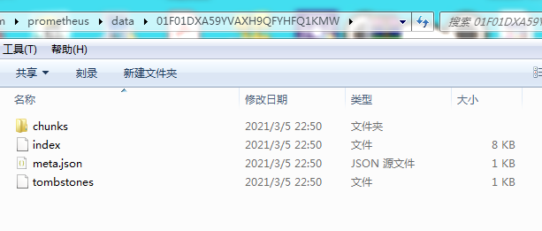

# index

[TOC]

## 总结

写索引文件由LeveledCompactor 负责

1. 先调用Writer.AddSymbol写符号，即label_name和label_value
2. 调用Write.AddSeries写series
3. 

### index文件格式

结合索引文件的格式，看一下其设计是否合理和这样设计的原因。首先来看index文件的最后52个字节。这块空间用来存放symbols、series等在索引文件中的位置。如此一来，可以快速定位到索引文件中各个模块的入口位置。

symbols:

series:

label_index:

postings:

label_index offset table:

posting offset table:

数据文件布局如下:

索引文件格式:

~~~
+++++++++++++++++++++++++++++++++++++++++++++++++++++++++++++++++++
头部 | symbols | padding(可选)| series	|padding(可选)	|	series
+++++++++++++++++++++++++++++++++++++++++++++++++++++++++++++++++++
label_index 	| label_index 	| postings 		|  postings 
+++++++++++++++++++++++++++++++++++++++++++++++++++++++++++++++++++
index offset table 		| posting offset table
+++++++++++++++++++++++++++++++++++++++++++++++++++++++++++++++++++
symbol 在文件中的位置 | series在文件中的位置| label index 的位置
+++++++++++++++++++++++++++++++++++++++++++++++++++++++++++++++++++
label_index offset table 的位置 | posting在文件中的位置 
+++++++++++++++++++++++++++++++++++++++++++++++++++++++++++++++++++
 posting offset table 在文件中的位置 | crc32
+++++++++++++++++++++++++++++++++++++++++++++++++++++++++++++++++++

头部格式:
+++++++++++++++++++++++++++++++++++++++++++++++++++++++++++++++++++
魔数 0xBAAAD700 (4字节) | 版本号1或2 (1字节)
+++++++++++++++++++++++++++++++++++++++++++++++++++++++++++++++++++

symbols格式(已经排好序):
symbol是label的key或value
+++++++++++++++++++++++++++++++++++++++++++++++++++++++++++++++++++
长度 包括symbol个数,但不包括自身(4字节) | symbol 个数(4字节)| symbol_1的长度| symbol_1| 
+++++++++++++++++++++++++++++++++++++++++++++++++++++++++++++++++++
symbol_2的长度| symbol_2 | 校验和 校验和包括symbol个数和数据 (4字节)
+++++++++++++++++++++++++++++++++++++++++++++++++++++++++++++++++++

series格式：
数据长度不包括crc32所占空间
+++++++++++++++++++++++++++++++++++++++++++++++++++++++++++++++++++
padding(可选) | 数据长度| lables 个数|name在索引文件中的位置 |value在索引文件中的位置
+++++++++++++++++++++++++++++++++++++++++++++++++++++++++++++++++++
chunks 个数| 第一个chunk的最小时间| 最大时间和最小时间的偏移量| 第一个chunk ref(8字节) 
+++++++++++++++++++++++++++++++++++++++++++++++++++++++++++++++++++
第二个chunk的最小时间和第一个chunk最大时间的偏移量| 最大时间和最小时间的偏移量|
+++++++++++++++++++++++++++++++++++++++++++++++++++++++++++++++++++
第二个chunk 的chunk ref| ...crc32(4字节)
+++++++++++++++++++++++++++++++++++++++++++++++++++++++++++++++++++

label_index table格式:
label name 对应的label values在index文件中posting部分的位置
+++++++++++++++++++++++++++++++++++++++++++++++++++++++++++++++++++
长度 | name 个数 1个 | values 个数 | value1 在索引文件中的位置
+++++++++++++++++++++++++++++++++++++++++++++++++++++++++++++++++++
value2 在文件中的位置 | crc32| .....
+++++++++++++++++++++++++++++++++++++++++++++++++++++++++++++++++++

label_index 和postings存在“隐式”的对应关系，比如第label_index中第一个name即对应
postings 中第一个

postings table格式:
+++++++++++++++++++++++++++++++++++++++++++++++++++++++++++++++++++
数据长度 | off 个数 | value1 所在的series 在文件中的位置 
+++++++++++++++++++++++++++++++++++++++++++++++++++++++++++++++++++
 value2 所在的series在index文件的位置
+++++++++++++++++++++++++++++++++++++++++++++++++++++++++++++++++++

index offset table:
此处的key是label name. 文件中的位置是label_index中的每个记录在文件中的位置:
+++++++++++++++++++++++++++++++++++++++++++++++++++++++++++++++++++
数据长度 | 
+++++++++++++++++++++++++++++++++++++++++++++++++++++++++++++++++++
label的个数｜label name的长度 | name字符串  | 文件中的位置 
+++++++++++++++++++++++++++++++++++++++++++++++++++++++++++++++++++
+++++++++++++++++++++++++++++++++++++++++++++++++++++++++++++++++++
crc32
+++++++++++++++++++++++++++++++++++++++++++++++++++++++++++++++++++

posting offset section:
+++++++++++++++++++++++++++++++++++++++++++++++++++++++++++++++++++
数据长度	| 总的记录数目 
+++++++++++++++++++++++++++++++++++++++++++++++++++++++++++++++++++
key个数	|name 长度	|	name 	| value 长度	|	value |postings 在文件位置
+++++++++++++++++++++++++++++++++++++++++++++++++++++++++++++++++++
key 个数| name 长度| name | value 长度| value | postings在文件位置
+++++++++++++++++++++++++++++++++++++++++++++++++++++++++++++++++++
 ....
+++++++++++++++++++++++++++++++++++++++++++++++++++++++++++++++++++
key 个数| name 长度| name | value 长度| value | postings在文件位置
+++++++++++++++++++++++++++++++++++++++++++++++++++++++++++++++++++
crc32
+++++++++++++++++++++++++++++++++++++++++++++++++++++++++++++++++++

~~~

##### 查找

查询语句无非是基于label的名称和值查找。查找的结果是包含指定值的series和sample。猜测的查找流程大致如下：

1. 首先根据index文件的最后52个字节，找到postings offset table的位置。
2. 将postings offset table 部分的数据读入内存。然后根据这部分数据确定查询条件中的label name 和label value 在postings  table中的位置。

## Writer

##### allPostingsKey 的定义

~~~go
var allPostingsKey = labels.Label{}

// AllPostingsKey returns the label key that is used to store the postings list of all existing IDs.
func AllPostingsKey() (name, value string) {
	return allPostingsKey.Name, allPostingsKey.Value
}
~~~

##### Writer

~~~go
// Writer implements the IndexWriter interface for the standard
// serialization format.
type Writer struct {
	ctx context.Context

	// For the main index file.
	f *FileWriter

	// Temporary file for postings.
	fP *FileWriter
    
	// Temporary file for posting offsets table.
	fPO   *FileWriter
	cntPO uint64

	toc           TOC
	stage         indexWriterStage
	postingsStart uint64 // Due to padding, can differ from TOC entry.

	// Reusable memory.
	buf1 encoding.Encbuf
	buf2 encoding.Encbuf

	numSymbols  int
	symbols     *Symbols
	symbolFile  *fileutil.MmapFile
	lastSymbol  string
	symbolCache map[string]symbolCacheEntry

	labelIndexes []labelIndexHashEntry // Label index offsets.
	labelNames   map[string]uint64     // Label names, and their usage.

	// Hold last series to validate that clients insert new series in order.
	lastSeries labels.Labels
	lastRef    uint64

	crc32 hash.Hash

	Version int
}
~~~

##### TOC 的定义

~~~go
// TOC represents index Table Of Content that states where each section of index starts.
type TOC struct {
	Symbols           uint64
	Series            uint64
	LabelIndices      uint64
	LabelIndicesTable uint64
	Postings          uint64
	PostingsTable     uint64
}
~~~

##### NewWriter

参数:

* fn  的值是index文件的路径 ./data/ulid.tmp-for-creation/index

* ./data/ulid.tmp-for-creation/index

~~~go
// NewWriter returns a new Writer to the given filename. It serializes data in format version 2.
func NewWriter(ctx context.Context, fn string) (*Writer, error) {
    //返回路径部分
	dir := filepath.Dir(fn)

    //dir ./data/ulid.tmp-for-creation
	df, err := fileutil.OpenDir(dir)
	if err != nil {
		return nil, err
	}
	defer df.Close() // Close for platform windows.

	if err := os.RemoveAll(fn); err != nil {
		return nil, errors.Wrap(err, "remove any existing index at path")
	}

    //dir ./data/ulid.tmp-for-creation/index 文件
	// Main index file we are building.
	f, err := NewFileWriter(fn)
	if err != nil {
		return nil, err
	}
    //dir ./data/ulid.tmp-for-creation/index_tmp_p
	// Temporary file for postings.
	fP, err := NewFileWriter(fn + "_tmp_p")
	if err != nil {
		return nil, err
	}
    //dir ./data/ulid.tmp-for-creation/index_tmp_po
	// Temporary file for posting offset table.
	fPO, err := NewFileWriter(fn + "_tmp_po")
	if err != nil {
		return nil, err
	}
	if err := df.Sync(); err != nil {
		return nil, errors.Wrap(err, "sync dir")
	}

	iw := &Writer{
		ctx:   ctx,
		f:     f,
		fP:    fP,
		fPO:   fPO,
		stage: idxStageNone,

		// Reusable memory. 4MB大小
		buf1: encoding.Encbuf{B: make([]byte, 0, 1<<22)},
		buf2: encoding.Encbuf{B: make([]byte, 0, 1<<22)},

		symbolCache: make(map[string]symbolCacheEntry, 1<<8),
		labelNames:  make(map[string]uint64, 1<<8),
		crc32:       newCRC32(),
	}
    //写入文件头信息
    //0xBAAAD700|2 一共5字节,先写入buf1
	if err := iw.writeMeta(); err != nil {
		return nil, err
	}
	return iw, nil
}
~~~

##### Writer.writeMeta 写入文件头

~~~go
func (w *Writer) writeMeta() error {
	w.buf1.Reset()
	w.buf1.PutBE32(MagicIndex)
	w.buf1.PutByte(FormatV2)

	return w.write(w.buf1.Get())
}
~~~

##### Writer.write 写入文件

~~~go
func (w *Writer) write(bufs ...[]byte) error {
	return w.f.Write(bufs...)
}
~~~

##### Writer.AddSymbol 写lable_name和label_value

~~~go
func (w *Writer) AddSymbol(sym string) error {
	if err := w.ensureStage(idxStageSymbols); err != nil {
		return err
    }	
	if w.numSymbols != 0 && sym <= w.lastSymbol {
		return errors.Errorf("symbol %q out-of-order", sym)
	}
	w.lastSymbol = sym
	w.numSymbols++
	w.buf1.Reset()
	w.buf1.PutUvarintStr(sym)
	return w.write(w.buf1.Get())
}
~~~

##### Writer.ensureStage

~~~go
//stage的定义
const (
	idxStageNone indexWriterStage = iota
	idxStageSymbols
	idxStageSeries
	idxStageDone
)

// ensureStage handles transitions between write stages and ensures that IndexWriter
// methods are called in an order valid for the implementation.
func (w *Writer) ensureStage(s indexWriterStage) error {
	select {
	case <-w.ctx.Done():
		return w.ctx.Err()
	default:
	}

	if w.stage == s {
		return nil
	}
    //当前的阶段 是s 的上上个阶段
	if w.stage < s-1 {
		// A stage has been skipped.
		if err := w.ensureStage(s - 1); err != nil {
			return err
		}
	}
	if w.stage > s {
		return errors.Errorf("invalid stage %q, currently at %q", s, w.stage)
	}

	// Mark start of sections in table of contents.
	switch s {
	case idxStageSymbols:
        //记录文件偏移量
		w.toc.Symbols = w.f.pos
        //w.toc.Symbols 是第一个symbol在文件中位置的开始前的8字节偏移量
		if err := w.startSymbols(); err != nil {
			return err
		}
        //开始写Series
	case idxStageSeries:
		if err := w.finishSymbols(); err != nil {
			return err
		}
        //记录series开始位置
		w.toc.Series = w.f.pos

	case idxStageDone:
        
		w.toc.LabelIndices = w.f.pos
		// LabelIndices generation depends on the posting offset
		// table produced at this stage.
		if err := w.writePostingsToTmpFiles(); err != nil {
			return err
		}
		if err := w.writeLabelIndices(); err != nil {
			return err
		}

		w.toc.Postings = w.f.pos
		if err := w.writePostings(); err != nil {
			return err
		}

		w.toc.LabelIndicesTable = w.f.pos
		if err := w.writeLabelIndexesOffsetTable(); err != nil {
			return err
		}

		w.toc.PostingsTable = w.f.pos
		if err := w.writePostingsOffsetTable(); err != nil {
			return err
		}
		if err := w.writeTOC(); err != nil {
			return err
		}
	}

	w.stage = s
	return nil
}
~~~

##### Writer.startSymbols 记录符号(symbols)在文件中的开始的位置

* 为symbols的元数据在文件中预留空间。预留4字节长度、4字节符号数量

~~~go
func (w *Writer) startSymbols() error {
	// We are at w.toc.Symbols.
	// Leave 4 bytes of space for the length, and another 4 for the number of symbols
	// which will both be calculated later.
	return w.write([]byte("alenblen"))
}
~~~

##### Writer.finishSymbols  收尾

写series的开始，标志着写symbols过程的结束

* 将symbols元数据即元数据所占空间长度、symbol个数、校验和写入文件
* 使用mmap将索引文件映射到内存

~~~go
func (w *Writer) finishSymbols() error {
	// Write out the length and symbol count.
	w.buf1.Reset()
    
    //计算包括 symbol 所占空间长度, 额外的4字节是symbol 个数所占空间
	w.buf1.PutBE32int(int(w.f.pos - w.toc.Symbols - 4))
    
    //symbole数目
	w.buf1.PutBE32int(int(w.numSymbols))
    
    //symbole的元数据写入文件指定位置
	if err := w.writeAt(w.buf1.Get(), w.toc.Symbols); err != nil {
		return err
	}

    //记录校验和在文件中的位置
	hashPos := w.f.pos
	// Leave space for the hash. We can only calculate it
	// now that the number of symbols is known, so mmap and do it from there.
	if err := w.write([]byte("hash")); err != nil {
		return err
	}
	if err := w.f.Flush(); err != nil {
		return err
	}
    
	//使用mmap建立内存映射
	sf, err := fileutil.OpenMmapFile(w.f.name)
	if err != nil {
		return err
	}
	w.symbolFile = sf
	hash := crc32.Checksum(w.symbolFile.Bytes()[w.toc.Symbols+4:hashPos], castagnoliTable)
	w.buf1.Reset()
	w.buf1.PutBE32(hash)
	if err := w.writeAt(w.buf1.Get(), hashPos); err != nil {
		return err
	}
    
    /*
    // ByteSlice abstracts a byte slice.
type ByteSlice interface {
	Len() int
	Range(start, end int) []byte
}

type realByteSlice []byte

func (b realByteSlice) Len() int {
	return len(b)
}

func (b realByteSlice) Range(start, end int) []byte {
	return b[start:end]
}

func (b realByteSlice) Sub(start, end int) ByteSlice {
	return b[start:end]
}
    */

	// Load in the symbol table efficiently for the rest of the index writing.
	w.symbols, err = NewSymbols(realByteSlice(w.symbolFile.Bytes()), FormatV2, int(w.toc.Symbols))
	if err != nil {
		return errors.Wrap(err, "read symbols")
	}
	return nil
}
~~~

##### Writer.AddSeries 写series及chunk到文件

参数:

* ref 只是一个顺序的序号，本身用途不大
* lset 是series对应的lables
* chunks

~~~go
// AddSeries adds the series one at a time along with its chunks.
func (w *Writer) AddSeries(ref uint64, lset labels.Labels, chunks ...chunks.Meta) error {
	if err := w.ensureStage(idxStageSeries); err != nil {
		return err
	}
	if labels.Compare(lset, w.lastSeries) <= 0 {
		return errors.Errorf("out-of-order series added with label set %q", lset)
	}

	if ref < w.lastRef && len(w.lastSeries) != 0 {
		return errors.Errorf("series with reference greater than %d already added", ref)
	}
	// We add padding to 16 bytes to increase the addressable space we get through 4 byte
	// series references.
    //实际调用FileWriter.AddPadding
	if err := w.addPadding(16); err != nil {
		return errors.Errorf("failed to write padding bytes: %v", err)
	}

	if w.f.pos%16 != 0 {
		return errors.Errorf("series write not 16-byte aligned at %d", w.f.pos)
	}

    // lables个数 | name 在文件中的位置| value在文件中的位置
	w.buf2.Reset()
	w.buf2.PutUvarint(len(lset))

	for _, l := range lset {
		var err error
		cacheEntry, ok := w.symbolCache[l.Name]
		nameIndex := cacheEntry.index
        //查找name在索引文件中的位置
		if !ok {
			nameIndex, err = w.symbols.ReverseLookup(l.Name)
			if err != nil {
				return errors.Errorf("symbol entry for %q does not exist, %v", l.Name, err)
			}
		}
        //写name的位置
        //lableNames 是 map[string]uint64类型的map
		w.labelNames[l.Name]++
		w.buf2.PutUvarint32(nameIndex)

		valueIndex := cacheEntry.lastValueIndex
		if !ok || cacheEntry.lastValue != l.Value {
			valueIndex, err = w.symbols.ReverseLookup(l.Value)
			if err != nil {
				return errors.Errorf("symbol entry for %q does not exist, %v", l.Value, err)
			}
			w.symbolCache[l.Name] = symbolCacheEntry{
				index:          nameIndex,
				lastValue:      l.Value,
				lastValueIndex: valueIndex,
			}
		}
		w.buf2.PutUvarint32(valueIndex)
	}

    //len(chunks) | c.MinTime | c.MaxTime- c.MinTime | c.Ref| c.MinTime - t0| c.MaxTime - c.MinTime | c.Ref -ref0 | len | 校验和
	w.buf2.PutUvarint(len(chunks))

    //需要确定c.Ref是series的ref_id 
    //还是chunk ref 由文件序号和chunk 在文件中的位置组成的。 该文件是./data/ulid/chunks/目录下的文件
    //极大可能是chunk ref
	if len(chunks) > 0 {
		c := chunks[0]
		w.buf2.PutVarint64(c.MinTime)
        //存储时间差值，估计是可以减小存储空间
		w.buf2.PutUvarint64(uint64(c.MaxTime - c.MinTime))
		w.buf2.PutUvarint64(c.Ref)
		t0 := c.MaxTime
		ref0 := int64(c.Ref)

		for _, c := range chunks[1:] {
            //和上一个的时间差值
			w.buf2.PutUvarint64(uint64(c.MinTime - t0))
			w.buf2.PutUvarint64(uint64(c.MaxTime - c.MinTime))
			t0 = c.MaxTime

			w.buf2.PutVarint64(int64(c.Ref) - ref0)
			ref0 = int64(c.Ref)
		}
	}

	w.buf1.Reset()
	w.buf1.PutUvarint(w.buf2.Len())

	w.buf2.PutHash(w.crc32)

	if err := w.write(w.buf1.Get(), w.buf2.Get()); err != nil {
		return errors.Wrap(err, "write series data")
	}

	w.lastSeries = append(w.lastSeries[:0], lset...)
	w.lastRef = ref

	return nil
}
~~~

### 写索引结束的几个阶段

##### Writer.Close 关闭索引文件

~~~go
func (w *Writer) Close() error {
	// Even if this fails, we need to close all the files.
	ensureErr := w.ensureStage(idxStageDone)

	if w.symbolFile != nil {
		if err := w.symbolFile.Close(); err != nil {
			return err
		}
	}
	if w.fP != nil {
		if err := w.fP.Close(); err != nil {
			return err
		}
	}
	if w.fPO != nil {
		if err := w.fPO.Close(); err != nil {
			return err
		}
	}
	if err := w.f.Close(); err != nil {
		return err
	}
	return ensureErr
}
~~~

##### 2 Writer.writeLabelIndices

建立label name 到label values的映射，即可以找到name对应的所有value在index文件中的位置

~~~go
func (w *Writer) writeLabelIndices() error {
	if err := w.fPO.Flush(); err != nil {
		return err
	}

    
    //fPO 文件存储了
	// Find all the label values in the tmp posting offset table.
	f, err := fileutil.OpenMmapFile(w.fPO.name)
	if err != nil {
		return err
	}
	defer f.Close()

    //这为啥通过解析fPO文件，而不是解析index文件中的symbols部分实现 ????
    // 应该是建立一种和postings部分中的记录"隐式“的对应关系
    //2 | len(name) | name | len(value) | value | w.fP.pos
    //解析fPO的文件内容
	d := encoding.NewDecbufRaw(realByteSlice(f.Bytes()), int(w.fPO.pos))
	cnt := w.cntPO
	current := []byte{}
	values := []uint32{}
	for d.Err() == nil && cnt > 0 {
		cnt--
		d.Uvarint()                           // Keycount.
		name := d.UvarintBytes()              // Label name.
		value := yoloString(d.UvarintBytes()) // Label value.
        //w.fP.pos 
		d.Uvarint64()                         // Offset.
		if len(name) == 0 {
			continue // All index is ignored.
		}

        //name 不等于current, 且values长度大于0
		if !bytes.Equal(name, current) && len(values) > 0 {
			// We've reached a new label name.
			if err := w.writeLabelIndex(string(current), values); err != nil {
				return err
			}
			values = values[:0]
		}
        //value 在索引文件symbols部分中的位置
		current = name
		sid, err := w.symbols.ReverseLookup(value)
		if err != nil {
			return err
		}
        //同一个name的多个value在index文件中的位置
		values = append(values, sid)
	}
	if d.Err() != nil {
		return d.Err()
	}

	// Handle the last label.
	if len(values) > 0 {
		if err := w.writeLabelIndex(string(current), values); err != nil {
			return err
		}
	}
	return nil
}

~~~

##### Writer.writeLabelIndex

写入index文件的内容的格式:

~~~
长度 | name个数，1个| values 个数| value1 | value2 | crc32

value 是label name 对应的value在index文件中的位置
~~~

~~~go
func (w *Writer) writeLabelIndex(name string, values []uint32) error {
	// Align beginning to 4 bytes for more efficient index list scans.
	if err := w.addPadding(4); err != nil {
		return err
	}

	w.labelIndexes = append(w.labelIndexes, labelIndexHashEntry{
		keys:   []string{name},
		offset: w.f.pos,
	})

	startPos := w.f.pos
    
	// Leave 4 bytes of space for the length, which will be calculated later.
	if err := w.write([]byte("alen")); err != nil {
		return err
	}
	w.crc32.Reset()

    // 1 | values个数
	w.buf1.Reset()
	w.buf1.PutBE32int(1) // Number of names.
	w.buf1.PutBE32int(len(values))
    
    //WriteToHash只是将数据写入crc32,等待计算
	w.buf1.WriteToHash(w.crc32)
	if err := w.write(w.buf1.Get()); err != nil {
		return err
	}

    //value在文件中的位置 
	for _, v := range values {
		w.buf1.Reset()
		w.buf1.PutBE32(v)
		w.buf1.WriteToHash(w.crc32)
		if err := w.write(w.buf1.Get()); err != nil {
			return err
		}
	}

	// Write out the length.
	w.buf1.Reset()
	w.buf1.PutBE32int(int(w.f.pos - startPos - 4))
	if err := w.writeAt(w.buf1.Get(), startPos); err != nil {
		return err
	}

	w.buf1.Reset()
	w.buf1.PutHashSum(w.crc32)
	return w.write(w.buf1.Get())
}

~~~

##### 4 Writer.writeIndexesOffsetTable

~~~go
// writeLabelIndexesOffsetTable writes the label indices offset table.
func (w *Writer) writeLabelIndexesOffsetTable() error {
	startPos := w.f.pos
	// Leave 4 bytes of space for the length, which will be calculated later.
	if err := w.write([]byte("alen")); err != nil {
		return err
	}
	w.crc32.Reset()

    //Writer.writeLabelIndex会在labelIndexs中存储数据,存储的是label_index在index文件中的位置
    //labelIndexes 个数
	w.buf1.Reset()
	w.buf1.PutBE32int(len(w.labelIndexes))
	w.buf1.WriteToHash(w.crc32)
	if err := w.write(w.buf1.Get()); err != nil {
		return err
	}

    //此处的key是label name 
    // key的个数| key的长度|key | key 2的长度|key 2 | 文件位置| crc32
	for _, e := range w.labelIndexes {
		w.buf1.Reset()
		w.buf1.PutUvarint(len(e.keys))
		for _, k := range e.keys {
			w.buf1.PutUvarintStr(k)
		}
		w.buf1.PutUvarint64(e.offset)
		w.buf1.WriteToHash(w.crc32)
		if err := w.write(w.buf1.Get()); err != nil {
			return err
		}
	}
	// Write out the length.
	w.buf1.Reset()
	w.buf1.PutBE32int(int(w.f.pos - startPos - 4))
	if err := w.writeAt(w.buf1.Get(), startPos); err != nil {
		return err
	}

	w.buf1.Reset()
	w.buf1.PutHashSum(w.crc32)
	return w.write(w.buf1.Get())
}
~~~

##### 5 Writer.writePostingsOffsetTable

~~~go
// writePostingsOffsetTable writes the postings offset table.
func (w *Writer) writePostingsOffsetTable() error {
	// Ensure everything is in the temporary file.
	if err := w.fPO.Flush(); err != nil {
		return err
	}

	startPos := w.f.pos
	// Leave 4 bytes of space for the length, which will be calculated later.
	if err := w.write([]byte("alen")); err != nil {
		return err
	}

	// Copy over the tmp posting offset table, however we need to
	// adjust the offsets.
	adjustment := w.postingsStart

    // po数目| 
	w.buf1.Reset()
	w.crc32.Reset()
	w.buf1.PutBE32int(int(w.cntPO)) // Count.
	w.buf1.WriteToHash(w.crc32)
	if err := w.write(w.buf1.Get()); err != nil {
		return err
	}

	f, err := fileutil.OpenMmapFile(w.fPO.name)
	if err != nil {
		return err
	}
	defer func() {
		if f != nil {
			f.Close()
		}
	}()
    //fPO文件内容: 2 | len(name) | name | len(value) | value | w.fP.pos
    // key数目| name 长度|name | value 长度| value | 文件位置
	d := encoding.NewDecbufRaw(realByteSlice(f.Bytes()), int(w.fPO.pos))
	cnt := w.cntPO
	for d.Err() == nil && cnt > 0 {
		w.buf1.Reset()
		w.buf1.PutUvarint(d.Uvarint())                     // Keycount.
		w.buf1.PutUvarintStr(yoloString(d.UvarintBytes())) // Label name.
		w.buf1.PutUvarintStr(yoloString(d.UvarintBytes())) // Label value.
        //adjustment 是w.postingsStart的值。postingsStart是postings 部分在index文件中的起始位置
        //为啥加上adjustment
		w.buf1.PutUvarint64(d.Uvarint64() + adjustment)    // Offset.
		w.buf1.WriteToHash(w.crc32)
		if err := w.write(w.buf1.Get()); err != nil {
			return err
		}
		cnt--
	}
	if d.Err() != nil {
		return d.Err()
	}

	// Cleanup temporary file.
	if err := f.Close(); err != nil {
		return err
	}
	f = nil
	if err := w.fPO.Close(); err != nil {
		return err
	}
	if err := w.fPO.Remove(); err != nil {
		return err
	}
	w.fPO = nil

    //数据长度
	// Write out the length.
	w.buf1.Reset()
	w.buf1.PutBE32int(int(w.f.pos - startPos - 4))
	if err := w.writeAt(w.buf1.Get(), startPos); err != nil {
		return err
	}

	// Finally write the hash.
	w.buf1.Reset()
	w.buf1.PutHashSum(w.crc32)
	return w.write(w.buf1.Get())
}
~~~

##### 6 Writer.writeTOC

最后 6 * 8 + 4 = 52 个字节，记录其他各个部分在索引文件中的位置

~~~go
func (w *Writer) writeTOC() error {
	w.buf1.Reset()

	w.buf1.PutBE64(w.toc.Symbols)
	w.buf1.PutBE64(w.toc.Series)
	w.buf1.PutBE64(w.toc.LabelIndices)
	w.buf1.PutBE64(w.toc.LabelIndicesTable)
	w.buf1.PutBE64(w.toc.Postings)
	w.buf1.PutBE64(w.toc.PostingsTable)

	w.buf1.PutHash(w.crc32)

	return w.write(w.buf1.Get())
}
~~~

##### 1 Writer.writePostingsToTmpFiles

将label name、value对应的series(series在index文件中的位置)写入临时文件。

这块的逻辑还比较麻烦。

1. labelNames

~~~go
func (w *Writer) writePostingsToTmpFiles() error {
    //Writer.AddSeries被调用时，所有series的每个label name 会存储到labelName中
	names := make([]string, 0, len(w.labelNames))
	for n := range w.labelNames {
		names = append(names, n)
	}
    //label name 排序
	sort.Strings(names)

    //将还在应用内缓存的数据刷到系统缓存或磁盘,这样
	if err := w.f.Flush(); err != nil {
		return err
	}
    //文件映射到内存，方便解析
	f, err := fileutil.OpenMmapFile(w.f.name)
	if err != nil {
		return err
	}
	defer f.Close()

	// Write out the special all posting.
	offsets := []uint32{}
    //w.toc.LabelIndices 指向series结束位置
	d := encoding.NewDecbufRaw(realByteSlice(f.Bytes()), int(w.toc.LabelIndices))
    
    //跳到series在文件开始的位置
	d.Skip(int(w.toc.Series))
    
    //这段代码没什么问题，就是将所有series在index文件中的位置，记录在offsets中
	for d.Len() > 0 {
		d.ConsumePadding()
		startPos := w.toc.LabelIndices - uint64(d.Len())
		if startPos%16 != 0 {
			return errors.Errorf("series not 16-byte aligned at %d", startPos)
		}
        //可以通过乘16计算实际位置
		offsets = append(offsets, uint32(startPos/16))
		// Skip to next series.
        //x 是serries所占空间大小
		x := d.Uvarint()
		d.Skip(x + crc32.Size)
		if err := d.Err(); err != nil {
			return err
		}
	}
    
    //将所有series的offsets(在index文件中的位置)写入临时文件
	if err := w.writePosting("", "", offsets); err != nil {
		return err
	}
	maxPostings := uint64(len(offsets)) // No label name can have more postings than this.

    //这块的逻辑比较
	for len(names) > 0 {
		batchNames := []string{}
		var c uint64
        
        //labelNames 是map[string]uint64类型， key 为name, value 是name出现的次数
		// Try to bunch up label names into one loop, but avoid
		// using more memory than a single label name can.
        //maxPostings 是series个数
        //这段是啥意思？？？
		for len(names) > 0 {
			if w.labelNames[names[0]]+c > maxPostings {
				break
			}
			batchNames = append(batchNames, names[0])
			c += w.labelNames[names[0]]
			names = names[1:]
		}//end for

        //name 存放在index文件中的posting部分
        //nameSymbols 存放 name在 索引文件位置到name的映射
		nameSymbols := map[uint32]string{}
		for _, name := range batchNames {
			sid, err := w.symbols.ReverseLookup(name)
			if err != nil {
				return err
			}
			nameSymbols[sid] = name
		}
        
        //一个name对应多个value,一个value多个series
        //postings存放 包含name、value的series在索引文件中的位置
		// Label name -> label value -> positions.
		postings := map[uint32]map[uint32][]uint32{}

		d := encoding.NewDecbufRaw(realByteSlice(f.Bytes()), int(w.toc.LabelIndices))
		d.Skip(int(w.toc.Series))
		for d.Len() > 0 {
			d.ConsumePadding()
            //series的起始位置
			startPos := w.toc.LabelIndices - uint64(d.Len())
            //series的长度
			l := d.Uvarint() // Length of this series in bytes.
			startLen := d.Len()

			// See if label names we want are in the series.
			numLabels := d.Uvarint()
			for i := 0; i < numLabels; i++ {
                //lno lable name 在文件中的位置
				lno := uint32(d.Uvarint())
                //label的 value在文件中的位置
				lvo := uint32(d.Uvarint())

                //
				if _, ok := nameSymbols[lno]; ok {
					if _, ok := postings[lno]; !ok {
						postings[lno] = map[uint32][]uint32{}
					}
					postings[lno][lvo] = append(postings[lno][lvo], uint32(startPos/16))
				}
            }//end for i:= 0; i < numLabels
            
			// Skip to next series.
			d.Skip(l - (startLen - d.Len()) + crc32.Size)
			if err := d.Err(); err != nil {
				return err
			}
		} //end for

		for _, name := range batchNames {
            //name 在文件中的位置
			// Write out postings for this label name.
			sid, err := w.symbols.ReverseLookup(name)
			if err != nil {
				return err
			}
            //map[uint32]
           //values 是label name 对应的多个value在文件中的位置
			values := make([]uint32, 0, len(postings[sid]))
			for v := range postings[sid] {
				values = append(values, v)
			}
            
			// Symbol numbers are in order, so the strings will also be in order.
			sort.Sort(uint32slice(values))
			for _, v := range values {
				value, err := w.symbols.Lookup(v)
				if err != nil {
					return err
				}
				if err := w.writePosting(name, value, postings[sid][v]);
                err != nil {
					return err
				}
            }//end for _, v := range values
            
		}//end for _, name 
		select {
		case <-w.ctx.Done():
			return w.ctx.Err()
		default:
		}

    }//end for len(names) > 0
	return nil
}
~~~

##### Writer.writePosting 在临时文件写入series在索引文件中的位置

参数:

* off 是series在index文件中的位置

写入fP文件的内容:

off 是series在index文件中的位置

~~~
  数据长度| len(offs) | off | off | crc32
  ++++++++++++++++++++++++++++++++++++++
  数据长度| len(offs) | off | off | crc
~~~

写入fPO文件的内容:

~~~
 2 | len(name) | name | len(value) | value | w.fP.pos
~~~

~~~go
func (w *Writer) writePosting(name, value string, offs []uint32) error {
	// Align beginning to 4 bytes for more efficient postings list scans.
	if err := w.fP.AddPadding(4); err != nil {
		return err
	}

    //name 和value 都是空字符串时， "" buf1有写入内容么 
	// Write out postings offset table to temporary file as we go.
	w.buf1.Reset()
	w.buf1.PutUvarint(2)
	w.buf1.PutUvarintStr(name)
	w.buf1.PutUvarintStr(value)
    
    //w.fP.pos 是offsets在fP文件中的位置
	w.buf1.PutUvarint64(w.fP.pos) // This is relative to the postings tmp file, not the final index file.
    
    //写入fPO文件
    // 2 | len(name) | name | len(value) | value | pos
	if err := w.fPO.Write(w.buf1.Get()); err != nil {
		return err
	}
	w.cntPO++

    //写fp文件
    // 数据长度| len(offs) | off | off | crc32
	w.buf1.Reset()
	w.buf1.PutBE32int(len(offs))

	for _, off := range offs {
		if off > (1<<32)-1 {
			return errors.Errorf("series offset %d exceeds 4 bytes", off)
		}
		w.buf1.PutBE32(off)
	}

	w.buf2.Reset()
	w.buf2.PutBE32int(w.buf1.Len())
	w.buf1.PutHash(w.crc32)
	return w.fP.Write(w.buf2.Get(), w.buf1.Get())
}
~~~

#####  3 Writer.writePostings 将临时文件fP中的内容拷贝到索引文件中

写入index文件的内容的格式：

~~~
  数据长度| len(offs) | off | off | crc32
  ++++++++++++++++++++++++++++++++++++++
  数据长度| len(offs) | off | off | crc
~~~

~~~go
func (w *Writer) writePostings() error {
	// There's padding in the tmp file, make sure it actually works.
	if err := w.f.AddPadding(4); err != nil {
		return err
	}
	w.postingsStart = w.f.pos

	// Copy temporary file into main index.
	if err := w.fP.Flush(); err != nil {
		return err
	}
    //跳到文件开始
	if _, err := w.fP.f.Seek(0, 0); err != nil {
		return err
	}
	// Don't need to calculate a checksum, so can copy directly.
	n, err := io.CopyBuffer(w.f.fbuf, w.fP.f, make([]byte, 1<<20))
	if err != nil {
		return err
	}
	if uint64(n) != w.fP.pos {
		return errors.Errorf("wrote %d bytes to posting temporary file, but only read back %d", w.fP.pos, n)
	}
	w.f.pos += uint64(n)

	if err := w.fP.Close(); err != nil {
		return err
	}
    //删除文件
	if err := w.fP.Remove(); err != nil {
		return err
	}
	w.fP = nil
	return nil
}
~~~

### Symbols

##### Symbols

只记录每32个symbol在字节数组(即文件的内存映射)中的位置，节省内存。symbol已在文件中排序

~~~go
type Symbols struct {
	bs      ByteSlice
	version int
	off     int

	offsets []int
	seen    int
}
~~~

##### NewSymbols 解析写入文件的symbol

~~~go
// NewSymbols returns a Symbols object for symbol lookups.
func NewSymbols(bs ByteSlice, version int, off int) (*Symbols, error) {
	s := &Symbols{
		bs:      bs,
		version: version,
		off:     off,
	}
	d := encoding.NewDecbufAt(bs, off, castagnoliTable)
	var (
		origLen = d.Len() //总长度
		cnt     = d.Be32int() //symbol数目
        
        //第一个symbol 开始的位置
		basePos = off + 4
	)
    
    //symbolFactor的常量值是32
    //为什么这么操作, 每32个取一个symbol
	s.offsets = make([]int, 0, 1+cnt/symbolFactor)
	for d.Err() == nil && s.seen < cnt {
		if s.seen%symbolFactor == 0 {
			s.offsets = append(s.offsets, basePos+origLen-d.Len())
		}
        //跳过symbol
		d.UvarintBytes() // The symbol.
		s.seen++
	}
	if d.Err() != nil {
		return nil, d.Err()
	}
	return s, nil
}
~~~

##### Symbols.Lookup

~~~go
func (s Symbols) Lookup(o uint32) (string, error) {
	d := encoding.Decbuf{
		B: s.bs.Range(0, s.bs.Len()),
	}

	if s.version == FormatV2 {
		if int(o) >= s.seen {
			return "", errors.Errorf("unknown symbol offset %d", o)
		}
		d.Skip(s.offsets[int(o/symbolFactor)])
		// Walk until we find the one we want.
		for i := o - (o / symbolFactor * symbolFactor); i > 0; i-- {
			d.UvarintBytes()
		}
	} else {
		d.Skip(int(o))
	}
	sym := d.UvarintStr()
	if d.Err() != nil {
		return "", d.Err()
	}
	return sym, nil
}
~~~

##### Symbols.ReverseLookup 查找符号在文件中的位置

~~~go
func (s Symbols) ReverseLookup(sym string) (uint32, error) {
	if len(s.offsets) == 0 {
		return 0, errors.Errorf("unknown symbol %q - no symbols", sym)
	}
    //sort.Search 使用二叉查找法
    //找到第一个大于sym的offset
	i := sort.Search(len(s.offsets), func(i int) bool {
		// Any decoding errors here will be lost, however
		// we already read through all of this at startup.
		d := encoding.Decbuf{
			B: s.bs.Range(0, s.bs.Len()),
		}
        //跳到第一个symbol的位置
		d.Skip(s.offsets[i])
		return yoloString(d.UvarintBytes()) > sym
	})
	d := encoding.Decbuf{
		B: s.bs.Range(0, s.bs.Len()),
	}
	if i > 0 {
		i--
	}
    //跳到指定位置
	d.Skip(s.offsets[i])
	res := i * 32
	var lastLen int
	var lastSymbol string
	for d.Err() == nil && res <= s.seen {
		lastLen = d.Len()
		lastSymbol = yoloString(d.UvarintBytes())
		if lastSymbol >= sym {
			break
		}
		res++
	}
	if d.Err() != nil {
		return 0, d.Err()
	}
	if lastSymbol != sym {
		return 0, errors.Errorf("unknown symbol %q", sym)
	}
	if s.version == FormatV2 {
		return uint32(res), nil
	}
	return uint32(s.bs.Len() - lastLen), nil
}
~~~

## FileWriter

##### NewFileWriter

并非直接写入文件，而是先写入文件的缓存

~~~go
func NewFileWriter(name string) (*FileWriter, error) {
	f, err := os.OpenFile(name, os.O_CREATE|os.O_RDWR, 0666)
	if err != nil {
		return nil, err
	}
    //4MB
	return &FileWriter{
		f:    f,
		fbuf: bufio.NewWriterSize(f, 1<<22),
		pos:  0,
		name: name,
	}, nil
}
~~~

##### FileWriter.Write 写入文件

~~~go
func (fw *FileWriter) Write(bufs ...[]byte) error {
	for _, b := range bufs {
		n, err := fw.fbuf.Write(b)
		fw.pos += uint64(n)
		if err != nil {
			return err
		}
		// For now the index file must not grow beyond 64GiB. Some of the fixed-sized
		// offset references in v1 are only 4 bytes large.
		// Once we move to compressed/varint representations in those areas, this limitation
		// can be lifted.
		if fw.pos > 16*math.MaxUint32 {
			return errors.Errorf("%q exceeding max size of 64GiB", fw.name)
		}
	}
	return nil
}
~~~

##### FileWriter.AddPadding 文件位置对齐

~~~go
// AddPadding adds zero byte padding until the file size is a multiple size.
func (fw *FileWriter) AddPadding(size int) error {
	p := fw.pos % uint64(size)
	if p == 0 {
		return nil
	}
	p = uint64(size) - p

	if err := fw.Write(make([]byte, p)); err != nil {
		return errors.Wrap(err, "add padding")
	}
	return nil
}
~~~

## Postings 接口

##### Merge 

~~~go
// Merge returns a new iterator over the union of the input iterators.
func Merge(its ...Postings) Postings {
	if len(its) == 0 {
		return EmptyPostings()
	}
	if len(its) == 1 {
		return its[0]
	}

	p, ok := newMergedPostings(its)
	if !ok {
		return EmptyPostings()
	}
	return p
}
~~~

##### Postings

~~~go
// Postings provides iterative access over a postings list.
type Postings interface {
	// Next advances the iterator and returns true if another value was found.
	Next() bool

	// Seek advances the iterator to value v or greater and returns
	// true if a value was found.
	Seek(v uint64) bool

	// At returns the value at the current iterator position.
	At() uint64

	// Err returns the last error of the iterator.
	Err() error
}
~~~

### MemPostings

MemPostings 维护了标签(labels)到 series id的映射。有点倒排索引那味儿了

~~~go
// MemPostings holds postings list for series ID per label pair. They may be written
// to out of order.
// ensureOrder() must be called once before any reads are done. This allows for quick
// unordered batch fills on startup.
type MemPostings struct {
	mtx     sync.RWMutex
    //label_name: value, label_name2:value2
    //第一层 key是 标签的名称, 第二层 key是 标签的值 
	m       map[string]map[string][]uint64
	ordered bool
}
~~~

##### NewUnorderedMemPostrings

~~~go
// NewUnorderedMemPostings returns a memPostings that is not safe to be read from
// until ensureOrder was called once.
func NewUnorderedMemPostings() *MemPostings {
	return &MemPostings{
		m:       make(map[string]map[string][]uint64, 512),
		ordered: false,
	}
}
~~~

##### MemPostings.Add

Head.getOrCreateWithID会调用此函数

参数:

* id 是series的ref_id

~~~go
// Add a label set to the postings index.
func (p *MemPostings) Add(id uint64, lset labels.Labels) {
	p.mtx.Lock()

    //为每个标签添加, 建立key、value到series id的映射
	for _, l := range lset {
		p.addFor(id, l)
	}
    //知道这玩意为啥这么用了, allPostringsKeys 为空字符串
    //所有的series的id都保存在allPostingsKey对应的数组中
	p.addFor(id, allPostingsKey)

	p.mtx.Unlock()
}

func (p *MemPostings) addFor(id uint64, l labels.Label) {
    //allPostingsKey的label ""，空字符串 , 其label对应的值也是""
    //这就意味着所有的id都在 allPosting中
	nm, ok := p.m[l.Name]
	if !ok {
		nm = map[string][]uint64{}
		p.m[l.Name] = nm
	}
	list := append(nm[l.Value], id)
	nm[l.Value] = list

	if !p.ordered {
		return
	}
	// There is no guarantee that no higher ID was inserted before as they may
	// be generated independently before adding them to postings.
	// We repair order violations on insert. The invariant is that the first n-1
	// items in the list are already sorted.
	for i := len(list) - 1; i >= 1; i-- {
		if list[i] >= list[i-1] {
			break
		}
		list[i], list[i-1] = list[i-1], list[i]
	}
}

// Get returns a postings list for the given label pair.
func (p *MemPostings) Get(name, value string) Postings {
	var lp []uint64
	p.mtx.RLock()
	l := p.m[name]
	if l != nil {
		lp = l[value]
	}
	p.mtx.RUnlock()

	if lp == nil {
		return EmptyPostings()
	}
	return newListPostings(lp...)
}
~~~

### ListPostrings

~~~go
type ListPostings struct {
    list []uint64
    cur  uint64
}

func newListPostings(list ...uint64) *ListPostings {
	return &ListPostings{list: list}
}
~~~

## encoding 数据序列化

### Encbuf

~~~go
// Encbuf is a helper type to populate a byte slice with various types.
type Encbuf struct {
	B []byte
	C [binary.MaxVarintLen64]byte
}
~~~

##### Encbuf.Reset、Encbuf.Get

~~~go
func (e *Encbuf) Reset()      { e.B = e.B[:0] }
func (e *Encbuf) Get() []byte { return e.B }
~~~

##### Encbuf.PutUvarintStr 写字符串

* e.PutUvarint 写入长度
* e.PutString 写入字符串

~~~go
// PutUvarintStr writes a string to the buffer prefixed by its varint length (in bytes!).
func (e *Encbuf) PutUvarintStr(s string) {
	b := *(*[]byte)(unsafe.Pointer(&s))
	e.PutUvarint(len(b))
	e.PutString(s)
}

func (e *Encbuf) PutString(s string) { e.B = append(e.B, s...) }
~~~

##### Encbuf.PutUvarint 和PutUvarint64

~~~go
func (e *Encbuf) PutUvarint(x int)      { e.PutUvarint64(uint64(x)) }

func (e *Encbuf) PutUvarint64(x uint64) {
	n := binary.PutUvarint(e.C[:], x)
	e.B = append(e.B, e.C[:n]...)
}
~~~

### Decbuf 解析写入索引文件的symbols

~~~go
// Decbuf provides safe methods to extract data from a byte slice. It does all
// necessary bounds checking and advancing of the byte slice.
// Several datums can be extracted without checking for errors. However, before using
// any datum, the err() method must be checked.
type Decbuf struct {
	B []byte
	E error
}

// NewDecbufAt returns a new decoding buffer. It expects the first 4 bytes
// after offset to hold the big endian encoded content length, followed by the contents and the expected
// checksum.
func NewDecbufAt(bs ByteSlice, off int, castagnoliTable *crc32.Table) Decbuf {
	if bs.Len() < off+4 {
		return Decbuf{E: ErrInvalidSize}
	}
    //symbol数目
	b := bs.Range(off, off+4)
	l := int(binary.BigEndian.Uint32(b))

	if bs.Len() < off+4+l+4 {
		return Decbuf{E: ErrInvalidSize}
	}

	// Load bytes holding the contents plus a CRC32 checksum.
	b = bs.Range(off+4, off+4+l+4)
	dec := Decbuf{B: b[:len(b)-4]}

	if castagnoliTable != nil {

		if exp := binary.BigEndian.Uint32(b[len(b)-4:]); dec.Crc32(castagnoliTable) != exp {
			return Decbuf{E: ErrInvalidChecksum}
		}
	}
	return dec
}
~~~

##### Decbuf.UvarintBytes

~~~go
// The return value becomes invalid if the byte slice goes away.
// Compared to UvarintStr, this avoid allocations.
func (d *Decbuf) UvarintBytes() []byte {
	l := d.Uvarint64()
	if d.E != nil {
		return []byte{}
	}
	if len(d.B) < int(l) {
		d.E = ErrInvalidSize
		return []byte{}
	}
	s := d.B[:l]
	d.B = d.B[l:]
	return s
}
~~~

##### Decbuf.Skip 跳转到字节数组的指定位置

~~~go
func (d *Decbuf) Skip(l int) {
	if len(d.B) < l {
		d.E = ErrInvalidSize
		return
	}
	d.B = d.B[l:]
}
~~~

##### NewDecbufRaw

~~~go
// NewDecbufRaw returns a new decoding buffer of the given length.
func NewDecbufRaw(bs ByteSlice, length int) Decbuf {
	if bs.Len() < length {
		return Decbuf{E: ErrInvalidSize}
	}
	return Decbuf{B: bs.Range(0, length)}
}
~~~

## 迭代器接口类型

##### StringIter

~~~go
// StringIter iterates over a sorted list of strings.
type StringIter interface {
	// Next advances the iterator and returns true if another value was found.
	Next() bool

	// At returns the value at the current iterator position.
	At() string

	// Err returns the last error of the iterator.
	Err() error
}
~~~

### stringListIter

~~~go
// NewStringListIter returns a StringIter for the given sorted list of strings.
func NewStringListIter(s []string) StringIter {
	return &stringListIter{l: s}
}

// symbolsIter implements StringIter.
type stringListIter struct {
	l   []string
	cur string
}

func (s *stringListIter) Next() bool {
	if len(s.l) == 0 {
		return false
	}
	s.cur = s.l[0]
	s.l = s.l[1:]
	return true
}
func (s stringListIter) At() string { return s.cur }
func (s stringListIter) Err() error { return nil }
~~~

