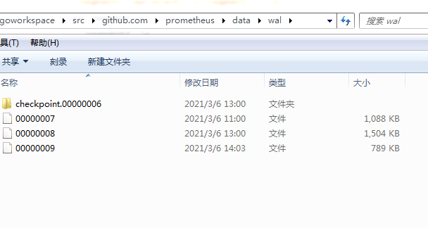

# wal

[TOC]

## 总结

wal 文件格式:

注意一个大的record跨多个虚拟页面(page)或page内空间不足时，会被拆分成多个record

~~~
record_header_1 |	record_1 
++++++++++++++++++++++++++++++++++++++++++++++++++++++++++++++++++++++
record_header_2 | record_2
++++++++++++++++++++++++++++++++++++++++++++++++++++++++++++++++++++++
record_header_3_1(第一个分片) | record_3_1
++++++++++++++++++++++++++++++++++++++++++++++++++++++++++++++++++++++
record_header_3_2	| record_3_2 
++++++++++++++++++++++++++++++++++++++++++++++++
 record_header_3_3	| record_3_3(最后一个分片)
~~~

record_header:

~~~
type (1字节)	| len(2字节)	|	crc (4字节)
++++++++++++++++++++++++++++++++++++++++++++
type :
1: 完整的record(未拆分) 
2: 拆分后的record的第一个分片
3：拆分后的中间分片 
4：最后一个分片

len: record的长度
~~~

record:

record 有三种类型：series、samples、tombstone

~~~

series:
类型1

类型 (1字节) | ref_id (8字节)| labels个数 (可变) | name 长度| name | value 长度| value
===============================================================================

samples:
类型2

类型 (1字节) | ref_id (8字节 大端)| timestamp(8字节大端)| ref_id 相对第一个的偏移量
+++++++++++++++++++++++++++++++++++++++++++++++++++++++++++++
 timestamp 相对第一个的偏移量| value (8字节)| ...
+++++++++++++++++++++++++++++++++++++++++++++++++++++++++++++

tombstone:
类型3

类型（1字节)| ref | mint | maxt
+++++++++++++++++++++++++++++++++++++++++++++++++++++++++++++
~~~

### 流程

headerAppend.Commit 被调用时， Commit会将series、samples序列化，然后调用WAL.Log将序列化的数据写入segment。写入时，先写到大小为32KB的缓存中(page)，然后再将page写入文件。若page未写入文件前程序崩溃，则最多丢失32KB的数据

### 尚未解决的问题

除了tombstone写入时机，对wal的分析已经完成。

* 什么时候写入tombstone
* 什么时候回收wal使用的空间
* 分析checkpoint

##  WAL

##### WAL的定义

* 一个Segment对应一个文件

~~~go
// WAL is a write ahead log that stores records in segment files.
// It must be read from start to end once before logging new data.
// If an error occurs during read, the repair procedure must be called
// before it's safe to do further writes.
//
// Segments are written to in pages of 32KB, with records possibly split
// across page boundaries.
// Records are never split across segments to allow full segments to be
// safely truncated. It also ensures that torn writes never corrupt records
// beyond the most recent segment.
type WAL struct {
	dir         string
	logger      log.Logger
	segmentSize int
	mtx         sync.RWMutex
	segment     *Segment // Active segment.
	donePages   int      // Pages written to the segment.
	page        *page    // Active page.
	stopc       chan chan struct{}
	actorc      chan func()
	closed      bool // To allow calling Close() more than once without blocking.
	compress    bool
	snappyBuf   []byte

	metrics *walMetrics
}
~~~

##### NewSize

segmentSize 的值是多少， 默认128MB

~~~go
// NewSize returns a new WAL over the given directory.
// New segments are created with the specified size.
func NewSize(logger log.Logger, reg prometheus.Registerer, dir string, segmentSize int, compress bool) (*WAL, error) {
    //pageSize的值是32KB, segmentSize 必须是32KB的倍数
	if segmentSize%pageSize != 0 {
		return nil, errors.New("invalid segment size")
	}
	if err := os.MkdirAll(dir, 0777); err != nil {
		return nil, errors.Wrap(err, "create dir")
	}
	if logger == nil {
		logger = log.NewNopLogger()
	}
	w := &WAL{
		dir:         dir,
		logger:      logger,
		segmentSize: segmentSize,
		page:        &page{},
		actorc:      make(chan func(), 100),
		stopc:       make(chan chan struct{}),
		compress:    compress,
	}
	w.metrics = newWALMetrics(reg)

    //获取上一个表示文件名称得序号
	_, last, err := Segments(w.Dir())
	if err != nil {
		return nil, errors.Wrap(err, "get segment range")
	}

	// Index of the Segment we want to open and write to.
	writeSegmentIndex := 0
	// If some segments already exist create one with a higher index than the last segment.
	if last != -1 {
		writeSegmentIndex = last + 1
	}

	segment, err := CreateSegment(w.Dir(), writeSegmentIndex)
	if err != nil {
		return nil, err
	}

	if err := w.setSegment(segment); err != nil {
		return nil, err
	}

	go w.run()

	return w, nil
}
~~~

##### WAL.run 调用Sync刷文件系统缓存

~~~go
func (w *WAL) run() {
Loop:
	for {
		select {
            //w.nextSegment 会向w.actorc写入f
            //执行异步刷盘的任务
		case f := <-w.actorc:
			f()
		case donec := <-w.stopc:
			close(w.actorc)
			defer close(donec)
			break Loop
		}
	}
	// Drain and process any remaining functions.
	for f := range w.actorc {
		f()
	}
}
~~~

##### WAL.setSegment 设置当前用于写数据的segment

~~~go
func (w *WAL) setSegment(segment *Segment) error {
	w.segment = segment

	// Correctly initialize donePages.
	stat, err := segment.Stat()
	if err != nil {
		return err
	}
    //stat.Size 是文件大小
	w.donePages = int(stat.Size() / pageSize)
	w.metrics.currentSegment.Set(float64(segment.Index()))
	return nil
}
~~~

##### WAL.nextSegment 创建新的segment(文件)

~~~go
// nextSegment creates the next segment and closes the previous one.
func (w *WAL) nextSegment() error {
	// Only flush the current page if it actually holds data.
	if w.page.alloc > 0 {
		if err := w.flushPage(true); err != nil {
			return err
		}
	}
	next, err := CreateSegment(w.Dir(), w.segment.Index()+1)
	if err != nil {
		return errors.Wrap(err, "create new segment file")
	}
	prev := w.segment
	if err := w.setSegment(next); err != nil {
		return err
	}

	// Don't block further writes by fsyncing the last segment.
	w.actorc <- func() {
		if err := w.fsync(prev); err != nil {
			level.Error(w.logger).Log("msg", "sync previous segment", "err", err)
		}
		if err := prev.Close(); err != nil {
			level.Error(w.logger).Log("msg", "close previous segment", "err", err)
		}
	}
	return nil
}
~~~

##### w.fsync

~~~go
func (w *WAL) fsync(f *Segment) error {
	start := time.Now()
	err := f.Sync()
	w.metrics.fsyncDuration.Observe(time.Since(start).Seconds())
	return err
}
~~~

### page 

~~~go
// page is an in memory buffer used to batch disk writes.
// Records bigger than the page size are split and flushed separately.
// A flush is triggered when a single records doesn't fit the page size or
// when the next record can't fit in the remaining free page space.
type page struct {
	alloc   int
	flushed int
	buf     [pageSize]byte
}

func (p *page) remaining() int {
	return pageSize - p.alloc
}

func (p *page) full() bool {
    //recordHeaderSize 是常量7
	return pageSize-p.alloc < recordHeaderSize
}

func (p *page) reset() {
	for i := range p.buf {
		p.buf[i] = 0
	}
	p.alloc = 0
	p.flushed = 0
}

~~~

### 写WAL数据

##### WAL.Log

写入的数据格式:

~~~
//格式： 类型([Series 1| Samples 2 | Tomestones 3] ) | ref_id | labels个数 | name 长度| name | value 长度| value
~~~

~~~go
// Log writes the records into the log.
// Multiple records can be passed at once to reduce writes and increase throughput.
func (w *WAL) Log(recs ...[]byte) error {
	w.mtx.Lock()
	defer w.mtx.Unlock()
	// Callers could just implement their own list record format but adding
	// a bit of extra logic here frees them from that overhead.
	for i, r := range recs {
		if err := w.log(r, i == len(recs)-1); err != nil {
			w.metrics.writesFailed.Inc()
			return err
		}
	}
	return nil
}
~~~

##### WAL.log

参数:

* final 确定是不是最后一个rec

一个rec不会跨越两个文件存储

~~~go
// log writes rec to the log and forces a flush of the current page if:
// - the final record of a batch
// - the record is bigger than the page size
// - the current page is full.
func (w *WAL) log(rec []byte, final bool) error {
	// When the last page flush failed the page will remain full.
	// When the page is full, need to flush it before trying to add more records to it.
    //page 是32KB大小的数组
	if w.page.full() {
		if err := w.flushPage(true); err != nil {
			return err
		}
	}
    
    //page 剩余空间
	// If the record is too big to fit within the active page in the current
	// segment, terminate the active segment and advance to the next one.
	// This ensures that records do not cross segment boundaries.
    //页内剩余空间
	left := w.page.remaining() - recordHeaderSize   
    
    //segment 内剩余空间（文件内剩余空间)
    //pageSize - recordHeaderSize 是一个页面内的最大可用空间
    // w.pagesPerSegment() 返回一个segment的对应多少个页面
    //w.donePages 是已经使用的页面, 为啥再减去1
	left += (pageSize - recordHeaderSize) * (w.pagesPerSegment() - w.donePages - 1) // Free pages in the active segment.

    //段内剩余空间不足,创建新的segment(文件)
	if len(rec) > left {
		if err := w.nextSegment(); err != nil {
			return err
		}
	}

    //压缩数据
	compressed := false
	if w.compress && len(rec) > 0 {
		// The snappy library uses `len` to calculate if we need a new buffer.
		// In order to allocate as few buffers as possible make the length
		// equal to the capacity.
		w.snappyBuf = w.snappyBuf[:cap(w.snappyBuf)]
		w.snappyBuf = snappy.Encode(w.snappyBuf, rec)
		if len(w.snappyBuf) < len(rec) {
			rec = w.snappyBuf
			compressed = true
		}
	}

    //rec可能超过一个页面大小(32KB)
	// Populate as many pages as necessary to fit the record.
	// Be careful to always do one pass to ensure we write zero-length records.
	for i := 0; i == 0 || len(rec) > 0; i++ {
		p := w.page

		// Find how much of the record we can fit into the page.
		var (
            //计算最小的可写长度
			l    = min(len(rec), (pageSize-p.alloc)-recordHeaderSize)
            //待写入的数据部分
			part = rec[:l]
			buf  = p.buf[p.alloc:]
			typ  recType
		)

        /*
        const (
	recPageTerm recType = 0 // Rest of page is empty.
	recFull     recType = 1 // Full record.
	recFirst    recType = 2 // First fragment of a record.
	recMiddle   recType = 3 // Middle fragments of a record.
	recLast     recType = 4 // Final fragment of a record.
)
        */
        //一个record 可能超过一个页面大小（32KB)
		switch {
            //小于一个页面且页面内空间足够
		case i == 0 && len(part) == len(rec):
			typ = recFull
            //最后一部分
		case len(part) == len(rec):
			typ = recLast
            
            //record的第一部分
		case i == 0:
			typ = recFirst
		default:
			typ = recMiddle
		}
        //压缩数据
		if compressed {
			typ |= snappyMask
		}

        //类型 1字节
		buf[0] = byte(typ)
		crc := crc32.Checksum(part, castagnoliTable)
        //长度 2字节| 校验和 4字节
		binary.BigEndian.PutUint16(buf[1:], uint16(len(part)))
		binary.BigEndian.PutUint32(buf[3:], crc)

        //拷贝数据
		copy(buf[recordHeaderSize:], part)
		p.alloc += len(part) + recordHeaderSize

        //页面满
		if w.page.full() {
			if err := w.flushPage(true); err != nil {
				// TODO When the flushing fails at this point and the record has not been
				// fully written to the buffer, we end up with a corrupted WAL because some part of the
				// record have been written to the buffer, while the rest of the record will be discarded.
				return err
			}
		}
        //调整
		rec = rec[l:]
	}//end for

	// If it's the final record of the batch and the page is not empty, flush it.
	if final && w.page.alloc > 0 {
		if err := w.flushPage(false); err != nil {
			return err
		}
	}

	return nil
}

~~~

##### WAL.flushPage 写数据到文件

~~~go
// flushPage writes the new contents of the page to disk. If no more records will fit into
// the page, the remaining bytes will be set to zero and a new page will be started.
// If clear is true, this is enforced regardless of how many bytes are left in the page.
func (w *WAL) flushPage(clear bool) error {
	w.metrics.pageFlushes.Inc()

	p := w.page
	clear = clear || p.full()

    //整个page写磁盘
	// No more data will fit into the page or an implicit clear.
	// Enqueue and clear it.
	if clear {
		p.alloc = pageSize // Write till end of page.
	}

    //Write op os.File.Write
	n, err := w.segment.Write(p.buf[p.flushed:p.alloc])
	if err != nil {
		p.flushed += n
		return err
	}
	p.flushed += n

	// We flushed an entire page, prepare a new one.
	if clear {
		p.reset()
		w.donePages++
		w.metrics.pageCompletions.Inc()
	}
	return nil
}
~~~

### Segment

##### Segment

~~~go
// SegmentFile represents the underlying file used to store a segment.
type SegmentFile interface {
	Stat() (os.FileInfo, error)
	Sync() error
	io.Writer
	io.Reader
	io.Closer
}

// Segment represents a segment file.
type Segment struct {
	SegmentFile
	dir string
	i   int
}
~~~

##### CreateSegment 创建存储segment的文件

~~~go
// CreateSegment creates a new segment k in dir.
func CreateSegment(dir string, k int) (*Segment, error) {
    //SegmentName 将目录和文件名连接起来
	f, err := os.OpenFile(SegmentName(dir, k), os.O_WRONLY|os.O_CREATE|os.O_APPEND, 0666)
	if err != nil {
		return nil, err
	}
	return &Segment{SegmentFile: f, i: k, dir: dir}, nil
}
~~~

##### Segments 获取segment文件列表的第一个和最后一个序号(序号就是文件名称)

~~~go
// Segments returns the range [first, n] of currently existing segments.
// If no segments are found, first and n are -1.
func Segments(walDir string) (first, last int, err error) {
	refs, err := listSegments(walDir)
	if err != nil {
		return 0, 0, err
	}
	if len(refs) == 0 {
		return -1, -1, nil
	}
	return refs[0].index, refs[len(refs)-1].index, nil
}
~~~

##### listSegments 获取segment文件列表

~~~go
func listSegments(dir string) (refs []segmentRef, err error) {
	files, err := ioutil.ReadDir(dir)
	if err != nil {
		return nil, err
	}
	for _, f := range files {
		fn := f.Name()
		k, err := strconv.Atoi(fn)
		if err != nil {
			continue
		}
		refs = append(refs, segmentRef{name: fn, index: k})
	}
	sort.Slice(refs, func(i, j int) bool {
		return refs[i].index < refs[j].index
	})
	for i := 0; i < len(refs)-1; i++ {
		if refs[i].index+1 != refs[i+1].index {
			return nil, errors.New("segments are not sequential")
		}
	}
	return refs, nil
}
~~~

### Record

负责将写入WAL的数据序列化。该模块定义在tsdb/record包中

~~~go
// Type represents the data type of a record.
type Type uint8

const (
	// Unknown is returned for unrecognised WAL record types.
	Unknown Type = 255
	// Series is used to match WAL records of type Series.
	Series Type = 1
	// Samples is used to match WAL records of type Samples.
	Samples Type = 2
	// Tombstones is used to match WAL records of type Tombstones.
	Tombstones Type = 3
)

// RefSeries is the series labels with the series ID.
type RefSeries struct {
	Ref    uint64
	Labels labels.Labels
}

// Encoder encodes series, sample, and tombstones records.
// The zero value is ready to use.
type Encoder struct {
}

~~~

##### Encoder.Series

~~~go

//格式： 类型([Series 1| Samples 2 | Tomestones 3] ) | ref_id | labels个数 | name 长度| name | value 长度| value
// Series appends the encoded series to b and returns the resulting slice.
func (e *Encoder) Series(series []RefSeries, b []byte) []byte {
	buf := encoding.Encbuf{B: b}
    //Series 的常量值是1
	buf.PutByte(byte(Series))

	for _, s := range series {
		buf.PutBE64(s.Ref)
		buf.PutUvarint(len(s.Labels))

		for _, l := range s.Labels {
			buf.PutUvarintStr(l.Name)
			buf.PutUvarintStr(l.Value)
		}
	}
	return buf.Get()
}
~~~

##### Encoder.Samples

格式: samples 类型1 | ref_id (8字节 大端)| timestamp(8字节大端)| ref_id 相对第一个的偏移量| timestamp 相对第一个的偏移量| value 

~~~go
// Samples appends the encoded samples to b and returns the resulting slice.
func (e *Encoder) Samples(samples []RefSample, b []byte) []byte {
	buf := encoding.Encbuf{B: b}
    //Samples 是常量值2
	buf.PutByte(byte(Samples))

	if len(samples) == 0 {
		return buf.Get()
	}

	// Store base timestamp and base reference number of first sample.
	// All samples encode their timestamp and ref as delta to those.
	first := samples[0]

    //实际是binary.BigEndian.PutUint64
    //Ref 是series的id
	buf.PutBE64(first.Ref)
    
    //实际是binary.BigEndian.PutUint64
    //时间戳
	buf.PutBE64int64(first.T)

	for _, s := range samples {
        //binary.PutVarint
		buf.PutVarint64(int64(s.Ref) - int64(first.Ref))
		buf.PutVarint64(s.T - first.T)
		buf.PutBE64(math.Float64bits(s.V))
	}
	return buf.Get()
}

~~~

##### Encoder.Tombstones

格式: Tombstones 类型1| ref | mint | maxt

~~~go
// Tombstones appends the encoded tombstones to b and returns the resulting slice.
func (e *Encoder) Tombstones(tstones []tombstones.Stone, b []byte) []byte {
	buf := encoding.Encbuf{B: b}
	buf.PutByte(byte(Tombstones))

	for _, s := range tstones {
		for _, iv := range s.Intervals {
			buf.PutBE64(s.Ref)
			buf.PutVarint64(iv.Mint)
			buf.PutVarint64(iv.Maxt)
		}
	}
	return buf.Get()
}
~~~

##### RefSeries、RefSample

~~~go
// RefSeries is the series labels with the series ID.
type RefSeries struct {
	Ref    uint64
	Labels labels.Labels
}

// RefSample is a timestamp/value pair associated with a reference to a series.
type RefSample struct {
	Ref uint64
	T   int64
	V   float64
}
~~~

## checkpoint

## 解析wal文件

现在的问题是不能处理record被分片的情况

~~~go
package main

import (
	"bufio"
	"encoding/binary"
	"fmt"
	"math"
	"os"
)

const (
	typeSeries    = 1
	typeSample    = 2
	typeTombstone = 3

	recordFull   = 1
	recordFirst  = 2
	recordMiddle = 3
	recordLast   = 4
)

var table = map[int]string{
	recordFull:   "full",
	recordFirst:  "first",
	recordMiddle: "middle",
	recordLast:   "last",
}

type pageT struct{
	data [1024 * 16]byte
	size int
	len int
	pos int
}
type recordT struct {
	rt       int //type
	len      int
	dataType int
}
type wal struct {
	r       *bufio.Reader
	rec     recordT
	decoded int
	size    int
	page *pageT
}

func main() {
	w := wal{page: &pageT{size: 16 * 1024}}
	w.dump("./data/wal/00000000")
	fmt.Printf("size:%d decoded:%d\n", w.size, w.decoded)
}

func (w *wal) nextRecord() error {
	r := w.r
	recordType, err := r.ReadByte()
	if err != nil {
		panic(err)
	}
	switch recordType {
	case recordFull:
	case recordFirst:
	case recordMiddle:
	case recordLast:
	default:
		return fmt.Errorf("invalid type:%d\n", recordType)
	}
	fmt.Printf("record type:%s\n", table[int(recordType)])
	tmpBuf := make([]byte, 2)
	w.r.Read(tmpBuf)
	len := binary.BigEndian.Uint16(tmpBuf)
	/*
		len := uint16(0)
		binary.Read(r, binary.BigEndian, &len)
	*/

	crc32 := uint32(0)
	if err := binary.Read(r, binary.BigEndian, &crc32); err != nil {
		return err
	}

	w.decoded += int(len)
	w.rec.rt = int(recordType)
	if int(recordType) == recordFirst || int(recordType) == recordFull {
		dataType, err := r.ReadByte()
		if err != nil {
			return err
		}
		w.rec.len = int(len) - 1
		w.rec.dataType = int(dataType)
	}

	return nil
}

func (w *wal) dump(filename string) {
	f, err := os.Open(filename)
	if err != nil {
		panic(err)
	}
	defer f.Close()
	stat, _ := f.Stat()
	w.size = int(stat.Size())
	r := bufio.NewReaderSize(f, 4096)
	w.r = r
	for {
		if err := w.nextRecord(); err != nil {
			panic(err)
		}
		switch w.rec.dataType {
		case typeSeries:
			if err := w.dumpSeries(); err != nil {
				panic(err)
			}
		case typeSample:
			w.dumpSamples()
		case typeTombstone:
			w.dumpTombstones()
		}
	}
}

func decodeUvarint(r *bufio.Reader) (uint64, int, error) {
	buf, err := r.Peek(binary.MaxVarintLen64)
	if err != nil {
		return 0, 0, err
	}
	tmp, n := binary.Uvarint(buf)
	if n <= 0 {
		return 0, 0, fmt.Errorf("decode err n:%d\n", n)
	}
	r.Discard(n)
	return tmp, n, nil
}
func (w *wal) dumpSeries() error {
	r := w.r
	size := w.rec.len
	fmt.Printf("dump series begin===========================\n")
	left := size
	decoded := 0
	for left > 0 {
		ref := uint64(0)
		if err := binary.Read(r, binary.BigEndian, &ref); err != nil {
			return err
		}
		//n, err := binary.ReadUvarint(r)
		num, n, err := decodeUvarint(r)
		if err != nil {
			return err
		}
		//left = left - 8 - binary.Size(n)
		decoded += 8 + n
		left = left - 8 - n
		fmt.Printf("\nleft:%d ref:%d series num:%d %d \n", left, ref, num, n)
		total := 0
		for i := 0; i < int(num); i++ {
			//nameLen, err := binary.ReadUvarint(r)
			nameLen, n1, err := decodeUvarint(r)
			if err != nil {
				return err
			}
			name := make([]byte, nameLen, nameLen)
			if _, err := r.Read(name); err != nil {
				return err
			}
			//fmt.Printf("name:<%d %s>\n", len, string(buf))
			//valueLen, err := binary.ReadUvarint(r)
			valueLen, n2, err := decodeUvarint(r)
			if err != nil {
				return err
			}
			value := make([]byte, valueLen, valueLen)
			if _, err := r.Read(value); err != nil {
				return err
			}
			total += int(valueLen) + int(nameLen) + n1 + n2
			fmt.Printf("label:<%d %s %d %s %d>\n", nameLen, string(name),
				valueLen, value, total)
			//left = left - int(nameLen) - int(valueLen) - binary.Size(nameLen) - binary.Size(valueLen)
			left = left - int(nameLen) - int(valueLen) - n1 - n2
		}
		decoded += total
		fmt.Printf("total:%d\n", total)
		//time.Sleep(time.Millisecond * 2)
	}
	fmt.Printf("dump series end. decoded:%d===========================\n", decoded)
	return nil
}

func (w *wal) noFragment() bool {
	if w.rec.rt == recordFull || w.rec.rt == recordLast {
		return true
	}
	return false
}
func (w *wal) dumpSamples() error {
	r := w.r
	size := w.rec.len
	fmt.Printf("dump samples begin===========================\n")
	ref := uint64(0)
	timestamp := uint64(0)
	binary.Read(r, binary.BigEndian, &ref)
	binary.Read(r, binary.BigEndian, &timestamp)
	fmt.Printf("<%d %d>\n", ref, timestamp)
	i := 16
	for {
		for i < size && i + {
			//refDelta, err := binary.ReadVarint(r)
			refDelta, n1, err := decodeUvarint(r)
			if err != nil {
				return err
			}

			//timestampDelta, err := binary.ReadVarint(r)
			timestampDelta, n2, err := decodeUvarint(r)
			if err != nil {
				return err
			}
			v := uint64(0)
			if err := binary.Read(r, binary.BigEndian, &v); err != nil {
				return err
			}
			i += n1 + n2 + 8
			fmt.Printf("(%d %d)<%d %d %f>\n", n1, n2, refDelta, timestampDelta, math.Float64frombits(v))
			//time.Sleep(time.Millisecond * 2)
		}
		if w.noFragment() {
			break
		} else {
			w.nextRecord()
			size = w.rec.len
			i = 0
		}
	}
	fmt.Printf("dump samples end %d %d===========================\n", i, size)
	return nil
}

func (w *wal) dumpTombstones() error {
	r := w.r
	size := w.rec.len
	left := size
	for {
		for left > 0 {
			ref := uint64(0)
			if err := binary.Read(r, binary.BigEndian, &ref); err != nil {
				return err
			}
			mint, n1, err := decodeUvarint(r)
			if err != nil {
				return err
			}
			maxt, n2, err := decodeUvarint(r)
			if err != nil {
				return err
			}
			left -= (8 + n1 + n2)
			fmt.Printf("(%d %d %d)\n", ref, mint, maxt)
		}
		if w.noFragment() {
			break
		} else {
			w.nextRecord()
			left = w.rec.len
		}
	}
	return nil
}

~~~

