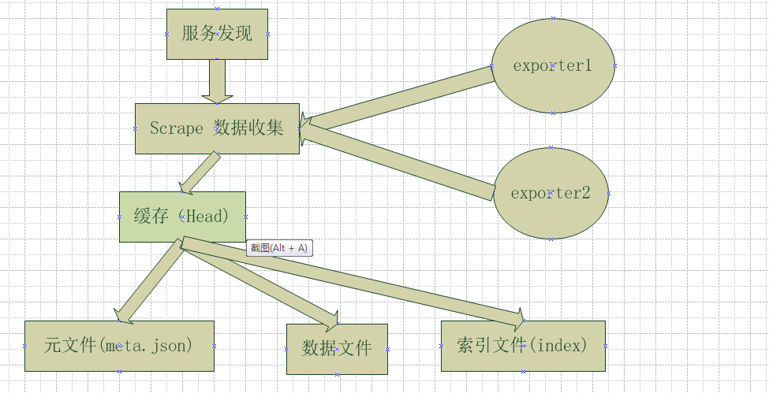

# prometheus

[TOC]

## 总结

分析tsdb的步骤：

* 沿着数据入库的路径，逐步分析。这就包括数据怎么到缓存，又如何从缓存到磁盘文件。索引又是如何创建的
* 沿着数据读取的路径分析

### 整体架构

#### tsdb架构

## 整体流程

###　写数据

* 写缓存

* 写wal文件
* 写数据文件
* 写索引

### 读数据

### 索引

## 总结

### 需要进一步学习

* mmap
* fallocate
* wal (write ahead logging)

### tsdb

* 索引格式

## 疑问

* mmap的优势是什么
* fallocate