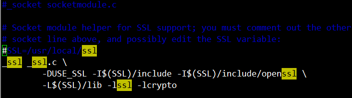
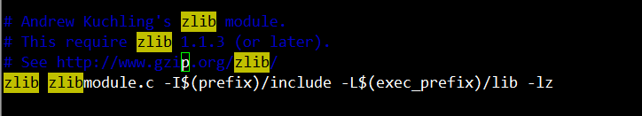

# python3 安装

[TOC]

### linux环境

从官网下载源码包, 解压进入源码目录。编译之前先配置

##### 配置SSL 和ZLIB

编辑Modules/Setup文件，去掉对ssl和zlib的注释。不编译这两个模块后面会导致安装pip时找不到ssl模块

### ./configure

指定安装目录

~~~
./configure --prefix=/usr/local/python3
~~~

### 安装

make install

### 安装pip

`curl https:``//bootstrap``.pypa.io``/get-pip``.py -o get-pip.py`