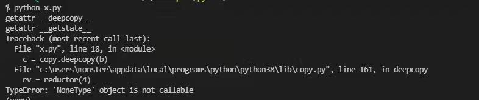

# 深度拷贝

最近遇到一个问题，还是费了不少力气。问题的堆栈类似如下图，不过是自己写的其他代码来复现同样的问题。

看copy.py代码始终没明白是什么导致的NoneType object is not callable。在增加的一些输出中，看到deepcopy被调用时会查找被拷贝对象的\_\_deepcopy\_\_和\_\_getstate\_\_两个方法。但被拷贝中定义了\_\_getattr\_\_方法，而又没有定义\_\_deepcopy\_\_ 和\_\_getstate\_\_两个方法。通过\_\_getattr\_\_方法获取上述两个方法 时会返回None。因此我假设是缺少\_\_getstate\_\_方法导致的，写了一段代码来复现问题，果然如此。

复现问题所用代码：

~~~python
import copy

class B:
    def __init__(self):
        self.a = 10
    def __getattr__(self, name):
        print("getattr", name)
        return None

    #def __getstate__(self):
    #    return self.__dict__
    #def __setstate__(self, state):
    #    self.__dict__ = state

b = B()

c = copy.deepcopy(b)
print(b.a)
print(c.a)
~~~

问题代码：

~~~python
class ContribResultItem:
    def __init__(self, obj, score, start_value, end_value, event=None) -> None:
        self.obj = obj
        self.score = score
        self.start_value = start_value
        self.end_value = end_value
        self.event = event

    def get_mutate_event(self):
        print("@" * 8, self, self.event, "\n")
        e = self.event  # type: MutateEvent
        e = copy.deepcopy(e)
        e.obj = self.obj

        return e

    @property
    def 对象(self):
        return self.obj

    def __str__(self):
        return self.format()

    def __getitem__(self, name: str):
        return self.__getattr(name)

    def __getattr__(self, name: str):
        return self.__getattr(name)

    def __getattr(self, name: str):
        ds = get_datasource_by_id(self.obj.ds_id)
        v1 = self.start_value
        v2 = self.end_value
        v1_formated = ds.format_value(self.event.table, self.event.indicator, v1)
        v2_formated = ds.format_value(self.event.table, self.event.indicator, v2)
        print("============= pca.__getattr", name)
        if name == "开始值":
            return v1_formated
        elif name == "$开始值":
            return v1
        elif name == "结束值":
            return v2_formated
        elif name == "$结束值":
            return v2
        if name == "$变化值":
            return v2 - v1
        elif name == "变化值":
            return ds.format_value(self.event.table, self.event.indicator, v2 - v1)
        return None

    def format(self):
        ds = get_datasource_by_id(self.obj.ds_id)
        indicator = ds.get_column_title(self.event.table, self.event.indicator)

        type_name = None
        change_text = None
        v1 = self.start_value
        v2 = self.end_value
        v1_formated = ds.format_value(self.event.table, self.event.indicator, v1)
        v2_formated = ds.format_value(self.event.table, self.event.indicator, v2)
        obj_formated = self.obj.format()
        if self.event.type == 1:
            type_name = "突增"
            if v1 == 0:
                change_text = "增加%s" % (
                    ds.format_value(self.event.table, self.event.indicator, v2 - v1)
                )
            else:
                change_text = "增加到%.2f倍" % (v2 / v1)
        else:
            type_name = "突降"
            if v2 == 0:
                change_text = "减少%s" % (
                    ds.format_value(self.event.table, self.event.indicator, v2 - v1)
                )
            else:
                change_text = "减少到%.2f%%" % ((v2 / v1) * 100)

        return f"{obj_formated}，出现{indicator}{type_name}，从{v1_formated}变为{v2_formated}，{change_text}"

def pca_accumulate_change(
    env: Env,
    event: MutateEvent,
    dimensions,
    threshold=10,
    top=None,
    alpha=0,
    beta=0,
    filter=True,
) -> List[ContribResultItem]:
    """
    PCA算法助手，给定分析目标、出现的现象，以及需要分析的维度

    返回贡献度最大的维度值，按照评分排序，返回格式：
    [
        {
            obj,
            score,
            case,
        }
    ]
    """

    # 默认top
    if top is None:
        top = 1000

    threshold = threshold / 100

    # if OPTIMIZE_FOR_FETCHING:
    data = {}
    for dimension_group in dimensions:
        if type(dimension_group) != list:
            dimension_group = [dimension_group]

        dimension_key = tuple(dimension_group)
        group_data = get_group_data_optimized(env, dimension_group, event, top)
        if group_data:
            data[dimension_key] = group_data

    result = []

    check_total = 0
    for dimension_key, dimension_data in data.items():
        check_total = check_total + max(
            len(dimension_data["data1"]), len(dimension_data["data2"])
        )
        pca_result = AccumulateChange(
            dimension_data["data1"], dimension_data["data2"], alpha=alpha, beta=beta
        ).analyse(min_score=threshold)

        for v in pca_result:
            # 忽略整体变化分析
            if v[0] == "_":
                continue

            item = ContribResultItem(
                obj=TableObject.unserialize(v[0]),
                start_value=dimension_data["data1"].get(v[0], 0),
                end_value=dimension_data["data2"].get(v[0], 0),
                score=util.format_score(v[1]),
                event=event,
            )
            result.append(item)

    result = sorted(result, key=lambda x: float(x.score), reverse=True)
    if filter:
        result = filter_result(result)

    if top > 0:
        result = result[0:top]

    # check_total
    return result

def get_group_data_optimized(env: Env, dimensions, event: MutateEvent, top=None):
    high_time = None
    low_time = None

    tg = env.env.get("granularity")
    tg_time = datetime_util.get_timedelta(tg)
    start_time = env.get("start_time") + event.result["left"] * tg_time
    start_value = event.result["left_value"]
    end_time = env.get("start_time") + event.result["index"] * tg_time
    end_value = event.result["value"]

    if start_value > end_value:
        high_time, low_time = start_time, end_time
    elif start_value < end_value:
        high_time, low_time = end_time, start_time
    else:
        return None

    # 组合维度不支持top
    if len(dimensions) > 1:
        top = None

    ds = env.get("datasource")  # type: Datasource

    # high value
    obj = event.obj.get_table_object(event.table)
    high_query = obj.get_query()
    high_query.columns.extend(dimensions)
    high_query.columns.append(event.indicator)
    high_query.start_time = high_time
    high_query.end_time = high_time + tg_time
    if top:
        high_query.page_size = top
        high_query.order = [event.indicator, "DESC"]

    high_data = ds.get_data(high_query)

    low_query = copy.deepcopy(high_query)
    low_query.start_time = low_time
    low_query.end_time = low_time + tg_time
    if top:
        dimension = dimensions[0]
        high_dimension_values = set()
        for row in high_data:
            dimension_value = row[dimension]
            high_dimension_values.add(dimension_value)

        # 是否使用高值来过滤
        # if len(high_dimension_values) == top:
        low_query.where["children"].append(
            {
                "column": dimensions[0],
                "value": list(high_dimension_values),
                "operator": "IN",
            }
        )

    low_data = ds.get_data(low_query)

    # logging.debug("get_group_data_optimized %s %s %s %s", high_data, low_data, high_rule.get_rule(), low_rule.get_rule())
    result = {
        "data1": {},
        "data2": {},
    }
    if start_value < end_value:
        data1, data2 = low_data, high_data
    else:
        data1, data2 = high_data, low_data

    for k, v in {"data1": data1, "data2": data2}.items():
        for row in v:
            row_obj = copy.deepcopy(obj)
            row_obj.dimensions = dimensions

            for dimension in dimensions:
                row_obj.where["children"].append(
                    {"column": dimension, "operator": "=", "value": row[dimension]}
                )

            key = row_obj.serialize()

            value = row[event.indicator]
            result[k][key] = value

    return result

def filter_result(result):
    # 过滤规则
    # 按照评分倒序，相邻的差距20分以上且差距2倍以上的，后面的全部忽略
    # 组合维度分数 >= 分维度的时，忽略分维度

    last_score = None
    alpha = CONTRIB_FILTER_ALPHA
    beta = CONTRIB_FILTER_BETA
    result_wrap = []
    for x in result:
        if float(x.score) < 0.001:
            break
        if last_score:
            if (
                float(x.score) * beta < float(last_score)
                and float(x.score) * beta < alpha
            ):
                break
            # if float(last_score) - float(x.score) > 20 and float(last_score) / float(x.score) > 2:
            #     break

        result_wrap.append(x)
        last_score = x.score

    # 重新排序（考虑到同分数时，组合维度优先于分维度）
    result_wrap = sorted(result_wrap, key=com_to_key)
    return result_wrap

def compare(a, b):
    score1 = float(a.score)
    score2 = float(b.score)

    if score1 > score2:
        return -1
    elif score1 < score2:
        return 1
    else:
        return 0

com_to_key = functools.cmp_to_key(compare)

~~~

~~~python
import copy

class B:
    def __init__(self):
        self.a = 10
    def __getattr__(self, name):
        print("getattr", name)
        return None

    #def __getstate__(self):
    #    return self.__dict__
    #def __setstate__(self, state):
    #    self.__dict__ = state

def test():
    if 1 >0:
        b = 2
    print("scope", b)

test()
b = B()
for k, v in b.__dict__.items():
    print("=======", k, v)

print(dir(b))

c = copy.deepcopy(b)
print(b.a)
print(c.a)
~~~

复现同样问题的代码:

~~~python

~~~

