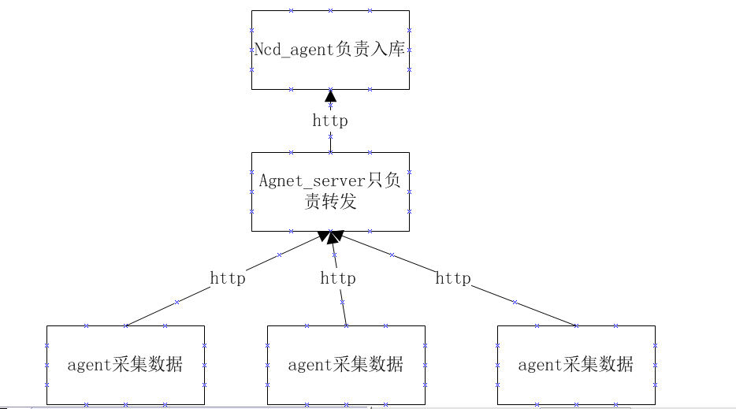
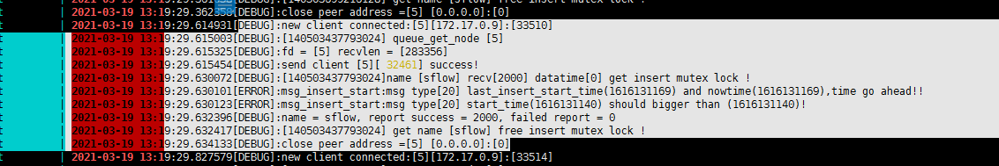
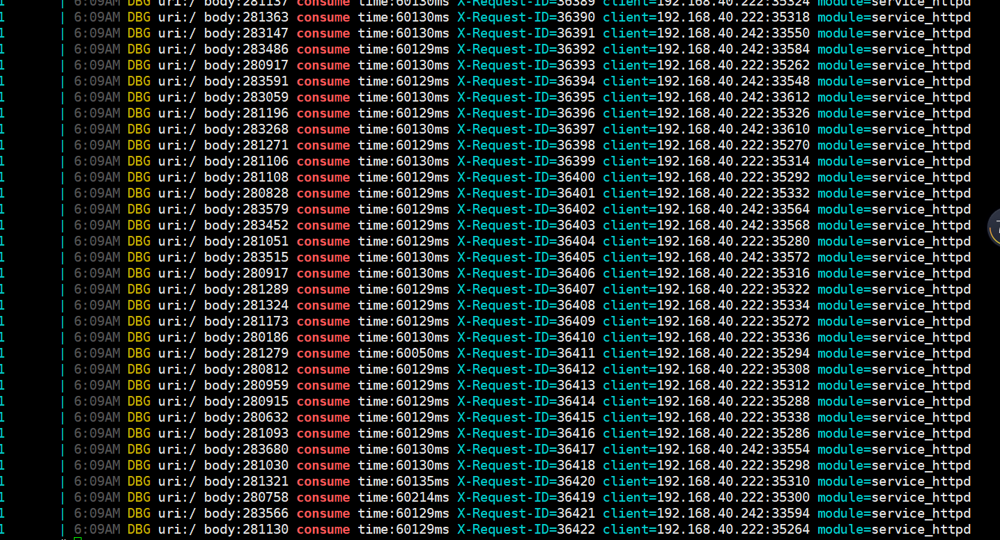
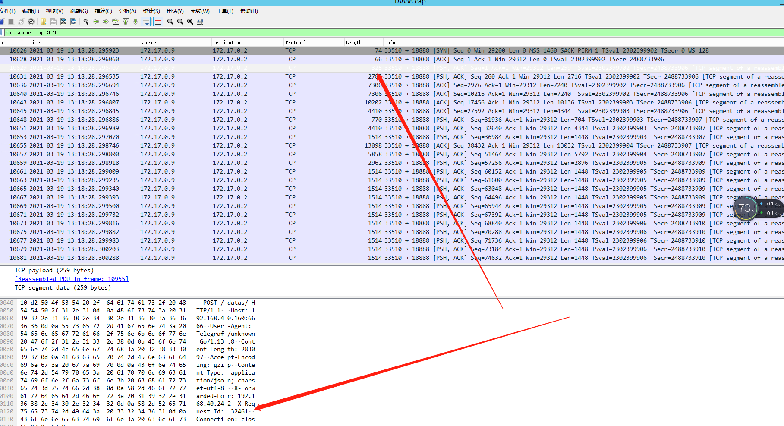

# 性能问题诊断

[TOC]

写于2021/3/19 

## 背景

最近负责一个监控系统，我主要负责数据采集和采集后的数据收集两个部分。而入库部分由另一个组的同事负责，至于数据库用的也是另一个项目组负责的数据平台。数据平台则基于clickhouse数据库。

系统准备投入生产环境之前，得先有一个测试过程。因为接入的数据量比较大（每分钟千万级数据)，采集数据的agent也多，这样就需要通过测试来看看系统的整体性能，二来可以为运行系统的硬件选型提供参考。

系统架构如图：

## 问题

### 环境

* 用于运行系统的机器配置相当不错。56核cpu、256G内存
* agent_server 和ncd_agent在同一台机器

* 测试接了80个agent、每分钟的数据量在10万左右。一个http请求的大小在200KB左右（使用压缩)
* agent_server及agent都是golang实现，ncd_agent是c语言实现
* 都是内网环境

* agent_server到ncd_agent是http短链接（该同事应该之前并未处理过类似高并发的项目，也觉得其他网络库如libevent、libuv可能不太好用。所以从网络到http解析都是自己写的）

### 现象

在测试过程中发现，请求响应特别慢，有的甚至超过一分钟，这从agent和agent_server提供的日志都能看到（图2）。让同事排查ncd_agent的问题时，同事根据ncd_agent日志(图1）却看到从链接建立到链接关闭整个过程的耗时很短，在几十毫秒左右。

  

​						图1： ncd_agent 日志，源端口33510的链接在13:19:29:614时间点建立，在13:19:29:634关闭

​							图2：agent-server 提供的请求—响应耗时的日志

## 诊断

根据我的直觉，出现这种情况很可能是数据积压在操作系统队列中。而ncd_agent由于自身的原因（线程调度、事件处理等）没有及时读取数据或建立链接。为了进一步验证自己的猜想，使用tcpdump抓包来分析整个请求响应过程（agent_server到ncd_agent的请求都加了X-Request-ID，ncd_agent响应时将收到的X-Request-ID原样返回。这样就可以追踪完整的请求响应过程）。图3是tcpdump捕获的数据，通过wireshark分析的截图。通过分析确实如此，其中有个请求在13:18:28秒已经建立链接(可能是客户端发送了syn、ack，而没有收到服务端的syn)，并开始发送数据。而等到13:18:29秒才看到http响应。

还有个疑问，就是在13:18:28秒时，三次握手有没有完成？还是在未完成的情况下已经开始传输数据了

​									图3：tcpdump抓包，然后通过wireshark分析

## 附注

### tcpdump

获取指定网卡的指定端口的流量，并写入文件

~~~
tcpdump -i br-8ee184b07ea8 -Xx tcp port 18888 -w 18888.cap
~~~

