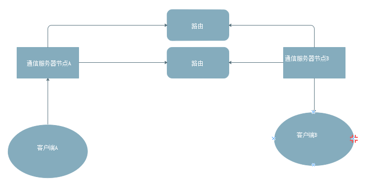

# 设计

[TOC]

### 百万粉丝关注大V

百万粉丝如何高效的获取大V动态更新

### 分布式即时通信

设计一个分布式即时通信架构, 我给出的架构大概如下图所示

* 多个路由避免单点故障、减轻负载

有以下几个需要思考的问题：

1.  如何分配不同的客户端到不同的通信节点

2. 客户端所在通信节点信息是独立保存在数据库中，还是放在路由中

3.  链接到同一个通信节点的客户端，避免去全局查找路由可以提高效率

4. 动态增加路由、通信节点扩容。服务发现怎么做，已有通信节点如何发现新加入的路由

5. 通信服务节点和路由之间的健康检查

6. 通信节点和路由之间使用什么协议

7. 是否使用消息队列服务替代路由节点

我的想法:

1. 总体思路是根据每个通信节点的负载情况，比如链接数目，分配客户端。具体实施就有两种方案1）采用LVS做负载均衡（阿里云产品)。2）提供一个额外的登陆服务器，登陆服务器根据根据每个通信节点的负载情况提供通信节点的IP地址。这种方式比较灵活
2. 针对问题2，若路由统一保存在额外的数据库中，则避免了拓展路由时同步路由数据的问题,即无状态路由，路由只负责消息转发。
3. 针对问题3，每个通信节点可以保存一份本地的局部路由
4. 针对问题4，

### 分布式锁-redis版

我的想法就是使用一个整型表示锁, 0表示未上锁，1表示上锁。通过这种方式实现的自然是互斥锁。自己的思路有点太天真。看了一下redis官方给出的，自己翻译了一下

redis官方给出的：https://redis.io/topics/distlock

###　并发写

问题是这样的：同一个账号在多端同时登陆，并修改个人信息，会不会有问题。我的回答相当模糊，有些信息也没有搞清楚，如存储用的数据库、更新方式（更新某个字段，更新所有内容)

其实考察的是并发写的问题。

首先需要搞清楚问题的背景：

* 存储方式，数据库比如mysql还是redis
* 更新方式，以数据库为例可能是用update更新被更改的字段。redis以json整体替换的方式。

### Bloom filter(布隆过滤器)